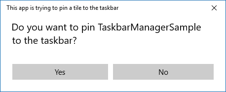

# Taskbar APIs
<link rel="stylesheet" href="https://az835927.vo.msecnd.net/sites/uwp/Resources/css/custom.css"> 

You can programmatically pin your own app to the taskbar, just like you can [pin yourself to Start](tiles-and-notifications-primary-tile-apis.md). And you can check if it's currently pinned.

> [!IMPORTANT]
> **PRERELEASE | Requires Fall Creators Update**: You must target [Insider SDK 16211](https://www.microsoft.com/en-us/software-download/windowsinsiderpreviewSDK) and be running [Insider build 16211](https://blogs.windows.com/windowsexperience/2017/05/17/announcing-windows-10-insider-preview-build-16199-pc-build-15215-mobile/#bDqf2Ah3Gd7FM66g.97) or higher to use the taskbar APIs.


At its core, the APIs let you...

* Check if taskbar is supported
* Check if taskbar allows pinning
* Check if you're currently pinned
* Pin your app


## When to request to pin to taskbar

You put a lot of effort into building a stellar app, and now you have the opportunity to ask the user to pin it to taskbar. But before we dive into the code, here are some things to keep in mind as you are designing your experience:

* **Do** craft a non-disruptive and easily dismissible UX in your app with a clear "Pin to taskbar" call to action.
* **Do** clearly explain the value of your app before asking the user to pin it.
* **Don't** ask a user to pin your app if the tile is already pinned or the device doesn’t support it (see code sections below).
* **Don't** repeatedly ask the user to pin your app (they will probably get annoyed).
* **Don't** call the pin API without explicit user interaction or when your app is minimized/not open.


## Checking whether the APIs exist

If your app supports older versions of Windows 10, you need to check whether these taskbar APIs are available. You do this by using ApiInformation. If the taskbar APIs aren't available, avoid executing any calls to the APIs.

```csharp
if (ApiInformation.IsTypePresent("Windows.UI.Shell.TaskbarManager"))
{
    // Taskbar APIs exist!
}

else
{
    // Older version of Windows, no taskbar APIs
}
```


## Check if taskbar is supported

Depending on the system you're running on, the taskbar may or may not be present. Currently, taskbar is only present on the Desktop device family. Therefore, before making any calls to the API, you should check IsSupported.

> [!NOTE]
> If you simply want to pin your app, you should instead call *IsPinningAllowed*, which will automatically factor in whether the taskbar itself is supported.

```csharp
// Check if taskbar is supported (false on devices where no taskbar is present)
bool isSupported = TaskbarManager.GetDefault().IsSupported;
```


## Check if taskbar allows pinning

Depending on the current taskbar (or lack thereof), pinning your app might not be supported. Therefore, before showing any pin UI or executing any pin code, you first need to check if pinning to the taskbar is supported. If it's not supported, don't prompt the user to pin the app.

```csharp
// Check if taskbar allows pinning (Group Policy can disable it, or some device families don't have taskbar)
bool isPinningAllowed = TaskbarManager.GetDefault().IsPinningAllowed;
```


## Check if you're currently pinned

To find out if your app is currently pinned to the taskbar, use the *IsCurrentAppPinnedAsync* method.

```csharp
// Check if your app is currently pinned
bool isPinned = await TaskbarManager.GetDefault().IsCurrentAppPinnedAsync();
```


##  Pin your app

If your app currently isn't pinned, and pinning is allowed, you might want to show a tip to users that they can pin your app.

If the user clicks your button to pin the app, you would then call the *RequestPinCurrentAppAsync* method to request that your app be pinned to the taskbar. This will display a dialog asking the user to confirm that they want your app pinned to the taskbar.

> [!IMPORTANT]
> This must be called from a foreground UI thread, otherwise an exception will be thrown.



This will return a boolean representing whether your app is now pinned to the taskbar. If your app was already pinned, this will immediately return true without showing the dialog to the user. If the user clicks no on the dialog, or pinning your app to the taskbar isn't allowed, this will return false. Otherwise, the user clicked yes and the app was pinned, and the API will return true.

```csharp
// Request to be pinned to the taskbar
bool isPinned = await TaskbarManager.GetDefault().RequestPinCurrentAppAsync();
```


## Resources

* [Full code sample on GitHub](https://github.com/WindowsNotifications/quickstart-pin-to-taskbar)
* [Pin app to Start](tiles-and-notifications-primary-tile-apis.md)
* [Tiles, badges, and notifications](tiles-badges-notifications.md)