# Create adaptive tiles

<link rel="stylesheet" href="https://az835927.vo.msecnd.net/sites/uwp/Resources/css/custom.css"> 


Adaptive tile templates are a new feature in Windows 10, allowing you to design your own tile notification content using a simple and flexible markup language that adapts to different screen densities. This article tells you how to create adaptive live tiles for your Universal Windows Platform (UWP) app. For the complete list of adaptive elements and attributes, see the [Adaptive tiles schema](tiles-and-notifications-adaptive-tiles-schema.md).

(If you'd like, you can still use the preset templates from the [Windows 8 tile template catalog](https://msdn.microsoft.com/library/windows/apps/hh761491) when designing notifications for Windows 10.)


## Getting started

**Install Notifications library.** If you'd like to use C# instead of XML to generate notifications, install the NuGet package named [Microsoft.Toolkit.Uwp.Notifications](https://www.nuget.org/packages/Microsoft.Toolkit.Uwp.Notifications/) (search for "notifications uwp"). The C# samples provided in this article use version 1.0.0 of the NuGet package.

**Install Notifications Visualizer.** This free UWP app helps you design adaptive live tiles by providing an instant visual preview of your tile as you edit it, similar to Visual Studio's XAML editor/design view. You can read [this blog post](http://blogs.msdn.com/b/tiles_and_toasts/archive/2015/09/22/introducing-notifications-visualizer-for-windows-10.aspx) for more information, and you can download Notifications Visualizer [here](https://www.microsoft.com/store/apps/notifications-visualizer/9nblggh5xsl1).


## How to send a tile notification

Please read our [Quickstart on sending local tile notifications](tiles-and-notifications-create-adaptive-tiles.md). The documentation on this page explains all the visual UI possibilities you have with adaptive tiles.


## Usage guidance


Adaptive templates are designed to work across different form factors and notification types. Elements such as group and subgroup link together content and don't imply a particular visual behavior on their own. The final appearance of a notification should be based on the specific device on which it will appear, whether it's phone, tablet, or desktop, or another device.

Hints are optional attributes that can be added to elements in order to achieve a specific visual behavior. Hints can be device-specific or notification-specific.

## A basic example


This example demonstrates what the adaptive tile templates can produce.

```XML
<tile>
  <visual>
  
    <binding template="TileMedium">
      ...
    </binding>
  
    <binding template="TileWide">
      <text hint-style="subtitle">Jennifer Parker</text>
      <text hint-style="captionSubtle">Photos from our trip</text>
      <text hint-style="captionSubtle">Check out these awesome photos I took while in New Zealand!</text>
    </binding>
  
    <binding template="TileLarge">
      ...
    </binding>
  
  </visual>
</tile>
```

```CSharp
TileContent content = new TileContent()
{
    Visual = new TileVisual()
    {
        TileMedium = ...
  
        TileWide = new TileBinding()
        {
            Content = new TileBindingContentAdaptive()
            {
                Children =
                {
                    new AdaptiveText()
                    {
                        Text = "Jennifer Parker",
                        HintStyle = AdaptiveTextStyle.Subtitle
                    },
  
                    new AdaptiveText()
                    {
                        Text = "Photos from our trip",
                        HintStyle = AdaptiveTextStyle.CaptionSubtle
                    },
  
                    new AdaptiveText()
                    {
                        Text = "Check out these awesome photos I took while in New Zealand!",
                        HintStyle = AdaptiveTextStyle.CaptionSubtle
                    }
                }
            }
        },
  
        TileLarge = ...
    }
};
```

**Result:**


## Tile sizes


Content for each tile size is individually specified in separate [&lt;binding&gt;](tiles-and-notifications-adaptive-tiles-schema.md) elements within the XML payload. Choose the target size by setting the template attribute to one of the following values:

-   TileSmall
-   TileMedium
-   TileWide
-   TileLarge (only for desktop)

For a single tile notification XML payload, provide &lt;binding&gt; elements for each tile size that you'd like to support, as shown in this example:

```XML
<tile>
  <visual>
  
    <binding template="TileSmall">
      <text>Small</text>
    </binding>
  
    <binding template="TileMedium">
      <text>Medium</text>
    </binding>
  
    <binding template="TileWide">
      <text>Wide</text>
    </binding>
  
    <binding template="TileLarge">
      <text>Large</text>
    </binding>
  
  </visual>
</tile>
```

```CSharp
TileContent content = new TileContent()
{
    Visual = new TileVisual()
    {
        TileSmall = new TileBinding()
        {
            Content = new TileBindingContentAdaptive()
            {
                Children =
                {
                    new AdaptiveText() { Text = "Small" }
                }
            }
        },
  
        TileMedium = new TileBinding()
        {
            Content = new TileBindingContentAdaptive()
            {
                Children =
                {
                    new AdaptiveText() { Text = "Medium" }
                }
            }
        },
  
        TileWide = new TileBinding()
        {
            Content = new TileBindingContentAdaptive()
            {
                Children =
                {
                    new AdaptiveText() { Text = "Wide" }
                }
            }
        },
  
        TileLarge = new TileBinding()
        {
            Content = new TileBindingContentAdaptive()
            {
                Children =
                {
                    new AdaptiveText() { Text = "Large" }
                }
            }
        }
    }
};
```

**Result:**

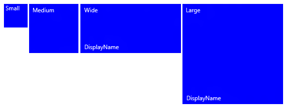

## Branding


You can control the branding on the bottom of a live tile (the display name and corner logo) by using the branding attribute on the notification payload. You can choose to display "none," only the "name," only the "logo," or both with "nameAndLogo."

**Note**  Windows Mobile doesn't support the corner logo, so "logo" and "nameAndLogo" default to "name" on Mobile.

 

```XML
<visual branding="logo">
  ...
</visual>
```

```CSharp
new TileVisual()
{
    Branding = TileBranding.Logo,
    ...
}
```

**Result:**


Branding can be applied for specific tile sizes one of two ways:

1. By applying the attribute on the [&lt;binding&gt;](tiles-and-notifications-adaptive-tiles-schema.md) element
2. By applying the attribute on the [&lt;visual&gt;](tiles-and-notifications-adaptive-tiles-schema.md) element, which affects the entire notification payload
If you don't specify branding for a binding, it will use the branding that's provided on the visual element.

```XML
<tile>
  <visual branding="nameAndLogo">
 
    <binding template="TileMedium" branding="logo">
      ...
    </binding>
 
    <!--Inherits branding from visual-->
    <binding template="TileWide">
      ...
    </binding>
 
  </visual>
</tile>
```

```CSharp
TileContent content = new TileContent()
{
    Visual = new TileVisual()
    {
        Branding = TileBranding.NameAndLogo,

        TileMedium = new TileBinding()
        {
            Branding = TileBranding.Logo,
            ...
        },

        // Inherits branding from Visual
        TileWide = new TileBinding()
        {
            ...
        }
    }
};
```

**Default branding result:**

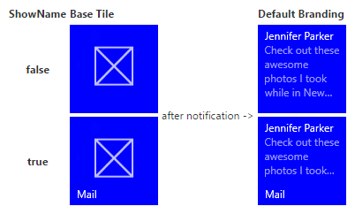

If you don't specify the branding in your notification payload, the base tile's properties will determine the branding. If the base tile shows the display name, then the branding will default to "name." Otherwise, the branding will default to "none" if the display name isn't shown.

**Note**   This is a change from Windows 8.x, in which the default branding was "logo."

 

## Display name


You can override the display name of a notification by entering the text string of your choice with the **displayName** attribute. As with branding, you can specify this on the [&lt;visual&gt;](tiles-and-notifications-adaptive-tiles-schema.md) element, which affects the entire notification payload, or on the [&lt;binding&gt;](tiles-and-notifications-adaptive-tiles-schema.md) element, which only affects individual tiles.

**Known Issue**  On Windows Mobile, if you specify a ShortName for your Tile, the display name provided in your notification will not be used (the ShortName will always be displayed). 

```XML
<tile>
  <visual branding="nameAndLogo" displayName="Wednesday 22">
 
    <binding template="TileMedium" displayName="Wed. 22">
      ...
    </binding>
 
    <!--Inherits displayName from visual-->
    <binding template="TileWide">
      ...
    </binding>
 
  </visual>
</tile>
```

```CSharp
TileContent content = new TileContent()
{
    Visual = new TileVisual()
    {
        Branding = TileBranding.NameAndLogo,
        DisplayName = "Wednesday 22",

        TileMedium = new TileBinding()
        {
            DisplayName = "Wed. 22",
            ...
        },

        // Inherits DisplayName from Visual
        TileWide = new TileBinding()
        {
            ...
        }
    }
};
```

**Result:**

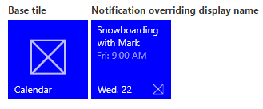

## Text


The [&lt;text&gt;](tiles-and-notifications-adaptive-tiles-schema.md) element is used to display text. You can use hints to modify how text appears.

```XML
<text>This is a line of text</text>
```


```CSharp
new AdaptiveText()
{
    Text = "This is a line of text"
};
```

**Result:**

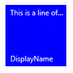

## Text wrapping


By default, text doesn't wrap and will continue off the edge of the tile. Use the **hint-wrap** attribute to set text wrapping on a text element. You can also control the minimum and maximum number of lines by using **hint-minLines** and **hint-maxLines**, both of which accept positive integers.

```XML
<text hint-wrap="true">This is a line of wrapping text</text>
```


```CSharp
new AdaptiveText()
{
    Text = "This is a line of wrapping text",
    HintWrap = true
};
```

**Result:**

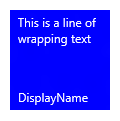

## Text styles


Styles control the font size, color, and weight of text elements. There are a number of available styles, including a "subtle" variation of each style that sets the opacity to 60%, which usually makes the text color a shade of light gray.

```XML
<text hint-style="base">Header content</text>
<text hint-style="captionSubtle">Subheader content</text>
```

```CSharp
new AdaptiveText()
{
    Text = "Header content",
    HintStyle = AdaptiveTextStyle.Base
},

new AdaptiveText()
{
    Text = "Subheader content",
    HintStyle = AdaptiveTextStyle.CaptionSubtle
}
```

**Result:**

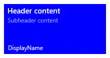

**Note**  The style defaults to caption if hint-style isn't specified.

 

**Basic text styles**

|                                |                           |             |
|--------------------------------|---------------------------|-------------|
| &lt;text hint-style="\*" /&gt; | Font height               | Font weight |
| caption                        | 12 effective pixels (epx) | Regular     |
| body                           | 15 epx                    | Regular     |
| base                           | 15 epx                    | Semibold    |
| subtitle                       | 20 epx                    | Regular     |
| title                          | 24 epx                    | Semilight   |
| subheader                      | 34 epx                    | Light       |
| header                         | 46 epx                    | Light       |

 

**Numeral text style variations**

These variations reduce the line height so that content above and below come much closer to the text.

|                  |
|------------------|
| titleNumeral     |
| subheaderNumeral |
| headerNumeral    |

 

**Subtle text style variations**

Each style has a subtle variation that gives the text a 60% opacity, which usually makes the text color a shade of light gray.

|                        |
|------------------------|
| captionSubtle          |
| bodySubtle             |
| baseSubtle             |
| subtitleSubtle         |
| titleSubtle            |
| titleNumeralSubtle     |
| subheaderSubtle        |
| subheaderNumeralSubtle |
| headerSubtle           |
| headerNumeralSubtle    |

 

## Text alignment


Text can be horizontally aligned left, center, or right. In left-to-right languages like English, text defaults to left-aligned. In right-to-left languages like Arabic, text defaults to right-aligned. You can manually set alignment with the **hint-align** attribute on elements.

```XML
<text hint-align="center">Hello</text>
```


```CSharp
new AdaptiveText()
{
    Text = "Hello",
    HintAlign = AdaptiveTextAlign.Center
};
```

**Result:**

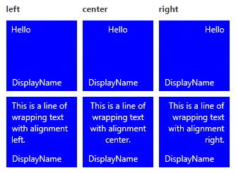

## Groups and subgroups


Groups allow you to semantically declare that the content inside the group is related and must be displayed in its entirety for the content to make sense. For example, you might have two text elements, a header, and a subheader, and it would not make sense for only the header to be shown. By grouping those elements inside a subgroup, the elements will either all be displayed (if they can fit) or not be displayed at all (because they can't fit).

To provide the best experience across devices and screens, provide multiple groups. Having multiple groups allows your tile to adapt to larger screens.

**Note**  The only valid child of a group is a subgroup.

 

```XML
<binding template="TileWide" branding="nameAndLogo">
  <group>
    <subgroup>
      <text hint-style="subtitle">Jennifer Parker</text>
      <text hint-style="captionSubtle">Photos from our trip</text>
      <text hint-style="captionSubtle">Check out these awesome photos I took while in New Zealand!</text>
    </subgroup>
  </group>
 
  <text />
 
  <group>
    <subgroup>
      <text hint-style="subtitle">Steve Bosniak</text>
      <text hint-style="captionSubtle">Build 2015 Dinner</text>
      <text hint-style="captionSubtle">Want to go out for dinner after Build tonight?</text>
    </subgroup>
  </group>
</binding>
```

```CSharp
TileWide = new TileBinding()
{
    Branding = TileBranding.NameAndLogo,
    Content = new TileBindingContentAdaptive()
    {
        Children =
        {
            CreateGroup(
                from: "Jennifer Parker",
                subject: "Photos from our trip",
                body: "Check out these awesome photos I took while in New Zealand!"),

            // For spacing
            new AdaptiveText(),

            CreateGroup(
                from: "Steve Bosniak",
                subject: "Build 2015 Dinner",
                body: "Want to go out for dinner after Build tonight?")
        }
    }
}

...

private static AdaptiveGroup CreateGroup(string from, string subject, string body)
{
    return new AdaptiveGroup()
    {
        Children =
        {
            new AdaptiveSubgroup()
            {
                Children =
                {
                    new AdaptiveText()
                    {
                        Text = from,
                        HintStyle = AdaptiveTextStyle.Subtitle
                    },
                    new AdaptiveText()
                    {
                        Text = subject,
                        HintStyle = AdaptiveTextStyle.CaptionSubtle
                    },
                    new AdaptiveText()
                    {
                        Text = body,
                        HintStyle = AdaptiveTextStyle.CaptionSubtle
                    }
                }
            }
        }
    };
}
```

**Result:**

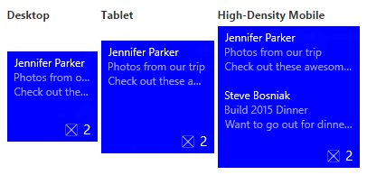

## Subgroups (columns)


Subgroups also allow you to divide data into semantic sections within a group. For live tiles, this visually translates to columns.

The **hint-weight** attribute lets you to control the widths of columns. The value of **hint-weight** is expressed as a weighted proportion of available space, which is identical to **GridUnitType.Star** behavior. For equal-width columns, assign each weight to 1.

<table>
<colgroup>
<col width="50%" />
<col width="50%" />
</colgroup>
<tbody>
<tr class="odd">
<td align="left">hint-weight</td>
<td align="left">Percentage of width</td>
</tr>
<tr class="even">
<td align="left">1</td>
<td align="left">25%</td>
</tr>
<tr class="odd">
<td align="left">1</td>
<td align="left">25%</td>
</tr>
<tr class="even">
<td align="left">1</td>
<td align="left">25%</td>
</tr>
<tr class="odd">
<td align="left">1</td>
<td align="left">25%</td>
</tr>
<tr class="even">
<td align="left">Total weight: 4</td>
<td align="left"></td>
</tr>
</tbody>
</table>

 

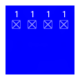

To make one column twice as large as another column, assign the smaller column a weight of 1 and the larger column a weight of 2.

<table>
<colgroup>
<col width="50%" />
<col width="50%" />
</colgroup>
<tbody>
<tr class="odd">
<td align="left">hint-weight</td>
<td align="left">Percentage of width</td>
</tr>
<tr class="even">
<td align="left">1</td>
<td align="left">33.3%</td>
</tr>
<tr class="odd">
<td align="left">2</td>
<td align="left">66.7%</td>
</tr>
<tr class="even">
<td align="left">Total weight: 3</td>
<td align="left"></td>
</tr>
</tbody>
</table>

 

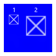

If you want your first column to take up 20% of the total width and your second column to take up 80% of the total width, assign the first weight to 20 and the second weight to 80. If your total weights equal 100, they'll act as percentages.

<table>
<colgroup>
<col width="50%" />
<col width="50%" />
</colgroup>
<tbody>
<tr class="odd">
<td align="left">hint-weight</td>
<td align="left">Percentage of width</td>
</tr>
<tr class="even">
<td align="left">20</td>
<td align="left">20%</td>
</tr>
<tr class="odd">
<td align="left">80</td>
<td align="left">80%</td>
</tr>
<tr class="even">
<td align="left">Total weight: 100</td>
<td align="left"></td>
</tr>
</tbody>
</table>

 

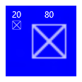

**Note**  An 8-pixel margin is automatically added between the columns.

 

When you have more than two subgroups, you should specify the **hint-weight**, which only accepts positive integers. If you don't specify hint-weight for the first subgroup, it will be assigned a weight of 50. The next subgroup that doesn't have a specified hint-weight will be assigned a weight equal to 100 minus the sum of the preceding weights, or to 1 if the result is zero. The remaining subgroups that don't have specified hint-weights will be assigned a weight of 1.

Here's sample code for a weather tile that shows how you can achieve a tile with five columns of equal width:

```XML
<binding template="TileWide" displayName="Seattle" branding="name">
  <group>
    <subgroup hint-weight="1">
      <text hint-align="center">Mon</text>
      <image src="Assets\Weather\Mostly Cloudy.png" hint-removeMargin="true"/>
      <text hint-align="center">63°</text>
      <text hint-align="center" hint-style="captionsubtle">42°</text>
    </subgroup>
    <subgroup hint-weight="1">
      <text hint-align="center">Tue</text>
      <image src="Assets\Weather\Cloudy.png" hint-removeMargin="true"/>
      <text hint-align="center">57°</text>
      <text hint-align="center" hint-style="captionsubtle">38°</text>
    </subgroup>
    <subgroup hint-weight="1">
      <text hint-align="center">Wed</text>
      <image src="Assets\Weather\Sunny.png" hint-removeMargin="true"/>
      <text hint-align="center">59°</text>
      <text hint-align="center" hint-style="captionsubtle">43°</text>
    </subgroup>
    <subgroup hint-weight="1">
      <text hint-align="center">Thu</text>
      <image src="Assets\Weather\Sunny.png" hint-removeMargin="true"/>
      <text hint-align="center">62°</text>
      <text hint-align="center" hint-style="captionsubtle">42°</text>
    </subgroup>
    <subgroup hint-weight="1">
      <text hint-align="center">Fri</text>
      <image src="Assets\Weather\Sunny.png" hint-removeMargin="true"/>
      <text hint-align="center">71°</text>
      <text hint-align="center" hint-style="captionsubtle">66°</text>
    </subgroup>
  </group>
</binding>
```

```CSharp
TileWide = new TileBinding()
{
    DisplayName = "Seattle",
    Branding = TileBranding.Name,
    Content = new TileBindingContentAdaptive()
    {
        Children =
        {
            new AdaptiveGroup()
            {
                Children =
                {
                    CreateSubgroup("Mon", "Mostly Cloudy.png", "63°", "42°"),
                    CreateSubgroup("Tue", "Cloudy.png", "57°", "38°"),
                    CreateSubgroup("Wed", "Sunny.png", "59°", "43°"),
                    CreateSubgroup("Thu", "Sunny.png", "62°", "42°"),
                    CreateSubgroup("Fri", "Sunny.png", "71°", "66°")
                }
            }
        }
    }
}

...

private static AdaptiveSubgroup CreateSubgroup(string day, string image, string highTemp, string lowTemp)
{
    return new AdaptiveSubgroup()
    {
        HintWeight = 1,
        Children =
        {
            new AdaptiveText()
            {
                Text = day,
                HintAlign = AdaptiveTextAlign.Center
            },
            new AdaptiveImage()
            {
                Source = "Assets/Weather/" + image,
                HintRemoveMargin = true
            },
            new AdaptiveText()
            {
                Text = highTemp,
                HintAlign = AdaptiveTextAlign.Center
            },
            new AdaptiveText()
            {
                Text = lowTemp,
                HintAlign = AdaptiveTextAlign.Center,
                HintStyle = AdaptiveTextStyle.CaptionSubtle
            }
        }
    };
}
```

**Result:**

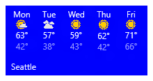

## Images


The &lt;image&gt; element is used to display images on the tile notification. Images can be placed inline within the tile content (default), as a background image behind your content, or as a peek image that animates in from the top of the notification.

**Note**   There are [restrictions on the file size and dimensions of images](https://msdn.microsoft.com/library/windows/apps/hh781198).

 

With no extra behaviors specified, images will uniformly shrink or expand to fill the available width. The sample below shows a tile using two columns and inline images. The inline images stretch to fill the width of the column.

```XML
<binding template="TileMedium" displayName="Seattle" branding="name">
  <group>
    <subgroup>
      <text hint-align="center">Mon</text>
      <image src="Assets\Apps\Weather\Mostly Cloudy.png" hint-removeMargin="true"/>
      <text hint-align="center">63°</text>
      <text hint-style="captionsubtle" hint-align="center">42°</text>
    </subgroup>
    <subgroup>
      <text hint-align="center">Tue</text>
      <image src="Assets\Apps\Weather\Cloudy.png" hint-removeMargin="true"/>
      <text hint-align="center">57°</text>
      <text hint-style="captionSubtle" hint-align="center">38°</text>
    </subgroup>
  </group>
</binding>
```

```CSharp
TileMedium = new TileBinding()
{
    DisplayName = "Seattle",
    Branding = TileBranding.Name,
    Content = new TileBindingContentAdaptive()
    {
        Children =
        {
            new AdaptiveGroup()
            {
                Children =
                {
                    CreateSubgroup("Mon", "Mostly Cloudy.png", "63°", "42°"),
                    CreateSubgroup("Tue", "Cloudy.png", "57°", "38°")
                }
            }
        }
    }
}
...
private static AdaptiveSubgroup CreateSubgroup(string day, string image, string highTemp, string lowTemp)
{
    return new AdaptiveSubgroup()
    {
        Children =
        {
            new AdaptiveText()
            {
                Text = day,
                HintAlign = AdaptiveTextAlign.Center
            },
            new AdaptiveImage()
            {
                Source = "Assets/Weather/" + image,
                HintRemoveMargin = true
            },
            new AdaptiveText()
            {
                Text = highTemp,
                HintAlign = AdaptiveTextAlign.Center
            },
            new AdaptiveText()
            {
                Text = lowTemp,
                HintAlign = AdaptiveTextAlign.Center,
                HintStyle = AdaptiveTextStyle.CaptionSubtle
            }
        }
    };
}
```

**Result:**

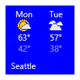

Images placed in the &lt;binding&gt; root, or in the first group, will also stretch to fit the available height.

### Image alignment

Images can be set to align left, center, or right using the **hint-align** attribute. This will also cause images to display at their native resolution instead of stretching to fill width.

```XML
<binding template="TileLarge">
  <image src="Assets/fable.jpg" hint-align="center"/>
</binding>
```

```CSharp
TileLarge = new TileBinding()
{
    Content = new TileBindingContentAdaptive()
    {
        Children =
        {
            new AdaptiveImage()
            {
                Source = "Assets/fable.jpg",
                HintAlign = AdaptiveImageAlign.Center
            }
        }
    }
}
```

**Result:**

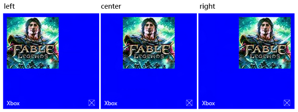

### Image margins

By default, inline images have an 8-pixel margin between any content above or below the image. This margin can be removed by using the **hint-removeMargin** attribute on the image. However, images always retain the 8-pixel margin from the edge of the tile, and subgroups (columns) always retain the 8-pixel padding between columns.

```XML
<binding template="TileMedium" branding="none">
  <group>
    <subgroup>
      <text hint-align="center">Mon</text>
      <image src="Assets\Numbers\4.jpg" hint-removeMargin="true"/>
      <text hint-align="center">63°</text>
      <text hint-style="captionsubtle" hint-align="center">42°</text>
    </subgroup>
    <subgroup>
      <text hint-align="center">Tue</text>
      <image src="Assets\Numbers\3.jpg" hint-removeMargin="true"/>
      <text hint-align="center">57°</text>
      <text hint-style="captionsubtle" hint-align="center">38°</text>
    </subgroup>
  </group>
</binding>
```

```CSharp
TileMedium = new TileBinding()
{
    Branding = TileBranding.None,
    Content = new TileBindingContentAdaptive()
    {
        Children =
        {
            new AdaptiveGroup()
            {
                Children =
                {
                    CreateSubgroup("Mon", "4.jpg", "63°", "42°"),
                    CreateSubgroup("Tue", "3.jpg", "57°", "38°")
                }
            }
        }
    }
}

...

private static AdaptiveSubgroup CreateSubgroup(string day, string image, string highTemp, string lowTemp)
{
    return new AdaptiveSubgroup()
    {
        HintWeight = 1,
        Children =
        {
            new AdaptiveText()
            {
                Text = day,
                HintAlign = AdaptiveTextAlign.Center
            },
            new AdaptiveImage()
            {
                Source = "Assets/Numbers/" + image,
                HintRemoveMargin = true
            },
            new AdaptiveText()
            {
                Text = highTemp,
                HintAlign = AdaptiveTextAlign.Center
            },
            new AdaptiveText()
            {
                Text = lowTemp,
                HintAlign = AdaptiveTextAlign.Center,
                HintStyle = AdaptiveTextStyle.CaptionSubtle
            }
        }
    };
}
```

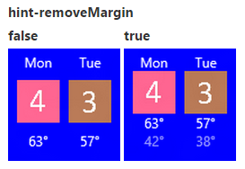

### Image cropping

Images can be cropped into a circle using the **hint-crop** attribute, which currently only supports the values "none" (default) or "circle."

```XML
<binding template="TileLarge" hint-textStacking="center">
  <group>
    <subgroup hint-weight="1"/>
    <subgroup hint-weight="2">
      <image src="Assets/Apps/Hipstame/hipster.jpg" hint-crop="circle"/>
    </subgroup>
    <subgroup hint-weight="1"/>
  </group>
 
  <text hint-style="title" hint-align="center">Hi,</text>
  <text hint-style="subtitleSubtle" hint-align="center">MasterHip</text>
</binding>
```

```CSharp
TileLarge = new TileBinding()
{
    Content = new TileBindingContentAdaptive()
    {
        TextStacking = TileTextStacking.Center,
        Children =
        {
            new AdaptiveGroup()
            {
                Children =
                {
                    new AdaptiveSubgroup() { HintWeight = 1 },
                    new AdaptiveSubgroup()
                    {
                        HintWeight = 2,
                        Children =
                        {
                            new AdaptiveImage()
                            {
                                Source = "Assets/Apps/Hipstame/hipster.jpg",
                                HintCrop = AdaptiveImageCrop.Circle
                            }
                        }
                    },
                    new AdaptiveSubgroup() { HintWeight = 1 }
                }
            },
            new AdaptiveText()
            {
                Text = "Hi,",
                HintStyle = AdaptiveTextStyle.Title,
                HintAlign = AdaptiveTextAlign.Center
            },
            new AdaptiveText()
            {
                Text = "MasterHip",
                HintStyle = AdaptiveTextStyle.SubtitleSubtle,
                HintAlign = AdaptiveTextAlign.Center
            }
        }
    }
}
```

**Result:**


### Background image

To set a background image, place an image element in the root of the &lt;binding&gt; and set the placement attribute to "background."

```XML
<binding template="TileWide">
  <image src="Assets\Mostly Cloudy-Background.jpg" placement="background"/>
  <group>
    <subgroup hint-weight="1">
      <text hint-align="center">Mon</text>
      <image src="Assets\Weather\Mostly Cloudy.png" hint-removeMargin="true"/>
      <text hint-align="center">63°</text>
      <text hint-align="center" hint-style="captionsubtle">42°</text>
    </subgroup>
    ...
  </group>
</binding>
```

```CSharp
TileWide = new TileBinding()
{
    Content = new TileBindingContentAdaptive()
    {
        BackgroundImage = new TileBackgroundImage()
        {
            Source = "Assets/Mostly Cloudy-Background.jpg"
        },

        Children =
        {
            new AdaptiveGroup()
            {
                Children =
                {
                    CreateSubgroup("Mon", "Mostly Cloudy.png", "63°", "42°")
                    ...
                }
            }
        }
    }
}

...

private static AdaptiveSubgroup CreateSubgroup(string day, string image, string highTemp, string lowTemp)
{
    return new AdaptiveSubgroup()
    {
        HintWeight = 1,
        Children =
        {
            new AdaptiveText()
            {
                Text = day,
                HintAlign = AdaptiveTextAlign.Center
            },
            new AdaptiveImage()
            {
                Source = "Assets/Weather/" + image,
                HintRemoveMargin = true
            },
            new AdaptiveText()
            {
                Text = highTemp,
                HintAlign = AdaptiveTextAlign.Center
            },
            new AdaptiveText()
            {
                Text = lowTemp,
                HintAlign = AdaptiveTextAlign.Center,
                HintStyle = AdaptiveTextStyle.CaptionSubtle
            }
        }
    };
}
```

**Result:**

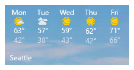

### Peek image

You can specify an image that "peeks" in from the top of the tile. The peek image uses an animation to slide down/up from the top of the tile, peeking into view, and then later sliding back out to reveal the main content on the tile. To set a peek image, place an image element in the root of the &lt;binding&gt;, and set the placement attribute to "peek."

```XML
<binding template="TileMedium" branding="name">
  <image placement="peek" src="Assets/Apps/Hipstame/hipster.jpg"/>
  <text>New Message</text>
  <text hint-style="captionsubtle" hint-wrap="true">Hey, have you tried Windows 10 yet?</text>
</binding>
```

```CSharp
TileWide = new TileBinding()
{
    Branding = TileBranding.Name,
    Content = new TileBindingContentAdaptive()
    {
        PeekImage = new TilePeekImage()
        {
            Source = "Assets/Apps/Hipstame/hipster.jpg"
        },
        Children =
        {
            new AdaptiveText()
            {
                Text = "New Message"
            },
            new AdaptiveText()
            {
                Text = "Hey, have you tried Windows 10 yet?",
                HintStyle = AdaptiveTextStyle.CaptionSubtle,
                HintWrap = true
            }
        }
    }
}
```


**Circle crop for peek and background images**

Use the hint-crop attribute on peek and background images to do a circle crop:

```XML
<image placement="peek" hint-crop="circle" src="Assets/Apps/Hipstame/hipster.jpg"/>
```

```CSharp
new TilePeekImage()
{
    HintCrop = TilePeekImageCrop.Circle,
    Source = "Assets/Apps/Hipstame/hipster.jpg"
}
```

The result will look like this:


**Use both peek and background image**

To use both a peek and a background image on a tile notification, specify both a peek image and a background image in your notification payload.

The result will look like this:


### Peek and background image overlays

You can set a black overlay on your background and peek images using **hint-overlay**, which accepts integers from 0-100, with 0 being no overlay and 100 being full black overlay. You can use the overlay to help ensure that text on your tile is readable.

**Use hint-overlay on a background image**

Your background image will default to 20% overlay as long as you have some text elements in your payload (otherwise it will default to 0% overlay).

```XML
<binding template="TileWide">
  <image placement="background" hint-overlay="60" src="Assets\Mostly Cloudy-Background.jpg"/>
  ...
</binding>
```

```CSharp
TileWide = new TileBinding()
{
    Content = new TileBindingContentAdaptive()
    {
        BackgroundImage = new TileBackgroundImage()
        {
            Source = "Assets/Mostly Cloudy-Background.jpg",
            HintOverlay = 60
        },

        ...
    }
}
```

**hint-overlay Result:**

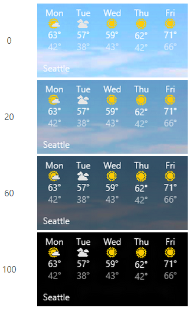

**Use hint-overlay on a peek image**

In Version 1511 of Windows 10, we support an overlay for your peek image too, just like your background image. Specify hint-overlay on the peek image element as an integer from 0-100. The default overlay for peek images is 0 (no overlay).

```XML
<binding template="TileMedium">
  <image hint-overlay="20" src="Assets\Map.jpg" placement="peek"/>
  ...
</binding>
```

```CSharp
TileMedium = new TileBinding()
{
    Content = new TileBindingContentAdaptive()
    {
        PeekImage = new TilePeekImage()
        {
            Source = "Assets/Map.jpg",
            HintOverlay = 20
        },
        ...
    }
}
```

This example shows a peek image at 20% opacity (left) and at 0% opacity (right):

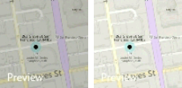

## Vertical alignment (text stacking)


You can control the vertical alignment of content on your tile by using the **hint-textStacking** attribute on both the [&lt;binding&gt;](tiles-and-notifications-adaptive-tiles-schema.md) element and [&lt;subgroup&gt;](tiles-and-notifications-adaptive-tiles-schema.md) element. By default, everything is vertically aligned to the top, but you can also align content to the bottom or center.

### Text stacking on binding element

When applied at the [&lt;binding&gt;](tiles-and-notifications-adaptive-tiles-schema.md) level, text stacking sets the vertical alignment of the notification content as a whole, aligning in the available vertical space above the branding/badge area.

```XML
<binding template="TileMedium" hint-textStacking="center" branding="logo">
  <text hint-style="base" hint-align="center">Hi,</text>
  <text hint-style="captionSubtle" hint-align="center">MasterHip</text>
</binding>
```

```CSharp
TileMedium = new TileBinding()
{
    Branding = TileBranding.Logo,
    Content = new TileBindingContentAdaptive()
    {
        TextStacking = TileTextStacking.Center,
        Children =
        {
            new AdaptiveText()
            {
                Text = "Hi,",
                HintStyle = AdaptiveTextStyle.Base,
                HintAlign = AdaptiveTextAlign.Center
            },

            new AdaptiveText()
            {
                Text = "MasterHip",
                HintStyle = AdaptiveTextStyle.CaptionSubtle,
                HintAlign = AdaptiveTextAlign.Center
            }
        }
    }
}
```

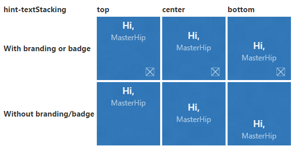

### Text stacking on subgroup element

When applied at the [&lt;subgroup&gt;](tiles-and-notifications-adaptive-tiles-schema.md) level, text stacking sets the vertical alignment of the subgroup (column) content, aligning in the available vertical space within the entire group.

```XML
<binding template="TileWide" branding="nameAndLogo">
  <group>
    <subgroup hint-weight="33">
      <image src="Assets/Apps/Hipstame/hipster.jpg" hint-crop="circle"/>
    </subgroup>
    <subgroup hint-textStacking="center">
      <text hint-style="subtitle">Hi,</text>
      <text hint-style="bodySubtle">MasterHip</text>
    </subgroup>
  </group>
</binding>
```

```CSharp
TileWide = new TileBinding()
{
    Branding = TileBranding.NameAndLogo,
    Content = new TileBindingContentAdaptive()
    {
        Children =
        {
            new AdaptiveGroup()
            {
                Children =
                {
                    // Image column
                    new AdaptiveSubgroup()
                    {
                        HintWeight = 33,
                        Children =
                        {
                            new AdaptiveImage()
                            {
                                Source = "Assets/Apps/Hipstame/hipster.jpg",
                                HintCrop = AdaptiveImageCrop.Circle
                            }
                        }
                    },

                    // Text column
                    new AdaptiveSubgroup()
                    {
                        // Vertical align its contents
                        TextStacking = TileTextStacking.Center,
                        Children =
                        {
                            new AdaptiveText()
                            {
                                Text = "Hi,",
                                HintStyle = AdaptiveTextStyle.Subtitle
                            },

                            new AdaptiveText()
                            {
                                Text = "MasterHip",
                                HintStyle = AdaptiveTextStyle.BodySubtle
                            }
                        }
                    }
                }
            }
        }
    }
}
```

## Related topics


* [Adaptive tiles schema](tiles-and-notifications-adaptive-tiles-schema.md)
* [Quickstart: Send a local tile notification](tiles-and-notifications-create-adaptive-tiles.md)
* [Notifications library on GitHub](https://github.com/Microsoft/UWPCommunityToolkit/tree/dev/Notifications)
* [Special tile templates catalog](tiles-and-notifications-special-tile-templates-catalog.md)
 

 


