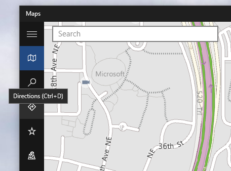

---
author: Jwmsft
Description: Use a tooltip to reveal more info about a control before asking the user to perform an action.
title: Tooltips
ms.assetid: A21BB12B-301E-40C9-B84B-C055FD43D307
label: Tooltips
template: detail.hbs
ms.author: jimwalk
ms.date: 02/08/2017
ms.topic: article
ms.prod: windows
ms.technology: uwp
keywords: windows 10, uwp
---
# Tooltips
<link rel="stylesheet" href="https://az835927.vo.msecnd.net/sites/uwp/Resources/css/custom.css"> 

A tooltip is a short description that is linked to another control or object. Tooltips help users understand unfamiliar objects that aren't described directly in the UI. They display automatically when the user moves focus to, presses and holds, or hovers the mouse pointer over a control. The tooltip disappears after a few seconds, or when the user moves the finger, pointer or keyboard/gamepad focus.




<b>Important APIs</b> 
<ul>
<li>[**ToolTip class**](https://msdn.microsoft.com/library/windows/apps/br227608)</li>
<li>[**ToolTipService class**](https://msdn.microsoft.com/library/windows/apps/windows.ui.xaml.controls.tooltipservice)</li>
</ul>


## Is this the right control?

Use a tooltip to reveal more info about a control before asking the user to perform an action. Tooltips should be used sparingly, and only when they are adding distinct value for the user who is trying to complete a task. One rule of thumb is that if the information is available elsewhere in the same experience, you do not need a tooltip. A valuable tooltip will clarify an unclear action.

When should you use a tooltip? To decide, consider these questions:

-   **Should info become visible based on pointer hover?**
    If not, use another control. Display tips only as the result of user interaction, never display them on their own.

-   **Does a control have a text label?**
    If not, use a tooltip to provide the label. It is a good UX design practice to label most controls inline and for these you don't need tooltips. Toolbar controls and command buttons showing only icons need tooltips.

-   **Does an object benefit from a description or further info?**
    If so, use a tooltip. But the text must be supplemental — that is, not essential to the primary tasks. If it is essential, put it directly in the UI so that users don't have to discover or hunt for it.

-   **Is the supplemental info an error, warning, or status?**
    If so, use another UI element, such as a flyout.

-   **Do users need to interact with the tip?**
    If so, use another control. Users can't interact with tips because moving the mouse makes them disappear.

-   **Do users need to print the supplemental info?**
    If so, use another control.

-   **Will users find the tips annoying or distracting?**
    If so, consider using another solution — including doing nothing at all. If you do use tips where they might be distracting, allow users to turn them off.

## Example

A tooltip in the Bing Maps app.



## Recommendations

-   Use tooltips sparingly (or not at all). Tooltips are an interruption. A tooltip can be as distracting as a pop-up, so don't use them unless they add significant value.
-   Keep the tooltip text concise. Tooltips are perfect for short sentences and sentence fragments. Large blocks of text can be overwhelming and the tooltip may time out before the user has finished reading.
-   Create helpful, supplemental tooltip text. Tooltip text must be informative. Don't make it obvious or just repeat what is already on the screen. Because tooltip text isn't always visible, it should be supplemental info that users don't have to read. Communicate important info using self-explanatory control labels or in-place supplemental text.
-   Use images when appropriate. Sometimes it's better to use an image in a tooltip. For example, when the user hovers over a hyperlink, you can use a tooltip to show a preview of the linked page.
-   Don't use a tooltip to display text already visible in the UI. For example, don't put a tooltip on a button that shows the same text of the button.
-   Don't put interactive controls inside the tooltip.
-   Don't put images that look like they are interactive inside the tooltip.

Related topics

* [**ToolTip class**](https://msdn.microsoft.com/library/windows/apps/br227608)
