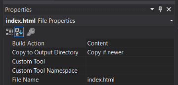
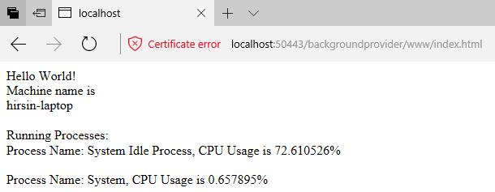
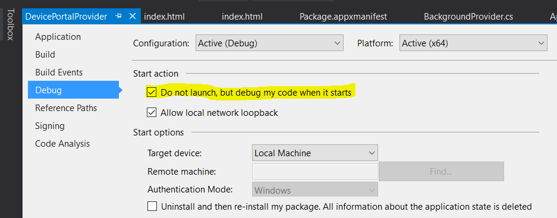

---

ms.assetid: 82ab5fc9-3a7f-4d9e-9882-077ccfdd0ec9
title: Write a custom plugin for device portal
description: Learn how to write a UWP app that uses the Windows Device Portal to host a web page and provide diagnostic information.

ms.date: 03/24/2017
ms.topic: article


keywords: windows 10, uwp, device portal
ms.localizationpriority: medium
---

# Write a custom plugin for Device Portal

Learn how to write a UWP app that uses th Windows Device Portal to host a web page and provide diagnostic information.

Starting with the Creators Update, you can use Device Portal to host your app's diagnostic interfaces. This article covers the three pieces needed to create a DevicePortalProvider for your app – the appxmanifest changes, setting up your app’s connection to the Device Portal service, and handling an incoming request. A sample app is also provided to get started (Coming soon) . 

## Create a new UWP app project
In this guide, we'll create everything in one solution for simplicity.

In Microsoft Visual Studio 2017, create a new UWP app project. Go to File > New Project and select Templates > Visual C# > Windows Universal > Blank app (Windows Universal). Name it "DevicePortalProvider". This will be the app that contains the app service. Ensure that you choose the Creators Update SDK to support.  You may need to update Visual Studio or install the new SDK - see [here](https://blogs.windows.com/buildingapps/2017/04/05/updating-tooling-windows-10-creators-update/) for details. 

## Add the devicePortalProvider extension to your package.appxmanifest file
You will need to add some code to your *package.appxmanifest* file in order to make your app functional as a Device Portal plugin. First, add the following namespace definitions at the top of the file. Also add them to the `IgnorableNamespaces` attribute.

```xml
<Package
    ... 
    xmlns:rescap="http://schemas.microsoft.com/appx/manifest/foundation/windows10/restrictedcapabilities"
    xmlns:uap4="http://schemas.microsoft.com/appx/manifest/uap/windows10/4"
    IgnorableNamespaces="uap mp rescap uap4">
    ...
```

In order to declare that your app is a Device Portal Provider, you need to create an app service and a new Device Portal Provider extension that uses it. Add both the windows.appService extension and the windows.devicePortalProvider extension in the `Extensions` element under `Application`. Make sure the `AppServiceName` attributes match in each extension. This indicates to the Device Portal service that this app service can be launched to handle requests on the handler namespace. 

```xml
...   
<Application 
    Id="App" 
    Executable="$targetnametoken$.exe"
    EntryPoint="DevicePortalProvider.App">
    ...
    <Extensions>
        <uap:Extension Category="windows.appService" EntryPoint="MySampleProvider.SampleProvider">
            <uap:AppService Name="com.sampleProvider.wdp" />
        </uap:Extension>
        <uap4:Extension Category="windows.devicePortalProvider">
            <uap4:DevicePortalProvider 
                DisplayName="My Device Portal Provider Sample App" 
                AppServiceName="com.sampleProvider.wdp" 
                HandlerRoute="/MyNamespace/api/" />
        </uap4:Extension>
    </Extensions>
</Application>
...
```

The `HandlerRoute` attribute references the REST namespace claimed by your app. Any HTTP requests on that namespace (implicitly followed by a wildcard) received by the Device Portal service will be sent to your app to be handled. In this case, any successfully authenticated HTTP request to `<ip_address>/MyNamespace/api/*` will be sent to your app. Conflicts between handler routes are settled via a "longest wins" check: whichever route matches more of the requests is selected, meaning that a request to "/MyNamespace/api/foo" will match against a provider with "/MyNamespace/api" rather than one with "/MyNamespace".  

Two new capabilities are required for this functionality. they must also be added to your *package.appxmanifest* file.

```xml
...
<Capabilities>
    ...
    <Capability Name="privateNetworkClientServer" />
    <rescap:Capability Name="devicePortalProvider" />
</Capabilities>
...
```

> [!NOTE]
> The capability "devicePortalProvider" is restricted ("rescap"), which means you must get prior approval from the Store before your app can be published there. However, this does not prevent you from testing your app locally through sideloading. For more information about restricted capabilities, see [App capability declarations](https://msdn.microsoft.com/en-us/windows/uwp/packaging/app-capability-declarations#special-and-restricted-capabilities).

## Set up your background task and WinRT Component
In order to set up the Device Portal connection, your app must hook up an app service connection from the Device Portal service with the instance of Device Portal running within your app. To do this, add a new WinRT Component to your application with a class that implements [**IBackgroundTask**](https://docs.microsoft.com/en-us/uwp/api/windows.applicationmodel.background.ibackgroundtask).

```csharp
namespace MySampleProvider {
    // Implementing a DevicePortalConnection in a background task
    public sealed class SampleProvider : IBackgroundTask {
        //...
    }
```

Make sure that its name matches the namespace and class name set up by the AppService EntryPoint ("MySampleProvider.SampleProvider"). When you make your first request to your Device Portal provider, Device Portal will stash the request, launch your app's background task, call its **Run** method, and pass in an [**IBackgroundTaskInstance**](https://docs.microsoft.com/en-us/uwp/api/windows.applicationmodel.background.ibackgroundtaskinstance). Your app then uses it to set up a [**DevicePortalConnection**](https://docs.microsoft.com/en-us/uwp/api/windows.system.diagnostics.deviceportal.deviceportalconnection) instance.

```csharp
// Implement background task handler with a DevicePortalConnection
public void Run(IBackgroundTaskInstance taskInstance) {
    // Take a deferral to allow the background task to continue executing 
    this.taskDeferral = taskInstance.GetDeferral();
    taskInstance.Canceled += TaskInstance_Canceled;

    // Create a DevicePortal client from an AppServiceConnection 
    var details = taskInstance.TriggerDetails as AppServiceTriggerDetails;
    var appServiceConnection = details.AppServiceConnection;
    this.devicePortalConnection = DevicePortalConnection.GetForAppServiceConnection(appServiceConnection);

    // Add Closed, RequestReceived handlers 
    devicePortalConnection.Closed += DevicePortalConnection_Closed;
    devicePortalConnection.RequestReceived += DevicePortalConnection_RequestReceived;
}
```

There are two events that must be handled by the app to complete the request handling loop: **Closed**, for whenever the Device Portal service shuts down, and [**RequestRecieved**](https://docs.microsoft.com/en-us/uwp/api/windows.system.diagnostics.deviceportal.deviceportalconnectionrequestreceivedeventargs), which surfaces incoming HTTP requests and provides the main functionality of the Device Portal provider. 

## Handle the RequestReceived event
The **RequestReceived** event will be raised once for every HTTP request that is made on your plugin's specified Handler Route. The request handling loop for Device Portal providers is similar to that in NodeJS Express: the request and response objects are provided together with the event, and the handler responds by filling in the response object. In Device Portal providers, the **RequestReceived** event and its handlers use [**Windows.Web.Http.HttpRequestMessage**](https://docs.microsoft.com/en-us/uwp/api/windows.web.http.httprequestmessage) and [**HttpResponseMessage**](https://docs.microsoft.com/en-us/uwp/api/windows.web.http.httpresponsemessage) objects.   

```csharp
// Sample RequestReceived echo handler: respond with an HTML page including the query and some additional process information. 
private void DevicePortalConnection_RequestReceived(DevicePortalConnection sender, DevicePortalConnectionRequestReceivedEventArgs args)
{
    var req = args.RequestMessage;
    var res = args.ResponseMessage;

    if (req.RequestUri.AbsolutePath.EndsWith("/echo"))
    {
        // construct an html response message
        string con = "<h1>" + req.RequestUri.AbsoluteUri + "</h1><br/>";
        var proc = Windows.System.Diagnostics.ProcessDiagnosticInfo.GetForCurrentProcess();
        con += String.Format("This process is consuming {0} bytes (Working Set)<br/>", proc.MemoryUsage.GetReport().WorkingSetSizeInBytes);
        con += String.Format("The process PID is {0}<br/>", proc.ProcessId);
        con += String.Format("The executable filename is {0}", proc.ExecutableFileName);
        res.Content = new HttpStringContent(con);
        res.Content.Headers.ContentType = new HttpMediaTypeHeaderValue("text/html");
        res.StatusCode = HttpStatusCode.Ok;            
    }
    //...
}
```

In this sample request handler, we first pull the request and response objects out of the *args* parameter, then create a string with the request URL and some additional HTML formatting. This is added into the Response object as an [**HttpStringContent**](https://docs.microsoft.com/en-us/uwp/api/windows.web.http.httpstringcontent) instance. Other [**IHttpContent**](https://docs.microsoft.com/en-us/uwp/api/windows.web.http.ihttpcontent) classes, such as those for "String" and "Buffer," are also allowed.

The response is then set as an HTTP response and given a 200 (OK) status code. It should render as expected in the browser that made the original call. Note that when the **RequestReceived** event handler returns, the response message is automatically returned to the user agent: no additional "send" method is needed.


## Providing static content
Static content can be served directly from a folder within your package, making it very easy to add a UI to your provider.  The easiest way to serve static content is to create a content folder in your project that can map to a URL.


 
Then, add a route handler in your **RequestReceived** event handler that detects static content routes and maps a request appropriately.  

```csharp
if (req.RequestUri.LocalPath.ToLower().Contains("/www/")) {
    var filePath = req.RequestUri.AbsolutePath.Replace('/', '\\').ToLower();
    filePath = filePath.Replace("\\backgroundprovider", "")
    try {
        var fileStream = Windows.ApplicationModel.Package.Current.InstalledLocation.OpenStreamForReadAsync(filePath).GetAwaiter().GetResult();
        res.StatusCode = HttpStatusCode.Ok;
        res.Content = new HttpStreamContent(fileStream.AsInputStream());
        res.Content.Headers.ContentType = new HttpMediaTypeHeaderValue("text/html");
    } catch(FileNotFoundException e) {
        string con = String.Format("<h1>{0} - not found</h1>\r\n", filePath);
        con += "Exception: " + e.ToString();
        res.Content = new HttpStringContent(con);
        res.StatusCode = HttpStatusCode.NotFound;
        res.Content.Headers.ContentType = new HttpMediaTypeHeaderValue("text/html");
    }
}
```
Make sure that all files inside of the content folder are marked as "Content" and set to "Copy if newer" or "Copy always" in Visual Studio’s Properties menu.  This ensures that the files will be inside your AppX Package when you deploy it.  



## Using existing Device Portal resources and APIs
Static content served by a Device Portal provider is served on the same port as the core Device Portal service.  This means that you can reference the existing JS and CSS included with Device Portal with simple `<link>` and `<script>` tags in your HTML. In general, we suggest the use of *rest.js*, which wraps all the core Device Portal REST APIs in a convenient webbRest object, and the *common.css* file, which will allow you to style your content to fit with the rest of Device Portal's UI. You can see an example of this in the *index.html* page included in the sample. It uses *rest.js* to retrieve the device name and running processes from Device Portal. 


 
Importantly, use of the HttpPost/DeleteExpect200 methods on webbRest will automatically do the [CSRF handling](https://docs.microsoft.com/en-us/aspnet/web-api/overview/security/preventing-cross-site-request-forgery-csrf-attacks) for you, which allows your webpage to call state-changing REST APIs.  

> [!NOTE] 
> The static content included with Device Portal does not come with a guarantee against breaking changes. While the APIs are not expected to change often, they may, especially in the *common.js* and *controls.js* files, which your provider should not use. 

## Debugging the Device Portal connection
In order to debug your background task, you must change the way Visual Studio runs your code. Follow the steps below for debugging an app service connection to inspect how your provider is handling the HTTP requests:

1.	From the Debug menu, select DevicePortalProvider Properties. 
2.	Under the Debugging tab, in the Start action section, select “Do not launch, but debug my code when it starts”.  

3.	Set a breakpoint in your RequestReceived handler function.

> [!NOTE] 
> Make sure the build architecture matches the architecture of the target exactly. If you are using a 64-bit PC, you must deploy using an AMD64 build. 
4.	Press F5 to deploy your app
5.	Turn Device Portal off, then turn it back on so that it finds your app (only needed when you change your app manifest – the rest of the time you can simply re-deploy and skip this step). 
6.	In your browser, access the provider's namespace, and the breakpoint should be hit.

## Related topics
* [Windows Device Portal overview](device-portal.md)
* [Create and consume an app service](https://docs.microsoft.com/en-us/windows/uwp/launch-resume/how-to-create-and-consume-an-app-service)


