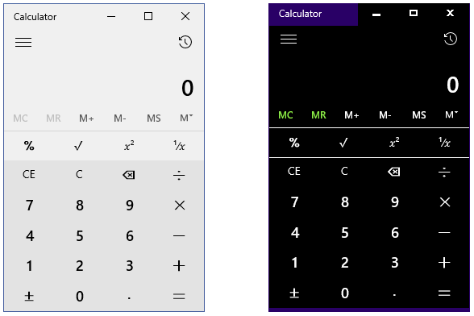
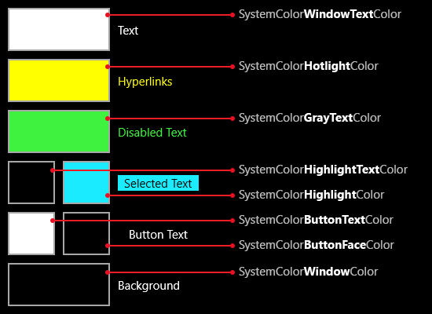

---

description: Describes the steps needed to ensure your Universal Windows Platform (UWP) app is usable when a high-contrast theme is active.
ms.assetid: FD7CA6F6-A8F1-47D8-AA6C-3F2EC3168C45
title: High-contrast themes
template: detail.hbs

ms.date: 09/28/2017
ms.topic: article


keywords: windows 10, uwp
ms.localizationpriority: medium
---

# High contrast themes  

Windows supports high contrast themes for the OS and apps that users may choose to enable. High contrast themes use a small palette of contrasting colors that makes the interface easier to see.



*Calculator shown in light theme and High Contrast Black theme.*

You can switch to a high contrast theme by using *Settings > Ease of access > High contrast*.

> [!NOTE]
> Don't confuse high contrast themes with light and dark themes, which allow a much larger color palette that isn't considered to have high contrast. For more light and dark themes, see the article on [color](../style/color.md).

While common controls come with full high contrast support for free, care needs to be taken while customizing your UI. The most common high contrast bug is caused by hard-coding a color on a control inline.

```xaml
<!-- Don't do this! -->
<Grid Background="#E6E6E6">

<!-- Instead, create BrandedPageBackgroundBrush and do this. -->
<Grid Background="{ThemeResource BrandedPageBackgroundBrush}">
```

When the `#E6E6E6` color is set inline in the first example, the Grid will retain that background color in all themes. If the user switches to the High Contrast Black theme, they'll expect your app to have a black background. Since `#E6E6E6` is almost white, some users may not be able to interact with your app.

In the second example, the [**{ThemeResource} markup extension**](../../xaml-platform/themeresource-markup-extension.md) is used to reference a color in the [**ThemeDictionaries**](https://msdn.microsoft.com/library/windows/apps/windows.ui.xaml.resourcedictionary.themedictionaries.aspx) collection, a dedicated property of a [**ResourceDictionary**](https://msdn.microsoft.com/library/windows/apps/BR208794) element. **ThemeDictionaries** allows XAML to automatically swap colors for you based on the user's current theme.

## Theme dictionaries

When you need to change a color from its system default, create a ThemeDictionaries collection for your app.

1. Start by creating the proper plumbing, if it doesn't already exist. In App.xaml, create a **ThemeDictionaries** collection, including **Default** and **HighContrast** at a minimum.
2. In **Default**, create the type of [Brush](http://msdn.microsoft.com/library/windows/apps/xaml/windows.ui.xaml.media.brush.aspx) you need, usually a **SolidColorBrush**. Give it a *x:Key* name specific to what it is being used for.
3. Assign the **Color** you want for it.
4. Copy that **Brush** into **HighContrast**.

``` xaml
<Application.Resources>
    <ResourceDictionary>
        <ResourceDictionary.ThemeDictionaries>
            <!-- Default is a fallback if a more precise theme isn't called
            out below -->
            <ResourceDictionary x:Key="Default">
                <SolidColorBrush x:Key="BrandedPageBackgroundBrush" Color="#E6E6E6" />
            </ResourceDictionary>

            <!-- Optional, Light is used in light theme.
            If included, Default will be used for Dark theme -->
            <ResourceDictionary x:Key="Light">
                <SolidColorBrush x:Key="BrandedPageBackgroundBrush" Color="#E6E6E6" />
            </ResourceDictionary>

            <!-- HighContrast is used in all high contrast themes -->
            <ResourceDictionary x:Key="HighContrast">
                <SolidColorBrush x:Key="BrandedPageBackgroundBrush" Color="#E6E6E6" />
            </ResourceDictionary>
        </ResourceDictionary.ThemeDictionaries>
    </ResourceDictionary>
</Application.Resources>
```

The last step is to determine what color to use in high contrast, which is covered in the next section.

> [!NOTE]
> **HighContrast** is not the only available key name. There's also **HighContrastBlack**, **HighContrastWhite**, and **HighContrastCustom**. In most cases, **HighContrast** is all you need.

## High contrast colors

On the *Settings > Ease of access > High contrast* page, there are 4 high contrast themes by default. 


  

*After the user selects an option, the page shows a preview.*  

  

*Every color swatch on the preview can be clicked to change its value. Every swatch also directly maps to an XAML color resource.*  

Each **SystemColor*Color** resource is a variable that automatically updates color when the user switches high contrast themes. Following are guidelines for where and when to use each resource.

Resource | Usage |
|--------|-------|
**SystemColorWindowTextColor** | Body copy, headings, lists; any text that can't be interacted with |
| **SystemColorHotlightColor** | Hyperlinks |
| **SystemColorGrayTextColor** | Disabled UI |
| **SystemColorHighlightTextColor** | Foreground color for text or UI that's in progress, selected, or currently being interacted with |
| **SystemColorHighlightColor** | Background color for text or UI that's in progress, selected, or currently being interacted with |
| **SystemColorButtonTextColor** | Foreground color for buttons; any UI that can be interacted with |
| **SystemColorButtonFaceColor** | Background color for buttons; any UI that can be interacted with |
| **SystemColorWindowColor** | Background of pages, panes, popups, and bars |

It's often helpful to look to existing apps, Start, or the common controls to see how others have solved high contrast design problems that are similar to your own.

**Do**

* Respect the background/foreground pairs where possible.
* Test in all 4 high contrast themes while your app is running. The user should not have to restart your app when they switch themes.
* Be consistent.

**Don't**

* Hard code a color in the **HighContrast** theme; use the **SystemColor*Color** resources.
* Choose a color resource for aesthetics. Remember, they change with the theme!
* Don't use **SystemColorGrayTextColor** for body copy that's secondary or acts as a hint.


To continue the earlier example, you need to pick a resource for **BrandedPageBackgroundBrush**. Because the name indicates that it will be used for a background, **SystemColorWindowColor** is a good choice.

``` xaml
<Application.Resources>
    <ResourceDictionary>
        <ResourceDictionary.ThemeDictionaries>
            <!-- Default is a fallback if a more precise theme isn't called
            out below -->
            <ResourceDictionary x:Key="Default">
                <SolidColorBrush x:Key="BrandedPageBackgroundBrush" Color="#E6E6E6" />
            </ResourceDictionary>

            <!-- Optional, Light is used in light theme.
            If included, Default will be used for Dark theme -->
            <ResourceDictionary x:Key="Light">
                <SolidColorBrush x:Key="BrandedPageBackgroundBrush" Color="#E6E6E6" />
            </ResourceDictionary>

            <!-- HighContrast is used in all high contrast themes -->
            <ResourceDictionary x:Key="HighContrast">
                <SolidColorBrush x:Key="BrandedPageBackgroundBrush" Color="{ThemeResource SystemColorWindowColor}" />
            </ResourceDictionary>
        </ResourceDictionary.ThemeDictionaries>
    </ResourceDictionary>
</Application.Resources>
```

Later in your app, you can now set the background.

```xaml
<Grid Background="{ThemeResource BrandedPageBackgroundBrush}">
```

Note how **\{ThemeResource\}** is used twice, once to reference **SystemColorWindowColor** and again to reference **BrandedPageBackgroundBrush**. Both are required for your app to theme correctly at run time. This is a good time to test out the functionality in your app. The Grid's background will automatically update as you switch to a high contrast theme. It will also update when switching between different high contrast themes.

## When to use borders

Pages, panes, popups, and bars should all use **SystemColorWindowColor** for their background in high contrast. Add a high contrast-only border where necessary to preserve important boundaries in your UI.

  

*The navigation pane and the page both share the same background color in high contrast. A high contrast-only border to divide them is essential.*


## List items

In high contrast, items in a [ListView](https://msdn.microsoft.com/library/windows/apps/windows.ui.xaml.controls.listview.aspx) have their background set to **SystemColorHighlightColor** when they are hovered, pressed, or selected. Complex list items commonly have a bug where the content of the list item fails to invert its color when the item is hovered, pressed, or selected. This makes the item impossible to read.


*A simple list in light theme (left) and High Contrast Black theme (right). The second item is selected; note how its text color is inverted in high contrast.*


### List items with colored text

One culprit is setting TextBlock.Foreground in the ListView's [DataTemplate](https://msdn.microsoft.com/library/windows/apps/windows.ui.xaml.controls.itemscontrol.itemtemplate.aspx). This is commonly done to establish visual hierarchy. The Foreground property is set on the [ListViewItem](https://msdn.microsoft.com/library/windows/apps/windows.ui.xaml.controls.listviewitem.aspx), and TextBlocks in the DataTemplate inherit the correct Foreground color when the item is hovered, pressed, or selected. However, setting Foreground breaks the inheritance.


*Complex list in light theme (left) and High Contrast Black theme (right). In high contrast, the second line of the selected item failed to invert.*  

You can work around this by setting Foreground conditionally via a Style that's in a **ThemeDictionaries** collection. Because the **Foreground** is not set by **SecondaryBodyTextBlockStyle** in **HighContrast**, its color will correctly invert.

```xaml
<!-- In App.xaml... -->
<ResourceDictionary.ThemeDictionaries>
    <ResourceDictionary x:Key="Default">
        <Style
            x:Key="SecondaryBodyTextBlockStyle"
            TargetType="TextBlock"
            BasedOn="{StaticResource BodyTextBlockStyle}">
            <Setter Property="Foreground" Value="{StaticResource SystemControlForegroundBaseMediumBrush}" />
        </Style>
    </ResourceDictionary>

    <ResourceDictionary x:Key="Light">
        <Style
            x:Key="SecondaryBodyTextBlockStyle"
            TargetType="TextBlock"
            BasedOn="{StaticResource BodyTextBlockStyle}">
            <Setter Property="Foreground" Value="{StaticResource SystemControlForegroundBaseMediumBrush}" />
        </Style>
    </ResourceDictionary>

    <ResourceDictionary x:Key="HighContrast">
        <!-- The Foreground Setter is omitted in HighContrast -->
        <Style
            x:Key="SecondaryBodyTextBlockStyle"
            TargetType="TextBlock"
            BasedOn="{StaticResource BodyTextBlockStyle}" />
    </ResourceDictionary>
</ResourceDictionary.ThemeDictionaries>

<!-- Usage in your DataTemplate... -->
<DataTemplate>
    <StackPanel>
        <TextBlock Style="{StaticResource BodyTextBlockStyle}" Text="Double line list item" />

        <!-- Note how ThemeResource is used to reference the Style -->
        <TextBlock Style="{ThemeResource SecondaryBodyTextBlockStyle}" Text="Second line of text" />
    </StackPanel>
</DataTemplate>
```


## Detecting high contrast

You can programmatically check if the current theme is a high contrast theme by using members of the [**AccessibilitySettings**](https://msdn.microsoft.com/library/windows/apps/BR242237) class.

> [!NOTE]
> Make sure you call the **AccessibilitySettings** constructor from a scope where the app is initialized and is already displaying content.

## Related topics  
* [Accessibility](accessibility.md)
* [UI contrast and settings sample](http://go.microsoft.com/fwlink/p/?linkid=231539)
* [XAML accessibility sample](http://go.microsoft.com/fwlink/p/?linkid=238570)
* [XAML high contrast sample](http://go.microsoft.com/fwlink/p/?linkid=254993)
* [**AccessibilitySettings**](https://msdn.microsoft.com/library/windows/apps/BR242237)
