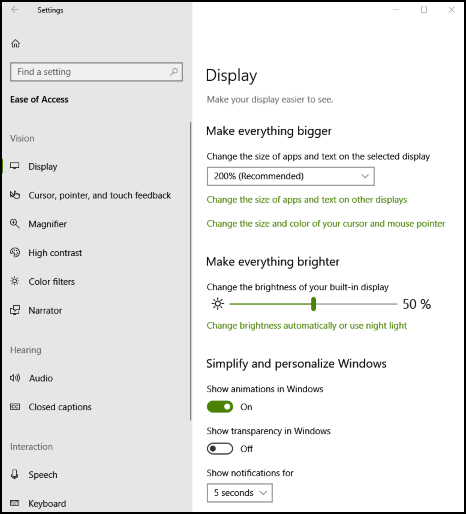

# Landmarks and Headings

A user interface is typically organized in a visually efficient way, allowing a sighted user to quickly skim for what interests them without having to slow down to read *all* the content. A screen reader user needs to have this same skimming ability. Landmarks and headings define sections of a user interface that aid in more efficient navigation for users of assistive technology (AT). Marking up the content into landmarks and headings provides a screen reader user the option to skim content similar to the way a sighted user would.

The concepts of [ARIA landmarks](https://www.w3.org/WAI/GL/wiki/Using_ARIA_landmarks_to_identify_regions_of_a_page), [ARIA headings](https://www.w3.org/TR/WCAG20-TECHS/ARIA12.html), and [HTML headings](https://www.w3.org/TR/2016/NOTE-WCAG20-TECHS-20161007/H42.html) have been used in web content for years to allow faster navigation by screen reader users. Web pages utilize landmarks and headings to make their content more usable by allowing the AT user to quickly get to the large chunk (landmark) and smaller chunk (heading). Specifically, screen readers have commands allowing users to jump between landmarks and jump between headings (next/previous or specific heading level). It is important to consider landmarks and headings in your apps for the same reasons.

Landmarks enable content to be grouped into various categories such as search, navigation, main content, and so on. Once grouped, the AT user can quickly navigate between the groups. This quick navigation allows the user to skip potentially substantial amounts of content which previously may have had to be navigated over item by item making for a poor experience. 

For example, when using a tab panel, consider this a navigational landmark. When using a search edit box, consider this a search landmark and consider setting your main content as a main content landmark. Whether within a landmark or even outside a landmark, consider setting sub elements as headings with logical heading levels. 

Consider the **Ease of Access** page in the Windows Settings app. 

  

There is a search edit box which is wrapped within a search landmark. The navigational elements on the left are wrapped within a navigational landmark and the main content on the right is wrapped within a main content landmark. Taking this further, within the navigational landmark there is a main group heading called **Ease of Access** which is a heading level 1. Under that are the sub options **Vison**, **Hearing**, and so on. These have a heading level 2. Setting headings is continued within the main content again setting the main subject, **Display**, as heading level 1 and sub groups such as **Make everything bigger** as heading level 2. 

The Settings app would be accessible without landmarks and headings, but it becomes more usable with them. A screen reader user can quickly and easily get to the group (landmark) they need and then quickly get to the sub group (heading) as well. 

Use [AutomationProperties.LandmarkTypeProperty](https://docs.microsoft.com/uwp/api/windows.ui.xaml.automation.automationproperties.LandmarkTypeProperty) to setup the UI element as the [type of landmark](https://msdn.microsoft.com/library/windows/desktop/mt759299) you wish. This landmark UI element would encapsulate all the other UI elements which make sense for that landmark. 

Use [AutomationProperties.LocalizedLandmarkTypeProperty](https://docs.microsoft.com/uwp/api/windows.ui.xaml.automation.automationproperties.LocalizedLandmarkTypeProperty) to specifically name the landmark. If you select a predefined landmark type such as main or navigational, these names will be used for the landmark name. However, if you set the landmark type to custom you must specifically name the landmark through this property. You can also use this property to override the default names from the non-custom landmark types. 

Use [AutomationProperties.HeadingLevel](https://docs.microsoft.com/uwp/api/windows.ui.xaml.automation.automationproperties.headinglevelproperty) to set the UI element as a heading of a specific level from *Level1* through *Level9*.

