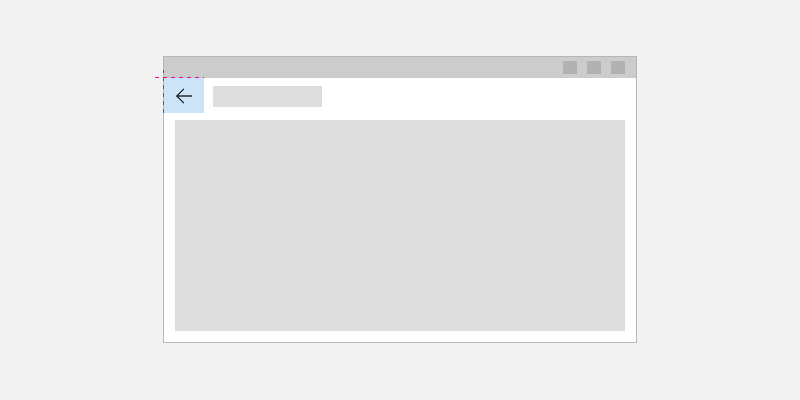
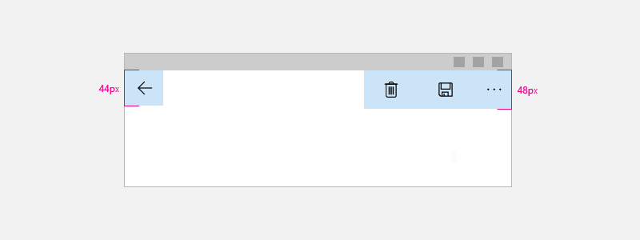

# Navigation history and backwards navigation for Windows apps

> **Important APIs**: [BackRequested event](/uwp/api/Windows.UI.Core.SystemNavigationManager.BackRequested), [SystemNavigationManager class](/uwp/api/Windows.UI.Core.SystemNavigationManager), [OnNavigatedTo](/uwp/api/windows.ui.xaml.controls.page.onnavigatedto#Windows_UI_Xaml_Controls_Page_OnNavigatedTo_Windows_UI_Xaml_Navigation_NavigationEventArgs_)

The Windows app provides a consistent back navigation system for traversing the user's navigation history within an app and, depending on the device, from app to app.

To implement backwards navigation in your app, place a back button at the top left corner of your app's UI. The user expects the back button to navigate to the previous location in the app's navigation history. Note that it's up to you to decide which navigation actions to add to the navigation history and how to respond to the back button press.

For most apps that have multiple pages, we recommend that you use the [NavigationView](../controls-and-patterns/navigationview.md) control to provide the navigation framework for your app. It adapts to a variety of screen sizes and supports both _top_ and _left_ navigation styles. If your app uses the `NavigationView` control, then you can use [NavigationView's built-in back button](../controls-and-patterns/navigationview.md#backwards-navigation).

> [!NOTE]
> The guidelines and examples in this article should be used when you implement navigation without using the `NavigationView` control. If you use `NavigationView`, this information provides useful background knowledge, but you should use the specific guidance and examples in the [NavigationView](../controls-and-patterns/navigationview.md) article

## Back button

To create a back button, use the [Button](../controls-and-patterns/buttons.md) control with the `NavigationBackButtonNormalStyle` style, and place the button at the top left hand corner of your app's UI (for details, see the XAML code examples below).



```xaml
<Page>
    <Grid>
        <Grid.RowDefinitions>
            <RowDefinition Height="Auto"/>
            <RowDefinition Height="*"/>
        </Grid.RowDefinitions>

        <Button x:Name="BackButton"
                Style="{StaticResource NavigationBackButtonNormalStyle}" 
                ToolTipService.ToolTip="Back"/>

    </Grid>
</Page>
```

If your app has a top [CommandBar](../controls-and-patterns/app-bars.md), the Button control that is 44px in height will not align with 48px AppBarButtons very nicely. However, to avoid inconsistency, align the top of the Button control inside the 48px bounds.



```xaml
<Page>
    <Grid>
        <Grid.RowDefinitions>
            <RowDefinition Height="Auto"/>
            <RowDefinition Height="*"/>
        </Grid.RowDefinitions>
        
        <CommandBar>
            <CommandBar.Content>
                <Button x:Name="BackButton"
                        Style="{StaticResource NavigationBackButtonNormalStyle}"
                        ToolTipService.ToolTip="Back" 
                        VerticalAlignment="Top"/>
            </CommandBar.Content>
        
            <AppBarButton Icon="Delete" Label="Delete"/>
            <AppBarButton Icon="Save" Label="Save"/>
        </CommandBar>
    </Grid>
</Page>
```

In order to minimize UI elements moving around in your app, show a disabled back button when there is nothing in the backstack (see code example below). However, if you expect your app will never have a backstack, you don't need to display the back button at all.


## Optimize for different devices and inputs

This backwards navigation design guidance is applicable to all devices, but your users will benefit if you optimize for different form factors and methods of input.

To optimize your UI:

- **Desktop/Hub**: Draw the in-app back button on the top left corner of your app's UI.
- **[Tablet Mode](https://support.microsoft.com/windows/use-your-pc-like-a-tablet-4fbfcca5-f058-814a-4f80-a12e703d7c34)**: A hardware or software back button might be present on tablets, but we recommend drawing an in-app back button for clarity.
- **Xbox/TV**: Do not draw a back button; it will add unnecessary UI clutter. Instead, rely on the Gamepad B button to navigate backwards.

If your app will run on Xbox, [create a custom visual trigger for Xbox](../devices/designing-for-tv.md#custom-visual-state-trigger-for-xbox) to toggle the visibility of the button. If you use a [NavigationView](../controls-and-patterns/navigationview.md) control, it will automatically toggle the back button's visibility when your app is running on Xbox.

We recommend handling the following events (in addition to the back button Click) to support the most common inputs for back navigation.

| Event | Input |
| --- | --- |
| [CoreDispatcher.AcceleratorKeyActivated](/uwp/api/windows.ui.core.coredispatcher.acceleratorkeyactivated) | Alt+Left arrow,<br/>VirtualKey.GoBack |
| [SystemNavigationManager.BackRequested](/api/windows.ui.core.systemnavigationmanager.backrequested) | Gamepad B button,<br/>Windows-Backspace key,<br/>Tablet Mode back button,<br/>Hardware back button |
| [CoreWindow.PointerPressed](/uwp/api/windows.ui.core.corewindow.pointerpressed) | VirtualKey.XButton1<br/>(Such as the back button found on some mice.) |

## Code examples

This section demonstrates how to handle back navigation using a variety of inputs.

### Back button and back navigation

At a minimum, you need to handle the back button `Click` event and provide the code to perform the back navigation. You should also disable the back button when the backstack is empty.

This example code demonstrates how to implement backwards navigation behavior with a back button. The code responds to the Button [Click](/uwp/api/windows.ui.xaml.controls.primitives.buttonbase.Click) event to navigate. The back button is enabled or disabled in the [OnNavigatedTo](/uwp/api/windows.ui.xaml.controls.page.onnavigatedto) method, which is called when navigating to a new page.

The code is shown for `MainPage`, but you add this code to each page that supports back navigation. To make this easier, this example creates a helper class called `NavigationHelper` to hold the navigation related code. An instance of `NavigationHelper` is created in each page.

```xaml
<!-- MainPage.xaml -->
<Page x:Class="AppName.MainPage">
...
        <Button x:Name="BackButton" Click="BackButton_Click"
                Style="{StaticResource NavigationBackButtonNormalStyle}" 
                ToolTipService.ToolTip="Back"/>
...
<Page/>
```

Code-behind:

```csharp
// MainPage.xaml.cs
NavigationHelper navigationHelper;
protected override void OnNavigatedTo(NavigationEventArgs e)
{
    if (navigationHelper is null)
    {
        // Pass the root Frame (Page.Frame property) to NavigationHelper.
        navigationHelper = new NavigationHelper(Frame);
    }
    // Enable or disable the back button.
    BackButton.IsEnabled = Frame.CanGoBack;
    base.OnNavigatedTo(e);
}

private void BackButton_Click(object sender, RoutedEventArgs e)
{
    navigationHelper.TryGoBack();
}
```

Here's the code for the `NavigationHelper` class.

```csharp
class NavigationHelper
{
    private Frame Frame { get; set; }

    public NavigationHelper(Frame rootFrame)
    {
        Frame = rootFrame;
    }

    // Perform back navigation if possible.
    public bool TryGoBack()
    {
        if (Frame.CanGoBack)
        {
            Frame.GoBack();
            return true;
        }
        return false;
    }
}
```

```cppwinrt
// MainPage.cpp
#include "pch.h"
#include "MainPage.h"

#include "winrt/Windows.System.h"
#include "winrt/Windows.UI.Xaml.Controls.h"
#include "winrt/Windows.UI.Xaml.Input.h"
#include "winrt/Windows.UI.Xaml.Navigation.h"

using namespace winrt;
using namespace Windows::Foundation;
using namespace Windows::UI::Xaml;

namespace winrt::PageNavTest::implementation
{
    MainPage::MainPage()
    {
        InitializeComponent();

        Windows::UI::Xaml::Input::KeyboardAccelerator goBack;
        goBack.Key(Windows::System::VirtualKey::GoBack);
        goBack.Invoked({ this, &MainPage::BackInvoked });
        Windows::UI::Xaml::Input::KeyboardAccelerator altLeft;
        altLeft.Key(Windows::System::VirtualKey::Left);
        altLeft.Invoked({ this, &MainPage::BackInvoked });
        KeyboardAccelerators().Append(goBack);
        KeyboardAccelerators().Append(altLeft);
        // ALT routes here.
        altLeft.Modifiers(Windows::System::VirtualKeyModifiers::Menu);
    }

    void MainPage::OnNavigatedTo(Windows::UI::Xaml::Navigation::NavigationEventArgs const& e)
    {
        BackButton().IsEnabled(Frame().CanGoBack());
    }

    void MainPage::Back_Click(IInspectable const&, RoutedEventArgs const&)
    {
        On_BackRequested();
    }

    // Handles system-level BackRequested events and page-level back button Click events.
    bool MainPage::On_BackRequested()
    {
        if (Frame().CanGoBack())
        {
            Frame().GoBack();
            return true;
        }
        return false;
    }

    void MainPage::BackInvoked(Windows::UI::Xaml::Input::KeyboardAccelerator const& sender,
        Windows::UI::Xaml::Input::KeyboardAcceleratorInvokedEventArgs const& args)
    {
        args.Handled(On_BackRequested());
    }
}
```

### Support access keys

Keyboard support is integral to ensuring your applications work great for users with different skills, abilities, and expectations. We recommend that you support accelerator keys for both forward and back navigation because users who rely on these will expect both. For more info, see [Keyboard interactions](..\input\keyboard-interactions.md) and [Keyboard accelerators](..\input\keyboard-accelerators.md).

The common accelerator keys for forward and back navigation are Alt + Right arrow (forward) and Alt + Left arrow (back). To support these keys for navigation, handle the [CoreDispatcher.AcceleratorKeyActivated](/uwp/api/windows.ui.core.coredispatcher.acceleratorkeyactivated) event. You handle an event that's directly on the Window (rather than an element on the page) so the app responds to the accelerator keys regardless of which element has focus.

Here's the code added to the `NavigationHelper` class to support accelerator keys and forward navigation. See the full `NavigationHelper` code at the end of the Code examples section for the complete class.

```csharp
class NavigationHelper
{
    ...

    public NavigationHelper(Frame rootFrame)
    {
        Frame = rootFrame;

        // Add support for accelerator keys. 
        // Listen to the window directly so the app responds
        // to accelerator keys regardless of which element has focus.
        Window.Current.CoreWindow.Dispatcher.AcceleratorKeyActivated +=
            CoreDispatcher_AcceleratorKeyActivated;

    }

    ...

    // Perform forward navigation if possible.
    private bool TryGoForward()
    {
        if (Frame.CanGoForward)
        {
            Frame.GoForward();
            return true;
        }
        return false;
    }

    // Invoked on every keystroke, including system keys such as Alt key combinations.
    // Used to detect keyboard navigation between pages even when the page itself
    // doesn't have focus.
    private void CoreDispatcher_AcceleratorKeyActivated(CoreDispatcher sender, AcceleratorKeyEventArgs e)
    {
        // When Alt+Left are pressed navigate back.
        // When Alt+Right are pressed navigate forward.
        if (e.EventType == CoreAcceleratorKeyEventType.SystemKeyDown
        && (e.VirtualKey == VirtualKey.Left || e.VirtualKey == VirtualKey.Right)
        && e.KeyStatus.IsMenuKeyDown == true
        && !e.Handled)
        {
            if (e.VirtualKey == VirtualKey.Left)
            {
                e.Handled = TryGoBack();
            }
            else if (e.VirtualKey == VirtualKey.Right)
            {
                e.Handled = TryGoForward();
            }
        }
    }
}
```

### Handle system back requests

Windows devices provide various ways that the system can pass a back navigation request to your app. Some common ways are the B button on a gamepad, the Windows key + Backspace key shortcut, or the system back button in Tablet Mode; the exact options available depend on the device.

You can support system provided back requests from hardware and software system back keys by registering a listener for the [SystemNavigationManager.BackRequested](/api/windows.ui.core.systemnavigationmanager.backrequested) event.

Here's the code added to the `NavigationHelper` class to support system provided back requests. See the full `NavigationHelper` code at the end of the Code examples section for the complete class.

```csharp
class NavigationHelper
{
    ...

    public NavigationHelper(Frame rootFrame)
    {
        Frame = rootFrame;

        // Add support for system back requests. 
        SystemNavigationManager.GetForCurrentView().BackRequested 
            += System_BackRequested;

    }

    ...

    private void System_BackRequested(object sender, BackRequestedEventArgs e)
    {
        if (!e.Handled)
        {
            e.Handled = TryGoBack();
        }
    }
}
```

```cppwinrt
// App.cpp
#include <winrt/Windows.UI.Core.h>
#include "winrt/Windows.UI.Input.h"
#include "winrt/Windows.UI.Xaml.Input.h"

#include "App.h"
#include "MainPage.h"

using namespace winrt;
...

    Windows::UI::Core::SystemNavigationManager::GetForCurrentView().BackRequested({ this, &App::App_BackRequested });
    Frame rootFrame{ nullptr };
    auto content = Window::Current().Content();
    if (content)
    {
        rootFrame = content.try_as<Frame>();
    }
    rootFrame.PointerPressed({ this, &App::On_PointerPressed });
...

void App::App_BackRequested(IInspectable const& /* sender */, Windows::UI::Core::BackRequestedEventArgs const& e)
{
    e.Handled(On_BackRequested());
}

void App::On_PointerPressed(IInspectable const& sender, Windows::UI::Xaml::Input::PointerRoutedEventArgs const& e)
{
    bool isXButton1Pressed =
        e.GetCurrentPoint(sender.as<UIElement>()).Properties().PointerUpdateKind() == Windows::UI::Input::PointerUpdateKind::XButton1Pressed;

    if (isXButton1Pressed)
    {
        e.Handled(On_BackRequested());
    }
}

// Handles system-level BackRequested events.
bool App::On_BackRequested()
{
    if (Frame().CanGoBack())
    {
        Frame().GoBack();
        return true;
    }
    return false;
}
```

#### System back behavior for backward compatibility

Previously, UWP apps used [SystemNavigationManager.AppViewBackButtonVisibility](/uwp/api/windows.ui.core.systemnavigationmanager.appviewbackbuttonvisibility) to show or hide a system back button for backwards navigation. (This button raises a [SystemNavigationManager.BackRequested](/api/windows.ui.core.systemnavigationmanager.backrequested) event.) This API will continue to be supported to ensure backward compatibility, but we no longer recommend using the back button exposed by `AppViewBackButtonVisibility`. Instead, you should provide your own in-app back button as described in this article.

If you continue to use [AppViewBackButtonVisibility](/uwp/api/windows.ui.core.appviewbackbuttonvisibility), then the system UI renders the system back button inside the title bar. (The appearance and user interactions for the back button are unchanged from previous builds.)


### Handle mouse navigation buttons

Some mice provide hardware navigation buttons for forward and back navigation. You can support these mouse buttons by handling the [CoreWindow.PointerPressed](/uwp/api/windows.ui.core.corewindow.pointerpressed) event and checking for [IsXButton1Pressed](/uwp/api/windows.ui.input.pointerpointproperties.isxbutton1pressed) (back) or [IsXButton2Pressed](/uwp/api/windows.ui.input.pointerpointproperties.isxbutton2pressed) (forward).

Here's the code added to the `NavigationHelper` class to support mouse button navigation. See the full `NavigationHelper` code at the end of the Code examples section for the complete class.

```csharp
class NavigationHelper
{
    ...

    public NavigationHelper(Frame rootFrame)
    {
        Frame = rootFrame;

        // Add support for mouse navigation buttons. 
        Window.Current.CoreWindow.PointerPressed += CoreWindow_PointerPressed;

    }

    ...

    // Handle mouse forward and back buttons.
    private void CoreWindow_PointerPressed(CoreWindow sender, PointerEventArgs e)
    {
        // For this event, e.Handled arrives as 'true', so invert the values. 
        if (e.CurrentPoint.Properties.IsXButton1Pressed
            && e.Handled)
        {
            e.Handled = !TryGoBack();
        }
        else if (e.CurrentPoint.Properties.IsXButton2Pressed 
                && e.Handled)
        {
            e.Handled = !TryGoForward();
        }
    }
}
```

### NavigationHelper complete code

```csharp
class NavigationHelper
{
    private Frame Frame { get; set; }

    public NavigationHelper(Frame rootFrame)
    {
        Frame = rootFrame;

        // Add support for system back requests. 
        SystemNavigationManager.GetForCurrentView().BackRequested 
            += System_BackRequested;

        // Add support for accelerator keys. 
        // Listen to the window directly so the app responds
        // to accelerator keys regardless of which element has focus.
        Window.Current.CoreWindow.Dispatcher.AcceleratorKeyActivated +=
            CoreDispatcher_AcceleratorKeyActivated;

        // Add support for mouse navigation buttons. 
        Window.Current.CoreWindow.PointerPressed += CoreWindow_PointerPressed;
    }

    // Perform back navigation if possible.
    public bool TryGoBack()
    {
        if (Frame.CanGoBack)
        {
            Frame.GoBack();
            return true;
        }
        return false;
    }

    // Perform forward navigation if possible.
    private bool TryGoForward()
    {
        if (Frame.CanGoForward)
        {
            Frame.GoForward();
            return true;
        }
        return false;
    }

    // Invoked on every keystroke, including system keys such as Alt key combinations.
    // Used to detect keyboard navigation between pages even when the page itself
    // doesn't have focus.
    private void CoreDispatcher_AcceleratorKeyActivated(CoreDispatcher sender, AcceleratorKeyEventArgs e)
    {
        // When Alt+Left are pressed navigate back.
        // When Alt+Right are pressed navigate forward.
        if (e.EventType == CoreAcceleratorKeyEventType.SystemKeyDown
        && (e.VirtualKey == VirtualKey.Left || e.VirtualKey == VirtualKey.Right)
        && e.KeyStatus.IsMenuKeyDown == true
        && !e.Handled)
        {
            if (e.VirtualKey == VirtualKey.Left)
            {
                e.Handled = TryGoBack();
            }
            else if (e.VirtualKey == VirtualKey.Right)
            {
                e.Handled = TryGoForward();
            }
        }
    }

    // Handle system back requests.
    private void System_BackRequested(object sender, BackRequestedEventArgs e)
    {
        if (!e.Handled)
        {
            e.Handled = TryGoBack();
        }
    }

    // Handle mouse forward and back buttons.
    private void CoreWindow_PointerPressed(CoreWindow sender, PointerEventArgs e)
    {
        // For this event, e.Handled arrives as 'true', so invert the values. 
        if (e.CurrentPoint.Properties.IsXButton1Pressed
            && e.Handled)
        {
            e.Handled = !TryGoBack();
        }
        else if (e.CurrentPoint.Properties.IsXButton2Pressed 
                && e.Handled)
        {
            e.Handled = !TryGoForward();
        }
    }
}
```

## Guidelines for custom back navigation behavior

If you choose to provide your own back stack navigation, the experience should be consistent with other apps. We recommend that you follow the following patterns for navigation actions:

<div class="mx-responsive-img">
<table>
<thead>
<tr class="header">
<th align="left">Navigation action</th>
<th align="left">Add to navigation history?</th>
</tr>
</thead>
<tbody>
<tr class="odd">
<td style="vertical-align:top;"><strong>Page to page, different peer groups</strong></td>
<td style="vertical-align:top;"><strong>Yes</strong>
<p>In this illustration, the user navigates from level 1 of the app to level 2, crossing peer groups, so the navigation is added to the navigation history.</p>
<p></p>
<p>In the next illustration, the user navigates between two peer groups at the same level, again crossing peer groups, so the navigation is added to the navigation history.</p>
<p></p></td>
</tr>
<tr class="even">
<td style="vertical-align:top;"><strong>Page to page, same peer group, no on-screen navigation element</strong>
<p>The user navigates from one page to another with the same peer group. There is no on-screen navigation element (such as <a href="/windows/uwp/design/controls-and-patterns/navigationview">NavigationView</a>) that provides direct navigation to both pages.</p></td>
<td style="vertical-align:top;"><strong>Yes</strong>
<p>In the following illustration, the user navigates between two pages in the same peer group, and the navigation should be added to the navigation history.</p>
<p></p></td>
</tr>
<tr class="odd">
<td style="vertical-align:top;"><strong>Page to page, same peer group, with an on-screen navigation element</strong>
<p>The user navigates from one page to another in the same peer group. Both pages are shown in the same navigation element, such as <a href="/windows/uwp/design/controls-and-patterns/navigationview">NavigationView</a>.</p></td>
<td style="vertical-align:top;"><strong>It depends</strong>
<p>Yes, add to the navigation history, with two notable exceptions. If you expect users of your app to switch between pages in the peer group frequently, or if you wish to preserve the navigational hierarchy, then do not add to the navigation history. In this case, when the user presses back, go back to the last page before the user navigated to the current peer group. </p>
<p></p></td>
</tr>
<tr class="even">
<td style="vertical-align:top;"><strong>Show a transient UI</strong>
<p>The app displays a pop-up or child window, such as a dialog, splash screen, or on-screen keyboard, or the app enters a special mode, such as multiple selection mode.</p></td>
<td style="vertical-align:top;"><strong>No</strong>
<p>When the user presses the back button, dismiss the transient UI (hide the on-screen keyboard, cancel the dialog, etc) and return to the page that spawned the transient UI.</p>
<p></p></td>
</tr>
<tr class="odd">
<td style="vertical-align:top;"><strong>Enumerate items</strong>
<p>The app displays content for an on-screen item, such as the details for the selected item in master/details list.</p></td>
<td style="vertical-align:top;"><strong>No</strong>
<p>Enumerating items is similar to navigating within a peer group. When the user presses back, navigate to the page that preceded the current page that has the item enumeration.</p>
<p></p></td>
</tr>
</tbody>
</table>
</div>

### Resuming

When the user switches to another app and returns to your app, we recommend returning to the last page in the navigation history.

## Related articles

- [Navigation basics](navigation-basics.md)
