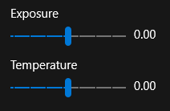
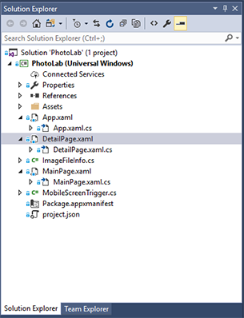
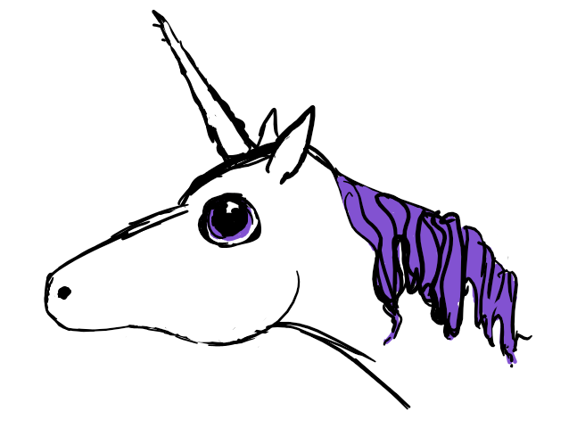
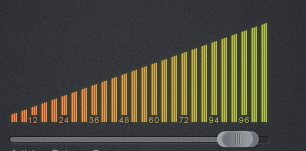
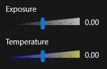
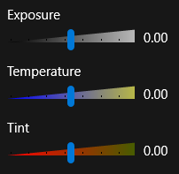
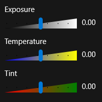

# Tutorial: Create custom styles

This tutorial shows you how to customize the UI of our XAML app. Warning: this tutorial might or might not involve a unicorn. (It does!)  

## Prerequisites
* [Visual Studio 2019 and the Windows 10 SDK (10.0.15063.468 or later)](https://developer.microsoft.com/windows/downloads)

## Part 0: Get the code
The starting point for this lab is located in the PhotoLab sample repository, in the [xaml-basics-starting-points/style/ folder](https://github.com/Microsoft/Windows-appsample-photo-lab/tree/master/xaml-basics-starting-points/style). After you've cloned/downloaded the repo, you can edit the project by opening PhotoLab.sln with Visual Studio 2019.

The PhotoLab app has two primary pages:

**MainPage.xaml:** displays a photo gallery view, along with some information about each image file.


**DetailPage.xaml:** displays a single photo after it has been selected. A flyout editing menu allows the photo to be altered, renamed, and saved.


## Part 1: Create a fancy slider control  

Universal Windows Platform (UWP) provides a number of ways to customize the look of your app. From fonts and typography settings to colors and gradients to blur effects, you have a lot of options. 

For the first part of the tutorial, let's jazz up some of our photo editing controls. 



These sliders are nice--they do all the things a slider should do--but they aren't very fancy. Let's fix that. 

The exposure slider adjusts the exposure of the image: slide it to the left and the image gets darker; slider it to the right and it gets lighter. Let's make our slider cooler by giving it a background that goes from black to white. It'll make the slider look better, which is great, but it will also provide a visual clue about the functionality that the slider provides.

### Customize a slider control

<!-- TODO: Update folder -->
1. After downloading the repository, open **PhotoLab.sln** in the xaml-basics-starting-points/style/ folder, and set your Solution Platform to x86 or x64 (not ARM). 

    Press F5 to compile and run the app. The first screen shows a gallery of images. Click an image to go to the image details page. Once you're there, click the edit button to see the editing controls we'll be working on. Exit the app and return to Visual Studio.  

2. In the Solution Explorer panel, double-click **DetailPage.xaml** to open it. 

    

3. Use a Polygon element to create a background shape for the exposure slider.

    The [Windows.XAML.Ui.Shapes namespace](https://docs.microsoft.com/en-us/uwp/api/Windows.UI.Xaml.Shapes) provides seven shapes to choose from. There's an ellipse, a rectangle, and a thing called a Path, which can make any sort of shape--yes, even a unicorn! 
    
    <!-- TODO reduce size -->
    
    
    > **Read about it:** The [Draw shapes](https://docs.microsoft.com/windows/uwp/design/controls-and-patterns/shapes) article tells you everything you need to know about XAML shapes. 
    
    We want to create a triangle-looking widget--something like the shape you'd see on a stereo's volume control.
    
    
    
    Sounds like a job for the Polygon shape! To define a polygon, you specify a set of points and give it a fill. Let's create a polygon that's about 200 pixels wide and 20 pixels tall, with a gradient fill.
    
    In DetailPage.xaml, find the code for the exposure slider, then create a Polygon element just before it: 

    * Set **Grid.Row** to "2" to put the polygon in the same row as the exposure slider. 
    * Set the **Points** property to "0,20 200,20 200,0" to define the triangle shape.
    * Set the **Stretch** property to "Fill" and the **HorizontalAlignment** property to "Stretch".
    * Set the **Height** to "20" and the **VerticalAlignment** to "Center". 
    * Give the **Polygon** a linear gradient fill.     
    * On the exposure slider, set the **Foreground** property to "Transparent" so you can see the polygon. 

    **Before**
    ```xaml
    <Slider Header="Exposure"
        Grid.Row="2"
        Value="{x:Bind item.Exposure, Mode=TwoWay}"
        Minimum="-2"
        Maximum="2" />
    ```
    **After**
    ```xaml
    <Polygon Grid.Row="2" Stretch="Fill"
                Points="0,20 200,20 200,0" HorizontalAlignment="Stretch"  
                VerticalAlignment="Center" Height="20">
        <Polygon.Fill>
            <LinearGradientBrush StartPoint="0,0.5" EndPoint="1,0.5">
                <LinearGradientBrush.GradientStops>
                    <GradientStop Offset="0" Color="Black" />
                    <GradientStop Offset="1" Color="White" />
                </LinearGradientBrush.GradientStops>
            </LinearGradientBrush>
        </Polygon.Fill>
    </Polygon>
    <Slider Header="Exposure" 
        Grid.Row="2" 
        Foreground="Transparent"
        Value="{x:Bind item.Exposure, Mode=TwoWay}"
        Minimum="-2"
        Maximum="2" />
    ```

    Notes:
    * If you look at the surrounding XAML, you'll see that these elements are in a Grid. We put the polygon in the same row as the exposure slider (Grid.Row="2") so they appear in the same spot. We put the polygon before the slider so that the slider renders of top of the shape.
    * We set Stretch="Fill" and HorizontalAlignment="Stretch" on the polygon so that the triangle will adjust to fill the available space. If the slider shrinks or grows in width, the polygon will shrink or grow to match. 

4. Compile and run the app. Your slider should now look awesome:

    

5. Let's give the next slider, the temperature slider, an upgrade. The temperature slider changes the color temperature of the image; sliding to the left makes the image bluer and sliding to the right makes the image more yellow.

    We'll use another polygon for this background shape with the same dimensions as the previous one, but this time we'll make the fill a blue-yellow gradient instead of black and white. 

    **Before**
    ```xaml
    <TextBlock Grid.Row="2"
                Grid.Column="1"
                 Margin="10,8,0,0" VerticalAlignment="Center" Padding="0"
                Text="{x:Bind item.Exposure.ToString('N', culture), Mode=OneWay}" />
                
    <Slider Header="Temperature"
            Grid.Row="3" Background="Transparent" Foreground="Transparent"
            Value="{x:Bind item.Temperature, Mode=TwoWay}"
            Minimum="-1"
            Maximum="1" />
    ```
    **After**
    ```xaml
    <TextBlock Grid.Row="2"
                Grid.Column="1"
                Margin="10,8,0,0" VerticalAlignment="Center" Padding="0"
                Text="{x:Bind item.Exposure.ToString('N', culture), Mode=OneWay}" />         
                
    <Polygon Grid.Row="3" Stretch="Fill"
                Points="0,20 200,20 200,0" HorizontalAlignment="Stretch"  
                VerticalAlignment="Center" Height="20">
        <Polygon.Fill>
            <LinearGradientBrush StartPoint="0,0.5" EndPoint="1,0.5">
                <LinearGradientBrush.GradientStops>
                    <GradientStop Offset="0" Color="Blue" />
                    <GradientStop Offset="1" Color="Yellow" />
                </LinearGradientBrush.GradientStops>
            </LinearGradientBrush>
        </Polygon.Fill>
    </Polygon>
    <Slider Header="Temperature"
            Grid.Row="3" Background="Transparent" Foreground="Transparent"
            Value="{x:Bind item.Temperature, Mode=TwoWay}"
            Minimum="-1"
            Maximum="1" />
    ```

6. Compile and run the app. You should now have two fancy sliders.

    

7. **Extra credit**

    Add a background shape for the tint slider that has a gradient from green to red. 

    


Congratulations, you've completed part 1! If you got stuck or want to see the final solution, you can find the completed code at **UWP Academy\XAML\Styling\Part1\Finish**.

 
    
## Part 2: Create basic styles

One of the advantages of XAML styles is that it can dramatically cut down the amount of code you have to write, and it can make it much, much easier to update the look of your app.

To define a style, you add a [Style](https://docs.microsoft.com/uwp/api/Windows.UI.Xaml.Style) element to the [Resources](https://docs.microsoft.com/en-us/uwp/api/windows.ui.xaml.frameworkelement.Resources) property of an element that contains the control you want to style.  If you add your style to the **Page.Resources** property, your styles will be accessible to the entire page. If you add your style to the **Application.Resources** property in your App.xaml file, the style will be accessible to the entire app.

You can create named styles and general styles. A named style must be explicitly applied to specific controls; a general style is applied to any control that matches the specified **TargetType**. 

In this example, the first style has an **x:Key** attribute and its target type is **Button**. The first button's **Style** property is set to this key, so this style is a named style and must be applied explicitly. The second style is applied automatically to the second button because its target type is **Button** and the style doesn't have an **x:Key** attribute.


```XAML
<Page.Resources>
    <Style x:Key="PurpleStyle" TargetType="Button">
        <Setter Property="FontFamily" Value="Lucida Sans Unicode"/>
        <Setter Property="FontStyle" Value="Italic"/>
        <Setter Property="FontSize" Value="14"/>
        <Setter Property="Foreground" Value="MediumOrchid"/>
    </Style>

    <Style TargetType="Button">
        <Setter Property="Foreground" Value="Orange"/>
    </Style>
</Page.Resources>

<Grid x:Name="LayoutRoot">
    <Button Content="Button" Style="{StaticResource PurpleStyle}"/>
    <Button Content="Button" />
</Grid>
```

Let's add a style to our app. In DetailsPage.xaml, take a look at the text blocks that sit next to our exposure, temperature, and tint sliders. Each of these text blocks displays the value of a slider. Here's the text block for the exposure slider. Notice that the **Margin**, **VerticalAlignment**, and **Padding** properties are set.

```XAML
<TextBlock Grid.Row="2"
            Grid.Column="1"
            Margin="10,8,0,0" VerticalAlignment="Center" Padding="0"
            Text="{x:Bind item.Exposure.ToString('N', culture), Mode=OneWay}" />
```
Look at the other text blocks--notice that those same properties are set to the same values. Sounds like a good candidate for a style...

### Create a value text block style

<!-- TODO: add second starting point -->
1. Open DetailsPage.xaml.

2. Find the **Grid** control named **EditControlsGrid**. It contains our sliders and text boxes. Notice that the grid already defines a style for our sliders. 

    ```XAML
    <Grid x:Name="EditControlsGrid"
            HorizontalAlignment="Stretch"
            Margin="24,48,24,24">
        <Grid.Resources>
            <Style TargetType="Slider">
                <Setter Property="Margin"
                        Value="0,0,0,0" />
                <Setter Property="Padding"
                        Value="0" />
                <Setter Property="MinWidth"
                        Value="100" />
                <Setter Property="StepFrequency"
                        Value="0.1" />
                <Setter Property="TickFrequency"
                        Value="0.1" />
            </Style>
        </Grid.Resources>    
    ```
3. Create a style for a **TextBlock** that sets its **Margin** to "10,8,0,0", its **VerticalAlignment** to "Center", and its **Padding** to "0".

    **Before**
    ```XAML
        <Grid.Resources>
            <Style TargetType="Slider">
                <Setter Property="Margin"
                        Value="0,0,0,0" />
                <Setter Property="Padding"
                        Value="0" />
                <Setter Property="MinWidth"
                        Value="100" />
                <Setter Property="StepFrequency"
                        Value="0.1" />
                <Setter Property="TickFrequency"
                        Value="0.1" />
            </Style>                           
        </Grid.Resources>
    ```

    **After**
    ```XAML
        <Grid.Resources>
            <Style TargetType="Slider">
                <Setter Property="Margin"
                        Value="0,0,0,0" />
                <Setter Property="Padding"
                        Value="0" />
                <Setter Property="MinWidth"
                        Value="100" />
                <Setter Property="StepFrequency"
                        Value="0.1" />
                <Setter Property="TickFrequency"
                        Value="0.1" />
            </Style>
            <Style TargetType="TextBlock">
                <Setter Property="Margin"
                        Value="10,8,0,0" />
                <Setter Property="VerticalAlignment"
                        Value="Center" />
                <Setter Property="Padding"
                        Value="0" />
            </Style>                            
        </Grid.Resources>
    ```    

4. Let's make this a named style so we can specify which **TextBlock** controls it applies to. Set the style's **x:Key** property to "ValueTextBox". 

    **Before**
    ```XAML
            <Style TargetType="TextBlock">
                <Setter Property="Margin"
                        Value="10,8,0,0" />
                <Setter Property="VerticalAlignment"
                        Value="Center" />
                <Setter Property="Padding"
                        Value="0" />
            </Style>                            
    ```    

    **After**
    ```XAML
            <Style TargetType="TextBlock"
                   x:Key="ValueTextBox">
                <Setter Property="Margin"
                        Value="10,8,0,0" />
                <Setter Property="VerticalAlignment"
                        Value="Center" />
                <Setter Property="Padding"
                        Value="0" />
            </Style>                            
    ```    

5. For each **TextBlock**, remove its **Margin**, **VerticalAlignment**, and **Padding** properties, and set its **Style** property to "{StaticResource ValueTextBox}".

    **Before**
    ```XAML
     <TextBlock Grid.Row="2"
                Grid.Column="1"
                Margin="10,8,0,0" VerticalAlignment="Center" Padding="0"
                Text="{x:Bind item.Exposure.ToString('N', culture), Mode=OneWay}" />   
    ```

    **After**
    ```XAML
     <TextBlock Grid.Row="2"
                Grid.Column="1"
                Style="{StaticResource ValueTextBox}"
                Text="{x:Bind item.Exposure.ToString('N', culture), Mode=OneWay}" />   
    ```    

    Make this change to all 6 TextBlock controls associated with the sliders.

6. Compile and run the app. It should look... the same. But you should feel that wonderful sense of satisfaction and accomplishment that comes from writing efficient, maintainable code.

<!-- TODO add new start/end points -->
Congratulations, you've completed Part 2!


## Part 3: Use a control template to make a fancy slider

Remember, how in Part 1 we added a shape behind the slider to make it look cool?

Well, we got the job done, but there's a better way to achieve the same effect: create a control template. 

<!-- TODO add new starting points -->
1. In the Solution Explorer panel, double-click **DetailPage.xaml**.

2. Next, we'll use the default control template for slider as our starting point. Add this XAML to the **Page.Resources** element. (The **Page.Resources** element is toward the beginning of the page.)

    ```XAML
    <ControlTemplate x:Key="FancySliderControlTemplate" TargetType="Slider">
        <Grid Margin="{TemplateBinding Padding}">
            <Grid.Resources>
                <Style TargetType="Thumb" x:Key="SliderThumbStyle">
                    <Setter Property="BorderThickness" Value="0" />
                    <Setter Property="Background" Value="{ThemeResource SliderThumbBackground}" />
                    <Setter Property="Template">
                        <Setter.Value>
                            <ControlTemplate TargetType="Thumb">
                                <Border Background="{TemplateBinding Background}"
                                            BorderBrush="{TemplateBinding BorderBrush}"
                                            BorderThickness="{TemplateBinding BorderThickness}"
                                            CornerRadius="4" />
                            </ControlTemplate>
                        </Setter.Value>
                    </Setter>
                </Style>
            </Grid.Resources>
            <Grid.RowDefinitions>
                <RowDefinition Height="Auto" />
                <RowDefinition Height="*" />
            </Grid.RowDefinitions>
            <VisualStateManager.VisualStateGroups>
                <VisualStateGroup x:Name="CommonStates">
                    <VisualState x:Name="Normal" />
                    <VisualState x:Name="Pressed">
                        <Storyboard>
                            <ObjectAnimationUsingKeyFrames Storyboard.TargetName="HorizontalTrackRect" Storyboard.TargetProperty="Fill">
                                <DiscreteObjectKeyFrame KeyTime="0" Value="{ThemeResource SliderTrackFillPressed}" />
                            </ObjectAnimationUsingKeyFrames>
                            <ObjectAnimationUsingKeyFrames Storyboard.TargetName="VerticalTrackRect" Storyboard.TargetProperty="Fill">
                                <DiscreteObjectKeyFrame KeyTime="0" Value="{ThemeResource SliderTrackFillPressed}" />
                            </ObjectAnimationUsingKeyFrames>
                            <ObjectAnimationUsingKeyFrames Storyboard.TargetName="HorizontalThumb" Storyboard.TargetProperty="Background">
                                <DiscreteObjectKeyFrame KeyTime="0" Value="{ThemeResource SliderThumbBackgroundPressed}" />
                            </ObjectAnimationUsingKeyFrames>
                            <ObjectAnimationUsingKeyFrames Storyboard.TargetName="VerticalThumb" Storyboard.TargetProperty="Background">
                                <DiscreteObjectKeyFrame KeyTime="0" Value="{ThemeResource SliderThumbBackgroundPressed}" />
                            </ObjectAnimationUsingKeyFrames>
                            <ObjectAnimationUsingKeyFrames Storyboard.TargetName="SliderContainer" Storyboard.TargetProperty="Background">
                                <DiscreteObjectKeyFrame KeyTime="0" Value="{ThemeResource SliderContainerBackgroundPressed}" />
                            </ObjectAnimationUsingKeyFrames>
                            <ObjectAnimationUsingKeyFrames Storyboard.TargetName="HorizontalDecreaseRect" Storyboard.TargetProperty="Fill">
                                <DiscreteObjectKeyFrame KeyTime="0" Value="{ThemeResource SliderTrackValueFillPressed}" />
                            </ObjectAnimationUsingKeyFrames>
                            <ObjectAnimationUsingKeyFrames Storyboard.TargetName="VerticalDecreaseRect" Storyboard.TargetProperty="Fill">
                                <DiscreteObjectKeyFrame KeyTime="0" Value="{ThemeResource SliderTrackValueFillPressed}" />
                            </ObjectAnimationUsingKeyFrames>
                        </Storyboard>
                    </VisualState>
                    <VisualState x:Name="Disabled">
                        <Storyboard>
                            <ObjectAnimationUsingKeyFrames Storyboard.TargetName="HeaderContentPresenter" Storyboard.TargetProperty="Foreground">
                                <DiscreteObjectKeyFrame KeyTime="0" Value="{ThemeResource SliderHeaderForegroundDisabled}" />
                            </ObjectAnimationUsingKeyFrames>
                            <ObjectAnimationUsingKeyFrames Storyboard.TargetName="HorizontalDecreaseRect" Storyboard.TargetProperty="Fill">
                                <DiscreteObjectKeyFrame KeyTime="0" Value="{ThemeResource SliderTrackValueFillDisabled}" />
                            </ObjectAnimationUsingKeyFrames>
                            <ObjectAnimationUsingKeyFrames Storyboard.TargetName="HorizontalTrackRect" Storyboard.TargetProperty="Fill">
                                <DiscreteObjectKeyFrame KeyTime="0" Value="{ThemeResource SliderTrackFillDisabled}" />
                            </ObjectAnimationUsingKeyFrames>
                            <ObjectAnimationUsingKeyFrames Storyboard.TargetName="VerticalDecreaseRect" Storyboard.TargetProperty="Fill">
                                <DiscreteObjectKeyFrame KeyTime="0" Value="{ThemeResource SliderTrackValueFillDisabled}" />
                            </ObjectAnimationUsingKeyFrames>
                            <ObjectAnimationUsingKeyFrames Storyboard.TargetName="VerticalTrackRect" Storyboard.TargetProperty="Fill">
                                <DiscreteObjectKeyFrame KeyTime="0" Value="{ThemeResource SliderTrackFillDisabled}" />
                            </ObjectAnimationUsingKeyFrames>
                            <ObjectAnimationUsingKeyFrames Storyboard.TargetName="HorizontalThumb" Storyboard.TargetProperty="Background">
                                <DiscreteObjectKeyFrame KeyTime="0" Value="{ThemeResource SliderThumbBackgroundDisabled}" />
                            </ObjectAnimationUsingKeyFrames>
                            <ObjectAnimationUsingKeyFrames Storyboard.TargetName="VerticalThumb" Storyboard.TargetProperty="Background">
                                <DiscreteObjectKeyFrame KeyTime="0" Value="{ThemeResource SliderThumbBackgroundDisabled}" />
                            </ObjectAnimationUsingKeyFrames>
                            <ObjectAnimationUsingKeyFrames Storyboard.TargetName="TopTickBar" Storyboard.TargetProperty="Fill">
                                <DiscreteObjectKeyFrame KeyTime="0" Value="{ThemeResource SliderTickBarFillDisabled}" />
                            </ObjectAnimationUsingKeyFrames>
                            <ObjectAnimationUsingKeyFrames Storyboard.TargetName="BottomTickBar" Storyboard.TargetProperty="Fill">
                                <DiscreteObjectKeyFrame KeyTime="0" Value="{ThemeResource SliderTickBarFillDisabled}" />
                            </ObjectAnimationUsingKeyFrames>
                            <ObjectAnimationUsingKeyFrames Storyboard.TargetName="LeftTickBar" Storyboard.TargetProperty="Fill">
                                <DiscreteObjectKeyFrame KeyTime="0" Value="{ThemeResource SliderTickBarFillDisabled}" />
                            </ObjectAnimationUsingKeyFrames>
                            <ObjectAnimationUsingKeyFrames Storyboard.TargetName="RightTickBar" Storyboard.TargetProperty="Fill">
                                <DiscreteObjectKeyFrame KeyTime="0" Value="{ThemeResource SliderTickBarFillDisabled}" />
                            </ObjectAnimationUsingKeyFrames>
                            <ObjectAnimationUsingKeyFrames Storyboard.TargetName="SliderContainer" Storyboard.TargetProperty="Background">
                                <DiscreteObjectKeyFrame KeyTime="0" Value="{ThemeResource SliderContainerBackgroundDisabled}" />
                            </ObjectAnimationUsingKeyFrames>
                        </Storyboard>
                    </VisualState>
                    <VisualState x:Name="PointerOver">
                        <Storyboard>
                            <ObjectAnimationUsingKeyFrames Storyboard.TargetName="HorizontalTrackRect" Storyboard.TargetProperty="Fill">
                                <DiscreteObjectKeyFrame KeyTime="0" Value="{ThemeResource SliderTrackFillPointerOver}" />
                            </ObjectAnimationUsingKeyFrames>
                            <ObjectAnimationUsingKeyFrames Storyboard.TargetName="VerticalTrackRect" Storyboard.TargetProperty="Fill">
                                <DiscreteObjectKeyFrame KeyTime="0" Value="{ThemeResource SliderTrackFillPointerOver}" />
                            </ObjectAnimationUsingKeyFrames>
                            <ObjectAnimationUsingKeyFrames Storyboard.TargetName="HorizontalThumb" Storyboard.TargetProperty="Background">
                                <DiscreteObjectKeyFrame KeyTime="0" Value="{ThemeResource SliderThumbBackgroundPointerOver}" />
                            </ObjectAnimationUsingKeyFrames>
                            <ObjectAnimationUsingKeyFrames Storyboard.TargetName="VerticalThumb" Storyboard.TargetProperty="Background">
                                <DiscreteObjectKeyFrame KeyTime="0" Value="{ThemeResource SliderThumbBackgroundPointerOver}" />
                            </ObjectAnimationUsingKeyFrames>
                            <ObjectAnimationUsingKeyFrames Storyboard.TargetName="SliderContainer" Storyboard.TargetProperty="Background">
                                <DiscreteObjectKeyFrame KeyTime="0" Value="{ThemeResource SliderContainerBackgroundPointerOver}" />
                            </ObjectAnimationUsingKeyFrames>
                            <ObjectAnimationUsingKeyFrames Storyboard.TargetName="HorizontalDecreaseRect" Storyboard.TargetProperty="Fill">
                                <DiscreteObjectKeyFrame KeyTime="0" Value="{ThemeResource SliderTrackValueFillPointerOver}" />
                            </ObjectAnimationUsingKeyFrames>
                            <ObjectAnimationUsingKeyFrames Storyboard.TargetName="VerticalDecreaseRect" Storyboard.TargetProperty="Fill">
                                <DiscreteObjectKeyFrame KeyTime="0" Value="{ThemeResource SliderTrackValueFillPointerOver}" />
                            </ObjectAnimationUsingKeyFrames>
                        </Storyboard>
                    </VisualState>
                </VisualStateGroup>
                <VisualStateGroup x:Name="FocusEngagementStates">
                    <VisualState x:Name="FocusDisengaged" />
                    <VisualState x:Name="FocusEngagedHorizontal">
                        <Storyboard>
                            <ObjectAnimationUsingKeyFrames Storyboard.TargetName="SliderContainer" Storyboard.TargetProperty="(Control.IsTemplateFocusTarget)">
                                <DiscreteObjectKeyFrame KeyTime="0" Value="False" />
                            </ObjectAnimationUsingKeyFrames>
                            <ObjectAnimationUsingKeyFrames Storyboard.TargetName="HorizontalThumb" Storyboard.TargetProperty="(Control.IsTemplateFocusTarget)">
                                <DiscreteObjectKeyFrame KeyTime="0" Value="True" />
                            </ObjectAnimationUsingKeyFrames>
                        </Storyboard>
                    </VisualState>
                    <VisualState x:Name="FocusEngagedVertical">
                        <Storyboard>
                            <ObjectAnimationUsingKeyFrames Storyboard.TargetName="SliderContainer" Storyboard.TargetProperty="(Control.IsTemplateFocusTarget)">
                                <DiscreteObjectKeyFrame KeyTime="0" Value="False" />
                            </ObjectAnimationUsingKeyFrames>
                            <ObjectAnimationUsingKeyFrames Storyboard.TargetName="VerticalThumb" Storyboard.TargetProperty="(Control.IsTemplateFocusTarget)">
                                <DiscreteObjectKeyFrame KeyTime="0" Value="True" />
                            </ObjectAnimationUsingKeyFrames>
                        </Storyboard>
                    </VisualState>
                </VisualStateGroup>
            </VisualStateManager.VisualStateGroups>
            <ContentPresenter x:Name="HeaderContentPresenter"
                        x:DeferLoadStrategy="Lazy"
                        Visibility="Collapsed"
                        Foreground="{ThemeResource SliderHeaderForeground}"
                        Margin="{ThemeResource SliderHeaderThemeMargin}"
                        Content="{TemplateBinding Header}"
                        ContentTemplate="{TemplateBinding HeaderTemplate}"
                        FontWeight="{ThemeResource SliderHeaderThemeFontWeight}"
                        TextWrapping="Wrap" />
            <Grid x:Name="SliderContainer"
                        Background="{ThemeResource SliderContainerBackground}"
                        Grid.Row="1"
                        Control.IsTemplateFocusTarget="True">
                <Grid x:Name="HorizontalTemplate" MinHeight="44">
                    <Grid.ColumnDefinitions>
                        <ColumnDefinition Width="Auto" />
                        <ColumnDefinition Width="Auto" />
                        <ColumnDefinition Width="*" />
                    </Grid.ColumnDefinitions>
                    <Grid.RowDefinitions>
                        <RowDefinition Height="18" />
                        <RowDefinition Height="Auto" />
                        <RowDefinition Height="18" />
                    </Grid.RowDefinitions>
                    <Rectangle x:Name="HorizontalTrackRect"
                                Fill="{TemplateBinding Background}"
                                Height="{ThemeResource SliderTrackThemeHeight}"
                                Grid.Row="1"
                                Grid.ColumnSpan="3" />
                    <Rectangle x:Name="HorizontalDecreaseRect" Fill="{TemplateBinding Foreground}" Grid.Row="1" />
                    <TickBar x:Name="TopTickBar"
                                Visibility="Collapsed"
                                Fill="{ThemeResource SliderTickBarFill}"
                                Height="{ThemeResource SliderOutsideTickBarThemeHeight}"
                                VerticalAlignment="Bottom"
                                Margin="0,0,0,4"
                                Grid.ColumnSpan="3" />
                    <TickBar x:Name="HorizontalInlineTickBar"
                                Visibility="Collapsed"
                                Fill="{ThemeResource SliderInlineTickBarFill}"
                                Height="{ThemeResource SliderTrackThemeHeight}"
                                Grid.Row="1"
                                Grid.ColumnSpan="3" />
                    <TickBar x:Name="BottomTickBar"
                                Visibility="Collapsed"
                                Fill="{ThemeResource SliderTickBarFill}"
                                Height="{ThemeResource SliderOutsideTickBarThemeHeight}"
                                VerticalAlignment="Top"
                                Margin="0,4,0,0"
                                Grid.Row="2"
                                Grid.ColumnSpan="3" />
                    <Thumb x:Name="HorizontalThumb"
                                Style="{StaticResource SliderThumbStyle}"
                                DataContext="{TemplateBinding Value}"
                                Height="24"
                                Width="8"
                                Grid.Row="0"
                                Grid.RowSpan="3"
                                Grid.Column="1"
                                FocusVisualMargin="-14,-6,-14,-6"
                                AutomationProperties.AccessibilityView="Raw" />
                </Grid>
                <Grid x:Name="VerticalTemplate" MinWidth="44" Visibility="Collapsed">
                    <Grid.RowDefinitions>
                        <RowDefinition Height="*" />
                        <RowDefinition Height="Auto" />
                        <RowDefinition Height="Auto" />
                    </Grid.RowDefinitions>
                    <Grid.ColumnDefinitions>
                        <ColumnDefinition Width="18" />
                        <ColumnDefinition Width="Auto" />
                        <ColumnDefinition Width="18" />
                    </Grid.ColumnDefinitions>
                    <Rectangle x:Name="VerticalTrackRect"
                                Fill="{TemplateBinding Background}"
                                Width="{ThemeResource SliderTrackThemeHeight}"
                                Grid.Column="1"
                                Grid.RowSpan="3" />
                    <Rectangle x:Name="VerticalDecreaseRect"
                                Fill="{TemplateBinding Foreground}"
                                Grid.Column="1"
                                Grid.Row="2" />
                    <TickBar x:Name="LeftTickBar"
                                Visibility="Collapsed"
                                Fill="{ThemeResource SliderTickBarFill}"
                                Width="{ThemeResource SliderOutsideTickBarThemeHeight}"
                                HorizontalAlignment="Right"
                                Margin="0,0,4,0"
                                Grid.RowSpan="3" />
                    <TickBar x:Name="VerticalInlineTickBar"
                                Visibility="Collapsed"
                                Fill="{ThemeResource SliderInlineTickBarFill}"
                                Width="{ThemeResource SliderTrackThemeHeight}"
                                Grid.Column="1"
                                Grid.RowSpan="3" />
                    <TickBar x:Name="RightTickBar"
                                Visibility="Collapsed"
                                Fill="{ThemeResource SliderTickBarFill}"
                                Width="{ThemeResource SliderOutsideTickBarThemeHeight}"
                                HorizontalAlignment="Left"
                                Margin="4,0,0,0"
                                Grid.Column="2"
                                Grid.RowSpan="3" />
                    <Thumb x:Name="VerticalThumb"
                                Style="{StaticResource SliderThumbStyle}"
                                DataContext="{TemplateBinding Value}"
                                Width="24"
                                Height="8"
                                Grid.Row="1"
                                Grid.Column="0"
                                Grid.ColumnSpan="3"
                                FocusVisualMargin="-6,-14,-6,-14"
                                AutomationProperties.AccessibilityView="Raw" />
                </Grid>
            </Grid>
        </Grid>
    </ControlTemplate>
    ```

    Wow, that's a lot of XAML! Control templates are a powerful feature, but they can be quite complex, which is why it's usually a good idea to start from the default template. 
    
3. Within the **ControlTemplate** you just added, find the grid control named **HorizontalTemplate**. This grid defines the portion of the template that we want to change.

    ```XAML
    <Grid x:Name="HorizontalTemplate" MinHeight="44">
        <Grid.ColumnDefinitions>
            <ColumnDefinition Width="Auto" />
            <ColumnDefinition Width="Auto" />
            <ColumnDefinition Width="*" />
        </Grid.ColumnDefinitions>
        <Grid.RowDefinitions>
            <RowDefinition Height="18" />
            <RowDefinition Height="Auto" />
            <RowDefinition Height="18" />
        </Grid.RowDefinitions>
    ```

5.  Create a polygon that's just like the polygon you created for the exposure slider in Part 1. Add the polygon after the closing **Grid.RowDefinitions** tag. Set **Grid.Row** to "0", **Grid.RowSpan** to "3", and **Grid.ColumnSpan** to "3". 

    **Before**
    ```XAML
    <Grid x:Name="HorizontalTemplate" MinHeight="44">
        <Grid.ColumnDefinitions>
            <ColumnDefinition Width="Auto" />
            <ColumnDefinition Width="Auto" />
            <ColumnDefinition Width="*" />
        </Grid.ColumnDefinitions>
        <Grid.RowDefinitions>
            <RowDefinition Height="18" />
            <RowDefinition Height="Auto" />
            <RowDefinition Height="18" />
        </Grid.RowDefinitions>        
    ```

    **After**
    ```XAML
    <Grid x:Name="HorizontalTemplate" MinHeight="44">
        <Grid.ColumnDefinitions>
            <ColumnDefinition Width="Auto" />
            <ColumnDefinition Width="Auto" />
            <ColumnDefinition Width="*" />
        </Grid.ColumnDefinitions>
        <Grid.RowDefinitions>
            <RowDefinition Height="18" />
            <RowDefinition Height="Auto" />
            <RowDefinition Height="18" />
        </Grid.RowDefinitions>
        <Polygon Grid.Row="0" Grid.RowSpan="3"  Grid.ColumnSpan="3" Stretch="Fill"
                    Points="0,20 200,20 200,0" HorizontalAlignment="Stretch"  
                    VerticalAlignment="Center" Height="20" >
            <Polygon.Fill>
                <LinearGradientBrush StartPoint="0,0.5" EndPoint="1,0.5">
                    <LinearGradientBrush.GradientStops>
                        <GradientStop Offset="0" Color="Black" />
                        <GradientStop Offset="1" Color="White" />
                    </LinearGradientBrush.GradientStops>
                </LinearGradientBrush>
            </Polygon.Fill>
        </Polygon>           
    ```

6. Remove the **Polygon.Fill** setting. Set **Fill** to "{TemplateBinding Background}". This makes it so that setting the **Background** property of the slider sets the **Fill** property of the polygon. 

    **Before**
    ```XAML
        <Polygon Grid.Row="0" Grid.RowSpan="3"  Grid.ColumnSpan="3" Stretch="Fill"
                    Points="0,20 200,20 200,0" HorizontalAlignment="Stretch"  
                    VerticalAlignment="Center" Height="20" >
            <Polygon.Fill>
                <LinearGradientBrush StartPoint="0,0.5" EndPoint="1,0.5">
                    <LinearGradientBrush.GradientStops>
                        <GradientStop Offset="0" Color="Black" />
                        <GradientStop Offset="1" Color="White" />
                    </LinearGradientBrush.GradientStops>
                </LinearGradientBrush>
            </Polygon.Fill>
        </Polygon>           
    ```
    
    **After**
    ```XAML
        <Polygon Grid.Row="0" Grid.RowSpan="3"  Grid.ColumnSpan="3" Stretch="Fill"
                    Points="0,20 200,20 200,0" HorizontalAlignment="Stretch"  
                    VerticalAlignment="Center" Height="20" 
                    Fill="{TemplateBinding Background}">
        </Polygon>           
    ```    

7. Just after the polygon you added, there's a rectangle named **HorizontalTrackRect**. Remove the Rectangle's **Fill** setting so that the rectangle won't be visible and won't block our polygon shape. (We don't want to completely remove the rectangle because the control template also uses it for interaction visuals, such as hover.)

    **Before**
    ```XAML
        <Rectangle x:Name="HorizontalTrackRect"
                    Fill="{TemplateBinding Background}"
                    Height="{ThemeResource SliderTrackThemeHeight}"
                    Grid.Row="1"
                    Grid.ColumnSpan="3" />          
    ```
    
    **After**
    ```XAML
        <Rectangle x:Name="HorizontalTrackRect"
                    Height="{ThemeResource SliderTrackThemeHeight}"
                    Grid.Row="1"
                    Grid.ColumnSpan="3" />
    ```

    You're done with the template! Now we need to apply it to our sliders. 
    
8. Let's update our exposure slider.

    * Set the slider's **Template** property to "{StaticResource FancySliderControlTemplate}".
    * Remove the slider's Background="Transparent" setting. 
    * Set the slider's Background to a linear gradient that transitions from black to white.
    * Remove the background polygon we created in Part 1.
        
    **Before**
    ```XAML
    <Polygon Grid.Row="2" Stretch="Fill"
                Points="0,20 200,20 200,0" HorizontalAlignment="Stretch"  
                VerticalAlignment="Center" Height="20">
        <Polygon.Fill>
            <LinearGradientBrush StartPoint="0,0.5" EndPoint="1,0.5">
                <LinearGradientBrush.GradientStops>
                    <GradientStop Offset="0" Color="Black" />
                    <GradientStop Offset="1" Color="White" />
                </LinearGradientBrush.GradientStops>
            </LinearGradientBrush>
        </Polygon.Fill>
    </Polygon>
    <Slider Header="Exposure" 
            Grid.Row="2" Background="Transparent" Foreground="Transparent"
            Value="{x:Bind item.Exposure, Mode=TwoWay}"
            Minimum="-2"
            Maximum="2" />    
    ```
    
    **After**
    ```XAML
    <Slider Header="Exposure" 
            Grid.Row="2"  Foreground="Transparent"
            Value="{x:Bind item.Exposure, Mode=TwoWay}"
            Minimum="-2"
            Maximum="2"
            Template="{StaticResource FancySliderControlTemplate}">
        <Slider.Background>
            <LinearGradientBrush StartPoint="0,0.5" EndPoint="1,0.5">
                <LinearGradientBrush.GradientStops>
                    <GradientStop Offset="0" Color="Black" />
                    <GradientStop Offset="1" Color="White" />
                </LinearGradientBrush.GradientStops>
            </LinearGradientBrush>
        </Slider.Background>
    </Slider>
    ```        
9. Make the same updates to the temperature slider.

    **Before**
    ```XAML
    <Polygon Grid.Row="3" Stretch="Fill"
                Points="0,20 200,20 200,0" HorizontalAlignment="Stretch"  
                VerticalAlignment="Center" Height="20">
        <Polygon.Fill>
            <LinearGradientBrush StartPoint="0,0.5" EndPoint="1,0.5">
                <LinearGradientBrush.GradientStops>
                    <GradientStop Offset="0" Color="Blue" />
                    <GradientStop Offset="1" Color="Yellow" />
                </LinearGradientBrush.GradientStops>
            </LinearGradientBrush>
        </Polygon.Fill>
    </Polygon>
    <Slider Header="Temperature"
            Grid.Row="3" Background="Transparent" Foreground="Transparent"
            Value="{x:Bind item.Temperature, Mode=TwoWay}"
            Minimum="-1"
            Maximum="1" />
    ```
    
    **After**
    ```XAML
    <Slider Header="Temperature"
            Grid.Row="3" Foreground="Transparent"
            Value="{x:Bind item.Temperature, Mode=TwoWay}"
            Minimum="-1"
            Maximum="1"
            Template="{StaticResource FancySliderControlTemplate}">
        <Slider.Background>
            <LinearGradientBrush StartPoint="0,0.5" EndPoint="1,0.5">
                <LinearGradientBrush.GradientStops>
                    <GradientStop Offset="0" Color="Blue" />
                    <GradientStop Offset="1" Color="Yellow" />
                </LinearGradientBrush.GradientStops>
            </LinearGradientBrush>
        </Slider.Background>
    </Slider>
    ```    

10. Make the same updates to the tint slider.

    **Before**
    ```XAML
    <Polygon Grid.Row="4" Stretch="Fill"
                Points="0,20 200,20 200,0" HorizontalAlignment="Stretch"  
                VerticalAlignment="Center" Height="20">
        <Polygon.Fill>
            <LinearGradientBrush StartPoint="0,0.5" EndPoint="1,0.5">
                <LinearGradientBrush.GradientStops>
                    <GradientStop Offset="0" Color="Red" />
                    <GradientStop Offset="1" Color="Green" />
                </LinearGradientBrush.GradientStops>
            </LinearGradientBrush>
        </Polygon.Fill>
    </Polygon>
    <Slider Header="Tint"
            Grid.Row="4" Background="Transparent" Foreground="Transparent"
            Value="{x:Bind item.Tint, Mode=TwoWay}"
            Minimum="-1"
            Maximum="1" />
    ```
    
    **After**
    ```XAML
    <Slider Header="Tint"
            Grid.Row="4" Foreground="Transparent"
            Value="{x:Bind item.Tint, Mode=TwoWay}"
            Minimum="-1"
            Maximum="1"
            Template="{StaticResource FancySliderControlTemplate}">
        <Slider.Background>
            <LinearGradientBrush StartPoint="0,0.5" EndPoint="1,0.5">
                <LinearGradientBrush.GradientStops>
                    <GradientStop Offset="0" Color="Red" />
                    <GradientStop Offset="1" Color="Green" />
                </LinearGradientBrush.GradientStops>
            </LinearGradientBrush>
        </Slider.Background>
    </Slider>
    ```        

11. Compile and run the app. 

    
    
    As you can see, our updates improved the positioning of the polygon; now the bottom of the polygon is aligned to the bottom of the slider thumb.
    
<!-- TODO correct folder -->
Congratulations, you've finished the tutorial! If you got stuck and want to see the final solution, you can find the complete sample in the [UWP app sample repository](https://github.com/Microsoft/Windows-universal-samples).
