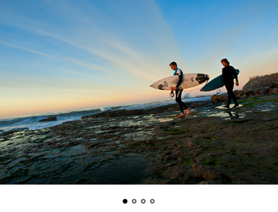

# Flip view

<link rel="stylesheet" href="https://az835927.vo.msecnd.net/sites/uwp/Resources/css/custom.css"> 

Use a flip view for browsing images or other items in a collection, such as photos in an album or items in a product details page, one item at a time. For touch devices, swiping across an item moves through the collection. For a mouse, navigation buttons appear on mouse hover. For a keyboard, arrow keys move through the collection.

> **Important APIs**: [FlipView class](https://msdn.microsoft.com/library/windows/apps/windows.ui.xaml.controls.flipview.aspx), [ItemsSource property](https://msdn.microsoft.com/library/windows/apps/windows.ui.xaml.controls.itemscontrol.itemssource.aspx), [ItemTemplate property](https://msdn.microsoft.com/library/windows/apps/windows.ui.xaml.controls.itemscontrol.itemtemplate.aspx)


## Is this the right control?

Flip view is best for perusing images in small to medium collections (up to 25 or so items). Examples of such collections include items in a product details page or photos in a photo album. Although we don't recommend flip view for most large collections, the control is common for viewing individual images in a photo album.

## Examples

Horizontal browsing, starting at the left-most item and flipping right, is the typical layout for a flip view. This layout works well in either portrait or landscape orientation on all devices:


A flip view can also be browsed vertically:


## Create a flip view

FlipView is an [ItemsControl](https://msdn.microsoft.com/library/windows/apps/windows.ui.xaml.controls.itemscontrol.aspx), so it can contain a collection of items of any type. To populate the view, add items to the [**Items**](https://msdn.microsoft.com/library/windows/apps/windows.ui.xaml.controls.itemscontrol.items.aspx) collection, or set the [**ItemsSource**](https://msdn.microsoft.com/library/windows/apps/windows.ui.xaml.controls.itemscontrol.itemssource.aspx) property to a data source.

By default, a data item is displayed in the flip view as the string representation of the data object it's bound to. To specify exactly how items in the flip view are displayed, you create a [**DataTemplate**](https://msdn.microsoft.com/library/windows/apps/windows.ui.xaml.datatemplate.aspx) to define the layout of controls used to display an individual item. The controls in the layout can be bound to properties of a data object, or have content defined inline. You assign the DataTemplate to the [**ItemTemplate**](https://msdn.microsoft.com/library/windows/apps/windows.ui.xaml.controls.itemscontrol.itemtemplate.aspx) property of the FlipView.

### Add items to the Items collection

You can add items to the [**Items**](https://msdn.microsoft.com/library/windows/apps/windows.ui.xaml.controls.itemscontrol.items.aspx) collection using XAML or code. You typically add items this way if you have a small number of items that don't change and are easily defined in XAML, or if you generate the items in code at run time. Here's a flip view with items defined inline.

```xaml
<FlipView x:Name="flipView1">
    <Image Source="Assets/Logo.png" />
    <Image Source="Assets/SplashScreen.png" />
    <Image Source="Assets/SmallLogo.png" />
</FlipView>
```

```csharp
// Create a new flip view, add content, 
// and add a SelectionChanged event handler.
FlipView flipView1 = new FlipView();
flipView1.Items.Add("Item 1");
flipView1.Items.Add("Item 2");

// Add the flip view to a parent container in the visual tree.
stackPanel1.Children.Add(flipView1);
```

When you add items to a flip view they are automatically placed in a [**FlipViewItem**](https://msdn.microsoft.com/library/windows/apps/xaml/windows.ui.xaml.controls.flipviewitem.aspx) container. To change how an item is displayed you can apply a style to the item container by setting the [**ItemContainerStyle**](https://msdn.microsoft.com/library/windows/apps/xaml/windows.ui.xaml.controls.itemscontrol.itemcontainerstyle.aspx) property. 

When you define the items in XAML, they are automatically added to the Items collection.

### Set the items source

You typically use a flip view to display data from a source such as a database or the Internet. To populate a flip view from a data source, you set its [**ItemsSource**](https://msdn.microsoft.com/library/windows/apps/xaml/windows.ui.xaml.controls.itemscontrol.itemssource.aspx) property to a collection of data items.

Here, the flip view's ItemsSource is set in code directly to an instance of a collection.

```csharp
// Data source.
List<String> itemsList = new List<string>();
itemsList.Add("Item 1");
itemsList.Add("Item 2");

// Create a new flip view, add content, 
// and add a SelectionChanged event handler.
FlipView flipView1 = new FlipView();
flipView1.ItemsSource = itemsList;
flipView1.SelectionChanged += FlipView_SelectionChanged;

// Add the flip view to a parent container in the visual tree.
stackPanel1.Children.Add(flipView1);
```

You can also bind the ItemsSource property to a collection in XAML. For more info, see [Data binding with XAML](../../data-binding/data-binding-quickstart.md).

Here, the ItemsSource is bound to a [**CollectionViewSource**](https://msdn.microsoft.com/library/windows/apps/xaml/windows.ui.xaml.data.collectionviewsource.aspx) named `itemsViewSource`. 

```xaml
<Page.Resources>
    <!-- Collection of items displayed by this page -->
    <CollectionViewSource x:Name="itemsViewSource" Source="{Binding Items}"/>
</Page.Resources>

...

<FlipView x:Name="itemFlipView" 
          ItemsSource="{Binding Source={StaticResource itemsViewSource}}"/>
```

>**Note**&nbsp;&nbsp;You can populate a flip view either by adding items to its Items collection, or by setting its ItemsSource property, but you can't use both ways at the same time. If you set the ItemsSource property and you add an item in XAML, the added item is ignored. If you set the ItemsSource property and you add an item to the Items collection in code, an exception is thrown.

### Specify the look of the items

By default, a data item is displayed in the flip view as the string representation of the data object it's bound to. You typically want to show a more rich presentation of your data. To specify exactly how items in the flip view are displayed, you create a [**DataTemplate**](https://msdn.microsoft.com/library/windows/apps/xaml/windows.ui.xaml.datatemplate.aspx). The XAML in the DataTemplate defines the layout and appearance of controls used to display an individual item. The controls in the layout can be bound to properties of a data object, or have content defined inline. The DataTemplate is assigned to the [**ItemTemplate**](https://msdn.microsoft.com/library/windows/apps/xaml/windows.ui.xaml.controls.itemscontrol.itemtemplate.aspx) property of the FlipView control.

In this example, the ItemTemplate of a FlipView is defined inline. An overlay is added to the image to display the image name. 

```XAML
<FlipView x:Name="flipView1" Width="480" Height="270" 
          BorderBrush="Black" BorderThickness="1">
    <FlipView.ItemTemplate>
        <DataTemplate>
            <Grid>
                <Image Width="480" Height="270" Stretch="UniformToFill"
                       Source="{Binding Image}"/>
                <Border Background="#A5000000" Height="80" VerticalAlignment="Bottom">
                    <TextBlock Text="{Binding Name}" 
                               FontFamily="Segoe UI" FontSize="26.667" 
                               Foreground="#CCFFFFFF" Padding="15,20"/>
                </Border>
            </Grid>
        </DataTemplate>
    </FlipView.ItemTemplate>
</FlipView>
```

Here's what the layout defined by the data template looks like.

Flip view data template.

### Set the orientation of the flip view

By default, the flip view flips horizontally. To make the it flip vertically, use a stack panel with a vertical orientation as the flip view's [**ItemsPanel**](https://msdn.microsoft.com/library/windows/apps/windows.ui.xaml.controls.itemscontrol.itemspanel.aspx).

This example shows how to use a stack panel with a vertical orientation as the ItemsPanel of a FlipView.

```XAML
<FlipView x:Name="flipViewVertical" Width="480" Height="270" 
          BorderBrush="Black" BorderThickness="1">
    
    <!-- Use a vertical stack panel for vertical flipping. -->
    <FlipView.ItemsPanel>
        <ItemsPanelTemplate>
            <VirtualizingStackPanel Orientation="Vertical"/>
        </ItemsPanelTemplate>
    </FlipView.ItemsPanel>
    
    <FlipView.ItemTemplate>
        <DataTemplate>
            <Grid>
                <Image Width="480" Height="270" Stretch="UniformToFill"
                       Source="{Binding Image}"/>
                <Border Background="#A5000000" Height="80" VerticalAlignment="Bottom">
                    <TextBlock Text="{Binding Name}" 
                               FontFamily="Segoe UI" FontSize="26.667" 
                               Foreground="#CCFFFFFF" Padding="15,20"/>
                </Border>
            </Grid>
        </DataTemplate>
    </FlipView.ItemTemplate>
</FlipView>
```

Here's what the flip view looks like with a vertical orientation.


## Adding a context indicator

A context indicator in a flip view provides a useful point of reference. The dots in a standard context indicator aren't interactive. As seen in this example, the best placement is usually centered and below the gallery:



For larger collections (10-25 items), consider using an indicator that provides more context, such as a film strip of thumbnails. Unlike a context indicator that uses simple dots, each thumbnail in the film strip shows a small version of the corresponding image and should be selectable:


For example code that shows how to add a context indicator to a FlipView, see [XAML FlipView sample](http://go.microsoft.com/fwlink/p/?LinkID=311760).

## Do's and don'ts

-   Flip views work best for collections of up to 25 or so items.
-   Avoid using a flip view control for larger collections, as the repetitive motion of flipping through each item can be tedious. An exception would be for photo albums, which often have hundreds or thousands of images. Photo albums almost always switch to a flip view once a photo has been selected in the grid view layout. For other large collections, consider a [List view or grid view](lists.md).
-   For context indicators:
    -   The order of dots (or whichever visual marker you choose) works best when centered and below a horizontally-panning gallery.
    -   If you want a context indicator in a vertically-panning gallery, it works best centered and to the right of the images.
    -   The highlighted dot indicates the current item. Usually the highlighted dot is white and the other dots are gray.
    -   The number of dots can vary, but don't have so many that the user might struggle to find his or her place - 10 dots is usually the maximum number to show.

## Globalization and localization checklist

<table>
<tr>
<th>Bi-directional considerations</th><td>Use standard mirroring for RTL languages. The back and forward controls should be based on the language's direction, so for RTL languages, the right button should navigate backwards and the left button should navigate forward.</td>
</tr>

</table>

## Get the sample code
* [XAML UI basics sample](https://github.com/Microsoft/Windows-universal-samples/blob/master/Samples/XamlUIBasics)


## Related articles

- [Guidelines for lists](lists.md)
- [**FlipView class**](https://msdn.microsoft.com/library/windows/apps/br242678)
