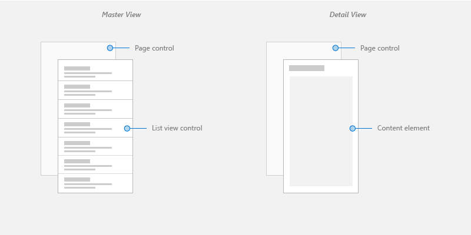
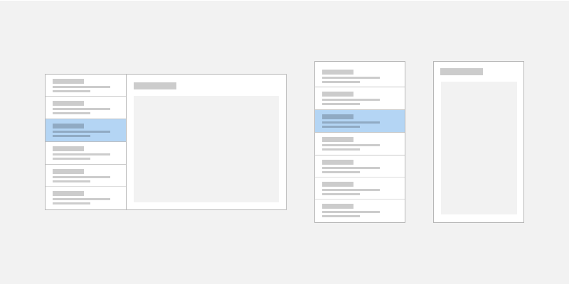

# Master/details pattern

 

The master/details pattern has a master pane (usually with a [list view](lists.md)) and a details pane for content. When an item in the master list is selected, the details pane is updated. This pattern is frequently used for email and address books.

> **Important APIs**: [ListView class](https://docs.microsoft.com/uwp/api/Windows.UI.Xaml.Controls.ListView), [SplitView class](https://docs.microsoft.com/uwp/api/windows.ui.xaml.controls.splitview)

> [!TIP]
> If you'd like to use a XAML control that implements this pattern for you, we recommend the [MasterDetailsView XAML Control](/windows/communitytoolkit/controls/masterdetailsview) from the Windows Community Toolkit.

## Is this the right pattern?

The master/details pattern works well if you want to:

-   Build an email app, address book, or any app that is based on a list-details layout.
-   Locate and prioritize a large collection of content.
-   Allow the quick addition and removal of items from a list while working back-and-forth between contexts.

## Choose the right style

When implementing the master/details pattern, we recommend that you use either the stacked style or the side-by-side style, based on the amount of available screen space.

| Available window width | Recommended style |
|------------------------|-------------------|
| 320 epx-640 epx        | Stacked           |
| 641 epx or wider       | Side-by-side      |

 
## Stacked style

In the stacked style, only one pane is visible at a time: the master or the details.

The user starts at the master pane and "drills down" to the details pane by selecting an item in the master list. To the user, it appears as though the master and details views exist on two separate pages.

### Create a stacked master/details pattern

One way to create the stacked master/details pattern is to use separate pages for the master pane and the details pane. Place the master view on one page, and the details pane on a separate page.

For the master view page, a [list view](lists.md) control works well for presenting lists that can contain images and text. 

For the details view page, use the [content element](../layout/layout-panels.md) that makes the most sense. If you have a lot of separate fields, consider using a **Grid** layout to arrange elements into a form.

For navigation between pages, see [navigation history and backwards navigation for Windows apps](../basics/navigation-history-and-backwards-navigation.md).

## Side-by-side style

In the side-by-side style, the master pane and details pane are visible at the same time.

The list in the master pane has a selection visual to indicate the currently selected item. Selecting a new item in the master list updates the details pane.

### Create a side-by-side master/details pattern

One way to create a side-by-side master/details pattern is to use the [split view](split-view.md) control. Place the master view in the split view pane, and the details view in the split view content.

For the master pane, a [list view](lists.md) control works well for presenting lists that can contain images and text.

For the details content, use the [content element](../layout/layout-panels.md) that makes the most sense. If you have a lot of separate fields, consider using a **Grid** layout to arrange elements into a form.

## Adaptive layout

To implement a master/details pattern for any screen size, create a responsive UI with an [adaptive layout](../layout/layouts-with-xaml.md).

### Create an adaptive master/details pattern
To create an adaptive layout, define different [**VisualStates**](https://docs.microsoft.com/uwp/api/windows.ui.xaml.visualstate) for your UI, and declare breakpoints for the different states with [**AdaptiveTriggers**](https://docs.microsoft.com/uwp/api/Windows.UI.Xaml.AdaptiveTrigger).

## Get the sample code

The following samples implement the master/details pattern with adaptive layouts and demonstrate data binding to static, database, and online resources: 
- [Master/detail sample](https://github.com/Microsoft/Windows-universal-samples/tree/master/Samples/XamlMasterDetail) 
- [Master/Details plus Selection sample](https://github.com/Microsoft/Windows-universal-samples/tree/master/Samples/XamlListView)
- [Windows Template Studio Master/Detail sample](https://github.com/Microsoft/WindowsTemplateStudio/tree/master/templates/Uwp/Pages/MasterDetail)
- [Customer orders database sample](https://github.com/Microsoft/Windows-appsample-customers-orders-database)
- [RSS Reader sample](https://github.com/Microsoft/Windows-appsample-rssreader)

> [!TIP]
> If you'd like to use a XAML control that implements this pattern for you, we recommend the [MasterDetailsView XAML Control](/windows/communitytoolkit/controls/masterdetailsview) from the Windows Community Toolkit.

## Related articles

- [Lists](lists.md)
- [Search](search.md)
- [App and command bars](app-bars.md)
- [ListView class](https://docs.microsoft.com/uwp/api/Windows.UI.Xaml.Controls.ListView)
- [SplitView class](https://docs.microsoft.com/uwp/api/windows.ui.xaml.controls.splitview)
