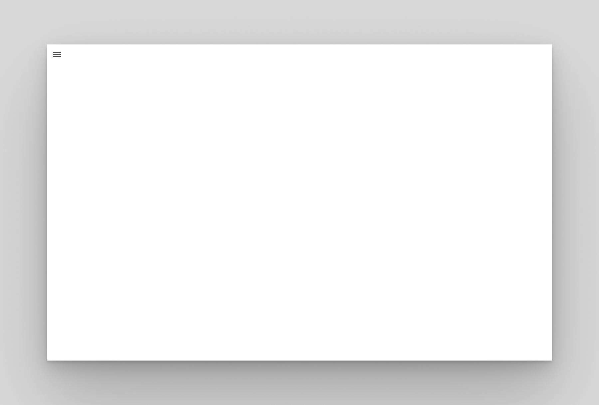
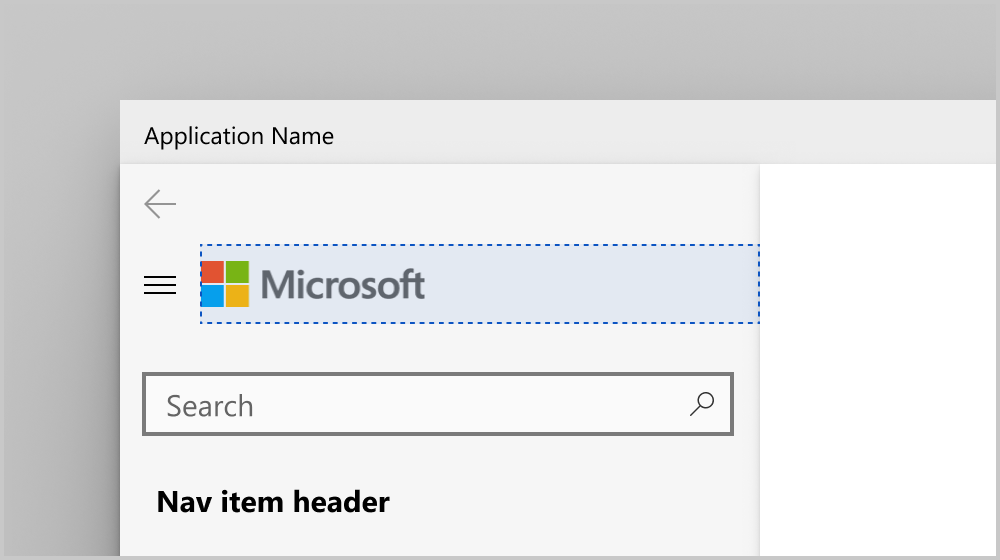
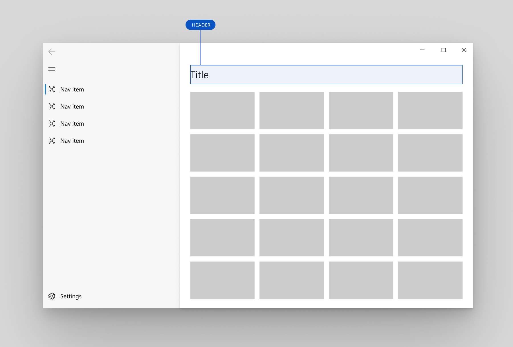
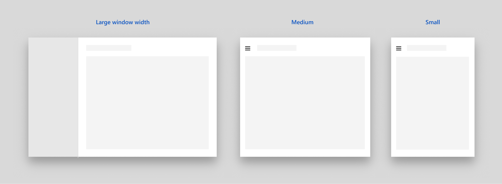

# Navigation view (Preview version)

> **This is a preview version**: This article describes a new version of the NavigationView control that's still in development. To use it now, you need the [latest Windows Insider build and SDK](https://insider.windows.com/for-developers/) or the [Windows UI Library](https://docs.microsoft.com/uwp/toolkits/winui/).

The NavigationView control provides top-level navigation for your app. It adapts to a variety of screen sizes supports multiple navigation styles.

> **Windows UI Library APIs**: [Microsoft.UI.Xaml.Controls.NavigationView class](/uwp/api/microsoft.ui.xaml.controls.navigationview)

> **Platform APIs**: [Windows.UI.Xaml.Controls.NavigationView class](https://docs.microsoft.com/uwp/api/windows.ui.xaml.controls.navigationview)

## Get the Windows UI Library

This control is included as part of the Windows UI Library, a NuGet package that contains new controls and UI features for UWP apps. For more info, including installation instructions, see the  [Windows UI Library overview](https://docs.microsoft.com/uwp/toolkits/winui/). 

## Navigation styles

NavigationView supports:

**Left navigation pane or menu**


**Top navigation pane or menu**


## Is this the right control?

NavigationView is an adaptive navigation control that works well for:

- Providing a consistent navigational experience throughout your app.
- Preserving screen real estate on smaller windows.
- Organizing access to many navigation categories.

For other navigation controls, see [Navigation design basics](../basics/navigation-basics.md).

If your navigation requires more complex behavior that is not supported by NavigationView, then you might want to consider the [Master/details](master-details.md) pattern instead.

:::row:::
    :::column:::
        
    :::column-end:::
    :::column span="2":::
        **XAML Controls Gallery**<br>
        If you have the XAML Controls Gallery app installed, click <a href="xamlcontrolsgallery:/item/NavigationView">here</a> to open the app and see NavigationView in action.

        <a href="https://www.microsoft.com/store/productId/9MSVH128X2ZT">Get the XAML Controls Gallery app (Microsoft Store)</a><br>
        <a href="https://github.com/Microsoft/Windows-universal-samples/tree/master/Samples/XamlUIBasics">Get the source code (GitHub)</a>
    :::column-end:::
:::row-end:::

## Display modes

NavigationView can be set to different display modes, via the `PaneDisplayMode` property:

:::row:::
    :::column:::
    ### Left
    Displays an expanded left positioned pane.
    :::column-end:::
    :::column span="2":::
    
    :::column-end:::
:::row-end:::

We recommend left navigation when:

- You have a medium-to-high number (5-10) of equally important top-level navigation categories.
- You desire very prominent navigation categories with less space for other app content.

:::row:::
    :::column:::
    ### Top
    Displays a top positioned pane.
    :::column-end:::
    :::column span="2":::
    
    :::column-end:::
:::row-end:::

We recommend top navigation when:

- You have 5 or less equally important top-level navigation categories, such that any additional top-level navigation categories that end up in the dropdown overflow menu are considered less important.
- You need to show all navigation options on screen.
- You desire more space for your app content.
- Icons cannot clearly describe your app's navigation categories.

:::row:::
    :::column:::
    ### LeftCompact
    Displays a thin sliver with icons on the left.
    :::column-end:::
    :::column span="2":::
    
    :::column-end:::
:::row-end:::

:::row:::
    :::column:::
    ### LeftMinimal
    Displays only the menu button.
    :::column-end:::
    :::column span="2":::
    
    :::column-end:::
:::row-end:::

### Auto


Adapts between LeftMinimal on small screens, LeftCompact on medium screens, and Left on large screens. See the [adaptive behavior](#adaptive-behavior) section for more information.

## Anatomy

<b>Left nav</b><br>


<b>Top nav</b><br>


## Pane

The pane can be positioned either on top or on left, via the `PanePosition` property.

Here is the detailed pane anatomy for the left and top pane positions:

<b>Left nav</b><br>


1. Menu button
1. Navigation items
1. Separators
1. Headers
1. AutoSuggestBox (optional)
1. Settings button (optional)

<b>Top nav</b><br>


1. Headers
1. Navigation items
1. Separators
1. AutoSuggestBox (optional)
1. Settings button (optional)

The back button appears in the top left-hand corner of the pane, but NavigationView does not automatically add content to the back stack. To enable backwards navigation, see the [backwards navigation](#backwards-navigation) section.

The NavigationView pane can also contain:

1. Navigation items, in the form of [NavigationViewItem](https://docs.microsoft.com/uwp/api/windows.ui.xaml.controls.navigationviewitem), for navigating to specific pages.
2. Separators, in the form of [NavigationViewItemSeparator](https://docs.microsoft.com/uwp/api/windows.ui.xaml.controls.navigationviewitemseparator), for grouping navigation items. Set the [Opacity](https://docs.microsoft.com/uwp/api/windows.ui.xaml.controls.navigationviewitemseparator.opacity) property to 0 to render the separator as space.
3. Headers, in the form of [NavigationViewItemHeader](https://docs.microsoft.com/uwp/api/windows.ui.xaml.controls.navigationviewitemheader), for labeling groups of items.
4. An optional [AutoSuggestBox](auto-suggest-box.md) to allow for app-level search.
5. An optional entry point for [app settings](../app-settings/app-settings-and-data.md). To hide the settings item, use the [IsSettingsVisible](https://docs.microsoft.com/uwp/api/windows.ui.xaml.controls.navigationview.IsSettingsVisible) property.

The left pane contains:

6. Menu button to toggle the pane open and close. On larger app windows when the pane is open, you may choose to hide this button using the [IsPaneToggleButtonVisible](https://docs.microsoft.com/uwp/api/windows.ui.xaml.controls.navigationview.IsPaneToggleButtonVisible) property.

### Pane footer

Free-form content in the pane’s footer, when added to the [PaneFooter](https://docs.microsoft.com/uwp/api/windows.ui.xaml.controls.navigationview.PaneFooter) property

:::row:::
    :::column:::
    <b>Left nav</b><br>
    <br>
    :::column-end:::
    :::column:::
     <b>Top nav</b><br>
    <br>
    :::column-end:::
:::row-end:::

### Pane header

Free-form content in the pane's header, when added to the [PaneHeader](https://docs.microsoft.com/uwp/api/windows.ui.xaml.controls.navigationview.PaneHeader) property

:::row:::
    :::column:::
    <b>Left nav</b><br>
    <br>
    :::column-end:::
    :::column:::
     <b>Top nav</b><br>
    <br>
    :::column-end:::
:::row-end:::

### Pane content

Free-form content in the pane, when added to the [PaneCustomContent](https://docs.microsoft.com/uwp/api/windows.ui.xaml.controls.navigationview.PaneCustomContent) property

:::row:::
    :::column:::
    <b>Left nav</b><br>
    <br>
    :::column-end:::
    :::column:::
     <b>Top nav</b><br>
    <br>
    :::column-end:::
:::row-end:::

### Visual style

When hardware and software requirements are met, NavigationView automatically uses the [Acrylic material](../style/acrylic.md) in its pane, and [Reveal highlight](../style/reveal.md) only in its left pane.

## Header



The header area is vertically aligned with the navigation button in the left pane position, and lies below the pane in the top pane position. It has a fixed height of 52 px. Its purpose is to hold the page title of the selected nav category. The header is docked to the top of the page and acts as a scroll clipping point for the content area.

The header must be visible when NavigationView is in Minimal display mode. You may choose to hide the header in other modes, which are used on larger window widths. To do so, set the [AlwaysShowHeader](https://docs.microsoft.com/uwp/api/windows.ui.xaml.controls.navigationview.AlwaysShowHeader) property to **false**.

## Content


The content area is where most of the information for the selected nav category is displayed.

We recommend 12px margins for your content area when NavigationView is in Minimal mode and 24px margins otherwise.

## Adaptive behavior

NavigationView automatically changes its display mode based on the amount of screen space available to it. However, you might want to customize the adaptive display mode behavior.

### Default

The default adaptive behavior of NavigationView is to show an expanded left pane on large window widths, a left icon-only nav pane on medium window widths, and a hamburger menu button on small window widths. For more information about window sizes for adaptive behavior, see [Screen sizes and breakpoints](../layout/screen-sizes-and-breakpoints-for-responsive-design.md).


```xaml
<NavigationView />
```

### Minimal

A second common adaptive pattern is to use an expanded left pane on large window widths, and a hamburger menu on both medium and small window widths.



```xaml
<NavigationView CompactModeThresholdWidth="1008" ExpandedModeThresholdWidth="1007" />
```

We recommend this when:

- You desire more space for app content on smaller window widths.
- Your navigation categories cannot be clearly represented with icons.

### Compact

A third common adaptive pattern is to use an expanded left pane on large window widths, and a left icon-only nav pane on both medium and small window widths. A good example of this is the Mail app.


```xaml
<NavigationView CompactModeThresholdWidth="0" ExpandedModeThresholdWidth="1007" />
```

We recommend this when:

- It is important to always show all navigation options on screen.
- your navigation categories can be clearly represented with icons.

### No adaptive behavior

Sometimes you may not desire any adaptive behavior at all. You can set the pane to be always expanded, always compact, or always minimal.


```xaml
<NavigationView PaneDisplayMode="LeftMinimal" />
```

### Top to left navigation

We recommend using top navigation on large window sizes and left navigation on small window sizes when:

- You have a set of equally important top-level navigation categories to be displayed together, such that if one category in this set doesn't fit on screen, you collapse to left navigation to give them equal importance.
- You wish to preserve as much content space as possible in small window sizes.

Here is an example:


```xaml
<Grid >
    <VisualStateManager.VisualStateGroups>
        <VisualStateGroup>
            <VisualState>
                <VisualState.StateTriggers>
                    <AdaptiveTrigger MinWindowWidth="{x:Bind NavigationViewControl.CompactModeThresholdWidth}" />
                </VisualState.StateTriggers>

                <VisualState.Setters>
                    <Setter Target="NavigationViewControl.PaneDisplayMode" Value="Top"/>
                </VisualState.Setters>
            </VisualState>
        </VisualStateGroup>
    </VisualStateManager.VisualStateGroups>

    <NavigationView x:Name="NavigationViewControl" >
        <NavigationView.MenuItems>
            <NavigationViewItem Content="A" x:Name="A" />
            <NavigationViewItem Content="B" x:Name="B" />
            <NavigationViewItem Content="C" x:Name="C" />
        </NavigationView.MenuItems>
    </NavigationView>
</Grid>

```

Sometimes apps need to bind different data to the top pane and left pane. Often the left pane includes more navigation elements.

Here is an example:


```xaml
<Page >
    <Page.Resources>
        <DataTemplate x:name="navItem_top_temp" x:DataType="models:Item">
            <NavigationViewItem Background= Icon={x:Bind TopIcon}, Content={x:Bind TopContent}, Visibility={x:Bind TopVisibility} />
        </DataTemplate>

        <DataTemplate x:name="navItem_temp" x:DataType="models:Item">
            <NavigationViewItem Icon={x:Bind Icon}, Content={x:Bind Content}, Visibility={x:Bind Visibility} />
        </DataTemplate>
        
        <services:NavViewDataTemplateSelector x:Key="navview_selector" 
              NavItemTemplate="{StaticResource navItem_temp}" 
              NavItemTopTemplate="{StaticResource navItem_top_temp}" 
              NavPaneDisplayMode="{x:Bind NavigationViewControl.PaneDisplayMode}">
        </services:NavViewDataTemplateSelector>
    </Page.Resources>

    <Grid >
        <VisualStateManager.VisualStateGroups>
            <VisualStateGroup>
                <VisualState>
                    <VisualState.StateTriggers>
                        <AdaptiveTrigger MinWindowWidth="{x:Bind NavigationViewControl.CompactModeThresholdWidth}" />
                    </VisualState.StateTriggers>

                    <VisualState.Setters>
                        <Setter Target="NavigationViewControl.PaneDisplayMode" Value="Top"/>
                    </VisualState.Setters>
                </VisualState>
            </VisualStateGroup>
        </VisualStateManager.VisualStateGroups>

        <NavView x:Name='NavigationViewControl' MenuItemsSource={x:Bind items}   
                 PanePosition = "Top" MenuItemTemplateSelector="navview_selector" />
    </Grid>
</Page>

```

```csharp
ObservableCollection<Item> items = new ObservableCollection<Item>();
items.Add(new Item() {
    Content = "Aa",
    TopContent ="A",
    Icon = new BitmapIcon() { UriSource = new Uri("ms-appx:///testimage.jpg") },
    TopIcon = new BitmapIcon(),
    ItemVisibility = Visibility.Visible,
    TopItemVisiblity = Visibility.Visible 
});
items.Add(new Item() {
    Content = "Bb",
    TopContent = "B",
    Icon = new BitmapIcon() { UriSource = new Uri("ms-appx:///testimage.jpg") },
    TopIcon = new BitmapIcon(),
    ItemVisibility = Visibility.Visible,
    TopItemVisiblity = Visibility.Visible 
});
items.Add(new Item() {
    Content = "Cc",
    TopContent = "C",
    Icon = new BitmapIcon() { UriSource = new Uri("ms-appx:///testimage.jpg") },
    TopIcon = new BitmapIcon(),
    ItemVisibility = Visibility.Visible,
    TopItemVisiblity = Visibility.Visible 
});

public class NavViewDataTemplateSelector : DataTemplateSelector
{
    public DataTemplate NavItemTemplate { get; set; }

    public DataTemplate NavItemTopTemplate { get; set; }	

    public NavigationViewPaneDisplayMode NavPaneDisplayMode { get; set; }

    protected override DataTemplate SelectTemplateCore(object item)
    {
        Item currItem = item as Item;
        if (NavPaneDisplayMode == NavigationViewPanePosition.Top)
            return NavItemTopTemplate;
        else 
            return NavItemTemplate;
    }	

}

```

## Interaction

When users tap on a navigation item in the Pane, NavigationView will show that item as selected and will raise an [ItemInvoked](https://docs.microsoft.com/uwp/api/windows.ui.xaml.controls.navigationview.ItemInvoked) event. If the tap results in a new item being selected, NavigationView will also raise a [SelectionChanged](https://docs.microsoft.com/uwp/api/windows.ui.xaml.controls.navigationview.SelectionChanged) event.

Your app is responsible for updating the Header and Content with appropriate information in response to this user interaction. In addition, we recommend programmatically moving [focus](https://docs.microsoft.com/uwp/api/windows.ui.xaml.controls.control.FocusState) from the navigation item to the content. By setting initial focus on load, you streamline the user flow and minimize the expected number of keyboard focus moves.

### Tabs

In the tabs model, selection and focus are tied. An action that normally shifts focus would also shift selection. In the below example, right arrowing would move the selection indicator from Display to Magnifier. You can achieve this by setting the [SelectionFollowsFocus](https://docs.microsoft.com/uwp/api/windows.ui.xaml.controls.navigationview.selectionfollowsfocus) property to Enabled.


Here is the example XAML for that:

```xaml
<NavigationView PanePosition="Top" SelectionFollowsFocus="Enabled" >
   <NavigationView.MenuItems>
        <NavigationViewItem Content="Display" />
        <NavigationViewItem Content="Magnifier"  />
        <NavigationViewItem Content="Keyboard" />
    </NavigationView.MenuItems>
</NavigationView>

```

To swap out content when changing tab selection, you can use Frame's [NavigateWithOptions](https://docs.microsoft.com/uwp/api/windows.ui.xaml.controls.frame.NavigateToType) method with FrameNavigationOptions.IsNavigationStackEnabled set to False, and NavigateOptions.TransitionInfoOverride set to the appropriate side-to-side slide animation. For an example, see the [code example](#code-example) below.

If you wish to change the default Style, you can override NavigationView's [MenuItemContainerStyle](https://docs.microsoft.com/uwp/api/windows.ui.xaml.controls.navigationview.menuitemcontainerstyle) property. You can also set the [MenuItemTemplate](https://docs.microsoft.com/uwp/api/windows.ui.xaml.controls.navigationview.menuitemtemplate) property to specify a different data template.

## Backwards navigation

NavigationView has a built-in back button, which can be enabled with the following properties:

- [**IsBackButtonVisible**](https://docs.microsoft.com/uwp/api/windows.ui.xaml.controls.navigationview.IsBackButtonVisible) is a NavigationViewBackButtonVisible enum and "Auto" by default. It is used to show/hide the back button. When the button is not visible, the space for drawing the back button will be collapsed.
- [**IsBackEnabled**](https://docs.microsoft.com/uwp/api/windows.ui.xaml.controls.navigationview.IsBackEnabled) is false by default and can be used to toggle the back button states.
- [**BackRequested**](https://docs.microsoft.com/uwp/api/windows.ui.xaml.controls.navigationview.BackRequested) is fired when a user clicks on the back button.
    - In Minimal/Compact mode, when the NavigationView.Pane is open as a flyout, clicking the back button will close the Pane and fire **PaneClosing** event instead.
    - Not fired if IsBackEnabled is false.

:::row:::
    :::column:::
    <b>Left nav</b><br>
    
    :::column-end:::
    :::column:::
     <b>Top nav</b><br>
    
    :::column-end:::
:::row-end:::

## Code example

> [!NOTE]
> NavigationView should serve as the root container of your app, as this control is designed to span the full width and height of the app window.
You can override the widths at which the navigation view changes display modes by using the [CompactModeThresholdWidth](https://docs.microsoft.com/uwp/api/windows.ui.xaml.controls.navigationview.CompactModeThresholdWidth) and [ExpandedModeThresholdWidth](https://docs.microsoft.com/uwp/api/windows.ui.xaml.controls.navigationview.ExpandedModeThresholdWidth) properties.

The following is an end-to-end example of how you can incorporate NavigationView with both a top navigation pane on large window sizes and a left navigation pane on small window sizes.

In this sample, we expect end users to frequently select new navigation categories, and so we:

- Set the [SelectionFollowsFocus](https://docs.microsoft.com/uwp/api/windows.ui.xaml.controls.navigationview.PanePostion) property to Enabled
- Use Frame navigations that do not add to the navigation stack.
- Keep the default value on the [ShoulderNavigationEnabled](https://docs.microsoft.com/uwp/api/windows.ui.xaml.controls.navigationview.PanePostion) property, which is used to indicate if left/right bumpers on a gamepad navigate the top-level navigation categories of your app. The default is "WhenSelectionFollowsFocus". The other possible values are "Always" and "Never".

We also demonstrate how to implement backwards navigation with NavigationView's back button.

Here's a recording of what the sample demonstrates:


Here's the sample code:

> [!NOTE]
> If you're using the [Windows UI Library](https://docs.microsoft.com/uwp/toolkits/winui/), then you'll need to add a reference to the toolkit: `xmlns:controls="using:Microsoft.UI.Xaml.Controls"`.

```xaml
<Page
    x:Class="NavigationViewSample.MainPage"
    xmlns="http://schemas.microsoft.com/winfx/2006/xaml/presentation"
    xmlns:x="http://schemas.microsoft.com/winfx/2006/xaml"
    xmlns:local="using:NavigationViewSample"
    xmlns:d="http://schemas.microsoft.com/expression/blend/2008"
    xmlns:mc="http://schemas.openxmlformats.org/markup-compatibility/2006"
    mc:Ignorable="d">

    <Grid Background="{ThemeResource ApplicationPageBackgroundThemeBrush}">
        <VisualStateManager.VisualStateGroups>
            <VisualStateGroup>
                <VisualState>
                    <VisualState.StateTriggers>
                        <AdaptiveTrigger MinWindowWidth="{x:Bind NavView.CompactModeThresholdWidth}" />
                    </VisualState.StateTriggers>

                    <VisualState.Setters>
                        <Setter Target="NavView.PaneDisplayMode" Value="Top"/>
                    </VisualState.Setters>
                </VisualState>
            </VisualStateGroup>
        </VisualStateManager.VisualStateGroups>

        <NavigationView x:Name="NavView"
                    SelectionFollowsFocus="Enabled"
                    ItemInvoked="NavView_ItemInvoked"
                    IsSettingsVisible="True"
                    Loaded="NavView_Loaded"
                    BackRequested="NavView_BackRequested"
                    Header="Welcome">

            <NavigationView.MenuItems>
                <NavigationViewItem Content="Home" x:Name="home" Tag="home">
                    <NavigationViewItem.Icon>
                        <FontIcon Glyph="&#xE10F;"/>
                    </NavigationViewItem.Icon>
                </NavigationViewItem>
                <NavigationViewItemSeparator/>
                <NavigationViewItemHeader Content="Main pages"/>
                <NavigationViewItem Icon="AllApps" Content="Apps" x:Name="apps" Tag="apps"/>
                <NavigationViewItem Icon="Video" Content="Games" x:Name="games" Tag="games"/>
                <NavigationViewItem Icon="Audio" Content="Music" x:Name="music" Tag="music"/>
            </NavigationView.MenuItems>

            <NavigationView.AutoSuggestBox>
                <AutoSuggestBox x:Name="ASB" QueryIcon="Find"/>
            </NavigationView.AutoSuggestBox>

            <NavigationView.HeaderTemplate>
                <DataTemplate>
                    <Grid Margin="24,10,0,0">
                        <Grid.ColumnDefinitions>
                            <ColumnDefinition Width="Auto"/>
                            <ColumnDefinition/>
                        </Grid.ColumnDefinitions>
                        <TextBlock Style="{StaticResource TitleTextBlockStyle}"
                           FontSize="28"
                           VerticalAlignment="Center"
                           Text="Welcome"/>
                        <CommandBar Grid.Column="1"
                            HorizontalAlignment="Right"
                            VerticalAlignment="Top"
                            DefaultLabelPosition="Right"
                            Background="{ThemeResource SystemControlBackgroundAltHighBrush}">
                            <AppBarButton Label="Refresh" Icon="Refresh"/>
                            <AppBarButton Label="Import" Icon="Import"/>
                        </CommandBar>
                    </Grid>
                </DataTemplate>
            </NavigationView.HeaderTemplate>

            <Frame x:Name="ContentFrame" Margin="24"/>

        </NavigationView>
    </Grid>
</Page>
```

> [!NOTE]
> If you're using the [Windows UI Library](https://docs.microsoft.com/uwp/toolkits/winui/), then you'll need to add a reference to the toolkit: `using MUXC = Microsoft.UI.Xaml.Controls;`.

```csharp
// List of ValueTuple holding the Navigation Tag and the relative Navigation Page 
private readonly IList<(string Tag, Type Page)> _pages = new List<(string Tag, Type Page)>
{
    ("home", typeof(HomePage)),
    ("apps", typeof(AppsPage)),
    ("games", typeof(GamesPage)),
    ("music", typeof(MusicPage)),
};

private void NavView_Loaded(object sender, RoutedEventArgs e)
{
    // You can also add items in code behind
    NavView.MenuItems.Add(new NavigationViewItemSeparator());
    NavView.MenuItems.Add(new NavigationViewItem
    {
        Content = "My content",
        Icon = new SymbolIcon(Symbol.Folder),
        Tag = "content"
    });
    _pages.Add(("content", typeof(MyContentPage)));

    ContentFrame.Navigated += On_Navigated;

    // NavView doesn't load any page by default: you need to specify it
    NavView_Navigate("home");

    // Add keyboard accelerators for backwards navigation
    var goBack = new KeyboardAccelerator { Key = VirtualKey.GoBack };
    goBack.Invoked += BackInvoked;
    this.KeyboardAccelerators.Add(goBack);

    // ALT routes here
    var altLeft = new KeyboardAccelerator
    {
        Key = VirtualKey.Left,
        Modifiers = VirtualKeyModifiers.Menu
    };
    altLeft.Invoked += BackInvoked;
    this.KeyboardAccelerators.Add(altLeft);
}

private void NavView_ItemInvoked(NavigationView sender, NavigationViewItemInvokedEventArgs args)
{

    if (args.IsSettingsInvoked)
        ContentFrame.Navigate(typeof(SettingsPage));
    else
    {
        // Getting the Tag from Content (args.InvokedItem is the content of NavigationViewItem)
        var navItemTag = NavView.MenuItems
            .OfType<NavigationViewItem>()
            .First(i => args.InvokedItem.Equals(i.Content))
            .Tag.ToString();

        NavView_Navigate(navItemTag);
    }
}

private void NavView_Navigate(string navItemTag)
{
    var item = _pages.First(p => p.Tag.Equals(navItemTag));
    ContentFrame.Navigate(item.Page);
}

private void NavView_BackRequested(NavigationView sender, NavigationViewBackRequestedEventArgs args) => On_BackRequested();

private void BackInvoked(KeyboardAccelerator sender, KeyboardAcceleratorInvokedEventArgs args)
{
    On_BackRequested();
    args.Handled = true;
}

private bool On_BackRequested()
{
    if (!ContentFrame.CanGoBack)
        return false;

    // Don't go back if the nav pane is overlayed
    if (NavView.IsPaneOpen &&
        (NavView.DisplayMode == NavigationViewDisplayMode.Compact ||
        NavView.DisplayMode == NavigationViewDisplayMode.Minimal))
        return false;

    ContentFrame.GoBack();
    return true;
}

private void On_Navigated(object sender, NavigationEventArgs e)
{
    NavView.IsBackEnabled = ContentFrame.CanGoBack;

    if (ContentFrame.SourcePageType == typeof(SettingsPage))
    {
        // SettingsItem is not part of NavView.MenuItems, and doesn't have a Tag
        NavView.SelectedItem = (NavigationViewItem)NavView.SettingsItem;
    }
    else
    {
        var item = _pages.First(p => p.Page == e.SourcePageType);

        NavView.SelectedItem = NavView.MenuItems
            .OfType<NavigationViewItem>()
            .First(n => n.Tag.Equals(item.Tag));
    }
}
```

## Customizing backgrounds

To change the background of NavigationView's main area, set its `Background` property to your preferred brush.

The Pane's background shows in-app acrylic when NavigationView is in Top, Minimal, or Compact mode. To update this behavior or customize the appearance of your Pane's acrylic, modify the two theme resources by overwriting them in your App.xaml.

```xaml
<Application.Resources>
    <ResourceDictionary>
        <AcrylicBrush x:Key="NavigationViewDefaultPaneBackground"
        BackgroundSource="Backdrop" TintColor="Yellow" TintOpacity=".6"/>
        <AcrylicBrush x:Key="NavigationViewTopPaneBackground"
        BackgroundSource="Backdrop" TintColor="Yellow" TintOpacity=".6"/>
        <AcrylicBrush x:Key="NavigationViewExpandedPaneBackground"
        BackgroundSource="HostBackdrop" TintColor="Orange" TintOpacity=".8"/>
    </ResourceDictionary>
</Application.Resources>
```

## Scroll content under top pane

For a seamless look+feel, if your app has pages that use a ScrollViewer and your navigation pane is top positioned, we recommend having the content scroll underneath the top nav pane. This gives a Sticky Header kind of behaviour to the app.

This can be achieved by setting the [CanContentRenderOutsideBounds](https://docs.microsoft.com/uwp/api/windows.ui.xaml.controls.scrollviewer.cancontentrenderoutsidebounds) property on the relevant ScrollViewer to true.


If your app has very long scrolling content, you may want to consider incorporating sticky headers that attach to the top nav pane and form a smooth surface. 


You can achieve this by setting the [ContentOverlay](https://docs.microsoft.com/uwp/api/windows.ui.xaml.controls.navigationview.ContentOverlay) property on NavigationView. 

Sometimes, if the user is scrolling down, you may want to hide the nav pane, achieved by setting the [IsPaneVisible](https://docs.microsoft.com/uwp/api/windows.ui.xaml.controls.navigationview.ContentOverlay) property on NavigationView to false.


## Related topics

- [NavigationView class](https://docs.microsoft.com/uwp/api/windows.ui.xaml.controls.navigationview)
- [Master/details](master-details.md)
- [Pivot control](tabs-pivot.md)
- [Navigation basics](../basics/navigation-basics.md)
- [Fluent Design for UWP overview](../fluent-design-system/index.md)
