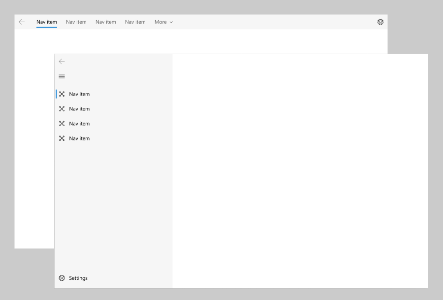
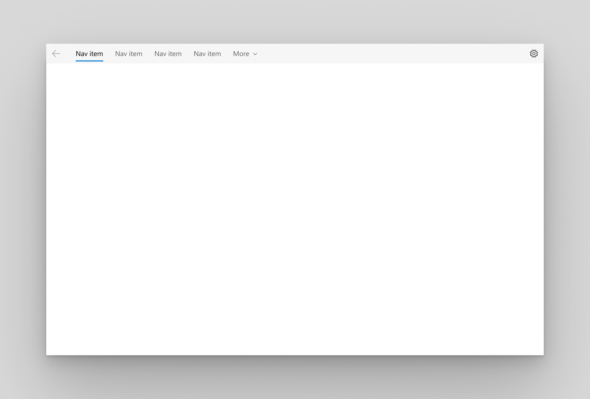
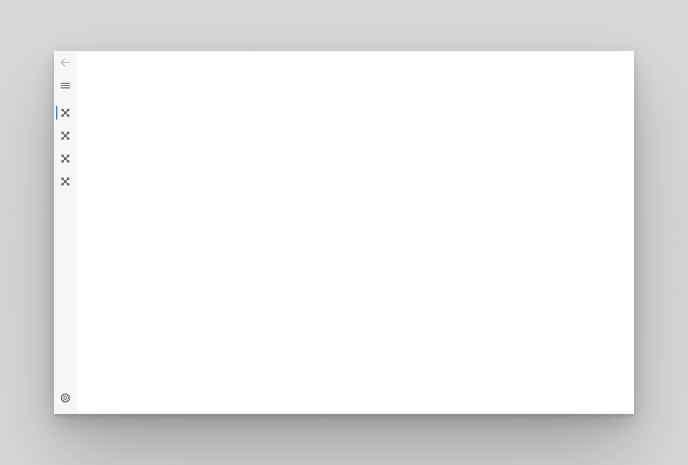
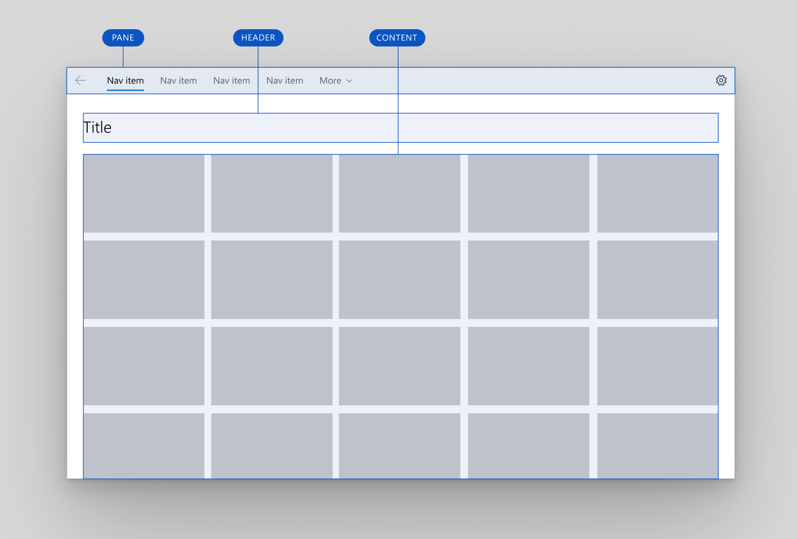
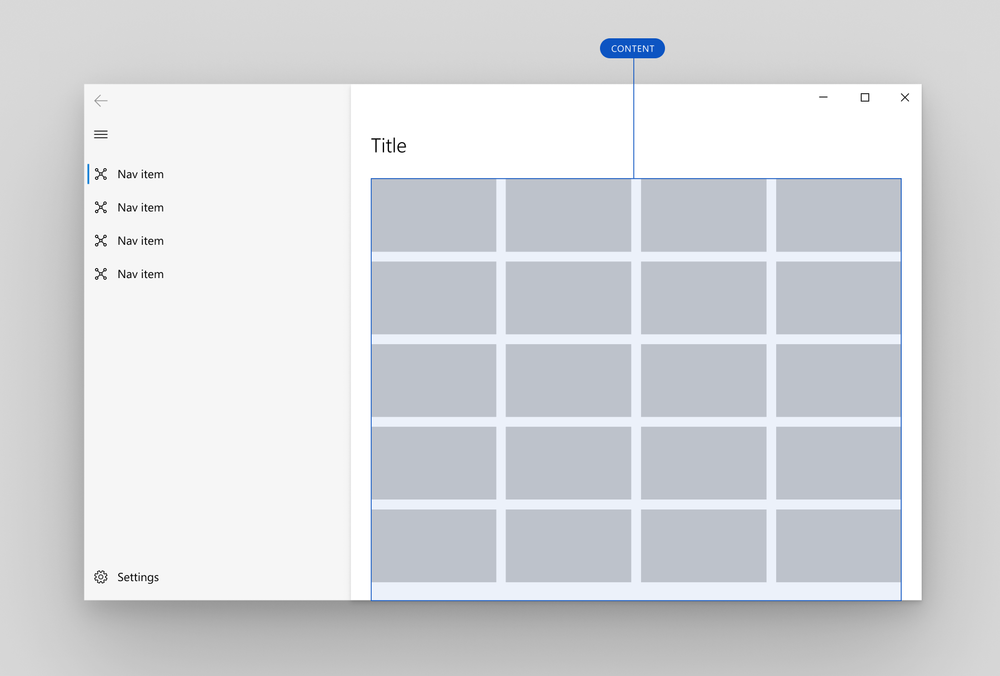
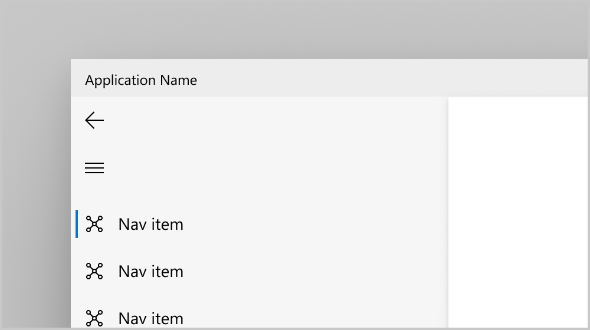

# Navigation view

The NavigationView control provides top-level navigation for your app. It adapts to a variety of screen sizes and supports both _top_ and _left_ navigation styles.

<br/>
_Navigation view supports both top and left navigation pane or menu_

> **Platform APIs**: [Windows.UI.Xaml.Controls.NavigationView class](/uwp/api/windows.ui.xaml.controls.navigationview)
>
> **Windows UI Library APIs**: [Microsoft.UI.Xaml.Controls.NavigationView class](/uwp/api/microsoft.ui.xaml.controls.navigationview)
>
> Some features of NavigationView, such as _top_ navigation, require Windows 10, version 1809 ([SDK 17763](https://developer.microsoft.com/windows/downloads/windows-10-sdk)) or later, or the [Windows UI Library](https://docs.microsoft.com/uwp/toolkits/winui/).

## Is this the right control?

NavigationView is an adaptive navigation control that works well for:

- Providing a consistent navigational experience throughout your app.
- Preserving screen real estate on smaller windows.
- Organizing access to many navigation categories.

For other navigation patterns, see [Navigation design basics](../basics/navigation-basics.md).

## Examples

<table>
<th align="left">XAML Controls Gallery<th>
<tr>
<td></img></td>
<td>
    <p>If you have the <strong style="font-weight: semi-bold">XAML Controls Gallery</strong> app installed, click here to <a href="xamlcontrolsgallery:/item/NavigationView">open the app and see the NavigationView in action</a>.</p>
    <ul>
    <li><a href="https://www.microsoft.com/p/xaml-controls-gallery/9msvh128x2zt">Get the XAML Controls Gallery app (Microsoft Store)</a></li>
    <li><a href="https://github.com/Microsoft/Xaml-Controls-Gallery">Get the source code (GitHub)</a></li>
    </ul>
</td>
</tr>
</table>

## Display modes

> The PaneDisplayMode property requires Windows 10, version 1809 ([SDK 17763](https://developer.microsoft.com/windows/downloads/windows-10-sdk)) or later, or the [Windows UI Library](https://docs.microsoft.com/uwp/toolkits/winui/).

You can use the PaneDisplayMode property to configure different navigation styles, or display modes, for the NavigationView.

:::row:::
    :::column:::
    ### Top
    The pane is positioned above the content.</br>
    `PaneDisplayMode="Top"`
    :::column-end:::
    :::column span="2":::
    
    :::column-end:::
:::row-end:::

We recommend _top_ navigation when:

- You have 5 or fewer top-level navigation categories that are equally important, and any additional top-level navigation categories that end up in the dropdown overflow menu are considered less important.
- You need to show all navigation options on screen.
- You want more space for your app content.
- Icons cannot clearly describe your app's navigation categories.

:::row:::
    :::column:::
    ### Left
    The pane is expanded and positioned to the left of the content.</br>
    `PaneDisplayMode="Left"`
    :::column-end:::
    :::column span="2":::
    
    :::column-end:::
:::row-end:::

We recommend _left_ navigation when:

- You have 5-10 equally important top-level navigation categories.
- You want navigation categories to be very prominent, with less space for other app content.

:::row:::
    :::column:::
    ### LeftCompact
    The pane shows only icons until opened and is positioned to the left of the content.</br>
    `PaneDisplayMode="LeftCompact"`
    :::column-end:::
    :::column span="2":::
    
    :::column-end:::
:::row-end:::

:::row:::
    :::column:::
    ### LeftMinimal
    Only the menu button is shown until the pane is opened. When opened, it's positioned to the left of the content.</br>
    `PaneDisplayMode="LeftMinimal"`
    :::column-end:::
    :::column span="2":::
    
    :::column-end:::
:::row-end:::

### Auto

By default, PaneDisplayMode is set to Auto. In Auto mode, the navigation view adapts between LeftMinimal when the window is narrow, to LeftCompact, and then Left as the window gets wider. For more info, see the [adaptive behavior](#adaptive-behavior) section.

<br/>
_Navigation view default adaptive behavior_

## Anatomy

These images show the layout of the pane, header, and content areas of the control when configured for _top_ or _left_ navigation.

<br/>
_Top navigation layout_

<br/>
_Left navigation layout_

### Pane

You can use the PaneDisplayMode property to position the pane above the content or to the left of the content.

The NavigationView pane can contain:

- [NavigationViewItem](/uwp/api/windows.ui.xaml.controls.navigationviewitem) objects. Navigation items for navigating to specific pages.
- [NavigationViewItemSeparator](/uwp/api/windows.ui.xaml.controls.navigationviewitemseparator) objects. Separators for grouping navigation items. Set the [Opacity](/uwp/api/windows.ui.xaml.uielement.opacity) property to 0 to render the separator as space.
- [NavigationViewItemHeader](/uwp/api/windows.ui.xaml.controls.navigationviewitemheader) objects. Headers for labeling groups of items.
- An optional [AutoSuggestBox](auto-suggest-box.md) control to allow for app-level search. Assign the control to the [NavigationView.AutoSuggestBox](/uwp/api/windows.ui.xaml.controls.navigationview.autosuggestbox) property.
- An optional entry point for [app settings](../app-settings/app-settings-and-data.md). To hide the settings item, set the [IsSettingsVisible](/uwp/api/windows.ui.xaml.controls.navigationview.IsSettingsVisible) property to **false**.

The left pane also contains:

- A menu button to toggle the pane opened and closed. On larger app windows when the pane is open, you may choose to hide this button using the [IsPaneToggleButtonVisible](https://docs.microsoft.com/uwp/api/windows.ui.xaml.controls.navigationview.IsPaneToggleButtonVisible) property.

The navigation view has a back button that is placed in the top left-hand corner of the pane. However, it does not automatically handle backwards navigation and add content to the back stack. To enable backwards navigation, see the [backwards navigation](#backwards-navigation) section.

Here is the detailed pane anatomy for the top and left pane positions.

#### Top navigation pane


1. Headers
1. Navigation items
1. Separators
1. AutoSuggestBox (optional)
1. Settings button (optional)

#### Left navigation pane


1. Menu button
1. Navigation items
1. Separators
1. Headers
1. AutoSuggestBox (optional)
1. Settings button (optional)

#### Pane footer

You can place free-form content in the pane's footer by adding it to the [PaneFooter](https://docs.microsoft.com/uwp/api/windows.ui.xaml.controls.navigationview.PaneFooter) property.

:::row:::
    :::column:::
    <br>
     _Top pane footer_<br>
    :::column-end:::
    :::column:::
    <br>
    _Left pane footer_<br>
    :::column-end:::
:::row-end:::

#### Pane title and header

You can place text content in the pane header area by setting the [PaneTitle](https://docs.microsoft.com/uwp/api/windows.ui.xaml.controls.navigationview.PaneTitle) property. It takes a string and shows the text next to the menu button.

To add non-text content, such as an image or logo, you can place any element in the pane's header by adding it to the [PaneHeader](https://docs.microsoft.com/uwp/api/windows.ui.xaml.controls.navigationview.PaneHeader) property.

If both PaneTitle and PaneHeader are set, the content is stacked horizontally next to the menu button, with the PaneTitle closest to the menu button.

:::row:::
    :::column:::
    <br>
     _Top pane header_<br>
    :::column-end:::
    :::column:::
    <br>
    _Left pane header_<br>
    :::column-end:::
:::row-end:::

#### Pane content

You can place free-form content in the pane by adding it to the [PaneCustomContent](https://docs.microsoft.com/uwp/api/windows.ui.xaml.controls.navigationview.PaneCustomContent) property.

:::row:::
    :::column:::
    <br>
     _Top pane custom content_<br>
    :::column-end:::
    :::column:::
    <br>
    _Left pane custom content_<br>
    :::column-end:::
:::row-end:::

### Header

You can add a page title by setting the [Header](/uwp/api/windows.ui.xaml.controls.navigationview.header) property.

<br/>
_Navigation view header_

The header area is vertically aligned with the navigation button in the left pane position, and lies below the pane in the top pane position. It has a fixed height of 52 px. Its purpose is to hold the page title of the selected nav category. The header is docked to the top of the page and acts as a scroll clipping point for the content area.

The header is visible any time the NavigationView is in Minimal display mode. You may choose to hide the header in other modes, which are used on larger window widths. To hide the header, set the [AlwaysShowHeader](/uwp/api/windows.ui.xaml.controls.navigationview.AlwaysShowHeader) property to **false**.

### Content

<br/>
_Navigation view content_

The content area is where most of the information for the selected nav category is displayed.

We recommend 12px margins for your content area when NavigationView is in **Minimal** mode and 24px margins otherwise.

## Adaptive behavior

By default, the navigation view automatically changes its display mode based on the amount of screen space available to it. The [CompactModeThresholdWidth](/uwp/api/windows.ui.xaml.controls.navigationview.compactmodethresholdwidth) and [ExpandedModeThresholdWidth](/uwp/api/windows.ui.xaml.controls.navigationview.expandedmodethresholdwidth) properties specify the breakpoints at which the display mode changes. You can modify these values to customize the adaptive display mode behavior.

### Default

When PaneDisplayMode is set to its default value of **Auto**, the adaptive behavior is to show:

- An expanded left pane on large window widths (1008px or greater).
- A left, icon-only, nav pane (LeftCompact) on medium window widths (641px to 1007px).
- Only a menu button (LeftMinimal) on small window widths (640px or less).

For more information about window sizes for adaptive behavior, see [Screen sizes and breakpoints](../layout/screen-sizes-and-breakpoints-for-responsive-design.md).

<br/>
_Navigation view default adaptive behavior_

### Minimal

A second common adaptive pattern is to use an expanded left pane on large window widths, and only a menu button on both medium and small window widths.

We recommend this when:

- You want more space for app content on smaller window widths.
- Your navigation categories cannot be clearly represented with icons.

<br/>
_Navigation view "minimal" adaptive behavior_

To configure this behavior, set CompactModeThresholdWidth to the width at which you want the pane to collapse. Here, it's changed from the default of 640 to 1007. You should also set ExpandedModeThresholdWidth to ensure the values don't conflict.

```xaml
<NavigationView CompactModeThresholdWidth="1007" ExpandedModeThresholdWidth="1007"/>
```

### Compact

A third common adaptive pattern is to use an expanded left pane on large window widths, and a LeftCompact, icon-only, nav pane on both medium and small window widths.

We recommend this when:

- It is important to always show all navigation options on screen.
- Your navigation categories can be clearly represented with icons.

<br/>
_Navigation view "compact" adaptive behavior_

To configure this behavior, set CompactModeThresholdWidth to 0.

```xaml
<NavigationView CompactModeThresholdWidth="0"/>
```

### No adaptive behavior

To disable the automatic adaptive behavior, set PaneDisplayMode to a value other than Auto. Here, it's set to LeftMinimal, so only the menu button is shown regardless of the window width.

<br/>
_Navigation view with PaneDisplayMode set to LeftMinimal_

```xaml
<NavigationView PaneDisplayMode="LeftMinimal" />
```

As described previously in the _Display modes_ section, you can set the pane to be always on top, always expanded, always compact, or always minimal. You can also manage the display modes yourself in your app code. An example of this is shown in the next section.

### Top to left navigation

When you use top navigation in your app, navigation items collapse into an overflow menu as the window width decreases. When your app window is narrow, it can provide a better user experience to switch the PaneDisplayMode from Top to LeftMinimal navigation, rather than letting all the items collapse into the overflow menu.

We recommend using top navigation on large window sizes and left navigation on small window sizes when:

- You have a set of equally important top-level navigation categories to be displayed together, such that if one category in this set doesn't fit on screen, you collapse to left navigation to give them equal importance.
- You wish to preserve as much content space as possible in small window sizes.

This example shows how to use a [VisualStateManager](/uwp/api/Windows.UI.Xaml.VisualStateManager) and [AdaptiveTrigger.MinWindowWidth](/uwp/api/windows.ui.xaml.adaptivetrigger.minwindowwidth) property to switch between Top and LeftMinimal navigation.


```xaml
<Grid >
    <NavigationView x:Name="NavigationViewControl" >
        <NavigationView.MenuItems>
            <NavigationViewItem Content="A" x:Name="A" />
            <NavigationViewItem Content="B" x:Name="B" />
            <NavigationViewItem Content="C" x:Name="C" />
        </NavigationView.MenuItems>
    </NavigationView>

    <VisualStateManager.VisualStateGroups>
        <VisualStateGroup>
            <VisualState>
                <VisualState.StateTriggers>
                    <AdaptiveTrigger
                        MinWindowWidth="{x:Bind NavigationViewControl.CompactModeThresholdWidth}" />
                </VisualState.StateTriggers>

                <VisualState.Setters>
                    <Setter Target="NavigationViewControl.PaneDisplayMode" Value="Top"/>
                </VisualState.Setters>
            </VisualState>
        </VisualStateGroup>
    </VisualStateManager.VisualStateGroups>
</Grid>

```

> [!TIP]
> When you use AdaptiveTrigger.MinWindowWidth, the visual state is triggered when the window is wider than the specified minimum width. This means the default XAML defines the narrow window, and the VisualState defines the modifications that are applied when the window gets wider. The default PaneDisplayMode for the navigation view is Auto, so when the window width is less than or equal to CompactModeThresholdWidth, LeftMinimal navigation is used. When the window gets wider, the VisualState overrides the default, and Top navigation is used.

## Navigation

The navigation view doesn't perform any navigation tasks automatically. When the user taps on a navigation item, the navigation view shows that item as selected and raises an [ItemInvoked](/uwp/api/windows.ui.xaml.controls.navigationview.ItemInvoked) event. If the tap results in a new item being selected, a [SelectionChanged](/uwp/api/windows.ui.xaml.controls.navigationview.SelectionChanged) event is also raised.

You can handle either event to perform tasks related to the requested navigation. Which one you should handle depends on the behavior you want for your app. Typically, you navigate to the requested page and update the navigation view header in response to these events.

**ItemInvoked** is raised any time the user taps a navigation item, even if it's already selected. (The item can also be invoked with an equivalent action using mouse, keyboard, or other input. For more info, see [Input and interactions](../input/index.md).) If you navigate in the ItemInvoked handler, by default, the page will be reloaded, and a duplicate entry is added to the navigation stack. If you navigate when an item is invoked, you should disallow reloading the page, or ensure that a duplicate entry is not created in the navigation backstack when the page is reloaded. (See code examples.)

**SelectionChanged** can be raised by a user invoking an item that isn't currently selected, or by programmatically changing the selected item. If the selection change occurs because a user invoked an item, the ItemInvoked event occurs first. If the selection change is programmatic, ItemInvoked is not raised.

### Backwards navigation

NavigationView has a built-in back button; but, as with forward navigation, it doesn't perform backwards navigation automatically. When the user taps the back button, the [BackRequested](/uwp/api/windows.ui.xaml.controls.navigationview.BackRequested) event is raised. You handle this event to perform backwards navigation. For more info and code examples, see [Navigation history and backwards navigation](../basics/navigation-history-and-backwards-navigation.md).

In Minimal or Compact mode, the navigation view Pane is open as a flyout. In this case, clicking the back button will close the Pane and raise the **PaneClosing** event instead.

You can hide or disable the back button by setting these properties:

- [IsBackButtonVisible](/uwp/api/windows.ui.xaml.controls.navigationview.IsBackButtonVisible): use to show and hide the back button. This property takes a value of the [NavigationViewBackButtonVisible](/uwp/api/windows.ui.xaml.controls.navigationviewbackbuttonvisible) enumeration, and is set to **Auto** by default. When the button is collapsed, no space is reserved for it in the layout.
- [IsBackEnabled](/uwp/api/windows.ui.xaml.controls.navigationview.IsBackEnabled): use to enable or disable the back button. You can data bind this property to the [CanGoBack](/uwp/api/windows.ui.xaml.controls.frame.cangoback) property of your navigation frame. **BackRequested** is not raised if **IsBackEnabled** is **false**.

:::row:::
    :::column:::
        <br/>
        _The back button in the left navigation pane_
    :::column-end:::
    :::column:::
        <br/>
        _The back button in the top navigation pane_
    :::column-end:::
:::row-end:::

## Code example

This example shows how you can use NavigationView with both a top navigation pane on large window sizes and a left navigation pane on small window sizes. It can be adapted to left-only navigation by removing the _top_ navigation settings in the VisualStateManager.

The example demonstrates a recommended way to set up navigation data that will work for many common scenarios. It also demonstrates how to implement backwards navigation with NavigationView's back button and keyboard navigation.

This code assumes that your app contains pages with the following names to navigate to: _HomePage_, _AppsPage_, _GamesPage_, _MusicPage_, _MyContentPage_, and _SettingsPage_. Code for these pages is not shown.

> [!IMPORTANT]
> Information about the app's pages is stored in a [ValueTuple](https://docs.microsoft.com/dotnet/api/system.valuetuple). This struct requires that the minimum version for your app project must be SDK 17763 or greater. If you use the WinUI version of NavigationView to target earlier versions of Windows 10, you can use the [System.ValueTuple NuGet package](https://www.nuget.org/packages/System.ValueTuple/) instead.

> [!IMPORTANT]
> This code shows how to use the [Windows UI Library](https://docs.microsoft.com/uwp/toolkits/winui/) version of NavigationView. If you use the platform version of NavigationView instead, the minimum version for your app project must be SDK 17763 or greater. To use the platform version, remove all references to `muxc:`.

```xaml
<!-- xmlns:muxc="using:Microsoft.UI.Xaml.Controls" -->
<Grid>
    <muxc:NavigationView x:Name="NavView"
                         Loaded="NavView_Loaded"
                         ItemInvoked="NavView_ItemInvoked"
                         BackRequested="NavView_BackRequested">
        <muxc:NavigationView.MenuItems>
            <muxc:NavigationViewItem Tag="home" Icon="Home" Content="Home"/>
            <muxc:NavigationViewItemSeparator/>
            <muxc:NavigationViewItemHeader x:Name="MainPagesHeader"
                                           Content="Main pages"/>
            <muxc:NavigationViewItem Tag="apps" Content="Apps">
                <muxc:NavigationViewItem.Icon>
                    <FontIcon FontFamily="Segoe MDL2 Assets" Glyph="&#xEB3C;"/>
                </muxc:NavigationViewItem.Icon>
            </muxc:NavigationViewItem>
            <muxc:NavigationViewItem Tag="games" Content="Games">
                <muxc:NavigationViewItem.Icon>
                    <FontIcon FontFamily="Segoe MDL2 Assets" Glyph="&#xE7FC;"/>
                </muxc:NavigationViewItem.Icon>
            </muxc:NavigationViewItem>
            <muxc:NavigationViewItem Tag="music" Icon="Audio" Content="Music"/>
        </muxc:NavigationView.MenuItems>

        <muxc:NavigationView.AutoSuggestBox>
            <!-- See AutoSuggestBox documentation for
                 more info about how to implement search. -->
            <AutoSuggestBox x:Name="NavViewSearchBox" QueryIcon="Find"/>
        </muxc:NavigationView.AutoSuggestBox>

        <ScrollViewer>
            <Frame x:Name="ContentFrame" Padding="12,0,12,24" IsTabStop="True"
                   NavigationFailed="ContentFrame_NavigationFailed"/>
        </ScrollViewer>
    </muxc:NavigationView>

    <VisualStateManager.VisualStateGroups>
        <VisualStateGroup>
            <VisualState>
                <VisualState.StateTriggers>
                    <AdaptiveTrigger
                        MinWindowWidth="{x:Bind NavView.CompactModeThresholdWidth}"/>
                </VisualState.StateTriggers>
                <VisualState.Setters>
                    <!-- Remove the next 3 lines for left-only navigation. -->
                    <Setter Target="NavView.PaneDisplayMode" Value="Top"/>
                    <Setter Target="NavViewSearchBox.Width" Value="200"/>
                    <Setter Target="MainPagesHeader.Visibility" Value="Collapsed"/>
                    <!-- Leave the next line for left-only navigation. -->
                    <Setter Target="ContentFrame.Padding" Value="24,0,24,24"/>
                </VisualState.Setters>
            </VisualState>
        </VisualStateGroup>
    </VisualStateManager.VisualStateGroups>
</Grid>
```

> [!IMPORTANT]
> This code shows how to use the [Windows UI Library](https://docs.microsoft.com/uwp/toolkits/winui/) version of NavigationView. If you use the platform version of NavigationView instead, the minimum version for your app project must be SDK 17763 or greater. To use the platform version, remove all references to `muxc`.

```csharp
// Add "using" for WinUI controls.
// using muxc = Microsoft.UI.Xaml.Controls;

private void ContentFrame_NavigationFailed(object sender, NavigationFailedEventArgs e)
{
    throw new Exception("Failed to load Page " + e.SourcePageType.FullName);
}

// List of ValueTuple holding the Navigation Tag and the relative Navigation Page
private readonly List<(string Tag, Type Page)> _pages = new List<(string Tag, Type Page)>
{
    ("home", typeof(HomePage)),
    ("apps", typeof(AppsPage)),
    ("games", typeof(GamesPage)),
    ("music", typeof(MusicPage)),
};

private void NavView_Loaded(object sender, RoutedEventArgs e)
{
    // You can also add items in code.
    NavView.MenuItems.Add(new muxc.NavigationViewItemSeparator());
    NavView.MenuItems.Add(new muxc.NavigationViewItem
    {
        Content = "My content",
        Icon = new SymbolIcon((Symbol)0xF1AD),
        Tag = "content"
    });
    _pages.Add(("content", typeof(MyContentPage)));

    // Add handler for ContentFrame navigation.
    ContentFrame.Navigated += On_Navigated;

    // NavView doesn't load any page by default, so load home page.
    NavView.SelectedItem = NavView.MenuItems[0];
    // If navigation occurs on SelectionChanged, this isn't needed.
    // Because we use ItemInvoked to navigate, we need to call Navigate
    // here to load the home page.
    NavView_Navigate("home", new EntranceNavigationTransitionInfo());

    // Add keyboard accelerators for backwards navigation.
    var goBack = new KeyboardAccelerator { Key = VirtualKey.GoBack };
    goBack.Invoked += BackInvoked;
    this.KeyboardAccelerators.Add(goBack);

    // ALT routes here
    var altLeft = new KeyboardAccelerator
    {
        Key = VirtualKey.Left,
        Modifiers = VirtualKeyModifiers.Menu
    };
    altLeft.Invoked += BackInvoked;
    this.KeyboardAccelerators.Add(altLeft);
}

private void NavView_ItemInvoked(muxc.NavigationView sender,
                                 muxc.NavigationViewItemInvokedEventArgs args)
{
    if (args.IsSettingsInvoked == true)
    {
        NavView_Navigate("settings", args.RecommendedNavigationTransitionInfo);
    }
    else if (args.InvokedItemContainer != null)
    {
        var navItemTag = args.InvokedItemContainer.Tag.ToString();
        NavView_Navigate(navItemTag, args.RecommendedNavigationTransitionInfo);
    }
}

<!-- NavView_SelectionChanged is not used in this example, but is shown for completeness.
     You will typically handle either ItemInvoked or SelectionChanged to perform navigation,
     but not both. -->
private void NavView_SelectionChanged(muxc.NavigationView sender,
                                      muxc.NavigationViewSelectionChangedEventArgs args)
{
    if (args.IsSettingsSelected == true)
    {
        NavView_Navigate("settings", args.RecommendedNavigationTransitionInfo);
    }
    else if (args.SelectedItemContainer != null)
    {
        var navItemTag = args.SelectedItemContainer.Tag.ToString();
        NavView_Navigate(navItemTag, args.RecommendedNavigationTransitionInfo);
    }
}

private void NavView_Navigate(string navItemTag, NavigationTransitionInfo transitionInfo)
{
    Type _page = null;
    if (navItemTag == "settings")
    {
        _page = typeof(SettingsPage);
    }
    else
    {
        var item = _pages.FirstOrDefault(p => p.Tag.Equals(navItemTag));
        _page = item.Page;
    }
    // Get the page type before navigation so you can prevent duplicate
    // entries in the backstack.
    var preNavPageType = ContentFrame.CurrentSourcePageType;

    // Only navigate if the selected page isn't currently loaded.
    if (!(_page is null) && !Type.Equals(preNavPageType, _page))
    {
        ContentFrame.Navigate(_page, null, transitionInfo);
    }
}

private void NavView_BackRequested(muxc.NavigationView sender,
                                   muxc.NavigationViewBackRequestedEventArgs args)
{
    On_BackRequested();
}

private void BackInvoked(KeyboardAccelerator sender,
                         KeyboardAcceleratorInvokedEventArgs args)
{
    On_BackRequested();
    args.Handled = true;
}

private bool On_BackRequested()
{
    if (!ContentFrame.CanGoBack)
        return false;

    // Don't go back if the nav pane is overlayed.
    if (NavView.IsPaneOpen &&
        (NavView.DisplayMode == muxc.NavigationViewDisplayMode.Compact ||
         NavView.DisplayMode == muxc.NavigationViewDisplayMode.Minimal))
        return false;

    ContentFrame.GoBack();
    return true;
}

private void On_Navigated(object sender, NavigationEventArgs e)
{
    NavView.IsBackEnabled = ContentFrame.CanGoBack;

    if (ContentFrame.SourcePageType == typeof(SettingsPage))
    {
        // SettingsItem is not part of NavView.MenuItems, and doesn't have a Tag.
        NavView.SelectedItem = (muxc.NavigationViewItem)NavView.SettingsItem;
        NavView.Header = "Settings";
    }
    else if (ContentFrame.SourcePageType != null)
    {
        var item = _pages.FirstOrDefault(p => p.Page == e.SourcePageType);

        NavView.SelectedItem = NavView.MenuItems
            .OfType<muxc.NavigationViewItem>()
            .First(n => n.Tag.Equals(item.Tag));

        NavView.Header =
            ((muxc.NavigationViewItem)NavView.SelectedItem)?.Content?.ToString();
    }
}
```

Below is a [C++/WinRT](/windows/uwp/cpp-and-winrt-apis/index) version of the **NavView_ItemInvoked** handler from the C# code example above. The technique in the C++/WinRT handler involves you first storing (in the tag of the [**NavigationViewItem**](/uwp/api/windows.ui.xaml.controls.navigationviewitem)) the full type name of the page to which you want to navigate. In the handler, you unbox that value, turn it into a [**Windows::UI::Xaml::Interop::TypeName**](/uwp/api/windows.ui.xaml.interop.typename) object, and use that to navigate to the destination page. There's no need for the mapping variable named `_pages` that you see in the C# example; and you'll be able to create unit tests confirming that the values inside your tags are of a valid type. Also see [Boxing and unboxing scalar values to IInspectable with C++/WinRT](/windows/uwp/cpp-and-winrt-apis/boxing).

```cppwinrt
void MainPage::NavView_ItemInvoked(Windows::Foundation::IInspectable const & /* sender */, Windows::UI::Xaml::Controls::NavigationViewItemInvokedEventArgs const & args)
{
    if (args.IsSettingsInvoked())
    {
        // Navigate to Settings.
    }
    else if (args.InvokedItemContainer())
    {
        Windows::UI::Xaml::Interop::TypeName pageTypeName;
        pageTypeName.Name = unbox_value<hstring>(args.InvokedItemContainer().Tag());
        pageTypeName.Kind = Windows::UI::Xaml::Interop::TypeKind::Primitive;
        ContentFrame().Navigate(pageTypeName, nullptr);
    }
}
```

## Navigation view customization

### Pane Backgrounds

By default, the NavigationView pane uses a different background depending on the display mode:

- the pane is a solid grey color when expanded on the left, side-by-side with the content (in Left mode).
- the pane uses in-app acrylic when open as an overlay on top of content (in Top, Minimal, or Compact mode).

To modify the pane background, you can override the XAML theme resources used to render the background in each mode. (This technique is used rather than a single PaneBackground property in order to support different backgrounds for different display modes.)

This table shows which theme resource is used in each display mode.

| Display mode | Theme resource |
| ------------ | -------------- |
| Left | NavigationViewExpandedPaneBackground |
| LeftCompact<br/>LeftMinimal | NavigationViewDefaultPaneBackground |
| Top | NavigationViewTopPaneBackground |

This example shows how to override the theme resources in App.xaml. When you override theme resources, you should always provide "Default" and "HighContrast" resource dictionaries at a minimum, and dictionaries for "Light" or "Dark" resources as needed. For more info, see [ResourceDictionary.ThemeDictionaries](/uwp/api/windows.ui.xaml.resourcedictionary.themedictionaries).

> [!IMPORTANT]
> This code shows how to use the [Windows UI Library](https://docs.microsoft.com/uwp/toolkits/winui/) version of AcrylicBrush. If you use the platform version of AcrylicBrush instead, the minimum version for your app project must be SDK 16299 or greater. To use the platform version, remove all references to `muxm:`.

```xaml
<Application
    <!-- ... -->
    xmlns:muxm="using:Microsoft.UI.Xaml.Media">
    <Application.Resources>
        <ResourceDictionary>
            <ResourceDictionary.MergedDictionaries>
                <XamlControlsResources xmlns="using:Microsoft.UI.Xaml.Controls"/>
                <ResourceDictionary>
                    <ResourceDictionary.ThemeDictionaries>
                        <ResourceDictionary x:Key="Default">
                            <!-- The "Default" theme dictionary is used unless a specific
                                 light, dark, or high contrast dictionary is provided. These
                                 resources should be tested with both the light and dark themes,
                                 and specific light or dark resources provided as needed. -->
                            <muxm:AcrylicBrush x:Key="NavigationViewDefaultPaneBackground"
                                   BackgroundSource="Backdrop"
                                   TintColor="LightSlateGray"
                                   TintOpacity=".6"/>
                            <muxm:AcrylicBrush x:Key="NavigationViewTopPaneBackground"
                                   BackgroundSource="Backdrop"
                                   TintColor="{ThemeResource SystemAccentColor}"
                                   TintOpacity=".6"/>
                            <LinearGradientBrush x:Key="NavigationViewExpandedPaneBackground"
                                     StartPoint="0.5,0" EndPoint="0.5,1">
                                <GradientStop Color="LightSlateGray" Offset="0.0" />
                                <GradientStop Color="White" Offset="1.0" />
                            </LinearGradientBrush>
                        </ResourceDictionary>
                        <ResourceDictionary x:Key="HighContrast">
                            <!-- Always include a "HighContrast" dictionary when you override
                                 theme resources. This empty dictionary ensures that the 
                                 default high contrast resources are used when the user
                                 turns on high contrast mode. -->
                        </ResourceDictionary>
                    </ResourceDictionary.ThemeDictionaries>
                </ResourceDictionary>
            </ResourceDictionary.MergedDictionaries>
        </ResourceDictionary>
    </Application.Resources>
</Application>
```
### Top whitespace
Some apps choose to [customize their window's title bar](https://docs.microsoft.com/windows/uwp/design/shell/title-bar), potentially extending their app content into the title bar area. 
When NavigationView is the root element in apps that extend into the title bar **using the [ExtendViewIntoTitleBar](uwp/api/Windows.ApplicationModel.Core.CoreApplicationViewTitleBar.ExtendViewIntoTitleBar.md) API**, the control automatically adjusts the position of its interactive elements to prevent overlap with [the draggable region](https://docs.microsoft.com/windows/uwp/design/shell/title-bar#draggable-regions). 


If your app specifies the draggable region by calling the [Window.SetTitleBar](/uwp/api/windows.ui.xaml.window.settitlebar.md) method and you would prefer to have the back and menu buttons draw closer to the top of your app window, set `IsTitleBarAutoPaddingEnabled` to False.


```Xaml
<muxc:NavigationView x:Name="NavView" IsTitleBarAutoPaddingEnabled="False">
```

#### Remarks
To further adjust the position of NavigationView's header area, override the *NavigationViewHeaderMargin* XAML theme resource.  


## Related topics

- [NavigationView class](https://docs.microsoft.com/uwp/api/windows.ui.xaml.controls.navigationview)
- [Master/details](master-details.md)
- [Navigation basics](../basics/navigation-basics.md)
- [Fluent Design for UWP overview](/windows/apps/fluent-design-system)
