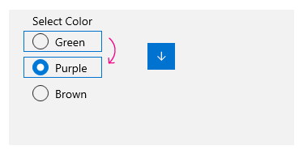
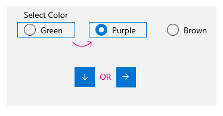
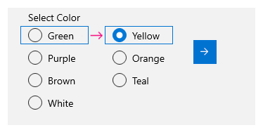
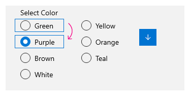
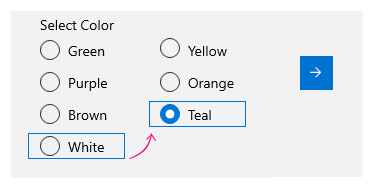
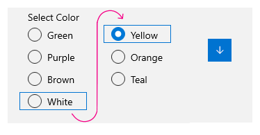

# Radio buttons

Radio buttons, also called option buttons, let users select one option from a collection of two or more mutually exclusive, but related, options. Radio buttons are always used in groups, and each option is represented by one radio button in the group.

In the default state, no radio button in a RadioButtons group is selected. That is, all radio buttons are cleared. However, once a user has selected a radio button, the user can't deselect the button to restore the group to its initial cleared state.

The singular behavior of a RadioButtons group distinguishes it from [check boxes](checkbox.md), which support multi-selection and deselection, or clearing.


**Get the Windows UI Library**

| &nbsp; | &nbsp; |
| - | - |
|  | The RadioButtons control is included as part of the Windows UI Library, a NuGet package that contains new controls and UI features for Windows apps. For more info, including installation instructions, see [Windows UI Library](/uwp/toolkits/winui/). |

> **Windows UI Library APIs**: [RadioButtons class](/uwp/api/microsoft.ui.xaml.controls.radiobuttons), [SelectedItem property](/uwp/api/microsoft.ui.xaml.controls.radiobuttons.selecteditem), [SelectedIndex property](/uwp/api/microsoft.ui.xaml.controls.radiobuttons.selectedindex), [SelectionChanged event](/uwp/api/microsoft.ui.xaml.controls.radiobuttons.selectionchanged)
>
> **Platform APIs**: [RadioButton class](/uwp/api/Windows.UI.Xaml.Controls.RadioButton), [IsChecked property](/uwp/api/Windows.UI.Xaml.Controls.Primitives.ToggleButton.IsChecked), [Checked event](/uwp/api/Windows.UI.Xaml.Controls.Primitives.ToggleButton.Checked)

> [!IMPORTANT]
> **RadioButtons vs RadioButton**
>
>There are two ways to create radio button groups.
>
>- Starting with WinUI 2.3, we recommend the **[RadioButtons](/uwp/api/microsoft.ui.xaml.controls.radiobuttons)** control. This control simplifies layout, handles keyboard navigation and accessibility, and supports binding to a data source.
>- You can use groups of individual **[RadioButton](https://docs.microsoft.com/uwp/api/Windows.UI.Xaml.Controls.RadioButton)** controls. If your app does not use WinUI 2.3 or later, this is the only option.

## Is this the right control?

Use radio buttons to let users select from two or more mutually exclusive options.


Use radio buttons when users need to see all options before they make a selection. Radio buttons emphasize all options equally, which means that some options might draw more attention than is necessary or desired.

Unless all options deserve equal attention, consider using other controls. For example, to recommend a single best option for most users and in most situations, use a [combo box](combo-box.md) to display that best option as the default option.


If there are only two possible options that can be expressed clearly as a single binary choice, such as on/off or yes/no, combine them into a single [check box](checkbox.md) or [toggle switch](toggles.md) control. For example, use a single check box for "I agree" instead of two radio buttons for "I agree" and "I don't agree."

Don't use two radio buttons for a single binary choice:


Use a check box instead:


When users can select multiple options, use [check boxes](checkbox.md).


When users' options lie within a range of values (for example, *10, 20, 30, ... 100*), use a [slider](slider.md) control.


If there are more than eight options, use a [combo box](combo-box.md).


If the available options are based on an app's current context, or they can otherwise vary dynamically, use a list control.

## Examples

<table>
<th align="left">XAML Controls Gallery<th>
<tr>
<td></img></td>
<td>
    <p>If you have the <strong style="font-weight: semi-bold">XAML Controls Gallery</strong> app installed, <a href="xamlcontrolsgallery:/item/RadioButton">open it to see the RadioButtons control in action</a>.</p>
    <ul>
    <li><a href="https://www.microsoft.com/store/productId/9MSVH128X2ZT">Get the XAML Controls Gallery app (Microsoft Store)</a></li>
    <li><a href="https://github.com/Microsoft/Xaml-Controls-Gallery">Get the source code (GitHub)</a></li>
    </ul>
</td>
</tr>
</table>

## WinUI RadioButtons overview

Keyboard access and navigation behavior have been optimized in the [RadioButtons](/uwp/api/microsoft.ui.xaml.controls.radiobuttons) control. These improvements help both accessibility and keyboard power users move through the list of options more quickly and easily.

In addition to these improvements, the default visual layout of individual radio buttons in a RadioButtons group has been optimized through automated orientation, spacing, and margin settings. This optimization eliminates the requirement to specify these properties, as you might have to do when you use a more primitive grouping control, such as [StackPanel](../layout/layout-panels.md#stackpanel) or [Grid](../layout/layout-panels.md#grid).

### Navigating a RadioButtons group

The `RadioButtons` control has special navigation behavior that helps keyboard users navigate the list more quickly and more easily.

#### Keyboard focus

The `RadioButtons` control supports two states:

- No radio button is selected
- One radio button is selected

The next sections describe the focus behavior of the control in each state.

##### No radio button is selected

When no radio button is selected, the first radio button in the list gets focus.

> [!NOTE]
> The item that receives tab focus from the initial tab navigation is not selected.

|List without tab focus | List with initial tab focus|
|:--:|:--:|
|  | |

##### One radio button is selected

When a user tabs into the list where a radio button is already selected, the selected radio button gets focus.

|List without tab focus | List with initial tab focus |
|:--:|:--:|
|  | |

#### Keyboard navigation

For more information about general keyboard navigation behaviors, see [Keyboard interactions - Navigation](../input/keyboard-interactions.md#navigation).

When an item in a `RadioButtons` group already has focus, the user can use arrow keys for "inner navigation" between the items within the group. The Up and Down arrow keys move to the "next" or "previous" logical item, as defined in your XAML markup. The Left and Right arrow keys move spatially.

##### Navigation within single-column or single-row layouts

In a single-column or single-row layout, keyboard navigation results in the following behavior:

|Single column | Single row|
|:--|:--|
| </br>The Up arrow and Down arrow keys move between items.</br>The Left arrow and Right arrow keys do nothing. | <br/>The Left and Up arrow keys move to the previous item, and the Right and Down arrow keys move to the next item. |

##### Navigation within multi-column, multi-row layouts

In a multi-column, multi-row grid layout, keyboard navigation results in this behavior:

|Left/Right arrow keys| Up/Down arrow keys |
|:--|:--|
| </br>The Left and Right arrow keys move focus horizontally between items in a row. | <br/>The Up and Down arrow keys move focus vertically between items in a column. |
| </br> When focus is on the last item in a column and the Right or Left arrow key is pressed, focus moves to the last item in the next or previous column (if any). | <br/>When focus is on the last item in a column and the Down arrow key is pressed, focus moves to the first item in the next column (if any). When focus is on the first item in a column and the Up arrow key is pressed, focus moves to the last item in the previous column (if any). |

For more information, see [Keyboard interactions](../input/keyboard-interactions.md#wrapping-homogeneous-list-and-grid-view-items).

###### Wrapping

The RadioButtons group doesn't wrap focus from the first row or column to the last, or from the last row or column to the first. This is because, when users use a screen reader, a sense of boundary and a clear indication of beginning and end is lost, which makes it difficult for users with visual impairment to navigate the list.

The `RadioButtons` control also doesn't support enumeration, because the control is intended to contain a reasonable number of items (see [Is this the right control?](#is-this-the-right-control)).

### Selection follows focus

When you use the keyboard to navigate between items in a `RadioButtons` group, as focus moves from one item to the next, the newly focused item gets selected and the previously focused item is cleared.

|Before keyboard navigation | After keyboard navigation|
|:--|:--|
| </br>*Example of focus and selection before keyboard navigation* | <br/>*Example of focus and selection after keyboard navigation, where the Down arrow key moves focus to radio button 3, selects it, and clears radio button 2* |

You can move focus without changing selection by using Ctrl+arrow keys to navigate. After focus is moved, you can use the Spacebar to select the item that currently has focus.

#### Navigating with Xbox gamepad and remote control

If you use an Xbox gamepad or remote control to move between radio buttons, the "selection follows focus" behavior is disabled, and the user must press the "A" button to select the radio button that currently has focus.

## Accessibility behavior

The following table describes how Narrator handles a `RadioButtons` group and what is announced. This behavior depends on how a user has set the Narrator detail preferences.

| Action | Narrator announcement |
|:--|:--|
| Focus moves to a selected item | "_name_, RadioButton, selected, _x_ of _N_" |
|Focus moves to an unselected item<br> *(If navigating with Ctrl-arrow keys or Xbox gamepad,<br>which indicates selection is not following focus.)* | "_name_, RadioButton, non-selected, _x_ of _N_"  |

> [!NOTE]
> The _**name**_ that Narrator announces for each item is the value of the [AutomationProperties.Name](/uwp/api/windows.ui.xaml.automation.automationproperties.nameproperty) attached property if it is available for the item; otherwise, it is the value returned by the item's [ToString](/dotnet/api/system.object.tostring?view=dotnet-uwp-10.0) method.
>
> _**x**_ is the number of the current item. _**N**_ is the total number of items in the group.

## Create a WinUI RadioButtons group

The `RadioButtons` control uses a content model similar to an [ItemsControl](/uwp/api/windows.ui.xaml.controls.itemscontrol). This means that you can:

- Populate it by adding items directly to the [Items](/uwp/api/microsoft.ui.xaml.controls.radiobuttons.items) collection or by binding data to its [ItemsSource](/uwp/api/microsoft.ui.xaml.controls.radiobuttons.itemssource) property.
- Use the [SelectedIndex](/uwp/api/microsoft.ui.xaml.controls.radiobuttons.selectedindex) or [SelectedItem](/uwp/api/microsoft.ui.xaml.controls.radiobuttons.selecteditem) properties to get and set which option is selected.
- Handle the [SelectionChanged](/uwp/api/microsoft.ui.xaml.controls.radiobuttons.selectionchanged) event to take action when an option is chosen.

Here, you declare a simple `RadioButtons` control with three options. The [Header](/uwp/api/microsoft.ui.xaml.controls.radiobuttons.header) property is set to give the group a label, and the `SelectedIndex` property is set to provide a default option.

```xaml
<muxc:RadioButtons Header="Background color"
                   SelectedIndex="0"
                   SelectionChanged="BackgroundColor_SelectionChanged">
    <x:String>Red</x:String>
    <x:String>Green</x:String>
    <x:String>Blue</x:String>
</muxc:RadioButtons>
```

The result looks like this:


To take an action when the user selects an option, handle the [SelectionChanged](/uwp/api/microsoft.ui.xaml.controls.radiobuttons.selectionchanged) event. Here, you change the background color of a [Border](/uwp/api/windows.ui.xaml.controls.border) element named "ExampleBorder" (`<Border x:Name="ExampleBorder" Width="100" Height="100"/>`).

```csharp
private void BackgroundColor_SelectionChanged(object sender, SelectionChangedEventArgs e)
{
    if (ExampleBorder != null && sender is muxc.RadioButtons rb)
    {
        string colorName = rb.SelectedItem as string;
        switch (colorName)
        {
            case "Red":
                ExampleBorder.Background = new SolidColorBrush(Colors.Red);
                break;
            case "Green":
                ExampleBorder.Background = new SolidColorBrush(Colors.Green);
                break;
            case "Blue":
                ExampleBorder.Background = new SolidColorBrush(Colors.Blue);
                break;
        }
    }
}
```

> [!TIP]
> You can also get the selected item from the [SelectionChangedEventArgs.AddedItems](/uwp/api/windows.ui.xaml.controls.selectionchangedeventargs.addeditems) property. There will only be one selected item, at index 0, so you could get the selected item like this: `string colorName = e.AddedItems[0] as string;`.

### Selection states

A radio button has two states: selected or cleared. When an option is selected in a `RadioButtons` group, you can get its value from the [SelectedItem](/uwp/api/microsoft.ui.xaml.controls.radiobuttons.selecteditem) property, and its location in the collection from the [SelectedIndex](/uwp/api/microsoft.ui.xaml.controls.radiobuttons.selectedindex) property. A radio button can be cleared if a user selects another radio button in the same group, but it can't be cleared if the user selects it again. However, you can clear a radio button group programmatically by setting it `SelectedItem = null`, or `SelectedIndex = -1`. (Setting `SelectedIndex` to any value outside the range of the `Items` collection results in no selection.)

### RadioButtons content

In the previous example, you populated the `RadioButtons` control with simple strings. The control provided the radio buttons, and used the strings as the label for each one.

However, you can populate the `RadioButtons` control with any object. Typically, you want the object to provide a string representation that can be used as a text label. In some cases, an image might be appropriate in place of text.

Here, [SymbolIcon](/uwp/api/windows.ui.xaml.controls.symbolicon) elements are used to populate the control.

```xaml
<muxc:RadioButtons Header="Choose the icon without an arrow">
    <SymbolIcon Symbol="Back"/>
    <SymbolIcon Symbol="Attach"/>
    <SymbolIcon Symbol="HangUp"/>
    <SymbolIcon Symbol="FullScreen"/>
</muxc:RadioButtons>
```


You can also use individual [RadioButton](/uwp/api/Windows.UI.Xaml.Controls.RadioButton) controls to populate the `RadioButtons` items. This is a special case that we discuss later. See [RadioButton controls in a RadioButtons group]().

A benefit of being able to use any object is that you can bind the `RadioButtons` control to a custom type in your data model. The next section demonstrates this.

### Data binding

The `RadioButtons` control supports data binding to its [ItemsSource](/uwp/api/microsoft.ui.xaml.controls.radiobuttons.itemssource) property. This example shows how you can bind the control to a custom data source. The appearance and functionality of this example is the same as the previous background color example, but here, the color brushes are stored in the data model instead of being created in the `SelectionChanged` event handler.

```xaml
 <muxc:RadioButtons Header="Background color"
                    SelectedIndex="0"
                    SelectionChanged="BackgroundColor_SelectionChanged"
                    ItemsSource="{x:Bind colorOptionItems}"/>
```

```c#
public sealed partial class MainPage : Page
{
    // Custom data item.
    public class ColorOptionDataModel
    {
        public string Label { get; set; }
        public SolidColorBrush ColorBrush { get; set; }

        public override string ToString()
        {
            return Label;
        }
    }

    List<ColorOptionDataModel> colorOptionItems;

    public MainPage1()
    {
        this.InitializeComponent();

        colorOptionItems = new List<ColorOptionDataModel>();
        colorOptionItems.Add(new ColorOptionDataModel()
            { Label = "Red", ColorBrush = new SolidColorBrush(Colors.Red) });
        colorOptionItems.Add(new ColorOptionDataModel()
            { Label = "Green", ColorBrush = new SolidColorBrush(Colors.Green) });
        colorOptionItems.Add(new ColorOptionDataModel()
            { Label = "Blue", ColorBrush = new SolidColorBrush(Colors.Blue) });
    }

    private void BackgroundColor_SelectionChanged(object sender, SelectionChangedEventArgs e)
    {
        var option = e.AddedItems[0] as ColorOptionDataModel;
        ExampleBorder.Background = option?.ColorBrush;
    }
}
```

### RadioButton controls in a RadioButtons group

You can use individual [RadioButton](/uwp/api/Windows.UI.Xaml.Controls.RadioButton) controls to populate the `RadioButtons` items. You might do this to get access to certain properties, like `AutomationProperties.Name`; or you might have existing `RadioButton` code, but want to take advantage of the layout and navigation of `RadioButtons`.

```xaml
<muxc:RadioButtons Header="Background color">
    <RadioButton Content="Red" Tag="red" AutomationProperties.Name="red"/>
    <RadioButton Content="Green" Tag="green" AutomationProperties.Name="green"/>
    <RadioButton Content="Blue" Tag="blue" AutomationProperties.Name="blue"/>
</muxc:RadioButtons>
```

When you use `RadioButton` controls in a `RadioButtons` group, the `RadioButtons` control knows how to present the `RadioButton`, so you won't end up with two selection circles.

However, there are some behaviors you should be aware of. We recommend that you handle state and events on the individual controls or on `RadioButtons`, but not both, to avoid conflicts.

This table shows the related events and properties on both controls.

|RadioButton  |RadioButtons  |
|---------|---------|
|[Checked](/uwp/api/windows.ui.xaml.controls.primitives.togglebutton.checked), [Unchecked](/uwp/api/windows.ui.xaml.controls.primitives.togglebutton.unchecked), [Click](/uwp/api/windows.ui.xaml.controls.primitives.buttonbase.click) |    [SelectionChanged](/uwp/api/microsoft.ui.xaml.controls.radiobuttons.selectionchanged) |
|[IsChecked](/uwp/api/windows.ui.xaml.controls.primitives.togglebutton.ischecked)  | [SelectedItem](/uwp/api/microsoft.ui.xaml.controls.radiobuttons.selecteditem), [SelectedIndex](/uwp/api/microsoft.ui.xaml.controls.radiobuttons.selectedindex) |

If you handle events on an individual `RadioButton`, such as `Checked` or `Unchecked`, and also handle the `RadioButtons.SelectionChanged` event, both events will fire. The `RadioButton` event occurs first, and then the `RadioButtons.SelectionChanged` event occurs, which could result in conflicts.

The `IsChecked`, `SelectedItem`, and `SelectedIndex` properties stay synchronized. A change to one property updates the other two.

The [RadioButton.GroupName](/uwp/api/windows.ui.xaml.controls.radiobutton.groupname) property is ignored. The group is created by the `RadioButtons` control.

### Defining multiple columns

By default, the `RadioButtons` control arranges its radio buttons vertically in a single column. You can set the [MaxColumns](/uwp/api/microsoft.ui.xaml.controls.radiobuttons.maxcolumns) property to make the control arrange the radio buttons in multiple columns. (When you do this, they are laid out in column-major order, where items fill in from top to bottom, then left to right.)

```xaml
<muxc:RadioButtons Header="Options" MaxColumns="3">
    <x:String>Item 1</x:String>
    <x:String>Item 2</x:String>
    <x:String>Item 3</x:String>
    <x:String>Item 4</x:String>
    <x:String>Item 5</x:String>
    <x:String>Item 6</x:String>
</muxc:RadioButtons>
```


> [!TIP]
> To have items arranged in a single horizontal row, set `MaxColumns` equal to the number of items in the group.

## Create your own RadioButton group

> [!Important]
> Unless you're using an older version of WinUI, we recommend using the WinUI `RadioButtons` control to group `RadioButton` elements.

Radio buttons work in groups. You can group individual [RadioButton](/uwp/api/Windows.UI.Xaml.Controls.RadioButton) controls in either of two ways:

- Put them inside the same parent container.
- Set the [GroupName](/uwp/api/Windows.UI.Xaml.Controls.RadioButton.GroupName) property on each radio button to the same value.

In this example, the first group of radio buttons is implicitly grouped by being in the same stack panel. The second group is divided between two stack panels, so `GroupName` is used to explicitly group them into a single group.

```xaml
<StackPanel>
    <StackPanel>
        <TextBlock Text="Background" Style="{ThemeResource BaseTextBlockStyle}"/>
        <!-- Group 1 - implicit grouping -->
        <StackPanel Orientation="Horizontal">
            <RadioButton Content="Green" Tag="green" Checked="BGRadioButton_Checked"/>
            <RadioButton Content="Yellow" Tag="yellow" Checked="BGRadioButton_Checked"/>
            <RadioButton Content="Blue" Tag="blue" Checked="BGRadioButton_Checked"/>
            <RadioButton Content="White" Tag="white" Checked="BGRadioButton_Checked"
                         IsChecked="True"/>
        </StackPanel>
    </StackPanel>

    <StackPanel>
        <TextBlock Text="BorderBrush" Style="{ThemeResource BaseTextBlockStyle}"/>
        <!-- Group 2 - grouped by GroupName -->
        <StackPanel Orientation="Horizontal">
            <StackPanel>
                <RadioButton Content="Green" Tag="green" GroupName="BorderBrush"
                             Checked="BorderRadioButton_Checked"/>
                <RadioButton Content="Yellow" Tag="yellow" GroupName="BorderBrush"
                             Checked="BorderRadioButton_Checked" IsChecked="True"/>
            </StackPanel>
            <StackPanel>
                <RadioButton Content="Blue" Tag="blue" GroupName="BorderBrush"
                             Checked="BorderRadioButton_Checked"/>
                <RadioButton Content="White" Tag="white"  GroupName="BorderBrush"
                             Checked="BorderRadioButton_Checked"/>
            </StackPanel>
        </StackPanel>
    </StackPanel>
    <Border x:Name="ExampleBorder"
            BorderBrush="#FFFFD700" Background="#FFFFFFFF"
            BorderThickness="10" Height="50" Margin="0,10"/>
</StackPanel>
```

```csharp
private void BGRadioButton_Checked(object sender, RoutedEventArgs e)
{
    RadioButton rb = sender as RadioButton;

    if (rb != null && ExampleBorder != null)
    {
        string colorName = rb.Tag.ToString();
        switch (colorName)
        {
            case "yellow":
                ExampleBorder.Background = new SolidColorBrush(Colors.Yellow);
                break;
            case "green":
                ExampleBorder.Background = new SolidColorBrush(Colors.Green);
                break;
            case "blue":
                ExampleBorder.Background = new SolidColorBrush(Colors.Blue);
                break;
            case "white":
                ExampleBorder.Background = new SolidColorBrush(Colors.White);
                break;
        }
    }
}

private void BorderRadioButton_Checked(object sender, RoutedEventArgs e)
{
    RadioButton rb = sender as RadioButton;

    if (rb != null && ExampleBorder != null)
    {
        string colorName = rb.Tag.ToString();
        switch (colorName)
        {
            case "yellow":
                ExampleBorder.BorderBrush = new SolidColorBrush(Colors.Gold);
                break;
            case "green":
                ExampleBorder.BorderBrush = new SolidColorBrush(Colors.DarkGreen);
                break;
            case "blue":
                ExampleBorder.BorderBrush = new SolidColorBrush(Colors.DarkBlue);
                break;
            case "white":
                ExampleBorder.BorderBrush = new SolidColorBrush(Colors.White);
                break;
        }
    }
}
```

These two groups of `RadioButton` controls look like this:


### Radio button states

A radio button has two states: selected or cleared. When a radio button is selected, its [IsChecked](/uwp/api/Windows.UI.Xaml.Controls.Primitives.ToggleButton.IsChecked) property is `true`. When a radio button is cleared, its `IsChecked` property is `false`. A radio button can be cleared if a user selects another radio button in the same group, but it can't be cleared if the user selects it again. However, you can clear a radio button programmatically by setting its `IsChecked` property to `false`.

### Visuals to consider

The default spacing of individual `RadioButton` controls is different than the spacing provided by a `RadioButtons` group. To apply the `RadioButtons` spacing to individual `RadioButton` controls, use a `Margin` value of `0,0,7,3`, as shown here.

```xaml
<StackPanel>
    <StackPanel.Resources>
        <Style TargetType="RadioButton">
            <Setter Property="Margin" Value="0,0,7,3"/>
        </Style>
    </StackPanel.Resources>
    <TextBlock Text="Background"/>
    <RadioButton Content="Item 1"/>
    <RadioButton Content="Item 2"/>
    <RadioButton Content="Item 3"/>
</StackPanel>
```

The following images show the preferred spacing of radio buttons in a group.


> [!NOTE]
> If you're using a WinUI RadioButtons control, the spacing, margins, and orientation are already optimized.

## Recommendations

- Make sure that the purpose and current state of a set of radio buttons is explicit.
- Limit the radio button's text label to a single line.
- If the text label is dynamic, consider how the button will automatically resize and what will happen to any visuals around it.
- Use the default font unless your brand guidelines tell you otherwise.
- Don't put two RadioButtons groups side by side. When two RadioButtons groups are right next to each other, it can be difficult for users to determine which buttons belong to which group.

## Get the sample code

- To get all the XAML controls in an interactive format, see [XAML Controls Gallery sample](https://github.com/Microsoft/Xaml-Controls-Gallery).

## Related topics

- [Buttons](buttons.md)
- [Toggle switches](toggles.md)
- [Check boxes](checkbox.md)
- [Lists and combo boxes](lists.md)
- [Sliders](slider.md)
- [RadioButtons class](/uwp/api/microsoft.ui.xaml.controls.radiobuttons)
- [RadioButton class](/uwp/api/windows.ui.xaml.controls.radiobutton)
