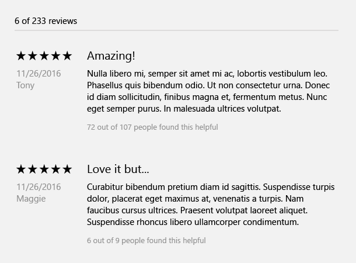

---

description: Enables users to view and set ratings that reflect satisfaction with content and services. 
title: Rating Control
template: detail.hbs

ms.date: 10/25/2017
ms.topic: article


keywords: windows 10, uwp
pm-contact: abarlow
design-contact: kimsea
dev-contact: mitra
doc-status: Published
ms.localizationpriority: medium
---

# Rating control

The rating control allows users to view and set ratings that reflect degrees of satisfaction with content and services. Users can interact with the rating control with touch, pen, mouse, gamepad or keyboard. The follow guidance shows how to use the rating control's features to provide flexibility and customization.

> **Important APIs**: [RatingControl class](https://docs.microsoft.com/uwp/api/windows.ui.xaml.controls.ratingcontrol)


## Examples

<table>
<th align="left">XAML Controls Gallery<th>
<tr>
<td></img></td>
<td>
    <p>If you have the <strong style="font-weight: semi-bold">XAML Controls Gallery</strong> app installed, click here to <a href="xamlcontrolsgallery:/item/RatingControl">open the app and see the RatingControl in action</a>.</p>
    <ul>
    <li><a href="https://www.microsoft.com/store/productId/9MSVH128X2ZT">Get the XAML Controls Gallery app (Microsoft Store)</a></li>
    <li><a href="https://github.com/Microsoft/Windows-universal-samples/tree/master/Samples/XamlUIBasics">Get the source code (GitHub)</a></li>
    </ul>
</td>
</tr>
</table>

### Editable rating with placeholder value

Perhaps the most common way to use the rating control is to display an average rating while still allowing the user to enter their own rating value. In this scenario, the rating control is initially set to reflect the average satisfaction rating of all users of a particular service or type of content (such as a music, videos, books, etc.). It remains in this state until a user interacts with the control with the goal of individually rating an item. This interaction changes the state of the ratings control to reflect the user's personal satisfaction rating.

#### Initial average rating state


#### Representation of user rating once set


```XAML
<RatingControl x:Name="MyRating" ValueChanged="RatingChanged"/>
```

```csharp
private void RatingChanged(RatingControl sender, object args)
{
    if (sender.Value == null)
    {
        MyRating.Caption = "(" + SomeWebService.HowManyPreviousRatings() + ")";
    }

    else
    {
        MyRating.Caption = "Your rating";
    }
}
```

### Read-only rating mode

Sometimes you need to show ratings of secondary content, such as that displayed in recommended content or when displaying a list of comments and their corresponding ratings. In this case, the user shouldn’t be able to edit the rating, so you can make the control read-only.
The read only mode is also the recommended way of using the rating control when it is used in very large virtualized lists of content, for both UI design and performance reasons.



To do this you would do the following:

```XAML
<RatingControl IsReadOnly="True"/>
```

## Additional functionality

The rating control has many additional features which can be used. Details for using these features can be found in our MSDN reference documentation.
Here is a non-comprehensive list of additional functionality:
-   Great long list performance
-   Compact sizing for tight UI scenarios
-   Continuous value fill and rating
-   Spacing customization
-   Disable growth animations
-   Customization of the number of stars

## Get the sample code

- [XAML Controls Gallery sample](https://github.com/Microsoft/Windows-universal-samples/tree/master/Samples/XamlUIBasics) - See all the XAML controls in an interactive format.