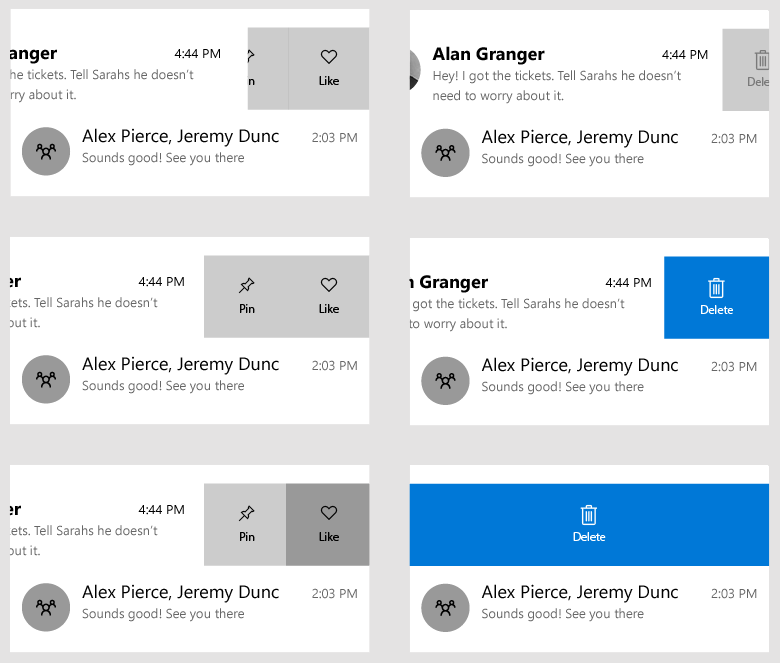

# Swipe

Swipe commanding is an accelerator for context menus that lets users easily access common menu actions by touch, without needing to change states within the app.

> **Important APIs**: [SwipeControl](/uwp/api/windows.ui.xaml.controls.swipecontrol), [SwipeItem](/uwp/api/windows.ui.xaml.controls.swipeitem), [ListView class](/uwp/api/Windows.UI.Xaml.Controls.ListView)



## Is this the right control?

Swipe commanding saves space. It's useful in situations where the user may perform the same operation on multiple items in quick succession. And it provides "quick actions" on items that don't need a full popup or state change within the page.

You should use swipe commanding when you have a potentially large group of items, and each item has 1-3 actions that a user may want to perform regularly. These actions may include, but are not limited to:

- Deleting
- Marking or archiving
- Saving or downloading
- Replying

## Examples

<table>
<th align="left">XAML Controls Gallery<th>
<tr>
<td></img></td>
<td>
    <p>If you have the <strong style="font-weight: semi-bold">XAML Controls Gallery</strong> app installed, click here to <a href="xamlcontrolsgallery:/item/SwipeControl">open the app and see the SwipeControl in action</a>.</p>
    <ul>
    <li><a href="https://www.microsoft.com/store/productId/9MSVH128X2ZT">Get the XAML Controls Gallery app (Microsoft Store)</a></li>
    <li><a href="https://github.com/Microsoft/Windows-universal-samples/tree/master/Samples/XamlUIBasics">Get the source code (GitHub)</a></li>
    </ul>
</td>
</tr>
</table>

## Video summary

> [!VIDEO https://channel9.msdn.com/Events/Windows/Windows-Developer-Day-Fall-Creators-Update/WinDev015/player]

## How does Swipe work?

UWP swipe commanding has two modes: [Reveal](/uwp/api/windows.ui.xaml.controls.swipemode) and [Execute](/uwp/api/windows.ui.xaml.controls.swipemode). It also supports four different swipe directions: up, down, left, and right.

### Reveal mode

In Reveal mode, the user swipes an item to open a menu of one or more commands and must explicitly tap a command to execute it. When the user swipes and releases an item, the menu remains open until either a command is selected, or the menu is closed again through swiping back, tapping off, or scrolling the opened swipe item off the screen.


Reveal mode is a safer, more versatile swipe mode, and can be used for most types of menu actions, even potentially destructive actions, such as deletion.

When the user selects one of the menu options shown in the reveal's open and resting state, the command for that item is invoked and the swipe control is closed.

### Execute mode

In Execute mode, the user swipes an item open to reveal and execute a single command with that one swipe. If the user releases the item being swiped before they swipe past a threshold, the menu closes and the command is not executed. If the user swipes past the threshold and then releases the item, the command is executed immediately.


If the user does not release their finger after the threshold is reached, and pulls the swipe item closed again, the command is not executed  and no action is performed on the item.

Execute mode provides more visual feedback through color and label orientation while an item is being swiped.

Execute is best used when the action the user is performing is most common.

It may also be used for more destructive actions like deleting an item. However, keep in mind that Execute requires only one action of swiping in a direction, as opposed to Reveal, which requires the user to explicitly click on a button.

### Swipe directions

Swipe works in all cardinal directions: up, down, left, and right. Each swipe direction can hold its own swipe items or content, but only one instance of a direction can be set at a time on a single swipe-able element.

For example, you cannot have two [LeftItems](/uwp/api/windows.ui.xaml.controls.swipecontrol.LeftItems) definitions on the same SwipeControl.

## How to create a Swipe command

Swipe commands have two components that you need to define:

- The [SwipeControl](/uwp/api/windows.ui.xaml.controls.swipecontrol), which wraps around your content. In a collection, such as a ListView, this sits within your DataTemplate.
- The swipe menu items, which is one or more [SwipeItem](/uwp/api/windows.ui.xaml.controls.swipeitem) objects placed in the swipe control's directional containers: [LeftItems](/uwp/api/windows.ui.xaml.controls.swipecontrol.LeftItems), [RightItems](/uwp/api/windows.ui.xaml.controls.swipecontrol.RightItems), [TopItems](/uwp/api/windows.ui.xaml.controls.swipecontrol.TopItems), or [BottomItems](/uwp/api/windows.ui.xaml.controls.swipecontrol.BottomItems)

Swipe content can be placed inline, or defined in the Resources section of your page or app.

Here's a simple example of a SwipeControl wrapped around some text. It shows the hierarchy of XAML elements required to create a swipe command.

```xaml
<SwipeControl HorizontalAlignment="Center" VerticalAlignment="Center">
    <SwipeControl.LeftItems>
        <SwipeItems>
            <SwipeItem Text="Pin">
                <SwipeItem.IconSource>
                    <SymbolIconSource Symbol="Pin"/>
                </SwipeItem.IconSource>
            </SwipeItem>
        </SwipeItems>
    </SwipeControl.LeftItems>

     <!-- Swipeable content -->
    <Border Width="180" Height="44" BorderBrush="Black" BorderThickness="2">
        <TextBlock Text="Swipe to Pin" Margin="4,8,0,0"/>
    </Border>
</SwipeControl>
```

Now we'll take a look at a more complete example of how you would typically use swipe commands in a list. In this example, you'll set up a delete command that uses Execute mode, and a menu of other commands that uses Reveal mode. Both sets of commands are defined in the Resources section of the page. You'll apply the swipe commands to the items in a ListView.

First, create the swipe items, which represent the commands, as page level resources. SwipeItem uses an [IconSource](/uwp/api/windows.ui.xaml.controls.iconsource) as its icon. Create the icons as resources, too.

```xaml
<Page.Resources>
    <SymbolIconSource x:Key="ReplyIcon" Symbol="MailReply"/>
    <SymbolIconSource x:Key="DeleteIcon" Symbol="Delete"/>
    <SymbolIconSource x:Key="PinIcon" Symbol="Pin"/>

    <SwipeItems x:Key="RevealOptions" Mode="Reveal">
        <SwipeItem Text="Reply" IconSource="{StaticResource ReplyIcon}"/>
        <SwipeItem Text="Pin" IconSource="{StaticResource PinIcon}"/>
    </SwipeItems>

    <SwipeItems x:Key="ExecuteDelete" Mode="Execute">
        <SwipeItem Text="Delete" IconSource="{StaticResource DeleteIcon}"
                   Background="Red"/>
    </SwipeItems>
</Page.Resources>
```

Remember to keep the menu items in your swipe content to short, concise text labels. These actions should be the primary ones that a user may want to perform multiple times over a short period.

Setting up a swipe command to work in a collection or ListView is exactly the same as defining a single swipe command (shown previously), except you define your SwipeControl in a DataTemplate so it's applied to each item in the collection.

Here's a ListView with the SwipeControl applied in its item DataTemplate. The LeftItems and RightItems properties reference the swipe items that you created as resources.

```xaml
<ListView x:Name="sampleList" Width="300">
    <ListView.ItemContainerStyle>
        <Style TargetType="ListViewItem">
            <Setter Property="HorizontalContentAlignment" Value="Stretch"/>
        </Style>
    </ListView.ItemContainerStyle>
    <ListView.ItemTemplate>
        <DataTemplate x:DataType="x:String">
            <SwipeControl x:Name="ListViewSwipeContainer"
                          LeftItems="{StaticResource RevealOptions}"
                          RightItems="{StaticResource ExecuteDelete}"
                          Height="60">
                <StackPanel Orientation="Vertical" Margin="5">
                    <TextBlock Text="{x:Bind}" FontSize="18"/>
                    <StackPanel Orientation="Horizontal">
                        <TextBlock Text="Lorem ipsum dolor sit amet, consectetur adipiscing elit..." FontSize="12"/>
                    </StackPanel>
                </StackPanel>
            </SwipeControl>
        </DataTemplate>
    </ListView.ItemTemplate>
    <x:String>Item 1</x:String>
    <x:String>Item 2</x:String>
    <x:String>Item 3</x:String>
    <x:String>Item 4</x:String>
    <x:String>Item 5</x:String>
</ListView>
```

## Handle an invoked swipe command

To act on a swipe command, you handle its [Invoked](/uwp/api/windows.ui.xaml.controls.swipeitem.Invoked) event. (For more info about a how a user can invoke a command, review the _How does swipe work?_ section earlier in this article.) Typically, a swipe command is in a ListView or list-like scenario. In that case, when a command is invoked, you want to perform an action on that swiped item.

Here's how to handle the Invoked event on the _delete_ swipe item you created previously.

```xaml
<SwipeItems x:Key="ExecuteDelete" Mode="Execute">
    <SwipeItem Text="Delete" IconSource="{StaticResource DeleteIcon}"
               Background="Red" Invoked="Delete_Invoked"/>
</SwipeItems>
```

The data item is the DataContext of the SwipeControl. In your code, you can access the item that was swiped by getting the SwipeControl.DataContext property from the event args, as shown here.

```csharp
 private void Delete_Invoked(SwipeItem sender, SwipeItemInvokedEventArgs args)
 {
     sampleList.Items.Remove(args.SwipeControl.DataContext);
 }
```

> [!NOTE]
> Here, the items were added directly to the ListView.Items collection for simplicity, so the item is also deleted the same way. If you instead set the ListView.ItemsSource to a collection, which is more typical, you need to delete the item from the source collection.

In this particular instance, you removed the item from the list, so the final visual state of the swiped item isn't important. However, in situations where you simply want to perform an action and then have the swipe collapse again, you can set the [BehaviorOnInvoked](/uwp/api/windows.ui.xaml.controls.swipeitem.BehaviorOnInvoked) property one of the 
[SwipeBehaviorOnInvoked](/uwp/api/windows.ui.xaml.controls.swipebehavioroninvoked) enum values.

- **Auto**
  - In Execute mode, the opened swipe item will remain open when invoked.
  - In Reveal mode, the opened swipe item will collapse when invoked.
- **Close**
  - When the item is invoked, the swipe control will always collapse and return to normal, regardless of the mode.
- **RemainOpen**
  - When the item is invoked, the swipe control will always stay open, regardless of the mode.

Here, a _reply_ swipe item is set to close after its invoked.

```xaml
<SwipeItem Text="Reply" IconSource="{StaticResource ReplyIcon}"
           Invoked="Reply_Invoked"
           BehaviorOnInvoked = "Close"/>
```

## Dos and don'ts

- Don't use swipe in FlipViews, Hubs or Pivots. The combination may be confusing for the user because of conflicting swipe directions.
- Don't combine horizontal swipe with horizontal navigation, or vertical swipe with vertical navigation.
- Do make sure what the user is swiping is the same action, and is consistent across all related items that can be swiped.
- Do use swipe for the main actions a user will want to perform.
- Do use swipe on items where the same action is repeated many times.
- Do use horizontal swiping on wider items, and vertical swiping on taller items.
- Do use short, concise text labels.

## Get the sample code

- [XAML Controls Gallery sample](https://github.com/Microsoft/Windows-universal-samples/tree/master/Samples/XamlUIBasics) - See all the XAML controls in an interactive format.

## Related articles

- [List view and Grid view](listview-and-gridview.md)
- [Item containers and templates](item-containers-templates.md)
- [Pull to refresh](pull-to-refresh.md)
