# Page layout

In UWP apps, each [**Page**](https://docs.microsoft.com/uwp/api/Windows.UI.Xaml.Controls.Page) generally has navigation, command, and content elements. 

Your app can have multiple pages: when a user launches a UWP app, the application code creates a [**Frame**](https://docs.microsoft.com/uwp/api/Windows.UI.Xaml.Controls.Frame) to place inside of the application's [**Window**](https://docs.microsoft.com/uwp/api/windows.ui.xaml.window). The Frame can then [navigate](../basics/navigate-between-two-pages.md) between the application's [**Page**](https://docs.microsoft.com/uwp/api/Windows.UI.Xaml.Controls.Page) instances. 

Most pages follow a common layout structure, and this article covers which UI elements you'll need, and where they should go on a page. 

## Navigation
Your app layout begins with the navigation model you choose, which defines how your users navigate between pages in your app. For this article, we'll discuss two common navigation patterns: left nav and top nav. For guidance on choosing other navigation options, see [Navigation design basics for UWP apps](../basics/navigation-basics.md).

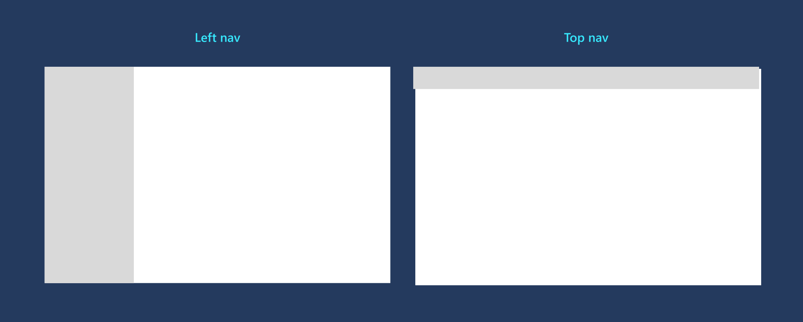

### Left nav
Left nav, or the [nav pane](../controls-and-patterns/navigationview.md) pattern, is generally reserved for app-level navigation and exists at the highest level within the app, meaning that it should always be visible and available. We recommend left nav when there are more than five navigational items, or more than five pages in your app. The nav pane pattern typically contains:
- Navigation items
- Entry point into app settings
- Entry point into account settings

The [NavigationView](https://docs.microsoft.com/uwp/api/windows.ui.xaml.controls.navigationview) control implements the left nav pattern for UWP.

When a navigation item is selected, the Frame should navigate to the selected item's Page.

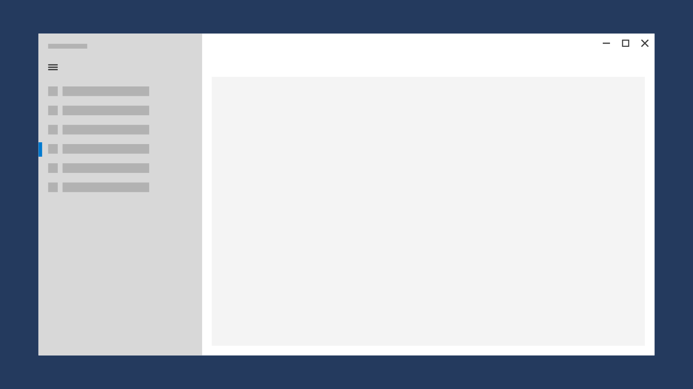

The menu button allows users to expand and collapse the nav pane. When the screen size is larger than 640 px, clicking the menu button collapses the nav pane into a bar.

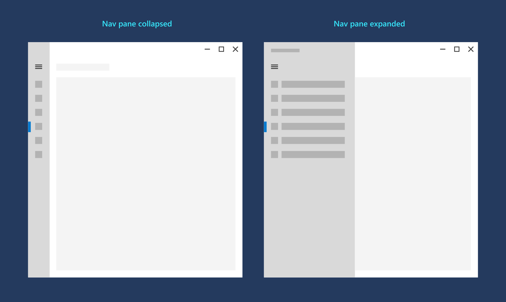

When the screen size is smaller than 640 px, the nav pane is fully collapsed.

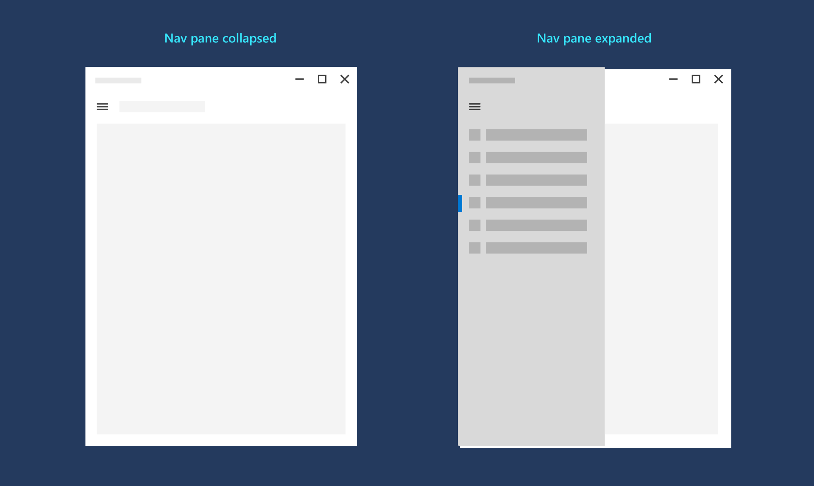

### Top nav

Top nav can also act as top-level navigation. While left nav is collapsible, top nav is always visible. The [NavigationView](../controls-and-patterns/navigationview.md) control implements the top navigation and tabs pattern for UWP.

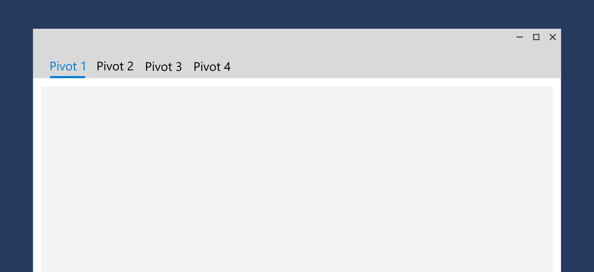

## Command bar

Next, you might want to provide users with easy access to your app's most common tasks. A [command bar](../controls-and-patterns/app-bars.md) can provide access to app-level or page-level commands, and it can be used with any navigation pattern.

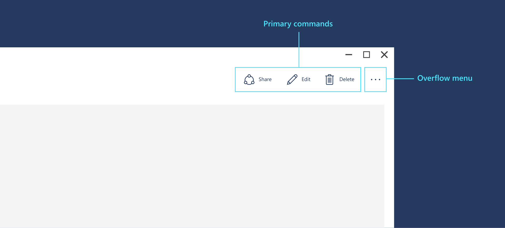

The command bar can be placed at the top or bottom of the page, whichever is best for your app.

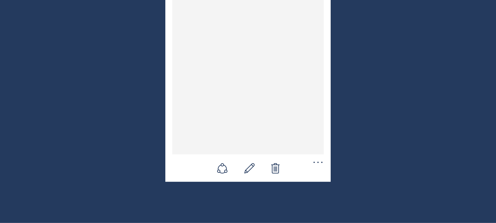

## Content

Finally, content varies widely from app to app, so you can present content in many different ways. Here, we describe some common page patterns that you might want to use in your app. Many apps use some, or all, of these common page patterns to display different types of content. Likewise, feel free to mix and match these patterns to optimize for your app.

## Landing

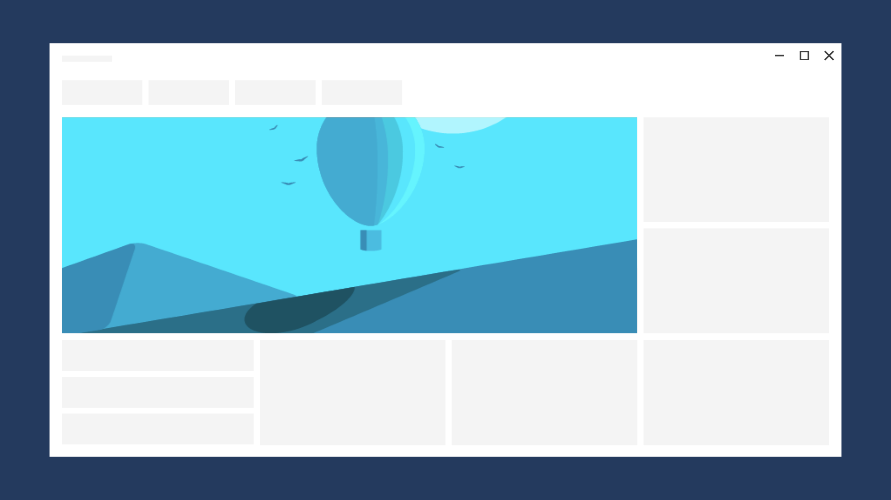

Landing pages, also known as hero screens, often appear at the top level of an app experience. The large surface area serves as a stage for apps to highlight content that users may want to browse and consume.

## Collections

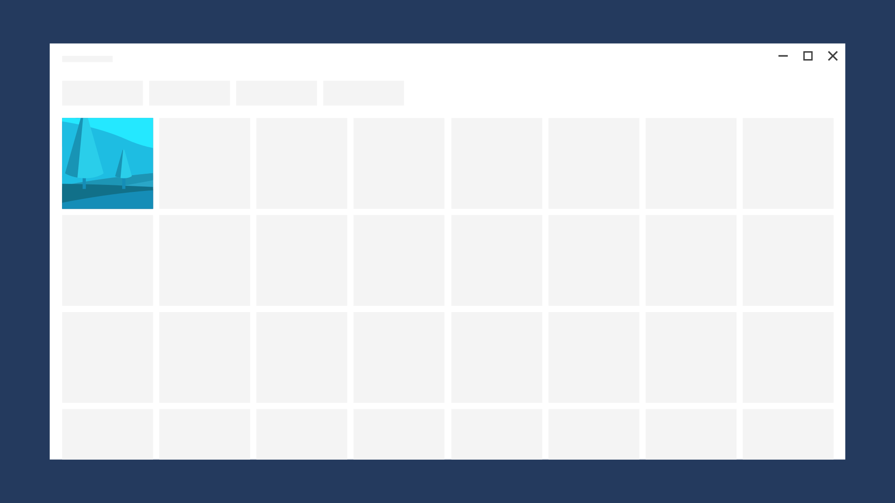

Collections allow users to browse groups of content or data. [Grid view](../controls-and-patterns/item-templates-gridview.md) is a good option for photos or media-centric content, and [list view](../controls-and-patterns/item-templates-listview.md) is a good option for text-heavy content or data.

## Master/detail

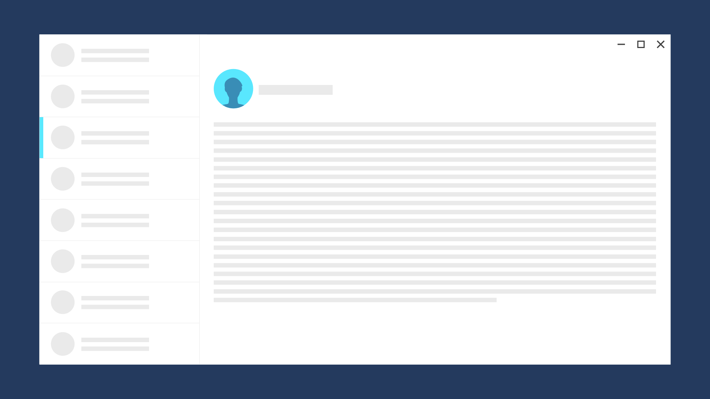

The [master/details](../controls-and-patterns/master-details.md) model consists of a list view (master) and a content view (detail). Both panes are fixed and have vertical scrolling. When an item in the list view is selected, the content view is correspondingly updated. 

## Forms
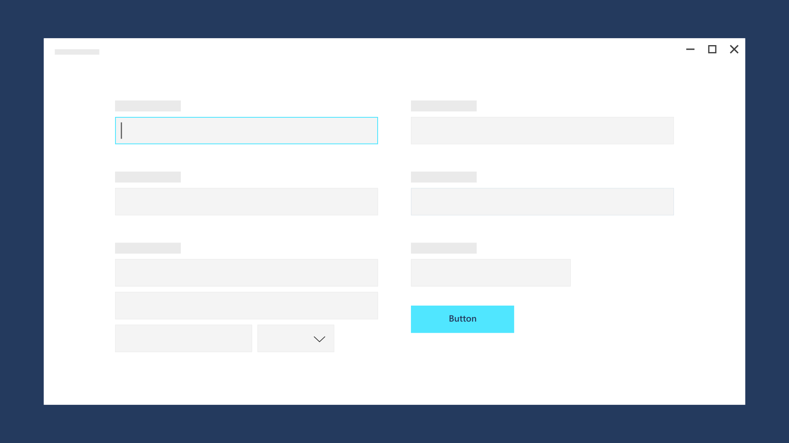

A [form](../controls-and-patterns/forms.md) is a group of controls that collect and submit data from users. Most, if not all apps, use a form of some sort for settings pages, log in portals, feedback hubs, account creation, or other purposes. 

## Sample apps
To see how these patterns can be implemented, check out our [UWP sample apps](https://developer.microsoft.com/en-us/windows/samples):
- [BuildCast Video Player](https://github.com/Microsoft/BuildCast)
- [Lunch Scheduler](https://github.com/Microsoft/Windows-appsample-lunch-scheduler)
- [Coloring Book](https://github.com/Microsoft/Windows-appsample-coloringbook)
- [Customers Orders Database](https://github.com/Microsoft/Windows-appsample-customers-orders-database)