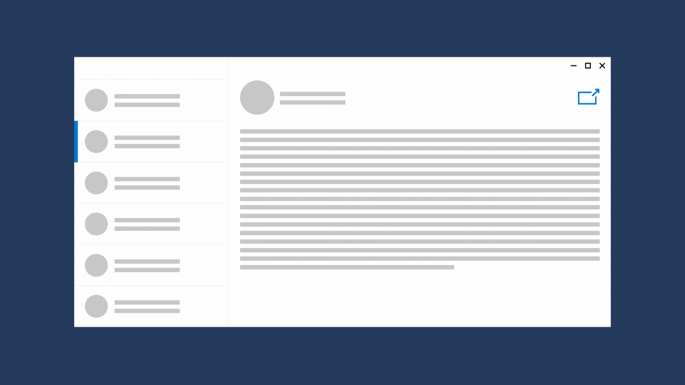

# Show multiple views for an app

Help your users be more productive by letting them view independent parts of your app in separate windows. When you create multiple windows for an app, the taskbar shows each window separately. Users can move, resize, show, and hide app windows independently and can switch between app windows as if they were separate apps.

> **Important APIs**: [Windows.UI.ViewManagement namespace](/uwp/api/windows.ui.viewmanagement), [Windows.UI.WindowManagement namespace](/uwp/api/windows.ui.windowmanagement)

## When should an app use multiple views?

There are a variety of scenarios that can benefit from multiple views. Here are a few examples:

- An email app that lets users view a list of received messages while composing a new email
- An address book app that lets users compare contact info for multiple people side-by-side
- A music player app that lets users see what's playing while browsing through a list of other available music
- A note-taking app that lets users copy information from one page of notes to another
- A reading app that lets users open several articles for reading later, after an opportunity to peruse all high-level headlines

While each app layout is unique, we recommend including a "new window" button in a predictable location, such as the top right corner of the content that can be opened in a new window. Also consider including a [context menu](..\controls-and-patterns\menus.md) option to "Open in a new window".

To create separate instances of your app (rather than separate windows for the same instance), see [Create a multi-instance UWP app](../../launch-resume/multi-instance-uwp.md).

## Windowing hosts

There are different ways that UWP content can be hosted inside an app.

- [CoreWindow](/uwp/api/windows.ui.core.corewindow)/[ApplicationView](/uwp/api/windows.ui.viewmanagement.applicationview)

     An app view is the 1:1 pairing of a thread and a window that the app uses to display content. The first view that’s created when your app starts is called the *main view*. Each CoreWindow/ApplicationView operates in its own thread. Having to work on different UI threads can complicate multi-window apps.
- [AppWindow](/uwp/api/windows.ui.windowmanagement.appwindow)

     The AppWindow class was introduced in Windows 10, version 1903 (with the supporting [WindowManagement](/uwp/api/windows.ui.windowmanagement) namespace) to simplify the creation of multi-window apps. An AppWindow operates on the same UI thread that it’s created from.

    > [!NOTE]
    > AppWindow is currently in preview. This means you can submit apps that use AppWindow to the Store, but some platform and framework components are known to not work with AppWindow (see [Limitations]((/uwp/api/windows.ui.windowmanagement.appwindow#limitations))).
- [DesktopWindowXamlSource](/uwp/api/windows.ui.xaml.hosting.desktopwindowxamlsource)

     UWP XAML content in a Win32 app (using HWND) is hosted in a DesktopWindowXamlSource.

The main view for your app is always hosted in an ApplicationView. Content in a secondary window can be hosted in a ApplicationView or in an AppWindow. Here, we look at how to use ApplicationView and AppWindow in UWP apps. For more info about DesktopWindowXamlSource in a Win32 app, see [Using the UWP XAML hosting API in a desktop application](/windows/apps/desktop/modernize/using-the-xaml-hosting-api).

The AppWindow class and other APIs in the WindowManagement namespace are available starting in Windows 10, version 1903 (SDK 18362). If your app targets earlier versions of Windows 10, you must use ApplicationView to create secondary windows. WindowManagement APIs are still under development and have [limitations](/uwp/api/windows.ui.windowmanagement.appwindow#limitations) as described in the API reference docs.

To learn how to use AppWindow to show secondary windows in your app, see [Use AppWindow](app-window.md).

To learn how to use ApplicationView to show secondary windows in your app, see [Use ApplicationView](application-view.md).

## Do's and don'ts

- Do provide a clear entry point to the secondary view by utilizing the "open new window" glyph.
- Do communicate the purpose of the secondary view to users.
- Do ensure that your app is fully functional in a single view and users will open a secondary view only for convenience.
- Don't rely on the secondary view to provide notifications or other transient visuals.

## Related topics

- [Use AppWindow](app-window.md)
- [Use ApplicationView](application-view.md)
- [ApplicationViewSwitcher](https://docs.microsoft.com/uwp/api/Windows.UI.ViewManagement.ApplicationViewSwitcher)
- [CreateNewView](https://docs.microsoft.com/uwp/api/windows.applicationmodel.core.coreapplication.createnewview)
