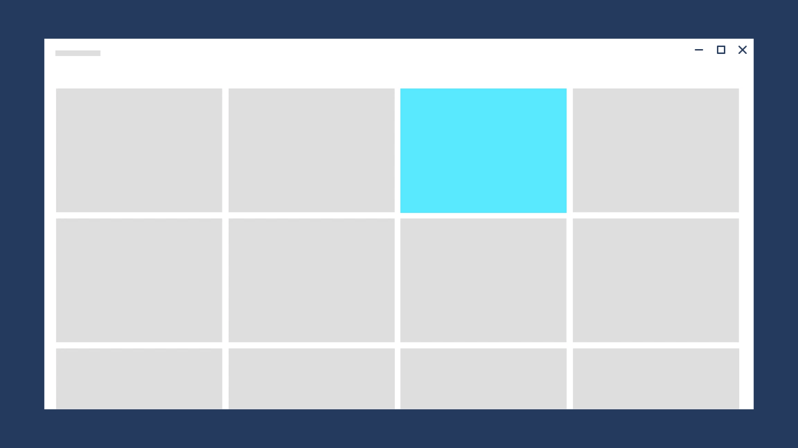

# Directionality and gravity

Directional signals help to solidify the mental model of the journey a user takes across experiences. It is important that the direction of any motion support both the continuity of the space as well as the integrity of the objects in the space.

​Directional movement is subject to forces like gravity. Applying forces to movement reinforces the natural feel of the motion.​

## Examples

<table>
<tr>
<td></img></td>
<td>
    
If you have the <strong style="font-weight: semi-bold">XAML Controls Gallery</strong> app installed, click here to <a href="xamlcontrolsgallery:/category/Motion">open the app and see Motion in action</a>.

    <ul>
    <li><a href="https://www.microsoft.com/store/productId/9MSVH128X2ZT">Get the XAML Controls Gallery app (Microsoft Store)</a></li>
    <li><a href="https://github.com/Microsoft/Xaml-Controls-Gallery">Get the source code (GitHub)</a></li>
    </ul>
</td>
</tr>
</table>

## Direction of movement​

:::row:::
    :::column:::
Direction of movement corresponds to physical motion. Just like in nature, objects can move in any world axis - X,Y,Z. This is how we think of the movement of objects on the screen.
When you move objects, avoid unnatural collisions. ​Keep in mind where objects come from and go to, and alway support higher level constructs that may be used in the scene, such as scroll direction or layout hierarchy.​
    :::column-end:::
    :::column:::
        
    :::column-end:::
:::row-end:::

## Direction of navigation​

The direction of navigation between scenes in your app is conceptual. Users navigate forward and back. Scenes move in and out of view. These concepts combine with physical movement to guide the user.

When navigation causes an object to travel from the previous scene to the new scene, the object makes a simple A-to-B move on the screen. To ensure that the movement feels more physical, the standard easing is added, as well as the feeling of gravity.

For back navigation, the move is reversed (B-to-A). When the user navigates back, they have an expectation to be returned to the previous state as soon as possible. The timing is quicker, more direct, and uses the decelerate easing.

Here, these priciples are applied as the selected item stays on screen during forward and back navigation.

When navigation causes items on the screen to be replaced, its important to show where the exiting scene went to, and where the new scene is coming from.

This has several benefits:
​
- It solidifies the user's mental model of the space.
- The duration of the exiting scene provides more time to prepare content to be animated in for the incoming scene.​
- It improves the perceived performance of the app.​

There are 4 discreet directions of navigation to consider​.

:::row:::
    :::column:::
**Forward-In**
Celebrate content entering the scene in a manner that does not collide with outgoing content. Content decelerates into the scene.
    :::column-end:::
    :::column:::
        
    :::column-end:::
:::row-end:::
:::row:::
    :::column:::
**Forward-Out**
Content exits quickly. Objects accelerate off screen.
    :::column-end:::
    :::column:::
        
    :::column-end:::
:::row-end:::
:::row:::
    :::column:::
**Backward-In**
Same as Forward-In, but reversed.
    :::column-end:::
    :::column:::
        
    :::column-end:::
:::row-end:::
:::row:::
    :::column:::
**Backward-Out**
Same as Forward-Out, but reversed.
    :::column-end:::
    :::column:::
        
    :::column-end:::
:::row-end:::

## Gravity

Gravity makes your experiences feel more natural. Objects that move on the Z-axis and are not anchored to the scene by an onscreen affordance have the potential to be affected by gravity.​ As an object breaks free of the scene and before it reaches escape velocity, gravity pulls down on the object, creating a more natural curve of the object trajectory as it moves.

Gravity typically manifests when an object must jump from one scene to another.​ Because of this, connected animation uses the concept of gravity.

Here, an element in the top row of the grid is affected by gravity, causing it to drop slightly as it leaves its place and moves to the front.

## Related articles

- [Motion overview](index.md)
- [Timing and easing](timing-and-easing.md)
