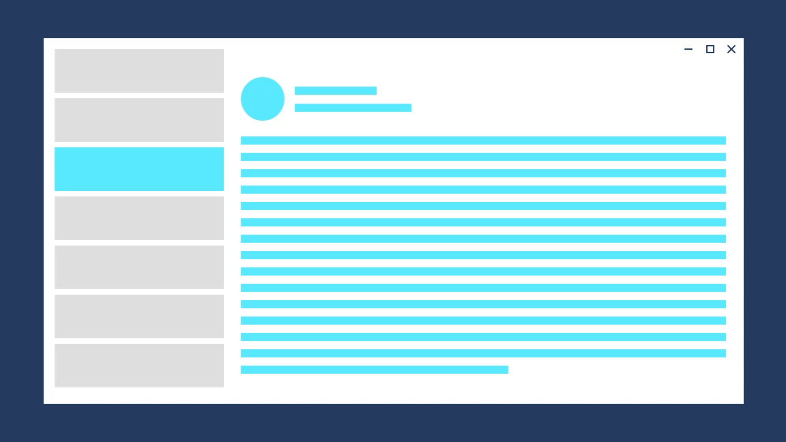
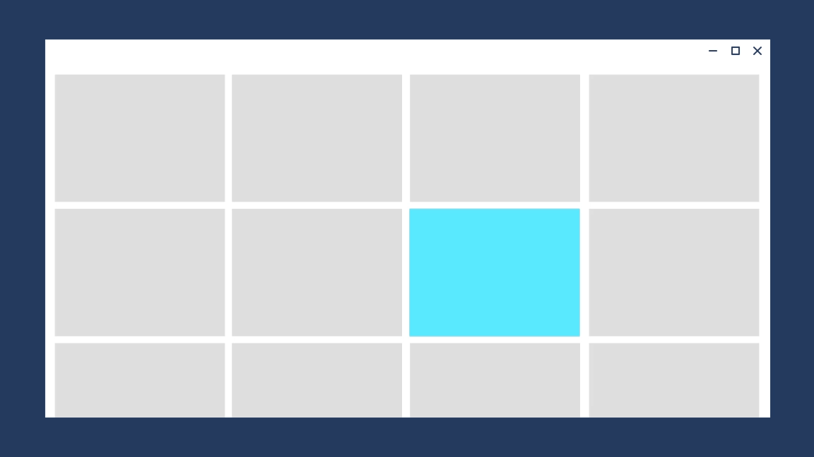

# Page transitions

Page transitions navigate users between pages in an app, providing feedback as the relationship between pages. Page transitions help users understand if they are at the top of a navigation hierarchy, moving between sibling pages, or navigating deeper into the page hierarchy.

Two different animations are provided for navigation between pages in an app, *Page refresh* and *Drill*, and are represented by subclasses of [**NavigationTransitionInfo**](https://docs.microsoft.com/uwp/api/windows.ui.xaml.media.animation.navigationtransitioninfo).

## Page refresh

Page refresh is a combination of a slide up animation and a fade in animation for the incoming content. Use page refresh when the user is taken to the top of a navigational stack, such as navigating between tabs or left-nav items.

The desired feeling is that the user has started over.



The page refresh animation is represented by the [**EntranceNavigationTransitionInfoClass**](https://docs.microsoft.com/uwp/api/windows.ui.xaml.media.animation.entrancenavigationtransitioninfo).

```csharp
// Explicitly play the page refresh animation
myFrame.Navigate(typeof(Page2), null, new EntranceNavigationTransitionInfo());

```

**Note**: A [**Frame**](https://docs.microsoft.com/uwp/api/windows.ui.xaml.controls.frame) automatically uses [**NavigationThemeTransition**](https://docs.microsoft.com/uwp/api/windows.ui.xaml.media.animation.navigationthemetransition) to animate navigation between two pages. By default, the animation is page refresh.

## Drill

Use drill when users navigate deeper into an app, such as displaying more information after selecting an item.

The desired feeling is that the user has gone deeper into the app.



The drill animation is represented by the [**DrillInNavigationTransitionInfo**](https://docs.microsoft.com/uwp/api/windows.ui.xaml.media.animation.drillinnavigationtransitioninfo) class.

```csharp
// Play the drill in animation
myFrame.Navigate(typeof(Page2), null, new DrillInNavigationTransitionInfo());
```

## Horizontal slide

Use horizontal slide to show that sibling pages appear next to each other. The [NavigationView](../controls-and-patterns/navigationview.md) control automatically uses this animation for top nav, but if you are building your own horizontal navigation experience, then you can implement horizonal slide with SlideNavigationTransitionInfo.

The desired feeling is that the user is navigating between pages that are next to each other. 

```csharp
// Navigate to the right, ie. from LeftPage to RightPage
myFrame.Navigate(typeof(RightPage), null, new SlideNavigationTransitionInfo() { SlideNavigationTransitionEffect.FromRight } );

// Navigate to the left, ie. from RightPage to LeftPage
myFrame.Navigate(typeof(LeftPage), null, new SlideNavigationTransitionInfo() { SlideNavigationTransitionEffect.FromLeft } );
```

## Suppress

To avoid playing any animation during navigation, use [**SuppressNavigationTransitionInfo**](https://docs.microsoft.com/uwp/api/windows.ui.xaml.media.animation.suppressnavigationtransitioninfo) in the place of other **NavigationTransitionInfo** subtypes.

```csharp
// Suppress the default animation
myFrame.Navigate(typeof(Page2), null, new SuppressNavigationTransitionInfo());
```

Suppressing the animation is useful if you are building your own transition using [Connected Animations](connected-animation.md) or implicit show/hide animations.

## Backwards navigation

You can use `Frame.GoBack(NavigationTransitionInfo)` to play a specific transition when navigating backwards.

This can be useful when you modify navigation behavior dynamically based on screen size; for example, in a responsive master/detail scenario.

## Related topics

- [Navigate between two pages](../basics/navigate-between-two-pages.md)
- [Motion in UWP apps](index.md)
