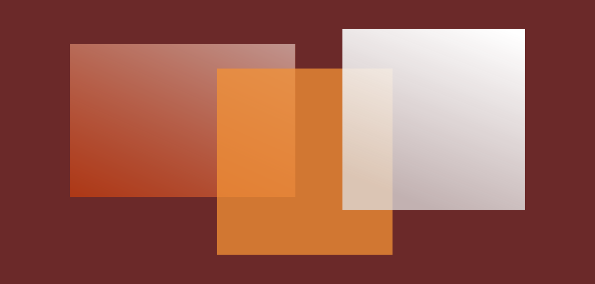
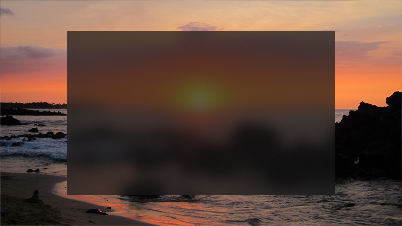
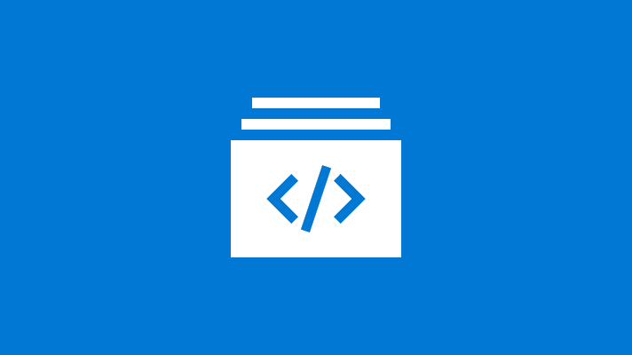
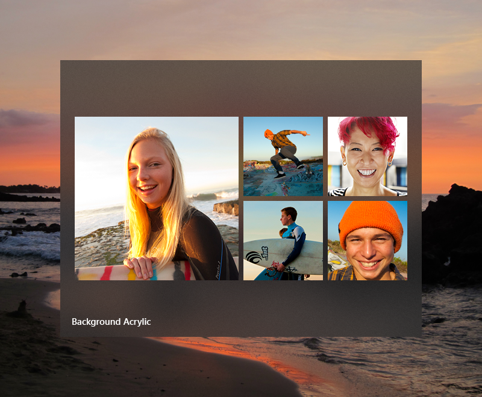
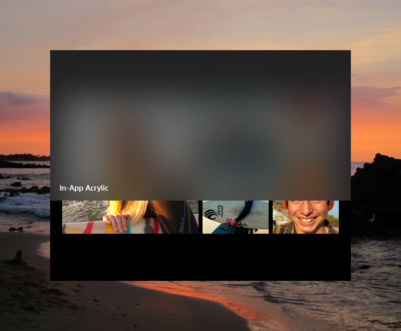
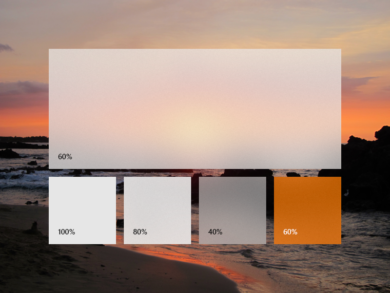
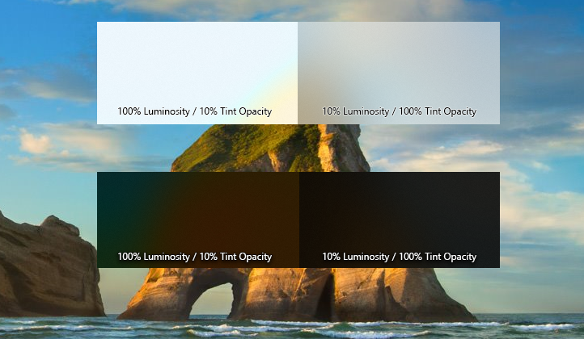

# Acrylic material



Acrylic is a type of [Brush](/uwp/api/Windows.UI.Xaml.Media.Brush) that creates a translucent texture. You can apply acrylic to app surfaces to add depth and help establish a visual hierarchy.

> **Important APIs**: [AcrylicBrush class](/windows/winui/api/microsoft.ui.xaml.media.acrylicbrush), [Background property](/uwp/api/windows.ui.xaml.controls.control.Background)

:::row:::
    :::column:::
Acrylic in light theme

    :::column-end:::
    :::column:::
Acrylic in dark theme

    :::column-end:::
:::row-end:::

## Acrylic and the Fluent Design System

 The Fluent Design System helps you create modern, bold UI that incorporates light, depth, motion, material, and scale. Acrylic is a Fluent Design System component that adds physical texture (material) and depth to your app. To learn more, see the [Fluent Design overview](/windows/apps/fluent-design-system).

 ## Video summary

> [!VIDEO https://channel9.msdn.com/Events/Windows/Windows-Developer-Day-Fall-Creators-Update/WinDev002/player]

## Examples

:::row:::
    :::column span:::

    :::column-end:::
    :::column span="2":::
**XAML Controls Gallery**<br>
If you have the XAML Controls Gallery app installed, click <a href="xamlcontrolsgallery:/item/Acrylic">here</a> to open the app and see acrylic in action.

<a href="https://www.microsoft.com/store/productId/9MSVH128X2ZT">Get the XAML Controls Gallery app (Microsoft Store)</a><br>
<a href="https://github.com/Microsoft/Xaml-Controls-Gallery">Get the source code (GitHub)</a>
    :::column-end:::
:::row-end:::

## Acrylic blend types
Acrylic's most noticeable characteristic is its transparency. There are two acrylic blend types that change what’s visible through the material:
 - **Background acrylic** reveals the desktop wallpaper and other windows that are behind the currently active app, adding depth between application windows while celebrating the user’s personalization preferences.
 - **In-app acrylic** adds a sense of depth within the app frame, providing both focus and hierarchy.

 

 

 Avoid layering multiple acrylic surfaces: multiple layers of background acrylic can create distracting optical illusions.

## When to use acrylic

* Use in-app acrylic for supporting UI, such as on surfaces that may overlap content when scrolled or interacted with.
* Use background acrylic for transient UI elements, such as context menus, flyouts, and light-dismissable UI.<br />Using Acrylic in transient scenarios helps maintain a visual relationship with the content that triggered the transient UI.

If you are using in-app acrylic on navigation surfaces, consider extending content beneath the acrylic pane to improve the flow in your app. Using NavigationView will do this for you automatically. However, to avoid creating a striping effect, try not to place multiple pieces of acrylic edge-to-edge - this can create an unwanted seam between the two blurred surfaces. Acrylic is a tool to bring visual harmony to your designs, but when used incorrectly can result in visual noise.

Consider the following usage patterns to decide how best to incorporate acrylic into your app:

### Vertical Panes

For vertical panes or surfaces that help section off content of your app, we recommend you use an opaque background instead of acrylic. If your vertical panes open on top of content, like in NavigationView's **Compact** or **Minimal** modes, we suggest you use in-app acrylic to help maintain the page's context when the user has this pane open.

### Transient surfaces

For apps with context menus, flyouts, non-modal popups, or light-dismiss panes, it is recommended to use background acrylic, especially if these surfaces draw outside the frame of the main app window.


Many XAML controls draw acrylic by default. [MenuFlyout](../controls-and-patterns/menus.md), [AutoSuggestBox](../controls-and-patterns/auto-suggest-box.md), [ComboBox](/uwp/api/windows.ui.xaml.controls.combobox), and similar controls with light-dismiss popups all use acrylic while open.

> [!Note]
> Rendering acrylic surfaces is GPU-intensive, which can increase device power consumption and shorten battery life. Acrylic effects are automatically disabled when a device enters Battery Saver mode. Users can disable acrylic effects for all apps by turning off _Transparency effects_ in Settings > Personalization > Colors.

## Usability and adaptability
Acrylic automatically adapts its appearance for a wide variety of devices and contexts.

In High Contrast mode, users continue to see the familiar background color of their choosing in place of acrylic. In addition, both background acrylic and in-app acrylic appear as a solid color:
 - When the user turns off _Transparency effects_ in Settings > Personalization > Colors.
 - When Battery Saver mode is activated.
 - When the app runs on low-end hardware.

In addition, only background acrylic will replace its translucency and texture with a solid color:
 - When an app window on desktop deactivates.
 - When the app is running on Xbox, HoloLens, or in tablet mode.

### Legibility considerations

It’s important to ensure that any text your app presents to users meets contrast ratios (see [Accessible text requirements](../accessibility/accessible-text-requirements.md)). We’ve optimized the acrylic resources such that text meets contrast ratios on top of acrylic. We don't recommend placing accent-colored text on your acrylic surfaces because these combinations are likely to not pass minimum contrast ratio requirements at the default 14px font size. Try to avoid placing [hyperlinks](../controls-and-patterns/hyperlinks.md) over acrylic elements. Also, if you choose to customize the acrylic tint color or opacity level, keep the impact on legibility in mind.

## Acrylic theme resources
You can easily apply acrylic to your app’s surfaces using the XAML [AcrylicBrush](/windows/winui/api/microsoft.ui.xaml.media.acrylicbrush) or predefined AcrylicBrush theme resources. First, you’ll need to decide whether to use in-app or background acrylic. Be sure to review common app patterns described earlier in this article for recommendations.

We’ve created a collection of brush theme resources for both background and in-app acrylic types that respect the app’s theme and fall back to solid colors as needed. For WinUI 2, these theme resources are located in the [AcrylicBrush themeresources file, in the microsoft-ui-xaml GitHub repo](https://github.com/microsoft/microsoft-ui-xaml/blob/6aed8d97fdecfe9b19d70c36bd1dacd9c6add7c1/dev/Materials/Acrylic/AcrylicBrush_19h1_themeresources.xaml#L11). Resources that include *Background* in their names represent background acrylic, while *InApp* refers to in-app acrylic.

To paint a specific surface, apply one of the WinUI 2 theme resources to element backgrounds just as you would apply any other brush resource.

```xaml
<Grid Background="{ThemeResource AcrylicBackgroundFillColorDefaultBrush}">
```

## Custom acrylic brush
You may choose to add a color tint to your app’s acrylic to show branding or provide visual balance with other elements on the page. To show color rather than greyscale, you’ll need to define your own acrylic brushes using the following properties.
 - **TintColor**: the color/tint overlay layer.
 - **TintOpacity**: the opacity of the tint layer.
 - **TintLuminosityOpacity**: controls the amount of saturation that is allowed through the acrylic surface from the background.
 - **BackgroundSource**: the flag to specify whether you want background or in-app acrylic.
 - **FallbackColor**: the solid color that replaces acrylic in Battery Saver. For background acrylic, fallback color also replaces acrylic when your app isn’t in the active desktop window or when the app is running on phone and Xbox.






To add an acrylic brush, define the three resources for dark, light and high contrast themes. Note that in high contrast, we recommend using a SolidColorBrush with the same x:Key as the dark/light AcrylicBrush.

> [!Note]
> If you don't specify a TintLuminosityOpacity value, the system will automatically adjust its value based on your TintColor and TintOpacity.

```xaml
<ResourceDictionary.ThemeDictionaries>
    <ResourceDictionary x:Key="Default">
        <AcrylicBrush x:Key="MyAcrylicBrush"
            BackgroundSource="HostBackdrop"
            TintColor="#FFFF0000"
            TintOpacity="0.8"
            TintLuminosityOpacity="0.5"
            FallbackColor="#FF7F0000"/>
    </ResourceDictionary>

    <ResourceDictionary x:Key="HighContrast">
        <SolidColorBrush x:Key="MyAcrylicBrush"
            Color="{ThemeResource SystemColorWindowColor}"/>
    </ResourceDictionary>

    <ResourceDictionary x:Key="Light">
        <AcrylicBrush x:Key="MyAcrylicBrush"
            BackgroundSource="HostBackdrop"
            TintColor="#FFFF0000"
            TintOpacity="0.8"
            TintLuminosityOpacity="0.5"
            FallbackColor="#FFFF7F7F"/>
    </ResourceDictionary>
</ResourceDictionary.ThemeDictionaries>
```

The following sample shows how to declare AcrylicBrush in code. If your app supports multiple OS targets, be sure to check that this API is available on the user’s machine.

```csharp
if (Windows.Foundation.Metadata.ApiInformation.IsTypePresent("Windows.UI.Xaml.Media.AcrylicBrush"))
{
    Windows.UI.Xaml.Media.AcrylicBrush myBrush = new Windows.UI.Xaml.Media.AcrylicBrush();
    myBrush.BackgroundSource = Windows.UI.Xaml.Media.AcrylicBackgroundSource.HostBackdrop;
    myBrush.TintColor = Color.FromArgb(255, 202, 24, 37);
    myBrush.FallbackColor = Color.FromArgb(255, 202, 24, 37);
    myBrush.TintOpacity = 0.6;

    grid.Fill = myBrush;
}
else
{
    SolidColorBrush myBrush = new SolidColorBrush(Color.FromArgb(255, 202, 24, 37));

    grid.Fill = myBrush;
}
```

## Extend acrylic into the title bar

To give your app's window a seamless look, you can use acrylic in the title bar area. This example extends acrylic into the title bar by setting the [ApplicationViewTitleBar](/uwp/api/Windows.UI.ViewManagement.ApplicationViewTitleBar) object's [ButtonBackgroundColor](/uwp/api/Windows.UI.ViewManagement.ApplicationViewTitleBar.ButtonBackgroundColor) and [ButtonInactiveBackgroundColor](/uwp/api/Windows.UI.ViewManagement.ApplicationViewTitleBar.ButtonInactiveBackgroundColor) properties to [Colors.Transparent](/uwp/api/Windows.UI.Colors.Transparent).

```csharp
private void ExtendAcrylicIntoTitleBar()
{
    CoreApplication.GetCurrentView().TitleBar.ExtendViewIntoTitleBar = true;
    ApplicationViewTitleBar titleBar = ApplicationView.GetForCurrentView().TitleBar;
    titleBar.ButtonBackgroundColor = Colors.Transparent;
    titleBar.ButtonInactiveBackgroundColor = Colors.Transparent;
}
```

This code can be placed in your app's [OnLaunched](/uwp/api/windows.ui.xaml.application#Windows_UI_Xaml_Application_OnLaunched_Windows_ApplicationModel_Activation_LaunchActivatedEventArgs_) method (_App.xaml.cs_), after the call to [Window.Activate](/uwp/api/windows.ui.xaml.window.Activate), as shown here, or in your app's first page.

```csharp
// Call your extend acrylic code in the OnLaunched event, after
// calling Window.Current.Activate.
protected override void OnLaunched(LaunchActivatedEventArgs e)
{
    Frame rootFrame = Window.Current.Content as Frame;

    // Do not repeat app initialization when the Window already has content,
    // just ensure that the window is active
    if (rootFrame == null)
    {
        // Create a Frame to act as the navigation context and navigate to the first page
        rootFrame = new Frame();

        rootFrame.NavigationFailed += OnNavigationFailed;

        if (e.PreviousExecutionState == ApplicationExecutionState.Terminated)
        {
            //TODO: Load state from previously suspended application
        }

        // Place the frame in the current Window
        Window.Current.Content = rootFrame;
    }

    if (e.PrelaunchActivated == false)
    {
        if (rootFrame.Content == null)
        {
            // When the navigation stack isn't restored navigate to the first page,
            // configuring the new page by passing required information as a navigation
            // parameter
            rootFrame.Navigate(typeof(MainPage), e.Arguments);
        }
        // Ensure the current window is active
        Window.Current.Activate();

        // Extend acrylic
        ExtendAcrylicIntoTitleBar();
    }
}
```

In addition, you'll need to draw your app's title, which normally appears automatically in the title bar, with a TextBlock using `CaptionTextBlockStyle`. For more info, see [Title bar customization](../shell/title-bar.md).

## Do's and don'ts
* Do use acrylic on transient surfaces.
* Do extend acrylic to at least one edge of your app to provide a seamless experience by subtly blending with the app’s surroundings.
* Don't put desktop acrylic on large background surfaces of your app.
* Don't place multiple acrylic panes next to each other because this results in an undesirable visible seam.
* Don’t place accent-colored text over acrylic surfaces.

## How we designed acrylic

We fine-tuned acrylic’s key components to arrive at its unique appearance and properties. We started with translucency, blur and noise to add visual depth and dimension to flat surfaces. We added an exclusion blend mode layer to ensure contrast and legibility of UI placed on an acrylic background. Finally, we added color tint for personalization opportunities. In concert these layers add up to a fresh, usable material.


<br/>The acrylic recipe: background, blur, exclusion blend, color/tint overlay, noise

## Get the sample code

- [XAML Controls Gallery sample](https://github.com/Microsoft/Xaml-Controls-Gallery) - See all the XAML controls in an interactive format.

## Related articles

[Fluent Design overview](/windows/apps/fluent-design-system)
