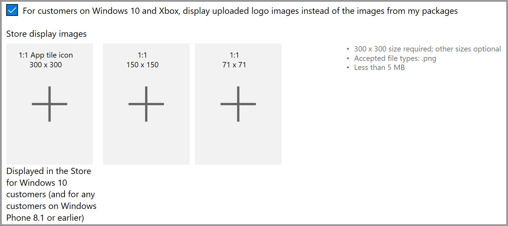
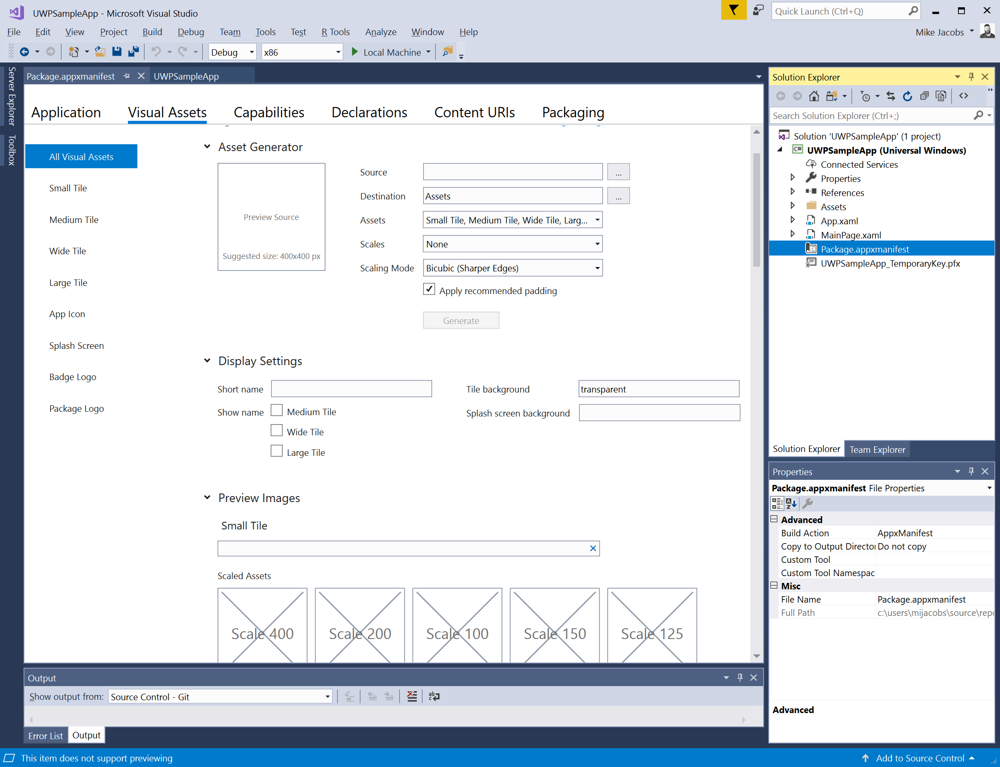
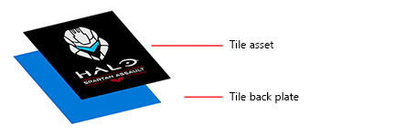

---

Description: How to create app icons/logos that represent your app in the Start menu, app tiles, the taskbar, the Microsoft Store, and more. 
title: App icons and logos
template: detail.hbs

ms.date: 04/17/2018
ms.topic: article
keywords: windows 10, uwp
design-contact: Judysa
doc-status: Published
ms.localizationpriority: medium
ms.custom: RS5
---

# App icons and logos 

Every app has an icon/logo that represents it, and that icon appears in multiple locations in the Windows shell: 

:::row:::
    :::column:::
        * The title bar of your app window
        * The app list in the start menu
        * The taskbar and task manager
        * Your app's tiles
        * Your app's splash screen
        * In the Microsoft Store
    :::column-end:::
    :::column:::
        
    :::column-end:::
:::row-end:::

This article covers the basics of creating app icons, how to use Visual Studio to manage them, and how manage them manually, should you need to.
 
(This article is specifically for icons that represent the app itself; for general icon guidance, see the [Icons](icons.md) article.)

## Icon types, locations, and scale factors

By default, Visual Studio stores your icon assets in an assets subdirectory. Here's a list of the different types of icons, where they appear, and what they're called. 

| Icon name | Appears in | Asset file name |
| ---      | ---        | --- |
| Small tile | Start menu |  SmallTile.png  |
| Medium tile |Start menu,  Microsoft Store listing\*  |  Square150x150Logo.png |
| Wide tile  | Start menu   | Wide310x150Logo.png |
| Large tile   | Start menu,  Microsoft Store listing\* |  LargeTile.png  |
| App icon | App list in start menu, task bar, task manager | Square44x44Logo.png |
| Splash screen | The app's splash screen | SplashScreen.png  |
| Badge logo | Your app's tiles | BadgeLogo.png  |
| Package logo/Store logo | App installer, Partner Center, the "Report an app" option in the Store, the "Write a review" option in the Store | StoreLogo.png  |

\* Used unless you choose to [display only uploaded images in the Store](/windows/uwp/publish/app-screenshots-and-images#display-only-uploaded-logo-images-in-the-store). 

To ensure these icons look sharp on every screen, you can create multiple versions of the same icon for different display scale factors. 

The  scale factor determines the size of UI elements, such as text. Scale factors range from 100% to 400%. Larger values create larger UI elements, making them easier to see on high-DPI displays. 

:::row:::
    :::column:::
        Windows automatically sets the scale factor for each display based on its DPI (dots-per-inch) and the viewing distance of the device. 

        (Users can override the default value by going to the **Settings &gt; Display &gt; Scale and layout** page.)
    :::column-end:::
    :::column:::
        
    :::column-end:::
:::row-end:::  

Because app icon assets are bitmaps and bitmaps don't scale well, we recommend providing a version each icon asset for each scale factor: 100%, 125%, 150%, 200%, and 400%. That's a lot of icons! Fortunatly, Visual Studio provides a tool that makes it easy to generate and update these icons. 

## Microsoft Store listing image

"How do I specify images for my app's listing in the Microsoft Store?"

By default, we use some of the images from your packages in the Store, as described in the table at the top of this page (along with other [images that you provide during the submission process](https://docs.microsoft.com/en-us/windows/uwp/publish/app-screenshots-and-images)). However, you have the option to prevent the Store from using the logo images in your app's packages when displaying your listing to customers on Windows 10 (including Xbox), and instead have the Store use only images that you upload. This gives you more control over your app’s appearance in various displays throughout the Store. (Note that if your product supports earlier OS versions, those customers may still see images from your packages, even if you use this option.) You can do this in the **Store logos** section of the **Store listing** step of the submission process.

When you check this box, a new section called **Store display images** appears. Here, you can upload 3 image sizes that the Store will use in place of logo images from your app’s packages: 300 x 300, 150 x 150, and 71 x 71 pixels. Only the 300 x 300 size is required, although we recommend providing all 3 sizes.

For more info, see [Display only uploaded logo images in the Store](/windows/uwp/publish/app-screenshots-and-images#display-only-uploaded-logo-images-in-the-store).

<!-- ### Fallback images for the Store

The simplest way to control the Store listing image is to specify it during the app submission process. If you don't provide these images during the app submission process, the Store will use a tile image:

1. Large tile
2. Medium tile

If these images aren't provided, the Store will search all matching images of the same image type with a square aspect ratio, preferable with a height greated than the scaled requested height (scaled height is the machine's resolution scale factor * display height). If none of the images meet this criteria, the Store will ignore the scale factor and select an image based on height.  -->

<!-- You can provide screenshots, logos, and other art assets (such as trailers and promotional images to include in your app's Microsoft Store listing. Some of these are required, and some are optional (although some of the optional images are important to include for the best Store display).

The Store may also use your app's tile and other images that you include in your app's package. 

For more information, see [App screenshots, images, and trailers in the Microsoft Store](/windows/uwp/publish/app-screenshots-and-images). -->

## Managing app icons with the Visual Studio Manifest Designer

Visual Studio provides a very useful tool for managing your app icons called the **Manifest Designer**. 

> If you don't already have Visual Studio 2017, there are several versions available, including a free version, (Visual Studio 2017 Community Edition), and the other versions offer free trials. You can download them here: [https://developer.microsoft.com/windows/downloads](https://developer.microsoft.com/windows/downloads)

To launch the Manifest Designer:
<!-- 1. Use Visual Studio to open a UWP project.
2. In the **Solution Explorer**, double-click the package.appmanifest file. 

    

    Visual Studio displays the manifest designer.

    
3. Click the **Visual Assets** tab.

     -->

:::row:::
    :::column:::
        1. Use Visual Studio to open a UWP project.
    :::column-end:::
    :::column:::
        
    :::column-end:::
:::row-end:::
:::row:::
    :::column:::
        2. In the **Solution Explorer**, double-click the Package.appmxanifest file.
    :::column-end:::
    :::column:::
        
    :::column-end:::
:::row-end:::
:::row:::
    :::column:::
            Visual Studio displays the Manifest Designer.
    :::column-end:::
    :::column:::
            
    :::column-end:::
:::row-end:::    
:::row:::
    :::column:::
        3. Click the **Visual Assets** tab.
    :::column-end:::
    :::column:::
        
    :::column-end:::
:::row-end:::        

## Generating all assets at once

The first menu item in the **Visual Assets** tab, **All Visual Assets**, does exactly what its name suggests: generates every visual asset your app needs with the press of a button.

All you need to do is supply a single image, and Visual Studio will generate the small tile, medium tile, large tile, wide tile, large tile, app icon, splash screen, and package logo assets for every scale factor.

To generate all assets at once:
1. Click the **...** next to the **Source** field and select the image you want to use. If you're using a bitmap image, make sure it's at least 400 by 400 pixels so that you get sharp results. Vector-based images work best; Visual Studio lets you use AI (Adobe Illustrator) and PDF files. 
2. (Optional.) In the **Display Settings** section, configure these options:

    a.  **Short name**:  Specify a short name for your app.

    b.  **Show name**: Indicate whether you want to display the short name on medium, wide, or large tiles. 

    c. **Tile background**: Specify the hex value or a color name for the tile background color. For example, `#464646`. The default value is `transparent`.

    d. **Spash screen background**: Specify the hex value or color name for the spash screen background. 

3. Click **Generate**. 

Visual Studio generates your image files and adds them to project. If you want to change your assets, simply repeat the process. 

Scaled icon assets follow this file naming convention:

*filename*-scale-*scale factor*.png

For example,

Square150x150Logo-scale-100.png, Square150x150Logo-scale-200.png, Square150x150Logo-scale-400.png

Notice that Visual Studio doesn't generate a badge logo by default. That's because your badge logo is unique and probably shouldn't match your other app icons. For more info, see the  [Badge notifications for UWP apps article](/windows/uwp/design/shell/tiles-and-notifications/badges). 

## More about app icon assets
Visual Studio will generate all the app icon assets required by your project, but if you'd like to customize them, it helps to understand how they're different from other app assets. 

The app icon asset appears in a lot of places: the Windows taskbar, the task view, ALT+TAB, and the lower-right corner of Start tiles. Because the app icon asset appears in so many places, it has some additional sizing and plating options the other assets don't have: "target-size" assets and "unplated" assets. 

### Target-size app icon assets
In addition to the standard scale factor sizes ("Square44x44Logo.scale-400.png"), we also recommend creating "target-size" assets. We call these assets target-size because they target specific sizes, such as 16 pixels, rather than specific scale factors, such as 400. Target-size assets are for surfaces that don't use the scaling plateau system:

* Start jump list (desktop)
* Start lower corner of tile (desktop)
* Shortcuts (desktop)
* Control Panel (desktop)

Here's the list of target-size assets:

| Asset size | File name example                  |
|------------|------------------------------------|
| 16x16\*    | Square44x44Logo.targetsize-16.png  |
| 24x24\*    | Square44x44Logo.targetsize-24.png  |
| 32x32\*    | Square44x44Logo.targetsize-32.png  |
| 48x48\*    | Square44x44Logo.targetsize-48.png  |
| 256x256\*  | Square44x44Logo.targetsize-256.png |
| 20x20      | Square44x44Logo.targetsize-20.png  |
| 30x30      | Square44x44Logo.targetsize-30.png  |
| 36x36      | Square44x44Logo.targetsize-36.png  |
| 40x40      | Square44x44Logo.targetsize-40.png  |
| 60x60      | Square44x44Logo.targetsize-60.png  |
| 64x64      | Square44x44Logo.targetsize-64.png  |
| 72x72      | Square44x44Logo.targetsize-72.png  |
| 80x80      | Square44x44Logo.targetsize-80.png  |
| 96x96      | Square44x44Logo.targetsize-96.png  |

\* At a minimum, we recommend providing these sizes. 

You don't have to add padding to these assets; Windows adds padding if needed. These assets should account for a minimum footprint of 16 pixels. 

Here's an example of these assets as they appear in icons on the Windows taskbar:

### Unplated assets
By default, Windows uses a target-based asset on top of a colored backplate by default. If you want, you can provide a target-based unplated asset. "Unplated" means the asset will be displayed on a transparent background. Keep in mind that these assets will appear over a variety of background colors. 

Here are the surfaces that use unplated app icon assets:
* Taskbar and taskbar thumbnail (desktop)
* Taskbar jumplist
* Task view
* ALT+TAB

### Target and unplated sizing

Here are the size recommendations for target-based assets, at 100% scale:

## More about splash screen assets
For more info about splash screens, see the [UWP splash screens article](/windows/uwp/launch-resume/splash-screens).

## More about badge logo assets

When you use the asset generator to generate all the assets you need, there's a reason why it doesn't generate badge logos by default: they're very different from other app assets. The badge logo is a status image that appears in notifications and on the app's tiles. 

For more information, see the [Badge notifications for UWP apps article](/windows/uwp/design/shell/tiles-and-notifications/badges).

## Customizing asset padding

By default, Visual Studio asset generator applies recommended padding to whatever image. If your images already contain padding or you want full bleed images that extend to the end of the tile, you can turn this feature off by unchecking the **Apply recommended padding** check box. 

### Tile padding recommendations
If you want to provide your own padding, here are our recommendations for tiles. 

There are 4 tile sizes: small (71 x 71), medium (150 x 150), wide (310 x 150), and large (310 x 310). 

Each tile asset is the same size as the tile on which it is placed.

If you don't want your icon to extend to the edge of the tile, you can use transparent pixels in your asset to create padding. 

For small tiles, limit the icon width and height to 66% of the tile size:

For medium tiles, limit the icon width to 66% and height to 50% of tile size. This prevents overlapping of elements in the branding bar:

For wide tiles, limit the icon width to 66% and height to 50% of tile size. This prevents overlapping of elements in the branding bar:

For large tiles, limit the icon width to 66% and height to 50% of tile size:

Some icons are designed to be horizontally or vertically oriented, while others have more complex shapes that prevent them from fitting squarely within the target dimensions. Icons that appear to be centered can be weighted to one side. In this case, parts of an icon may hang outside the recommended footprint, provided it occupies the same visual weight as a squarely fitted icon:

With full-bleed assets, take into account elements that interact within the margins and edges of the tiles. Maintain margins of at least 16% of the height or width of the tile. This percentage represents double the width of the margins at the smallest tile sizes:

In this example, margins are too tight:

