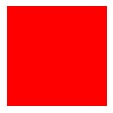
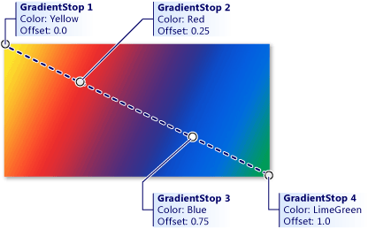
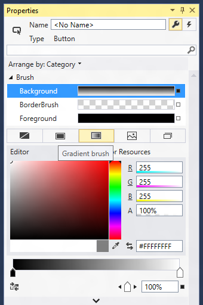
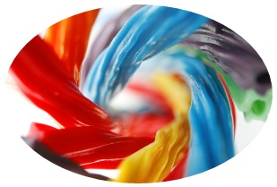

# Using brushes to paint backgrounds, foregrounds, and outlines

Use [**Brush**](/uwp/api/Windows.UI.Xaml.Media.Brush) objects to paint the interiors and outlines of XAML shapes, text, and controls, making them visible in your application UI.

> **Important APIs**:  [Brush class](/uwp/api/Windows.UI.Xaml.Media.Brush)

## Introduction to brushes

To paint a [**Shape**](/uwp/api/Windows.UI.Xaml.Shapes.Shape), text, or parts of a [**Control**](/uwp/api/Windows.UI.Xaml.Controls.Control) that is displayed on the app canvas, set the [**Fill**](/uwp/api/windows.ui.xaml.shapes.shape.fill) property of the **Shape** or the [**Background**](/uwp/api/windows.ui.xaml.controls.control.background) and [**Foreground**](/uwp/api/windows.ui.xaml.controls.control.foreground) properties of a **Control** to a **Brush** value.

The different types of brushes are: 
-   [**AcrylicBrush**](/uwp/api/windows.ui.xaml.media.acrylicbrush)
-   [**SolidColorBrush**](/uwp/api/Windows.UI.Xaml.Media.SolidColorBrush)
-   [**LinearGradientBrush**](/uwp/api/Windows.UI.Xaml.Media.LinearGradientBrush) 
-   [**RadialGradientBrush**](/uwp/api/windows.ui.xaml.media.radialgradientbrush) 
-   [**ImageBrush**](/uwp/api/Windows.UI.Xaml.Media.ImageBrush)
-   [**WebViewBrush**](/uwp/api/Windows.UI.Xaml.Controls.WebViewBrush)
-   [**XamlCompositionBrushBase**](/uwp/api/windows.ui.xaml.media.xamlcompositionbrushbase)

## Solid color brushes

A [**SolidColorBrush**](/uwp/api/Windows.UI.Xaml.Media.SolidColorBrush) paints an area with a single [**Color**](/uwp/api/Windows.UI.Color), such as red or blue. This is the most basic brush. In XAML, there are three ways to define a **SolidColorBrush** and the color it specifies: predefined color names, hexadecimal color values, or the property element syntax.

### Predefined color names

You can use a predefined color name, such as [**Yellow**](/uwp/api/windows.ui.colors.yellow) or [**Magenta**](/uwp/api/windows.ui.colors.magenta). There are 256 available named colors. The XAML parser converts the color name to a [**Color**](/uwp/api/Windows.UI.Color) structure with the correct color channels. The 256 named colors are based on the *X11* color names from the Cascading Style Sheets, Level 3 (CSS3) specification, so you may already be familiar with this list of named colors if you have previous experience with web development or design.

Here's an example that sets the [**Fill**](/uwp/api/windows.ui.xaml.shapes.shape.fill) property of a [**Rectangle**](/uwp/api/Windows.UI.Xaml.Shapes.Rectangle) to the predefined color [**Red**](/uwp/api/windows.ui.colors.red).

```xaml
<Rectangle Width="100" Height="100" Fill="Red" />
```



*SolidColorBrush applied to a Rectangle*

If you are defining a [**SolidColorBrush**](/uwp/api/Windows.UI.Xaml.Media.SolidColorBrush) using code rather than XAML, each named color is available as a static property value of the [**Colors**](https://docs.microsoft.com/uwp/api/windows.ui.colors) class. For example, to declare a [**Color**](/uwp/api/windows.ui.xaml.media.solidcolorbrush.color) value of a **SolidColorBrush** to represent the named color "Orchid", set the **Color** value to the static value [**Colors.Orchid**](/uwp/api/windows.ui.colors.orchid).

### Hexadecimal color values

You can use a hexadecimal format string to declare precise 24-bit color values with 8-bit alpha channel for a [**SolidColorBrush**](/uwp/api/Windows.UI.Xaml.Media.SolidColorBrush). Two characters in the range 0 to F define each component value, and the component value order of the hexadecimal string is: alpha channel (opacity), red channel, green channel, and blue channel (**ARGB**). For example, the hexadecimal value "\#FFFF0000" defines fully opaque red (alpha="FF", red="FF", green="00", and blue="00").

This XAML example sets the [**Fill**](/uwp/api/windows.ui.xaml.shapes.shape.fill) property of a [**Rectangle**](/uwp/api/Windows.UI.Xaml.Shapes.Rectangle) to the hexadecimal value "\#FFFF0000", and gives an identical result to using the named color [**Colors.Red**](/uwp/api/windows.ui.colors.red).

```xml
<StackPanel>
  <Rectangle Width="100" Height="100" Fill="#FFFF0000" />
</StackPanel>
```

### Property element syntax

You can use property element syntax to define a [**SolidColorBrush**](/uwp/api/Windows.UI.Xaml.Media.SolidColorBrush). This syntax is more verbose than the previous methods, but you can specify additional property values on an element, such as the [**Opacity**](/uwp/api/windows.ui.xaml.media.brush.opacity). For more info on XAML syntax, including property element syntax, see the [XAML overview](https://docs.microsoft.com/windows/uwp/xaml-platform/xaml-overview) and [XAML syntax guide](https://docs.microsoft.com/windows/uwp/xaml-platform/xaml-syntax-guide).

In the previous examples, the brush being created is created implicitly and automatically, as part of a deliberate XAML language shorthand that helps keep UI definitions simple for the most common cases. The next example creates a [**Rectangle**](/uwp/api/Windows.UI.Xaml.Shapes.Rectangle) and explicitly creates the [**SolidColorBrush**](/uwp/api/Windows.UI.Xaml.Media.SolidColorBrush) as an element value for a [**Rectangle.Fill**](/uwp/api/windows.ui.xaml.shapes.shape.fill) property. The [**Color**](/uwp/api/windows.ui.xaml.media.solidcolorbrush.color) of the **SolidColorBrush** is set to [**Blue**](/uwp/api/windows.ui.colors.blue) and the [**Opacity**](/uwp/api/windows.ui.xaml.media.brush.opacity) is set to 0.5.

```xml
<Rectangle Width="200" Height="150">
    <Rectangle.Fill>
        <SolidColorBrush Color="Blue" Opacity="0.5" />
    </Rectangle.Fill>
</Rectangle>
```

## Linear gradient brushes

A [**LinearGradientBrush**](/uwp/api/Windows.UI.Xaml.Media.LinearGradientBrush) paints an area with a gradient that's defined along a line. This line is called the *gradient axis*. You specify the gradient's colors and their locations along the gradient axis using [**GradientStop**](/uwp/api/Windows.UI.Xaml.Media.GradientStop) objects. By default, the gradient axis runs from the upper left corner to the lower right corner of the area that the brush paints, resulting in a diagonal shading.

The [**GradientStop**](/uwp/api/Windows.UI.Xaml.Media.GradientStop) is the basic building block of a gradient brush. A gradient stop specifies what the [**Color**](/uwp/api/windows.ui.xaml.media.gradientstop.color) of the brush is at an [**Offset**](/uwp/api/windows.ui.xaml.media.gradientstop.offset) along the gradient axis, when the brush is applied to the area being painted.

The gradient stop's [**Color**](/uwp/api/windows.ui.xaml.media.gradientstop.color) property specifies the color of the gradient stop. You can set the color by using a predefined color name or by specifying the hexadecimal **ARGB** values.

The [**Offset**](/uwp/api/windows.ui.xaml.media.gradientstop.offset) property of a [**GradientStop**](/uwp/api/Windows.UI.Xaml.Media.GradientStop) specifies the position of each **GradientStop** along the gradient axis. The **Offset** is a **double** that ranges from 0 to 1. An **Offset** of 0 places the **GradientStop** at the start of the gradient axis, in other words near its [**StartPoint**](/uwp/api/windows.ui.xaml.media.lineargradientbrush.startpoint). An **Offset** of 1 places the **GradientStop** at the [**EndPoint**](/uwp/api/windows.ui.xaml.media.lineargradientbrush.endpoint). At a minimum, a useful [**LinearGradientBrush**](/uwp/api/Windows.UI.Xaml.Media.LinearGradientBrush) should have two **GradientStop** values, where each **GradientStop** should specify a different [**Color**](/uwp/api/windows.ui.xaml.media.gradientstop.color) and have a different **Offset** between 0 and 1.

This example creates a linear gradient with four colors and uses it to paint a [**Rectangle**](/uwp/api/Windows.UI.Xaml.Shapes.Rectangle).

```xml
<!-- This rectangle is painted with a diagonal linear gradient. -->
<Rectangle Width="200" Height="100">
    <Rectangle.Fill>
        <LinearGradientBrush StartPoint="0,0" EndPoint="1,1">
            <GradientStop Color="Yellow" Offset="0.0" x:Name="GradientStop1"/>
            <GradientStop Color="Red" Offset="0.25" x:Name="GradientStop2"/>
            <GradientStop Color="Blue" Offset="0.75" x:Name="GradientStop3"/>
            <GradientStop Color="LimeGreen" Offset="1.0" x:Name="GradientStop4"/>
        </LinearGradientBrush>
    </Rectangle.Fill>
</Rectangle>
```

The color of each point between gradient stops is linearly interpolated as a combination of the color specified by the two bounding gradient stops. The following image highlights the gradient stops in the previous example. The circles mark the position of the gradient stops, and the dashed line shows the gradient axis.



*Combination of colors specified by the two bounding gradient stops*

You can change the line at which the gradient stops are positioned by setting the [**StartPoint**](/uwp/api/windows.ui.xaml.media.lineargradientbrush.startpoint) and [**EndPoint**](/uwp/api/windows.ui.xaml.media.lineargradientbrush.endpoint) properties to be different values than the `(0,0)` and `(1,1)` starting defaults. By changing the **StartPoint** and **EndPoint** coordinate values, you can create horizontal or vertical gradients, reverse the gradient direction, or condense the gradient spread to apply to a smaller range than the full painted area. To condense the gradient, you set values of **StartPoint** and/or **EndPoint** to be something that is between the values 0 and 1. For example, if you want a horizontal gradient where the fade all happens on the left half of the brush and the right side is solid to your last [**GradientStop**](/uwp/api/Windows.UI.Xaml.Media.GradientStop) color, you specify a **StartPoint** of `(0,0)` and an **EndPoint** of `(0.5,0)`.

### Use tools to make gradients

Now that you know how linear gradients work, you can use Visual Studio or Blend to make creating these gradients easier. To create a gradient, select the object you want to apply a gradient to on the design surface or in XAML view. Expand **Brush** and select the **Linear Gradient** tab.



*Creating a linear gradient in Visual Studio*

Now you can change the colors of the gradient stops and slide their positions using the bar on the bottom. You can also add new gradient stops by clicking on the bar and remove them by dragging the stops off of the bar (see next screenshot).


*Gradient setting slider*

## Radial gradient brushes

A [**RadialGradientBrush**](/uwp/api/windows.ui.xaml.media.radialgradientbrush) is drawn within an ellipse that is defined by the [**Center**](/uwp/api/windows.ui.xaml.media.radialgradientbrush.center), [**RadiusX**](/uwp/api/windows.ui.xaml.media.radialgradientbrush.radiusx), and [**RadiusY**](/uwp/api/windows.ui.xaml.media.radialgradientbrush.radiusy) properties. Colors for the gradient start at the center of the ellipse and end at the radius.

The colors for the radial gradient are defined by color stops added to the [**GradientStops**](/uwp/api/windows.ui.xaml.media.radialgradientbrush.gradientstops) collection property. Each gradient stop specifies a color and an offset along the gradient.

The gradient origin defaults to center and can be offset using the [**GradientOrigin**](/uwp/api/windows.ui.xaml.media.radialgradientbrush.gradientorigin) property.

[MappingMode](/uwp/api/windows.ui.xaml.media.radialgradientbrush.mappingmode) defines whether [**Center**](/uwp/api/windows.ui.xaml.media.radialgradientbrush.center), [**RadiusX**](/uwp/api/windows.ui.xaml.media.radialgradientbrush.radiusx), [**RadiusY**](/uwp/api/windows.ui.xaml.media.radialgradientbrush.radiusy), and [**GradientOrigin**](/uwp/api/windows.ui.xaml.media.radialgradientbrush.gradientorigin) represent relative or absolute coordinates.

When [**MappingMode**](/uwp/api/windows.ui.xaml.media.radialgradientbrush.mappingmode) is set to `RelativeToBoundingBox`, the X and Y values of the three properties are treated as relative to the element bounds, where `(0,0)` represents the top left and `(1,1)` represents the bottom right of the element bounds for the [**Center**](/uwp/api/windows.ui.xaml.media.radialgradientbrush.center), [**RadiusX**](/uwp/api/windows.ui.xaml.media.radialgradientbrush.radiusx), and [**RadiusY**](/uwp/api/windows.ui.xaml.media.radialgradientbrush.radiusy) properties and `(0,0)` represents the center for the [**GradientOrigin**](/uwp/api/windows.ui.xaml.media.radialgradientbrush.gradientorigin) property.

When [**MappingMode**](/uwp/api/windows.ui.xaml.media.radialgradientbrush.mappingmode) is set to `Absolute`, the X and Y values of the three properties are treated as absolute coordinates within the element bounds.

This example creates a linear gradient with four colors and uses it to paint a [**Rectangle**](/uwp/api/Windows.UI.Xaml.Shapes.Rectangle).

```xml
<!-- This rectangle is painted with a radial gradient. -->
<Rectangle Width="200" Height="200">
    <Rectangle.Fill>
        <media:RadialGradientBrush>
            <GradientStop Color="Blue" Offset="0.0" />
            <GradientStop Color="Yellow" Offset="0.2" />
            <GradientStop Color="LimeGreen" Offset="0.4" />
            <GradientStop Color="LightBlue" Offset="0.6" />
            <GradientStop Color="Blue" Offset="0.8" />
            <GradientStop Color="LightGray" Offset="1" />
        </media:RadialGradientBrush>
    </Rectangle.Fill>
</Rectangle>
```

The color of each point between gradient stops is radially interpolated as a combination of the color specified by the two bounding gradient stops. The following image highlights the gradient stops in the previous example. 


*Gradient stops*

## Image brushes

An [**ImageBrush**](/uwp/api/Windows.UI.Xaml.Media.ImageBrush) paints an area with an image, with the image to paint coming from an image file source. You set the [**ImageSource**](/uwp/api/Windows.UI.Xaml.Media.ImageSource) property with the path of the image to load. Typically, the image source comes from a **Content** item that is part of your app's resources.

By default, an [**ImageBrush**](/uwp/api/Windows.UI.Xaml.Media.ImageBrush) stretches its image to completely fill the painted area, possibly distorting the image if the painted area has a different aspect ratio than the image. You can change this behavior by changing the [**Stretch**](/uwp/api/windows.ui.xaml.media.tilebrush.stretch) property from its default value of **Fill** and setting it as **None**, **Uniform**, or **UniformToFill**.

The next example creates an [**ImageBrush**](/uwp/api/Windows.UI.Xaml.Media.ImageBrush) and sets the [**ImageSource**](/uwp/api/Windows.UI.Xaml.Media.ImageSource) to an image named licorice.jpg, which you must include as a resource in the app. The **ImageBrush** then paints the area defined by an [**Ellipse**](/uwp/api/Windows.UI.Xaml.Shapes.Ellipse) shape.

```xml
<Ellipse Height="200" Width="300">
   <Ellipse.Fill>
     <ImageBrush ImageSource="licorice.jpg" />
   </Ellipse.Fill>
</Ellipse>
```



*A rendered ImageBrush*

[**ImageBrush**](/uwp/api/Windows.UI.Xaml.Media.ImageBrush) and [**Image**](/uwp/api/Windows.UI.Xaml.Controls.Image) both reference an image source file by Uniform Resource Identifier (URI), where that image source file uses several possible image formats. These image source files are specified as URIs. For more info about specifying image sources, the usable image formats, and packaging them in an app, see [Image and ImageBrush](https://docs.microsoft.com/windows/uwp/controls-and-patterns/images-imagebrushes).

## Brushes and text

You can also use brushes to apply rendering characteristics to text elements. For example, the [**Foreground**](/uwp/api/windows.ui.xaml.controls.textblock.foreground) property of [**TextBlock**](/uwp/api/Windows.UI.Xaml.Controls.TextBlock) takes a [**Brush**](/uwp/api/Windows.UI.Xaml.Media.Brush). You can apply any of the brushes described here to text. However, be careful with brushes applied to text, as any background might make the text can be unreadable if you use brushes that bleed into the background. Use [**SolidColorBrush**](/uwp/api/Windows.UI.Xaml.Media.SolidColorBrush) for readability of text elements in most cases, unless you want the text element to be mostly decorative.

Even when you use a solid color, make sure that the text color you choose has enough contrast against the background color of the text's layout container. The level of contrast between text foreground and text container background is an accessibility consideration.

## WebViewBrush

A [**WebViewBrush**](/uwp/api/Windows.UI.Xaml.Controls.WebViewBrush) is a special type of brush that can access the content normally viewed in a [**WebView**](/uwp/api/Windows.UI.Xaml.Controls.WebView) control. Instead of rendering the content in the rectangular **WebView** control area, **WebViewBrush** paints that content onto another element that has a [**Brush**](/uwp/api/Windows.UI.Xaml.Media.Brush)-type property for a render surface. **WebViewBrush** isn't appropriate for every brush scenario, but is useful for transitions of a **WebView**. For more info, see [**WebViewBrush**](/uwp/api/Windows.UI.Xaml.Controls.WebViewBrush).

## XamlCompositionBrushBase

[**XamlCompositionBrushBase**](https://docs.microsoft.com/uwp/api/windows.ui.xaml.media.xamlcompositionbrushbase) is a base class used to create custom brushes that use [**CompositionBrush**](https://docs.microsoft.com/uwp/api/Windows.UI.Composition.CompositionBrush) to paint XAML UI elements.

This enables "drop down" interoperation between the Windows.UI.Xaml and Windows.UI.Composition layers as described in the [**Visual Layer overview**](/windows/uwp/composition/visual-layer). 

To create a custom brush, create a new class that inherits from XamlCompositionBrushBase and implements the required methods.

For example, this can be used to apply [**effects**](/uwp/composition/composition-effects) to XAML UIElements using a [**CompositionEffectBrush**](/uwp/api/Windows.UI.Composition.CompositionEffectBrush), such as a **GaussianBlurEffect** or a [**SceneLightingEffect**](/uwp/api/Windows.UI.Composition.Effects.SceneLightingEffect) that controls the reflective properties of a XAML UIElement when being lit by a [**XamlLight**](/uwp/api/windows.ui.xaml.media.xamllight).

For code examples, see [**XamlCompositionBrushBase**](/uwp/api/windows.ui.xaml.media.xamlcompositionbrushbase).

## Brushes as XAML resources

You can declare any brush to be a keyed XAML resource in a XAML resource dictionary. This makes it easy to replicate the same brush values as applied to multiple elements in a UI. The brush values are then shared and applied to any case where you reference the brush resource as a [{StaticResource}](/uwp/xaml-platform/staticresource-markup-extension) usage in your XAML. This includes cases where you have a XAML control template that references the shared brush, and the control template is itself a keyed XAML resource.

## Brushes in code

It's much more typical to specify brushes using XAML than it is to use code to define brushes. This is because brushes are usually defined as XAML resources, and because brush values are often the output of design tools or otherwise as part of a XAML UI definition. Still, for the occasional case where you might want to define a brush using code, all the [**Brush**](/uwp/api/Windows.UI.Xaml.Media.Brush) types are available for code instantiation.

To create a [**SolidColorBrush**](/uwp/api/Windows.UI.Xaml.Media.SolidColorBrush) in code, use the constructor that takes a [**Color**](/uwp/api/Windows.UI.Color) parameter. Pass a value that is a static property of the [**Colors**](/uwp/api/windows.ui.colors) class, like this:

```cs
SolidColorBrush blueBrush = new SolidColorBrush(Windows.UI.Colors.Blue);
```

```vb
Dim blueBrush as SolidColorBrush = New SolidColorBrush(Windows.UI.Colors.Blue)
```

```cppwinrt
Windows::UI::Xaml::Media::SolidColorBrush blueBrush{ Windows::UI::Colors::Blue() };
```

```cpp
blueBrush = ref new SolidColorBrush(Windows::UI::Colors::Blue);
```

For [**WebViewBrush**](/uwp/api/Windows.UI.Xaml.Controls.WebViewBrush) and [**ImageBrush**](/uwp/api/Windows.UI.Xaml.Media.ImageBrush), use the default constructor and then call other APIs before you attempt to use that brush for a UI property.

-   [**ImageSource**](/uwp/api/windows.ui.xaml.media.imagebrush.imagesourceproperty) requires a [**BitmapImage**](/uwp/api/Windows.UI.Xaml.Media.Imaging.BitmapImage) (not a URI) when you define an [**ImageBrush**](/uwp/api/Windows.UI.Xaml.Media.ImageBrush) using code. If your source is a stream , use the [**SetSourceAsync**](/uwp/api/windows.ui.xaml.media.imaging.bitmapsource.setsourceasync) method to initialize the value. If your source is a URI, which includes content in your app that uses the **ms-appx** or **ms-resource** schemes, use the [**BitmapImage**](/uwp/api/windows.ui.xaml.media.imaging.bitmapimage) constructor that takes a URI. You might also consider handling the [**ImageOpened**](/uwp/api/windows.ui.xaml.media.imagebrush.imageopened) event if there are any timing issues with retrieving or decoding the image source, where you might need alternate content to display until the image source is available.
-   For [**WebViewBrush**](/uwp/api/Windows.UI.Xaml.Controls.WebViewBrush) you might need to call [**Redraw**](/uwp/api/windows.ui.xaml.controls.webviewbrush.redraw) if you've recently reset the [**SourceName**](/uwp/api/windows.ui.xaml.controls.webviewbrush.sourcename) property or if the content of the [**WebView**](/uwp/api/Windows.UI.Xaml.Controls.WebView) is also being changed with code.

For code examples, see [**WebViewBrush**](/uwp/api/Windows.UI.Xaml.Controls.WebViewBrush),  [**ImageBrush**](/uwp/api/Windows.UI.Xaml.Media.ImageBrush), and [**XamlCompositionBrushBase**](/uwp/api/windows.ui.xaml.media.xamlcompositionbrushbase).
 

 


