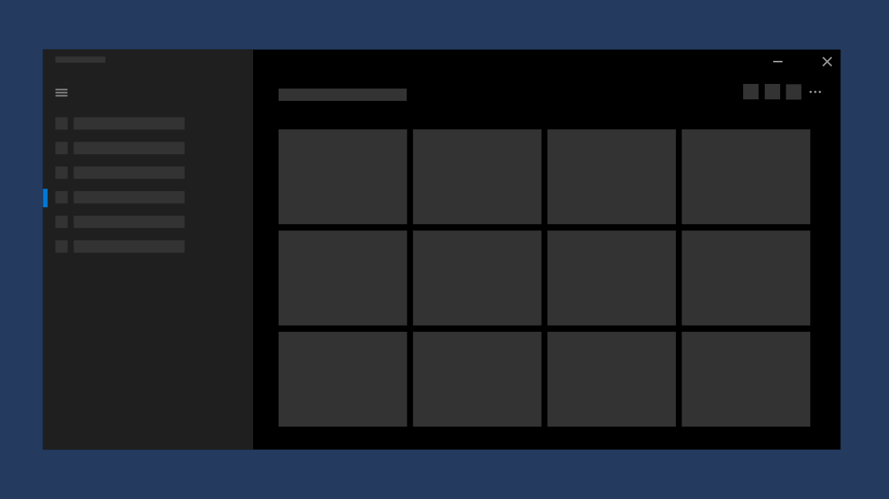
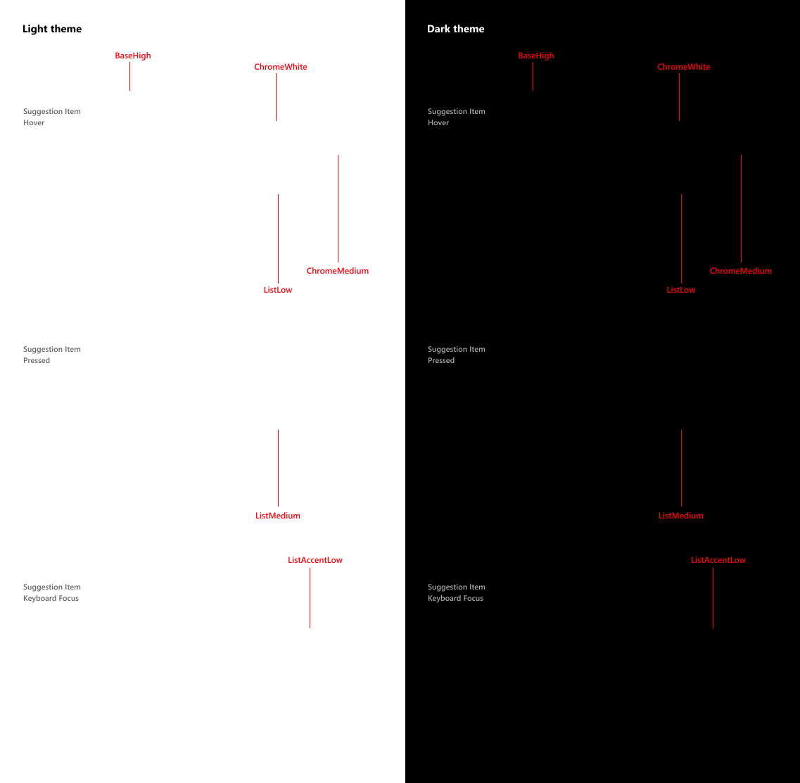
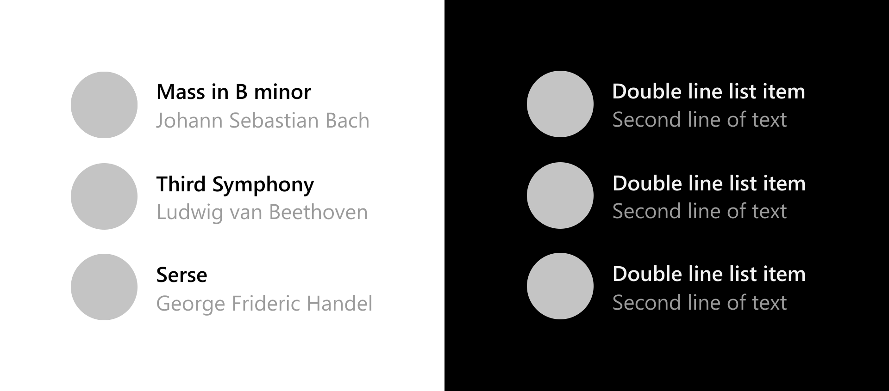
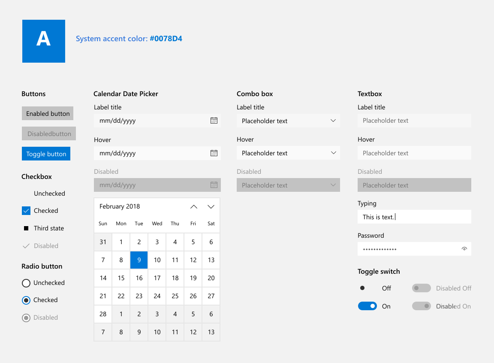
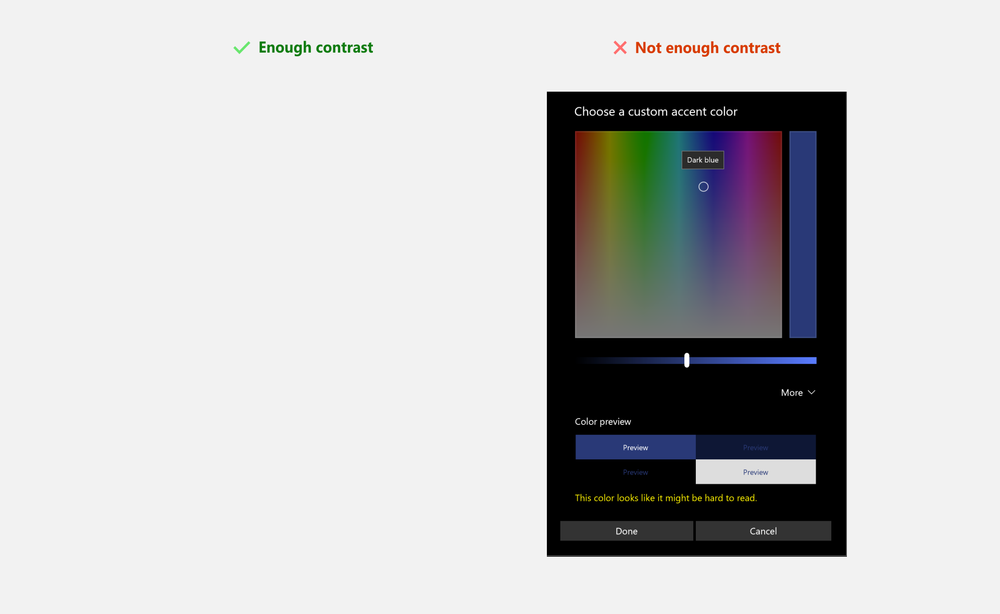

# Color


Color provides an intuitive way of communicating information to users in your app: it can be used to indicate interactivity, give feedback to user actions, and give your interface a sense of visual continuity. 

In UWP apps, colors are primarily determined by accent color and theme. In this article, we'll discuss how you can use color in your app, and how to use accent color and theme resources to make your UWP app usable in any theme context. 

## Color principles

:::row:::
    :::column:::
        **Use color meaningfully.**
        When color is used sparingly to highlight important elements, it can help create a user interface that is fluid and intuitive.
    :::column-end:::
    :::column:::
        **Use color to indicate interactivity.**
        It's a good idea to choose one color to indicate elements of your application that are interactive. For example, many web pages use blue text to denote a hyperlink.
    :::column-end:::
:::row-end:::

:::row:::
    :::column:::
        **Color is personal.**
        In Windows, users can choose an accent color and a light or dark theme, which are reflected throughout their experience. You can choose how to incorporate the user's accent color and theme into your application, personalizing their experience.
    :::column-end:::
    :::column:::
        **Color is cultural.**
        Consider how the colors you use will be interpreted by people from different cultures. For example, in some cultures the color blue is associated with virtue and protection, while in others it represents mourning.
    :::column-end:::
:::row-end:::

## Themes

UWP apps can use a light or dark application theme. The theme affects the colors of the app's background, text, icons, and [common controls](../controls-and-patterns/index.md).

### Light theme


### Dark theme



By default, your UWP app's theme is the user’s theme preference from Windows Settings or the device's default theme (i.e., dark on XBox). However, you can set the theme for your UWP app. 

### Changing the theme

You can change themes by changing the **RequestedTheme** property in your `App.xaml` file.

```XAML
<Application
    x:Class="App9.App"
    xmlns="http://schemas.microsoft.com/winfx/2006/xaml/presentation"
    xmlns:x="http://schemas.microsoft.com/winfx/2006/xaml"
    xmlns:local="using:App9"
    RequestedTheme="Dark">
</Application>
```

Removing the **RequestedTheme** property means that your application will use the user’s system settings.

Users can also select the high contrast theme, which uses a small palette of contrasting colors that makes the interface easier to see. In that case, the system will override your RequestedTheme.

### Testing themes

If you don't request a theme for your app, make sure to test your app in both light and dark themes to ensure that your app will be legible in all conditions.

**Note**: In Visual Studio, the default RequestedTheme is light, so you'll need to change the RequestedTheme to test both.

## Theme brushes

Common controls automatically use [theme brushes](../controls-and-patterns/xaml-theme-resources.md#the-xaml-color-ramp-and-theme-dependent-brushes) to adjust contrast for light and dark themes.

For example, here's an illustration of how the [AutoSuggestBox](../controls-and-patterns/auto-suggest-box.md) uses theme brushes:



The theme brushes are used for the following purposes:

- **Base** is for text.
- **Alt** is the inverse of Base.
- **Chrome** is for top-level elements, such as navigation panes or command bars.
- **List** is for list controls.

**Low**/**Medium**/**High** refer to the intensity of the color.

### Using theme brushes

:::row:::
    :::column:::
        When creating templates for custom controls, use theme brushes rather than hard code color values. This way, your app can easily adapt to any theme.

        For example, these [item templates for ListView](../controls-and-patterns/item-templates-listview.md) demonstrate how to use theme brushes in a custom template.
    :::column-end:::
    :::column:::
         
    :::column-end:::
:::row-end:::

```xaml
<ListView ItemsSource="{x:Bind ViewModel.Recordings}">
    <ListView.ItemTemplate>
        <DataTemplate x:Name="DoubleLineDataTemplate" x:DataType="local:Recording">
            <StackPanel Orientation="Horizontal" Height="64" AutomationProperties.Name="{x:Bind CompositionName}">
                <Ellipse Height="48" Width="48" VerticalAlignment="Center">
                    <Ellipse.Fill>
                        <ImageBrush ImageSource="Placeholder.png"/>
                    </Ellipse.Fill>
                </Ellipse>
                <StackPanel Orientation="Vertical" VerticalAlignment="Center" Margin="12,0,0,0">
                    <TextBlock Text="{x:Bind CompositionName}"  Style="{ThemeResource BaseTextBlockStyle}" Foreground="{ThemeResource SystemControlPageTextBaseHighBrush}" />
                    <TextBlock Text="{x:Bind ArtistName}" Style="{ThemeResource BodyTextBlockStyle}" Foreground="{ThemeResource SystemControlPageTextBaseMediumBrush}"/>
                </StackPanel>
            </StackPanel>
        </DataTemplate>
    </ListView.ItemTemplate>
</ListView>
```

For more information about how to use theme brushes in your app, see [Theme Resources](../controls-and-patterns/xaml-theme-resources.md).

## Accent color

Common controls use an accent color to convey state information. By default, the accent color is the `SystemAccentColor` that users select in their Settings. However, you can also customize your app's accent color to reflect your brand.



:::row:::
    :::column:::
        
        
    :::column-end:::
    :::column:::
        
        
    :::column-end:::
:::row-end:::

### Overriding the accent color

To change your app's accent color, place the following code in `app.xaml`.

```xaml
<Application.Resources>
    <ResourceDictionary>
        <Color x:Key="SystemAccentColor">#107C10</Color>
    </ResourceDictionary>
</Application.Resources>
```

### Choosing an accent color

If you select a custom accent color for your app, please make sure that text and backgrounds that use the accent color have sufficient contrast for optimal readability. To test contrast, you can use the color picker tool in Windows Settings, or you can use these [online contrast tools](https://www.w3.org/TR/WCAG20-TECHS/G18.html#G18-resources).



## Accent color palette

An accent color algorithm in the Windows shell generates light and dark shades of the accent color.


These shades can be accessed as [theme resources](../controls-and-patterns/xaml-theme-resources.md):

- `SystemAccentColorLight3`
- `SystemAccentColorLight2`
- `SystemAccentColorLight1`
- `SystemAccentColorDark1`
- `SystemAccentColorDark2`
- `SystemAccentColorDark3`

<!-- check this is true -->
You can also access the accent color palette programmatically with the [**UISettings.GetColorValue**](https://docs.microsoft.com/uwp/api/Windows.UI.ViewManagement.UISettings#Windows_UI_ViewManagement_UISettings_GetColorValue_Windows_UI_ViewManagement_UIColorType_) method and [**UIColorType**](https://docs.microsoft.com/uwp/api/Windows.UI.ViewManagement.UIColorType) enum.

You can use the accent color palette for color theming in your app. Below is an example of how you can use the accent color palette on a button.


```xaml
<Page.Resources>
    <ResourceDictionary>
        <ResourceDictionary.ThemeDictionaries>
            <ResourceDictionary x:Key="Light">
                <SolidColorBrush x:Key="ButtonBackground" Color="{ThemeResource SystemAccentColor}"/>
                <SolidColorBrush x:Key="ButtonBackgroundPointerOver" Color="{ThemeResource SystemAccentColorLight1}"/>
                <SolidColorBrush x:Key="ButtonBackgroundPressed" Color="{ThemeResource SystemAccentColorDark1}"/>
            </ResourceDictionary>
        </ResourceDictionary.ThemeDictionaries>
    </ResourceDictionary>
</Page.Resources>

<Button Content="Button"></Button>
```

When using colored text on a colored background, make sure there is enough contrast between text and background. By default, hyperlink or hypertext will use the accent color. If you apply variations of the accent color to the background, you should use a variation of the original accent color to optimize the contrast of colored text on a colored background.

The chart below illustrates an example of the various light/dark shades of accent color, and how colored type can be applied on a colored surface.


For more information about styling controls, see [XAML styles](../controls-and-patterns/xaml-styles.md).

## Color API

There are several APIs that can be used to add color to your application. First, the [**Colors**](https://docs.microsoft.com/en-us/uwp/api/windows.ui.colors) class, which implements a large list of predefined colors. These can be accessed automatically with XAML properties. In the example below, we create a button and set the background and foreground color properties to members of the **Colors** class.

```xaml
<Button Background="MediumSlateBlue" Foreground="White">Button text</Button>
```

You can create your own colors from RGB or hex values using the [**Color**](https://docs.microsoft.com/en-us/uwp/api/windows.ui.color) struct in XAML.

```xaml
<Color x:Key="LightBlue">#FF36C0FF</Color>
```

You can also create the same color in code by using the **FromArgb** method.

```csharp
Color LightBlue = Color.FromArgb(255,54,192,255);
```

The letters "Argb" stands for Alpha (opacity), Red, Green, and Blue, which are the four components of a color. Each argument can range from 0 to 255. You can choose to omit the first value, which will give you a default opacity of 255, or 100% opaque.

> [!Note]
> If you're using C++, you must create colors by using the [**ColorHelper**](https://docs.microsoft.com/en-us/uwp/api/windows.ui.colorhelper) class.

The most common use for a **Color** is as an argument for a [**SolidColorBrush**](https://docs.microsoft.com/en-us/uwp/api/windows.ui.xaml.media.solidcolorbrush), which can be used to paint UI elements a single solid color. These brushes are generally defined in a [**ResourceDictionary**](https://docs.microsoft.com/en-us/uwp/api/Windows.UI.Xaml.ResourceDictionary), so they can be reused for multiple elements.

```xaml
<ResourceDictionary>
    <SolidColorBrush x:Key="ButtonBackgroundBrush" Color="#FFFF4F67"/>
    <SolidColorBrush x:Key="ButtonForegroundBrush" Color="White"/>
</ResourceDictionary>
```

For more information on how to use brushes, see [XAML brushes](brushes.md).

## Usability

:::row:::
    :::column:::
        
    :::column-end:::
    :::column span="2":::
        **Contrast**

        Make sure that elements and images have sufficient contrast to differentiate between them, regardless of the accent color or theme.

        When considering what colors to use in your application, accessiblity should be a primary concern. Use the guidance below to make sure your application is accessible to as many users as possible.
    :::column-end:::
:::row-end:::

:::row:::
    :::column:::
        
    :::column-end:::
    :::column span="2":::
        **Lighting**

        Be aware that variation in ambient lighting can affect the useability of your app. For example, a page with a black background might unreadable outside due to screen glare, while a page with a white background might be painful to look at in a dark room.
    :::column-end:::
:::row-end:::

:::row:::
    :::column:::
        
    :::column-end:::
    :::column span="2":::
        **Colorblindness**

        Be aware of how colorblindness could affect the useability of your application. For example, a user with red-green colorblindness will have difficulty distinguishing red and green elements from each other. About **8 percent of men** and **0.5 percent of women** are red-green colorblind, so avoid using these color combinations as the sole differentiator between application elements.
    :::column-end:::
:::row-end:::

## Related articles

- [XAML Styles](../controls-and-patterns/xaml-styles.md)
- [XAML Theme Resources](../controls-and-patterns/xaml-theme-resources.md)