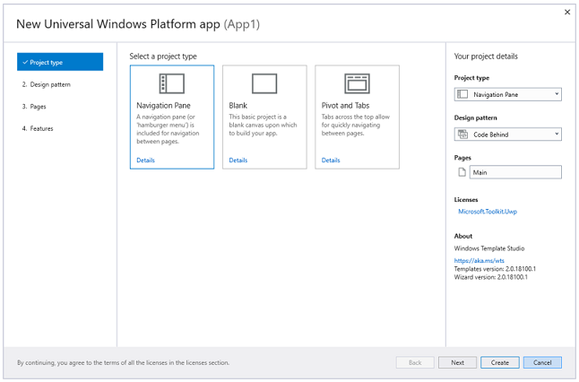
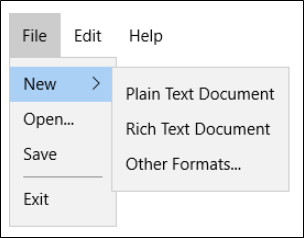

# Enterprise

This article provides an overview of key enterprise features provided by the Universal Windows Platform (UWP) for Windows 10 apps. For a video that demonstrates some of these features in detail, see [Rapidly Construct LOB Applications with UWP and Visual Studio](https://channel9.msdn.com/Events/Build/2018/BRK3502).

<a id="template-studio" />

### Windows Template Studio

Windows Template Studio is a Visual Studio 2017 Extension that accelerates the creation of new Universal Windows Platform (UWP) apps using a wizard-based experience. The resulting UWP project is well-formed, readable code that incorporates the latest Windows 10 features while implementing proven patterns and best practices.

See [Windows Template Studio](https://marketplace.visualstudio.com/items?itemName=WASTeamAccount.WindowsTemplateStudio)

<a id="desktop-style-UI" />

### Controls to create desktop-style UIs

We've released new UWP XAML controls that fill the gap between a traditional desktop application UI and a UWP UI.

For example, the new [MenuBar](/windows/uwp/design/controls-and-patterns/menus), [DropDownButton](/windows/uwp/design/controls-and-patterns/buttons#create-a-drop-down-button), [SplitButton](/windows/uwp/design/controls-and-patterns/buttons#create-a-split-button), and [CommandBarFlyout](/windows/uwp/design/controls-and-patterns/command-bar-flyout) controls give you more flexible ways to expose commands, and the [EditableComboBox](/windows/uwp/design/controls-and-patterns/combo-box#make-a-combo-box-editable) let's the user enter values that aren't listed in a pre-defined list of options.

<a id="enterprise" />

### Controls to support enterprise scenarios

The [DataGridView](https://docs.microsoft.com/en-us/windows/communitytoolkit/controls/datagrid) provides a flexible way to display a collection of data in rows and columns.

The [TreeView](https://docs.microsoft.com/windows/uwp/design/controls-and-patterns/tree-view) enables a hierarchical list with expanding and collapsing nodes that contain nested items. It can be used to illustrate a folder structure or nested relationships in your UI.

### Windows UI Library

The Windows UI Library is a set of NuGet packages that provide controls and other user interface elements for UWP apps. It also enables down-level compatibility with earlier versions of Windows 10, so your app works even if users don't have the latest OS.

See [Windows UI Library (Preview version)](https://docs.microsoft.com/uwp/toolkits/winui/).

<a id="xaml-islands" />

### UWP controls in desktop applications

Windows 10 now enables you to use UWP controls in WPF, Windows Forms, and C++ Win32 desktop applications. This means that you can enhance the look, feel, and functionality of your existing desktop applications with the latest Windows 10 UI features that are only available via UWP controls, such as Windows Ink and controls that support the Fluent Design System. This feature is called XAML islands.

See [UWP controls in desktop applications](https://docs.microsoft.com/windows/uwp/xaml-platform/xaml-host-controls).

<a id="standard" />

### .NET Standard 2.0

The .NET Standard includes over 20,000 more APIs than .NET Standard 1.x. This makes it so much easier to migrate existing .NET Framework libraries and then use them across different .NET applications including your UWP application.

See [Share code between a desktop app and a UWP app](https://docs.microsoft.com/windows/uwp/porting/desktop-to-uwp-migrate).

<a id="sql-server" />

### SQL Server connectivity

Your app can connect directly to a SQL Server database and then store and retrieve data by using classes in the [System.Data.SqlClient](https://docs.microsoft.com/dotnet/api/system.data.sqlclient?redirectedfrom=MSDN&view=netframework-4.7.2) namespace.

See [Use a SQL Server database in a UWP app](https://docs.microsoft.com/en-us/windows/uwp/data-access/sql-server-databases).

<a id="MSIX" />

### MSIX deployment

MSIX is the Windows app package format that provides a modern packaging experience to all Windows apps. The MSIX package format preserves the functionality of existing app packages and install files in addition to enabling new, modern packaging and deployment features to Win32, WPF, and Windows Forms apps.

MSIX is a packaging format built to be safe, secure and reliable, based on a combination of .msi, .appx, App-V and ClickOnce installation technologies.

See [MSIX documentation](https://docs.microsoft.com/windows/msix/).

<a id="distribution" />

## Security

Windows 10 provides a suite of security features for app developers to protect the identity of their users, the security of corporate networks, and any business data stored on devices. New for Windows 10 is Microsoft Passport, an easy-to-deploy two-factor password alternative that is accessible by using a PIN or Windows Hello, which provides enterprise grade security and supports fingerprint, facial, and iris based recognition.

| Topic | Description |
|-------|-------------|
| [Intro to secure Windows app development](https://docs.microsoft.com/windows/uwp/security/intro-to-secure-windows-app-development) | This introductory article explains various Windows security features across the stages of authentication, data-in-flight, and data-at-rest. It also describes how you can integrate those stages into your apps. It covers a large range of topics, and is aimed primarily at helping app architects better understand the Windows features that make creating Universal Windows   Platform apps quick and easy. |
| [Authentication and user identity](https://docs.microsoft.com/windows/uwp/security/authentication-and-user-identity) | UWP apps have several options for user authentication which are outlined in this article. For the enterprise, the new Microsoft Passport feature is strongly recommended. Microsoft Passport replaces passwords with strong   two-factor authentication (2FA) by verifying existing credentials and by creating a device-specific credential that a biometric or PIN-based user gesture protects, resulting in a both convenient and highly secure experience. |
| [Cryptography](https://docs.microsoft.com/windows/uwp/security/cryptography) | The cryptography section provides an overview of the cryptography features available to UWP apps. Articles range from introductory walkthroughs on how to easily encrypt sensitive business data, to advanced to advanced topics such as manipulating cryptographic keys and working with MACs, hashes, and signatures. |
| [Windows Information Protection (WIP)](wip-hub.md) | This is a hub topic covering the full developer picture of how Windows Information Protection (WIP) relates to files, buffers, clipboard, networking, background tasks, and data protection under lock. |

## Data binding and databases

Data binding is a way for your app's UI to display data from an external source, such as a database, and optionally to stay in sync with that data. Data binding allows you to separate the concern of data from the concern of UI, and that results in a simpler conceptual model as well as better readability, testability, and maintainability of your app.

| Topic | Description |
|-------|-------------|
| [Data binding overview](https://docs.microsoft.com/windows/uwp/data-binding/data-binding-quickstart) | This topic shows you how to bind a control (or other UI element) to a   single item or bind an items control to a collection of items in a Universal Windows Platform (UWP) app. In addition, it shows how to control the rendering of items, implement a details view based on a selection, and convert data for display. |
| [Entity Framework 7 for UWP](https://docs.microsoft.com/windows/uwp/data-access/entity-framework-7-with-sqlite-for-csharp-apps) | Performing complex queries against large data sets is vastly simplified using Entity Framework 7, which supports UWP. In this walkthrough, you will build a UWP app that performs basic data access against a local SQLite   database using Entity Framework. |
| [SQLite local database](https://channel9.msdn.com/Series/A-Developers-Guide-to-Windows-10/10) | This video is a comprehensive developer's guide to using SQLite, the recommended solution for local app databases. Visit [SQLite](https://www.sqlite.org/download.html) to download the latest version for UWP, or use the version that's already provided with the Windows 10 SDK. |

## Networking and data serialization

Line-of-business apps often need to communicate with or store data on a variety of other systems. This is typically accomplished by connecting to a network service (using protocols such as REST or SOAP) and then serializing or deserializing data into a common format. Working with networks and data serialization in UWP apps similar to WPF, WinForms, and ASP.NET applications. See the following articles for more information.

| Topic | Description |
|-------|-------------|
| [Networking basics](https://docs.microsoft.com/windows/uwp/networking/networking-basics) | This walkthrough explains basic networking concepts relevant to all UWP apps, regardless of the communication protocols in use.  |
| [Which networking technology?](https://docs.microsoft.com/windows/uwp/networking/which-networking-technology) | A quick overview of the networking technologies available for UWP apps, with suggestions on how to choose the technologies that are the best fit for your app. |
| [XML and SOAP serialization](https://docs.microsoft.com/dotnet/framework/serialization/xml-and-soap-serialization) | XML serialization converts objects into an XML stream that conforms to a   specific XML Schema definition language (XSD). To convert between XML and a strongly-typed class, you can use the native [XDocument](https://docs.microsoft.com/dotnet/api/system.xml.linq.xdocument?redirectedfrom=MSDN) class, or an external library. |
| [JSON serialization](https://docs.microsoft.com/uwp/api/Windows.Data.Json) | JSON (JavaScript object notation) serialization is a popular format for   communicating with REST APIs. The [Newtonsoft Json.NET](https://www.newtonsoft.com/json), which is fully supported for UWP apps. |

## Devices

In order to integrate with line-of-business tools, like printers, barcode scanners, or smart card readers, you may find it necessary to integrate external devices or sensors into your app. Here are some examples of features that you can add to your app using the technology described in this section.

| Topic  | Description |
|--------|-------------|
| [Enumerate devices](https://docs.microsoft.com/windows/uwp/devices-sensors/enumerate-devices) | This article explains how to use the [Windows.Devices.Enumeration](https://docs.microsoft.com/uwp/api/Windows.Devices.Enumeration) namespace to find devices that are internally connected to the system, externally connected, or detectable over wireless or networking protocols. Start here if you're building any app that works with devices. |
| [Printing and scanning](https://docs.microsoft.com/windows/uwp/devices-sensors/printing-and-scanning) | Describes how to print and scan from your app, including connecting to   and working with business devices like point-of-sale (POS) systems, receipt printers, and high-capacity feeder scanners. |
| [Bluetooth](https://docs.microsoft.com/windows/uwp/devices-sensors/bluetooth) | In addition to using traditional Bluetooth connections to send and receive data or control devices, Windows 10 enables using Bluetooth Low Energy (BTLE) to send or receive beacons in the background. Use this to display notifications or enable functionality when a user gets close to or leaves a particular location. |
| [Enterprise shared storage](enterprise-shared-storage.md) | In device lockdown scenarios, learn how data can be shared within the same app, between instances of an app, or even between apps. |

## Device targeting

Many users today are bringing their own phone or tablet to work, which have varying form factors and screen sizes. With the Universal Windows Platform (UWP), you can write a single line-of-business app that runs seamlessly on all different types of devices, including desktop PCs and PPI displays, allowing you to maximize the reach of your app and the efficiency of your code.

| Topic | Description |
|-------|-------------|
| [Guide to UWP apps](https://docs.microsoft.com/windows/uwp/get-started/universal-application-platform-guide) | In this introductory guide, you'll get acquainted with the Windows 10UWP platform, including: what a device family is and how to decide which one to target, new UI controls and panels that allow you to adapt your UI to different device form factors, and how to understand and control the API surface that is available to your app. |
| [Adaptive XAML UI code sample](https://go.microsoft.com/fwlink/p/?LinkId=619992) | This code sample shows all the possible layout options and controls for   your app, regardless of device type, and allows you to interact with the panels to show how to achieve any layout you are looking for. In addition to showing how each control responds to different form factors, the app itself is responsive and shows various methods for achieving adaptive UI. |
| [Xamarin topic](/xamarin/) | Xamarin for targeting phone |

## Deployment

You have options for distributing apps to your organization’s users. You can use Microsoft Store for Business, existing mobile device management or you can sideload apps to devices. You can also make your apps available to the general public by publishing to the Microsoft Store.

| Topic | Description |
|-------|-------------|
| [Distribute LOB apps to enterprises](https://docs.microsoft.com/windows/uwp/publish/distribute-lob-apps-to-enterprises) | You can publish line-of-business apps directly to enterprises for volume acquisition via the Microsoft Store for Business, without making the apps broadly available to the public. |
| [Sideload apps](https://technet.microsoft.com/library/mt269549) | When you sideload an app, you deploy a signed app package to a device. You maintain the signing, hosting, and deployment of these apps. The process for sideloading apps is streamlined for Windows 10.             |
| [Publish apps to the Microsoft Store](https://dev.windows.com/publish) | The unified Microsoft Store lets you publish and manage all of your apps for all Windows devices. Customize your app’s availability with per-market pricing, distribution and visibility controls, and other options. |

## Enterprise UWP samples

| Topic |  Description |
|------ |--------------|
| [VanArsdel Inventory Sample](https://github.com/Microsoft/InventorySample) | A UWP sample app that showcases line-of-business scenarios. The sample is based around creating and managing customer, orders, and products for the fictitious company VanArsdel. |
| [Customer Orders Database Sample](https://github.com/Microsoft/Windows-appsample-customers-orders-database) | A UWP sample app that showcases features useful to enterprise developers, like Azure Active Directory (AAD) authentication, UI controls (including a data grid), Sqlite and SQL Azure database integration, Entity Framework, and cloud API services. The sample is based around creating and managing customer accounts, orders, and products for the fictitious company Contoso. |

## Patterns and practices

Code bases for large scale, enterprise-grade apps can become unwieldy. Prism is a framework for building loosely coupled, maintainable, and testable XAML applications in WPF, Windows 10 UWP, and Xamarin Forms. Prism provides an implementation of a collection of design patterns that are helpful in writing well-structured and maintainable XAML applications, including MVVM, dependency injection, commands, EventAggregator, and others.

For more information on Prism, see the [GitHub repo](https://github.com/PrismLibrary/Prism).

 

 
