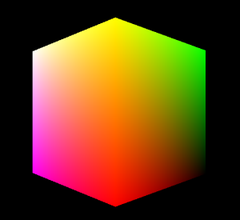

# Port a simple OpenGL ES 2.0 renderer to Direct3D 11


For this porting exercise, we'll start with the basics: bringing a simple renderer for a spinning, vertex-shaded cube from OpenGL ES 2.0 into Direct3D, such that it matches the DirectX 11 App (Universal Windows) template from Visual Studio 2015. As we walk through this port process, you will learn the following:

-   How to port a simple set of vertex buffers to Direct3D input buffers
-   How to port uniforms and attributes to constant buffers
-   How to configure Direct3D shader objects
-   How basic HLSL semantics are used in Direct3D shader development
-   How to port very simple GLSL to HLSL

This topic starts after you have created a new DirectX 11 project. To learn how to create a new DirectX 11 project, read [Create a new DirectX 11 project for Universal Windows Platform (UWP)](user-interface.md).

The project created from either of these links has all the code for the [Direct3D](https://msdn.microsoft.com/library/windows/desktop/ff476345) infrastructure prepared, and you can immediately start into the process of porting your renderer from Open GL ES 2.0 to Direct3D 11.

This topic walks two code paths that perform the same basic graphics task: display a rotating vertex-shaded cube in a window. In both cases, the code covers the following process:

1.  Creating a cube mesh from hardcoded data. This mesh is represented as a list of vertices, with each vertex possessing a position, a normal vector, and a color vector. This mesh is put into a vertex buffer for the shading pipeline to process.
2.  Creating shader objects to process the cube mesh. There are two shaders: a vertex shader that processes the vertices for rasterization, and a fragment (pixel) shader that colors the individual pixels of the cube after rasterization. These pixels are written into a render target for display.
3.  Forming the shading language that is used for vertex and pixel processing in the vertex and fragment shaders, respectively.
4.  Displaying the rendered cube on the screen.



Upon completing this walkthrough, you should be familiar with the following basic differences between Open GL ES 2.0 and Direct3D 11:

-   The representation of vertex buffers and vertex data.
-   The process of creating and configuring shaders.
-   Shading languages, and the inputs and outputs to shader objects.
-   Screen drawing behaviors.

In this walkthrough, we refer to an simple and generic OpenGL renderer structure, which is defined like this:

``` syntax
typedef struct 
{
    GLfloat pos[3];        
    GLfloat rgba[4];
} Vertex;

typedef struct
{
  // Integer handle to the shader program object.
  GLuint programObject;

  // The vertex and index buffers
  GLuint vertexBuffer;
  GLuint indexBuffer;

  // Handle to the location of model-view-projection matrix uniform
  GLint  mvpLoc; 
   
  // Vertex and index data
  Vertex  *vertices;
  GLuint   *vertexIndices;
  int       numIndices;

  // Rotation angle used for animation
  GLfloat   angle;

  GLfloat  mvpMatrix[4][4]; // the model-view-projection matrix itself
} Renderer;
```

This structure has one instance and contains all the necessary components for rendering a very simple vertex-shaded mesh.

> **Note**  Any OpenGL ES 2.0 code in this topic is based on the Windows API implementation provided by the Khronos Group, and uses Windows C programming syntax.

 

## What you need to know


### Technologies

-   [Microsoft Visual C++](http://msdn.microsoft.com/library/vstudio/60k1461a.aspx)
-   OpenGL ES 2.0

### Prerequisites

-   Optional. Review [Port EGL code to DXGI and Direct3D](moving-from-egl-to-dxgi.md). Read this topic to better understand the graphics interface provided by DirectX.

## <span id="keylinks_steps_heading"></span>Steps


<table>
<colgroup>
<col width="50%" />
<col width="50%" />
</colgroup>
<thead>
<tr class="header">
<th align="left">Topic</th>
<th align="left">Description</th>
</tr>
</thead>
<tbody>
<tr class="odd">
<td align="left"><p>[Port the shader objects](port-the-shader-config.md)</p></td>
<td align="left"><p>When porting the simple renderer from OpenGL ES 2.0, the first step is to set up the equivalent vertex and fragment shader objects in Direct3D 11, and to make sure that the main program can communicate with the shader objects after they are compiled.</p></td>
</tr>
<tr class="even">
<td align="left"><p>[Port the vertex buffers and data](port-the-vertex-buffers-and-data-config.md)</p></td>
<td align="left"><p>In this step, you'll define the vertex buffers that will contain your meshes and the index buffers that allow the shaders to traverse the vertices in a specified order.</p></td>
</tr>
<tr class="odd">
<td align="left"><p>[Port the GLSL](port-the-glsl.md)</p></td>
<td align="left"><p>Once you've moved over the code that creates and configures your buffers and shader objects, it's time to port the code inside those shaders from OpenGL ES 2.0's GL Shader Language (GLSL) to Direct3D 11's High-level Shader Language (HLSL).</p></td>
</tr>
<tr class="even">
<td align="left"><p>[Draw to the screen](draw-to-the-screen.md)</p></td>
<td align="left"><p>Finally, we port the code that draws the spinning cube to the screen.</p></td>
</tr>
</tbody>
</table>

 

## <span id="additional_resources"></span>Additional resources


-   [Prepare your dev environment for UWP DirectX game development](prepare-your-dev-environment-for-windows-store-directx-game-development.md)
-   [Create a new DirectX 11 project for UWP](user-interface.md)
-   [Map OpenGL ES 2.0 concepts and infrastructure to Direct3D 11](map-concepts-and-infrastructure.md)

 

 


