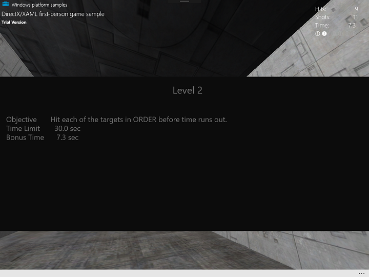

# Extend the sample game

> [!NOTE]
> This topic is part of the [Create a simple Universal Windows Platform (UWP) game with DirectX](tutorial--create-your-first-uwp-directx-game.md) tutorial series. The topic at that link sets the context for the series.

At this point we've covered the key components of a basic Universal Windows Platform (UWP) DirectX 3D game. You can set up the framework for a game, including the view-provider and rendering pipeline, and implement a basic game loop. You can also create a basic user interface overlay, incorporate sounds, and implement controls. You're on your way to creating a game of your own, but if you need more help and info, check out these resources.

-   [DirectX Graphics and Gaming](/windows/desktop/directx)
-   [Direct3D 11 Overview](/windows/desktop/direct3d11/dx-graphics-overviews)
-   [Direct3D 11 Reference](/windows/desktop/direct3d11/d3d11-graphics-reference)

## Using XAML for the overlay

One alternative that we didn't discuss in depth is the use of XAML instead of [Direct2D](/windows/desktop/Direct2D/direct2d-portal) for the overlay. XAML has many benefits over Direct2D for drawing user interface elements. The most important benefit is that it makes incorporating the Windows 10 look and feel into your DirectX game more convenient. Many of the common elements, styles, and behaviors that define a UWP app are tightly integrated into the XAML model, making it far less work for a game developer to implement. If your own game design has a complicated user interface, consider using XAML instead of Direct2D.

With XAML, we can make a game interface that looks similar to the Direct2D one made earlier.

### XAML


### Direct2D


While they have similar end results, there are a number of differences between implementing Direct2D and XAML interfaces.

Feature | XAML| Direct2D
:----------|:----------- | :-----------
Defining overlay | Defined in a XAML file, `\*.xaml`. Once understanding XAML, creating and configuring more complicated overlays are made simpiler when compared to Direct2D.| Defined as a collection of Direct2D primitives and [DirectWrite](/windows/desktop/DirectWrite/direct-write-portal) strings manually placed and written to a Direct2D target buffer. 
User interface elements | XAML user interface elements come from standardized elements that are part of the Windows Runtime XAML APIs, including [**Windows::UI::Xaml**](/uwp/api/Windows.UI.Xaml) and [**Windows::UI::Xaml::Controls**](/uwp/api/Windows.UI.Xaml.Controls). The code that handles the behavior of the XAML user interface elements is defined in a codebehind file, Main.xaml.cpp. | Simple shapes can be drawn like rectangles and ellipses.
Window resizing | Naturally handles resize and view state change events, transforming the overlay accordingly | Need to manually specify how to redraw the overlay's components.

Another big difference involves the [swap chain](/windows/uwp/graphics-concepts/swap-chains). You don't have to attach the swap chain to a [**Windows::UI::Core::CoreWindow**](/uwp/api/windows.ui.core.corewindow) object. Instead, a DirectX app that incorporates XAML associates a swap chain when a new [**SwapChainPanel**](/uwp/api/windows.ui.xaml.controls.swapchainpanel) object is constructed. 

The following snippet show how to declare XAML for the **SwapChainPanel** in the [**DirectXPage.xaml**](https://github.com/Microsoft/Windows-universal-samples/blob/6370138b150ca8a34ff86de376ab6408c5587f5d/Samples/Simple3DGameXaml/cpp/DirectXPage.xaml) file.
```xml
<Page
    x:Class="Simple3DGameXaml.DirectXPage"
    xmlns="http://schemas.microsoft.com/winfx/2006/xaml/presentation"
    xmlns:x="http://schemas.microsoft.com/winfx/2006/xaml"
    xmlns:local="using:Simple3DGameXaml"
    xmlns:d="http://schemas.microsoft.com/expression/blend/2008"
    xmlns:mc="http://schemas.openxmlformats.org/markup-compatibility/2006"
    mc:Ignorable="d">
    <SwapChainPanel x:Name="DXSwapChainPanel">

    <!-- ... XAML user controls and elements -->

    </SwapChainPanel>
</Page>
```

The **SwapChainPanel** object is set as the [**Content**](/uwp/api/Windows.UI.Xaml.Window.Content) property of the current window object created [at launch](https://github.com/Microsoft/Windows-universal-samples/blob/6370138b150ca8a34ff86de376ab6408c5587f5d/Samples/Simple3DGameXaml/cpp/App.xaml.cpp#L45-L51) by the app singleton.

```cpp
void App::OnLaunched(_In_ LaunchActivatedEventArgs^ /* args */)
{
    m_mainPage = ref new DirectXPage();

    Window::Current->Content = m_mainPage;
    // Bring the application to the foreground so that it's visible
    Window::Current->Activate();
}
```

To attach the configured swap chain to the [**SwapChainPanel**](/uwp/api/Windows.UI.Xaml.Controls.SwapChainPanel) instance defined by your XAML, you must obtain a pointer to the underlying native [**ISwapChainPanelNative**](/windows/desktop/api/windows.ui.xaml.media.dxinterop/nn-windows-ui-xaml-media-dxinterop-iswapchainpanelnative) interface implementation and call [**ISwapChainPanelNative::SetSwapChain**](/windows/desktop/api/windows.ui.xaml.media.dxinterop/nf-windows-ui-xaml-media-dxinterop-iswapchainpanelnative-setswapchain) on it, passing it your configured swap chain. 

The following snippet from  [**DX::DeviceResources::CreateWindowSizeDependentResources**](https://github.com/Microsoft/Windows-universal-samples/blob/6370138b150ca8a34ff86de376ab6408c5587f5d/Samples/Simple3DGameXaml/cpp/Common/DeviceResources.cpp#L218-L521) details this for DirectX/XAML interop:

```cpp
        ComPtr<IDXGIDevice3> dxgiDevice;
        DX::ThrowIfFailed(
            m_d3dDevice.As(&dxgiDevice)
            );

        ComPtr<IDXGIAdapter> dxgiAdapter;
        DX::ThrowIfFailed(
            dxgiDevice->GetAdapter(&dxgiAdapter)
            );

        ComPtr<IDXGIFactory2> dxgiFactory;
        DX::ThrowIfFailed(
            dxgiAdapter->GetParent(IID_PPV_ARGS(&dxgiFactory))
            );

        // When using XAML interop, the swap chain must be created for composition.
        DX::ThrowIfFailed(
            dxgiFactory->CreateSwapChainForComposition(
                m_d3dDevice.Get(),
                &swapChainDesc,
                nullptr,
                &m_swapChain
                )
            );

        // Associate swap chain with SwapChainPanel
        // UI changes will need to be dispatched back to the UI thread
        m_swapChainPanel->Dispatcher->RunAsync(CoreDispatcherPriority::High, ref new DispatchedHandler([=]()
        {
            // Get backing native interface for SwapChainPanel
            ComPtr<ISwapChainPanelNative> panelNative;
            DX::ThrowIfFailed(
                reinterpret_cast<IUnknown*>(m_swapChainPanel)->QueryInterface(IID_PPV_ARGS(&panelNative))
                );
            DX::ThrowIfFailed(
                panelNative->SetSwapChain(m_swapChain.Get())
                );
        }, CallbackContext::Any));

        // Ensure that DXGI does not queue more than one frame at a time. This both reduces latency and
        // ensures that the application will only render after each VSync, minimizing power consumption.
        DX::ThrowIfFailed(
            dxgiDevice->SetMaximumFrameLatency(1)
            );
    }
```

For more info about this process, see [DirectX and XAML interop](directx-and-xaml-interop.md).

## Sample

To download the version of this game that uses XAML for the overlay, go to the [Direct3D shooting sample game (XAML)](https://github.com/Microsoft/Windows-universal-samples/tree/master/Samples/Simple3DGameXaml).

Unlike the version of the sample game discussed in the rest of these topics, the XAML version defines its framework in the [App.xaml.cpp](https://github.com/Microsoft/Windows-universal-samples/blob/6370138b150ca8a34ff86de376ab6408c5587f5d/Samples/Simple3DGameXaml/cpp/App.xaml.cpp) and [DirectXPage.xaml.cpp](https://github.com/Microsoft/Windows-universal-samples/blob/6370138b150ca8a34ff86de376ab6408c5587f5d/Samples/Simple3DGameXaml/cpp/DirectXPage.xaml.cpp) files, instead of [App.cpp](https://github.com/Microsoft/Windows-universal-samples/blob/6370138b150ca8a34ff86de376ab6408c5587f5d/Samples/Simple3DGameDX/cpp/App.cpp) and [GameInfoOverlay.cpp](https://github.com/Microsoft/Windows-universal-samples/blob/6370138b150ca8a34ff86de376ab6408c5587f5d/Samples/Simple3DGameDX/cpp/GameInfoOverlay.cpp), respectively.
