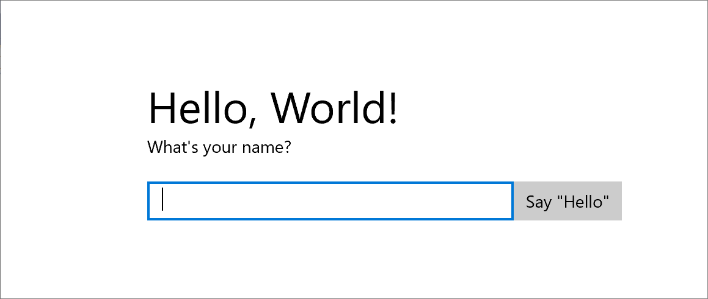
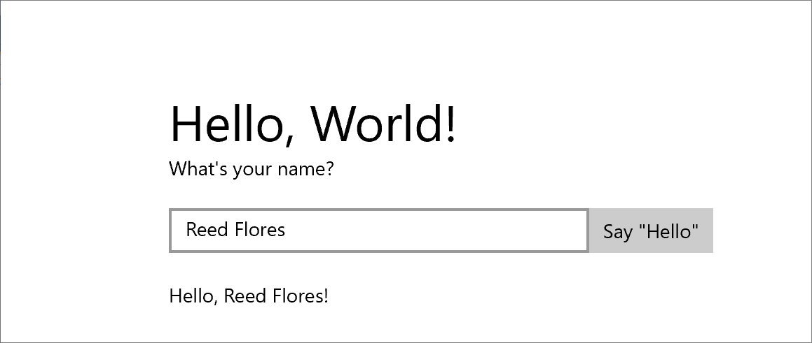

# Create a "Hello, World!" app using C++/WinRT

This topic walks you through creating a Windows 10 Universal Windows Platform (UWP) "Hello, World!" app using C++/WinRT. The app's user interface (UI) is defined using Extensible Application Markup Language (XAML).

C++/WinRT is an entirely standard modern C++17 language projection for Windows Runtime (WinRT) APIs. For more info, and more walkthroughs and code examples, see the [C++/WinRT](/windows/uwp/cpp-and-winrt-apis/) documentation. A good topic to begin with is [Get started with C++/WinRT](/windows/uwp/cpp-and-winrt-apis/get-started).

## Set up Visual Studio for C++/WinRT

For info about setting up Visual Studio for C++/WinRT development&mdash;including installing and using the C++/WinRT Visual Studio Extension (VSIX) and the NuGet package (which together provide project template and build support)&mdash;see [Visual Studio support for C++/WinRT](/windows/uwp/cpp-and-winrt-apis/intro-to-using-cpp-with-winrt#visual-studio-support-for-cwinrt-xaml-the-vsix-extension-and-the-nuget-package).

To download Visual Studio, see [Downloads](https://visualstudio.microsoft.com/downloads/).

For an introduction to XAML, see [XAML overview](/windows/uwp/xaml-platform/xaml-overview)

## Create a Blank App (HelloWorldCppWinRT)

Our first app is a "Hello, World!" app that demonstrates some basic features of interactivity, layout, and styles.

Begin by creating a new project in Microsoft Visual Studio. Create a **Blank App (C++/WinRT)** project, and name it *HelloWorldCppWinRT*. Make sure that **Place solution and project in the same directory** is unchecked. Target the latest generally-available (that is, not preview) version of the Windows SDK.

In a later section of this topic, you'll be directed to build your project (but don't build until then).

### About the project files

Typically, in the project folder, each `.xaml` (XAML markup) file has a corresponding `.idl`, `.h`, and `.cpp` file. Together, those files compile into a XAML page type.

You can modify a XAML markup file to create UI elements, and you can bind those elements to data sources (a task known as [data binding](/windows/uwp/data-binding/)). You modify the `.h`, and `.cpp` files (and sometimes the `.idl` file) to add custom logic for your XAML page&mdash;event handlers, for example.

Let's look at some of the project files.

- `App.idl`, `App.xaml`, `App.h`, and `App.cpp`. These files represent your app's specialization of the [**Windows::UI::Xaml::Application**](/uwp/api/windows.ui.xaml.application) class, which includes your app's entry point. `App.xaml` doesn't contain any page-specific markup, but you can add user interface element styles there, as well as any other elements that you want to be accessible from all pages. The `.h` and `.cpp` files contain handlers for various application lifecycle events. Typically, you add custom code there to initialize your app when it starts, and to perform cleanup when it's either suspended or terminated.
- `MainPage.idl`, `MainPage.xaml`, `MainPage.h`, and `MainPage.cpp`. Contain the XAML markup, and implementation, for the default main (startup) page type in an app, which is the **MainPage** runtime class. **MainPage** has no navigation support, but it provides some default UI, and an event handler, to get you started.
- `pch.h` and `pch.cpp`. These files represent your project's precompiled header file. In `pch.h`, include any header files that don't change often, and then include `pch.h` in other files in the project.

## A first look at the code

### Runtime classes

As you may know, all of the classes in a Universal Windows Platform (UWP) app written in C# are Windows Runtime types. But when you author a type in a C++/WinRT application, you can choose whether that type is a Windows Runtime type, or a regular C++ class/struct/enumeration.

Any XAML page type in your project needs to be a Windows Runtime type. So **MainPage** is a Windows Runtime type. Specifically, it's a *runtime class*. Any type that's consumed by a XAML page also needs to be a Windows Runtime type. When you're writing a [Windows Runtime component](/windows/uwp/winrt-components/create-a-windows-runtime-component-in-cppwinrt), and you want to author a type that can be consumed from another app, then you'll author a Windows Runtime type. In other cases, your type can be a regular C++ type. Generally speaking, a Windows Runtime type can be consumed using any Windows Runtime language.

One good indication that a type is a Windows Runtime type is that it's defined in [Microsoft Interface Definition Language (MIDL)](/uwp/midl-3/) inside an Interface Definition Language (`.idl`) file. Let's take **MainPage** as an example.

```idl
// MainPage.idl
namespace HelloWorldCppWinRT
{
    [default_interface]
    runtimeclass MainPage : Windows.UI.Xaml.Controls.Page
    {
        MainPage();
        Int32 MyProperty;
    }
}
```

And here's the basic structure of the implementation of the **MainPage** runtime class, and its activation factory, as seen in `MainPage.h`.

```cppwinrt
// MainPage.h
...
namespace winrt::HelloWorldCppWinRT::implementation
{
    struct MainPage : MainPageT<MainPage>
    {
        MainPage();

        int32_t MyProperty();
        void MyProperty(int32_t value);
        ...
    };
}

namespace winrt::HelloWorldCppWinRT::factory_implementation
{
    struct MainPage : MainPageT<MainPage, implementation::MainPage>
    {
    };
}
```    

For more details about whether or not you should author a runtime class for a given type, see the topic [Author APIs with C++/WinRT](/windows/uwp/cpp-and-winrt-apis/author-apis). And for more info about the connection between runtime classes and IDL (`.idl` files), you can read and follow along with the topic [XAML controls; bind to a C++/WinRT property](/windows/uwp/cpp-and-winrt-apis/binding-property). That topic walks through the process of authoring a new runtime class, the first step of which is to add a new **Midl File (.idl)** item to the project.

Now let's add some functionality to the **HelloWorldCppWinRT** project.

## Step 1. Modify your startup page

In **Solution Explorer**, open `MainPage.xaml` so that you can author the controls that form the user interface (UI).

Delete the **StackPanel** that's in there already, as well as its contents. In its place, paste the following XAML.

```xaml
<StackPanel x:Name="contentPanel" Margin="120,30,0,0">
    <TextBlock HorizontalAlignment="Left" Text="Hello, World!" FontSize="36"/>
    <TextBlock Text="What's your name?"/>
    <StackPanel x:Name="inputPanel" Orientation="Horizontal" Margin="0,20,0,20">
        <TextBox x:Name="nameInput" Width="300" HorizontalAlignment="Left"/>
        <Button x:Name="inputButton" Content="Say &quot;Hello&quot;"/>
    </StackPanel>
    <TextBlock x:Name="greetingOutput"/>
</StackPanel>
```

This new [**StackPanel**](/uwp/api/Windows.UI.Xaml.Controls.StackPanel) has a [**TextBlock**](/uwp/api/Windows.UI.Xaml.Controls.TextBlock) that prompts for the user's name, a [**TextBox**](/uwp/api/Windows.UI.Xaml.Controls.TextBox) that accepts the user's name, a [**Button**](/uwp/api/Windows.UI.Xaml.Controls.Button), and another **TextBlock** element.

Since we deleted the **Button** named *myButton*, we'll have to remove the reference to it from the code. So, in `MainPage.cpp`, delete the line of code inside the **MainPage::ClickHandler** function.

At this point, you've created a very basic Universal Windows app. To see what the UWP app looks like, build and run the app.



In the app, you can type into the text box. But clicking the button doesn't do anything yet.

## Step 2. Add an event handler

In `MainPage.xaml`, find the **Button** named *inputButton*, and declare an event handler for its [**ButtonBase::Click**](/uwp/api/windows.ui.xaml.controls.primitives.buttonbase.click) event. The markup for the **Button** should now look like this.

```xaml
<Button x:Name="inputButton" Content="Say &quot;Hello&quot;" Click="inputButton_Click"/>
```

Implement the event handler like this.

```cppwinrt
// MainPage.h
struct MainPage : MainPageT<MainPage>
{
    ...
    void inputButton_Click(
        winrt::Windows::Foundation::IInspectable const& sender,
        winrt::Windows::UI::Xaml::RoutedEventArgs const& e);
};

// MainPage.cpp
namespace winrt::HelloWorldCppWinRT::implementation
{
    ...
    void MainPage::inputButton_Click(
        winrt::Windows::Foundation::IInspectable const& sender,
        winrt::Windows::UI::Xaml::RoutedEventArgs const& e)
    {
        greetingOutput().Text(L"Hello, " + nameInput().Text() + L"!");
    }
}
```

For more info, see [Handle events by using delegates](/windows/uwp/cpp-and-winrt-apis/handle-events).

The implementation retrieves the user's name from the text box, uses it to create a greeting, and displays that in the *greetingOutput* text block.

Build and run the app. Type your name in the text box, and click the button. The app displays a personalized greeting.



## Step 3. Style the startup page

### Choose a theme

It's easy to customize the look and feel of your app. By default, your app uses resources that have a light-colored style. The system resources also include a dark theme.

To try out the dark theme, edit `App.xaml`, and add a value for [**Application::RequestedTheme**](/uwp/api/windows.ui.xaml.application.requestedtheme).

```xaml
<Application
    ...
    RequestedTheme="Dark">

</Application>
```

For apps that display mostly images or video, we recommend the dark theme; for apps that contain a lot of text, we recommend the light theme. If you're using a custom color scheme, then use the theme that goes best with your app's look and feel.

> [!NOTE]
> A theme is applied when your app starts up. It can't be changed while the app is running.

### Use system styles

In this section we'll change the appearance of the text (for example, make the font size larger).

In `MainPage.xaml`, find the "What's your name?" **TextBlock**. Set its [**Style**](/uwp/api/windows.ui.xaml.style) property to a reference to the *BaseTextBlockStyle* system resource key.

```xaml
<TextBlock Text="What's your name?" Style="{ThemeResource BaseTextBlockStyle}"/>
```

*BaseTextBlockStyle* is the key of a resource that's defined in the [**ResourceDictionary**](/uwp/api/Windows.UI.Xaml.ResourceDictionary) in `\Program Files (x86)\Windows Kits\10\DesignTime\CommonConfiguration\Neutral\UAP\<version>\Generic\generic.xaml`. Here are the property values that are set by that style.

```xaml
<Style x:Key="BaseTextBlockStyle" TargetType="TextBlock">
    <Setter Property="FontFamily" Value="XamlAutoFontFamily" />
    <Setter Property="FontWeight" Value="SemiBold" />
    <Setter Property="FontSize" Value="14" />
    <Setter Property="TextTrimming" Value="None" />
    <Setter Property="TextWrapping" Value="Wrap" />
    <Setter Property="LineStackingStrategy" Value="MaxHeight" />
    <Setter Property="TextLineBounds" Value="Full" />
</Style>
```

Also in `MainPage.xaml`, find the **TextBlock** named `greetingOutput`. Set its **Style** to *BaseTextBlockStyle* also. If you build and run the app now, you'll see that the appearance of both text blocks has changed (for example, the font size is now larger).

## Step 4. Have the UI adapt to different window sizes

Now we'll cause the UI to adapt dynamically to a changing window size, and so that it looks good on devices with small displays. To do this, you'll add a [**VisualStateManager**](/uwp/api/Windows.UI.Xaml.VisualStateManager) section into `MainPage.xaml`. You'll define different visual states for different window sizes, and then set the properties to apply for each of those visual states.

### Adjust the UI layout

Add this block of XAML as the first child element of the root **StackPanel** element.

```xaml
<StackPanel ...>
    <VisualStateManager.VisualStateGroups>
        <VisualStateGroup>
            <VisualState x:Name="wideState">
                <VisualState.StateTriggers>
                    <AdaptiveTrigger MinWindowWidth="641" />
                </VisualState.StateTriggers>
            </VisualState>
            <VisualState x:Name="narrowState">
                <VisualState.StateTriggers>
                    <AdaptiveTrigger MinWindowWidth="0" />
                </VisualState.StateTriggers>
                <VisualState.Setters>
                    <Setter Target="contentPanel.Margin" Value="20,30,0,0"/>
                    <Setter Target="inputPanel.Orientation" Value="Vertical"/>
                    <Setter Target="inputButton.Margin" Value="0,4,0,0"/>
                </VisualState.Setters>
            </VisualState>
        </VisualStateGroup>
    ...
</StackPanel>
```

Build and run the app. Notice that the UI looks the same as before until the window is resized narrower than 641 device-independent pixels (DIPs). At that point, the *narrowState* visual state is applied and, along with it, all of the property setters defined for that state.

The [**VisualState**](/uwp/api/Windows.UI.Xaml.VisualState) named `wideState` has an [**AdaptiveTrigger**](/uwp/api/Windows.UI.Xaml.AdaptiveTrigger) with its [**MinWindowWidth**](/uwp/api/windows.ui.xaml.adaptivetrigger.minwindowwidth) property set to 641. This means that the state is to be applied only when the window width is not less than the minimum of 641 DIPs. You don't define any [**Setter**](/uwp/api/Windows.UI.Xaml.Setter) objects for this state, so it uses the layout properties that you defined in the XAML for the page content.

The second [**VisualState**](/uwp/api/Windows.UI.Xaml.VisualState), `narrowState`, has an [**AdaptiveTrigger**](/uwp/api/Windows.UI.Xaml.AdaptiveTrigger) with its [**MinWindowWidth**](/uwp/api/windows.ui.xaml.adaptivetrigger.minwindowwidth) property set to 0. This state is applied when the window width is greater than 0, but less than 641 DIPs. At exactly 641 DIPs, `wideState` is in effect. In `narrowState`, you define [**Setter**](/uwp/api/Windows.UI.Xaml.Setter) objects to change the layout properties of controls in the UI.

- You reduce the left margin of the *contentPanel* element from 120 to 20.
- You change the [**Orientation**](/uwp/api/windows.ui.xaml.controls.stackpanel.orientation) of the *inputPanel* element from **Horizontal** to **Vertical**.
- You add a top margin of 4 DIPs to the *inputButton* element.

## Summary

This walkthrough showed you how to add content to a Windows Universal app, how to add interactivity, and how to change the UI's appearance.
