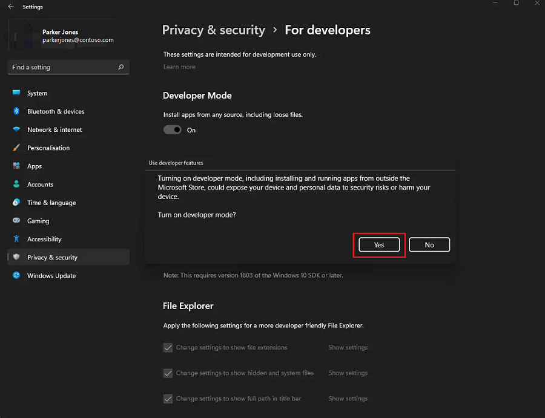
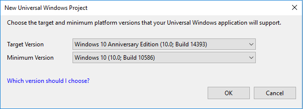

# Create a "Hello, world" app (JS)

This tutorial teaches you how to use JavaScript and HTML to create a simple "Hello, world" app that targets the Universal Windows Platform (UWP) on Windows 10. With a single project in Microsoft Visual Studio, you can build an app that runs on any Windows 10 device.

> [!NOTE]
> This tutorial is using Visual Studio Community 2017. If you are using a different version of Visual Studio, it may look a little different for you.


Here you'll learn how to:

-   Create a new **Visual Studio 2017** project that targets **Windows 10** and the **UWP**.
-   Add HTML and JavaScript content
-   Run the project on the local desktop in Visual Studio

## Before you start...

-   [What's a Universal Windows app](whats-a-uwp.md)?
-   To complete this tutorial, you need Windows 10 and Visual Studio 2017. [Get set up](get-set-up.md).
-   We also assume you're using the default window layout in Visual Studio. If you change the default layout, you can reset it in the **Window** menu by using the **Reset Window Layout** command.

## Step 1: Create a new project in Visual Studio.

1.  Launch Visual Studio 2017.

2.  From the **File** menu, select **New > Project...** to open the *New Project* dialog.

3.  From the list of templates on the left, open **Installed > Templates > JavaScript**, and then choose **Windows Universal** to see the list of UWP project templates.

    (If you don't see any Universal templates, you might be missing the components for creating UWP apps. You can repeat the installation process and add UWP support by clicking **Open Visual Studio installer** on the *New Project* dialog. See [Get set up](get-set-up.md)

4.  Choose the **Blank App (Universal Windows)** template, and enter "HelloWorld" as the **Name**. Select **OK**.

    

> [!NOTE]
> If this is the first time you have used Visual Studio, you might see a Settings dialog asking you to enable **Developer mode**. Developer mode is a special setting that enables certain features, such as permission to run apps directly, rather than only from the Store. For more information, please read [Enable your device for development](enable-your-device-for-development.md). To continue with this guide, select **Developer mode**, click **Yes**, and close the dialog.

 

5.  The target version/minimum version dialog appears. The default settings are fine for this tutorial, so select **OK** to create the project.

    

6.  When your new project opens, its files are displayed in the **Solution Explorer** pane on the right. You may need to choose the **Solution Explorer** tab instead of the **Properties** tab to see your files.

    

Although the **Blank App (Universal Window)** is a minimal template, it still contains a lot of files. These files are essential to all UWP apps using JavaScript. Every project that you create in Visual Studio contains them.


### What's in the files?

To view and edit a file in your project, double-click the file in the **Solution Explorer**. 

*default.css*

-  The default stylesheet used by the app.

*main.js*

- The default JavaScript file. It's referenced in the index.html file.

*index.html*

- The app's web page, loaded and displayed when the app is launched.

*A set of logo images*
-   Assets/Square150x150Logo.scale-200.png represents your app in the start menu.
-   Assets/StoreLogo.png represents your app in the Windows Store.
-   Assets/SplashScreen.scale-200.png is the splash screen that appears when your app starts.

## Step 2: Adding a button

Click on *index.html* to select it in the editor, and change the HTML it contains to read:

```html
<!DOCTYPE html>
<html>

<head>
    <meta charset="utf-8" />
    <title>Hello World</title>
    <script src="js/main.js"></script>
    <link href="css/default.css" rel="stylesheet" />
</head>

<body>
    <p>Click the button..</p>
    <button id="button">Hello world!</button>
</body>

</html>
```

It should look like this:

 

This HTML references the *main.js* that will contain our JavaScript, and then adds a single line of text and a single button to the body of the web page. The button is given an *ID* so the JavaScript will be able to reference it.


## Step 3: Adding some JavaScript

Now we'll add the JavaScript. Click on *main.js* to select it, and add the following:

```javascript
// Your code here!

window.onload = function () {
    document.getElementById("button").onclick = function (evt) {
        sayHello()
    }
}


function sayHello() {
    var messageDialog = new Windows.UI.Popups.MessageDialog("Hello, world!", "Alert");
    messageDialog.showAsync();
}

```

It should look like this:

 

This JavaScript declares two functions. The *window.onload* function is called automatically when *index.html* is displayed. It finds the button (using the ID we declared) and adds an onclick handler: the method that will be called when the button is clicked.

The second function, *sayHello()*, creates and displays a dialog. This is very similar to the *Alert()* function you may know from previous JavaScript development.


## Step 4: Run the app!

Now you can run the app by pressing F5. The app will load, the web page will be displayed. Click on the button, and the message dialog will pop-up.

 


## Summary


Congratulations, you've created a JavaScript app for Windows 10 and the UWP! This is a rediculously simple example, however, you can now start adding your favorite JavaScript libraries and frameworks to create your own app. And as it's a UWP app, you can publish it to the Store. For example of how third party frameworks can be added, see these  projects:

* [A simple 2D UWP game for the Windows Store, written in JavaScript and CreateJS](get-started-tutorial-game-js2d.md)
* [A 3D UWP game for the Windows Store, written in JavaScript and threeJS](get-started-tutorial-game-js3d.md)


