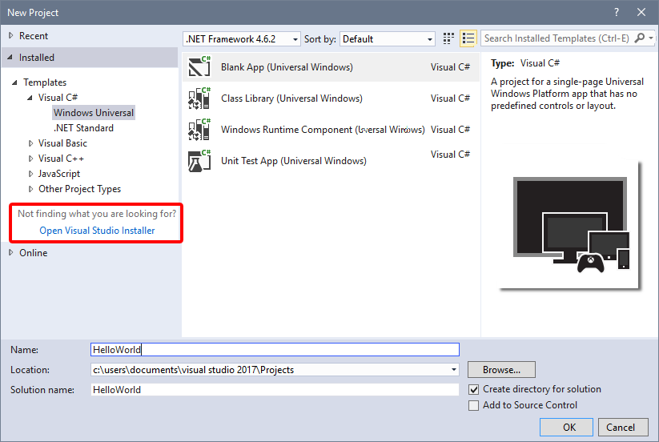

# Get set up

It's easier than you think to get going. Follow these instructions and start creating Universal Windows Platform (UWP) apps for Windows 10.

## 1. Download or update Visual Studio

Microsoft Visual Studio 2017 helps you design, code, test, and debug your apps.

If you don't already have Visual Studio 2017, you can install the free Microsoft Visual Studio Community 2017. This download includes device simulators for testing your apps:

-   [Download Windows 10 developer tools](https://go.microsoft.com/fwlink/p/?LinkID=534189)

When you install Visual Studio, make sure to select the Universal Windows App Development Tools option, as shown here:

Need some help with Visual Studio? See [Get Started with Visual Studio](https://www.visualstudio.com/vs/getting-started).

If you have already started using Visual Studio, but discover you are missing some components, you can launch the installer again from the *New project* dialog:

   

## 2. Enable your device for development

It’s important to test your UWP apps on real PCs and phones. Before you can deploy apps to your PC or Windows Phone, you have to enable it for development.

-   For detailed instructions, see [Enable your device for development](enable-your-device-for-development.md).

## 3. Register as an app developer

You can start developing apps now, but before you can submit them to the store, you need a developer account.

-   To get a developer account, go to the [Sign up](sign-up.md) page.

## What's next?

After you've installed the tools and enabled your device for development, check out our guidance on how to start creating Windows 10 apps.

-   [Start coding](create-uwp-apps.md)

## Windows development setup scripts

If you want to customize your device and install other features or packages, check out this project for system setup scripts.

- [Developer setup scripts](https://github.com/Microsoft/windows-dev-box-setup-scripts)

## Want more tools and downloads?

For the complete list of tools and downloads, see [Downloads](https://go.microsoft.com/fwlink/p/?linkid=285935).

## See Also

* [Code Samples for UWP developers](https://developer.microsoft.com/windows/samples)
* [What's a UWP app?](universal-application-platform-guide.md)
* [Sign up for Windows account](sign-up.md)
