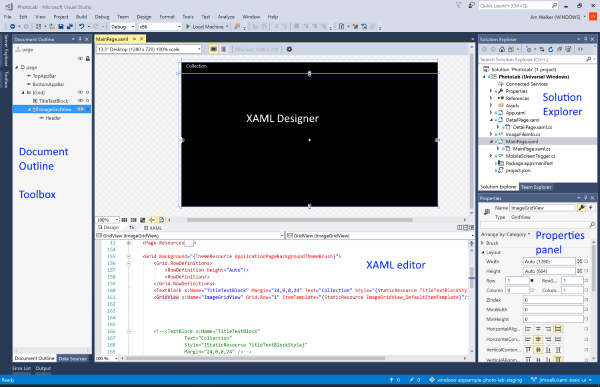
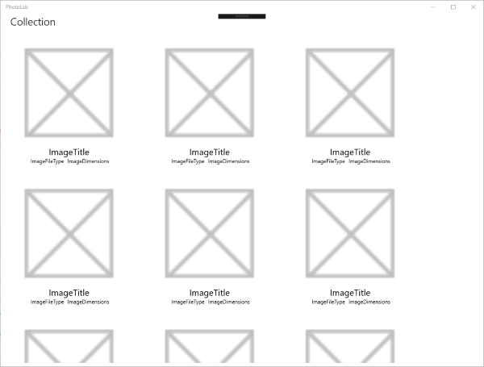
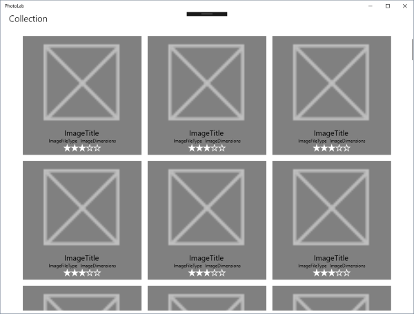

# Create a user interface

In this tutorial, you'll learn have to create a basic user interface (UI) with common XAML controls and panels by:

+ Using the XAML tools in Visual Studio, such as XAML Designer, Toolbox, XAML editor, Properties panel, and Document Outline to add controls and content to your UI
+ Utilizing some of the most common XAML layout panels, such as RelativePanel, Grid, and StackPanel.

We'll start with a simplified version of the PhotoLab sample. This starter version includes the complete data layer plus the basic XAML pages, but leaves out many features in order to make the code easier to browse around in. This tutorial doesn't build up to the complete app, so be sure to check out the [final version](https://github.com/Microsoft/Windows-appsample-photo-lab) to see other features such as custom animations and phone support. You can find the final version in the UWP Academy\XAML\Final folder.

## Prerequisites

* [Visual Studio 2017 and the Windows 10 SDK (10.0.15063.468 or later)](https://developer.microsoft.com/windows/downloads)

## Part 0: Get the code
The starting point for this lab is located in the PhotoLab sample repository, in the [xaml-basics-tutorials/user-interface/ folder](https://github.com/Microsoft/Windows-appsample-photo-lab/tree/master/xaml-basics-starting-points/user-interface). After you've cloned/downloaded the repo, you can edit the project by openning PhotoLab.sln with Visual Studio 2017.

## Part 1: Add a TextBlock using XAML Designer

Visual Studio provides several tools to make creating your XAML UI easier. XAML Designer lets you drag controls onto the design surface and see what they'll look like before you run the app. The Properties panel lets you view and set all the properties of the control that are active in the designer. Document Outline shows the parent-child structure of the XAML visual tree for your UI. The XAML editor lets you directly enter and modify the XAML markup.

Here's the Visual Studio UI with the tools labeled.



Each of these tools make creating your UI easier, so we'll use all of them in this tutorial. You'll start by using XAML Designer to add a control. 

**Add a control using XAML Designer:**

1. Open the UWP Academy\XAML\Basic layout\Start folder and load the PhotoLab solution, then double-click **MainPage.xaml** in Solution Explorer to open it. This shows the main page of the app without any UI elements added.

2. Before going further, you need to make some adjustments to Visual Studio.

    - Make sure the Solution Platform is set to x86 or x64, not ARM.
    - Set the main page XAML Designer to show the 13.3" Desktop preview.

    You should see both settings near the top of the window, as shown here.

    

    You can run the app now, but you won't see much. Let's add some UI elements to make things more interesting.

3. In Toolbox, expand **Common XAML controls** and find the [TextBlock](https://docs.microsoft.com/uwp/api/windows.ui.xaml.controls.textblock) control. Drag a TextBlock onto the design surface near the upper left corner of the page.

    The TextBlock is added to the page, and the designer sets some properties based on its best guess at the layout you want. A blue highlight appears around the TextBlock to indicate that it is now the active object. Notice the margins and other settings added by the designer. Your XAML will look something like this. Don't worry if it's not formatted exactly like this; we abbreviated here to make it easier to read.

    ```xaml
    <TextBlock x:Name="textBlock"
               HorizontalAlignment="Left"
               Margin="351,44,0,0"
               TextWrapping="Wrap"
               Text="TextBlock"
               VerticalAlignment="Top"/>
    ```

    In the next steps, you'll update these values.

4. In the Properties panel, change the Name value of the TextBlock from **textBlock** to **TitleTextBlock**. (Make sure the TextBlock is still the active object.)

5. Under **Common**, change the Text value to **Collection**.

    

    In the XAML editor, your XAML will now look like this.

    ```xaml
    <TextBlock x:Name="TitleTextBlock"
               HorizontalAlignment="Left"
               Margin="351,44,0,0"
               TextWrapping="Wrap"
               Text="Collection"
               VerticalAlignment="Top"/>
    ```

6. To position the TextBlock, you should first remove the property values that were added by Visual Studio. In Document Outline, right-click **TitleTextBlock**, then select **Layout > Reset All**.


7. In the Properties panel, enter **margin** into the search box to easily find the **Margin** property. Set the left and bottom margins to 24.

    

    Margins provide the most basic positioning of an element on the page. They're useful for fine-tuning your layout, but using large margin values like those added by Visual Studio makes it difficult for your UI to adapt to various screen sizes, and should be avoided.

    For more info, see [Alignment, margins, and padding](https://docs.microsoft.com/windows/uwp/layout/alignment-margin-padding).

8. In the Properties panel, enter **style** into the search box to find the **Style** property. Click the _property marker_ for the **Style** property to open its menu. (The _property marker_ is the small box symbol to the right of each property value.) On the **Property** menu, select **System Resource > TitleTextBlockStyle**. This applies a system-defined style to your title text.

    ```xaml
    <TextBlock x:Name="TitleTextBlock"
               TextWrapping="Wrap"
               Text="Collection"
               Margin="24,0,0,24"
               Style="{StaticResource TitleTextBlockStyle}"/>
    ```

9. In the Properties panel, enter **textwrapping** into the search box to find the **TextWrapping** property. Click the _property marker_ for the **TextWrapping** property to open its menu. (The _property marker_ is black to indicate that the property is set to a non-default value.) On the **Property** menu, select **Reset** to reset the TextWrapping property.

    Visual Studio adds this property, but it's already set in the style you applied, so you don't need it here.

You've added the first part of the UI to your app! Run the app now to see what it looks like.

You might have noticed that in XAML Designer, your app showed white text on a black background, but when you ran it, it showed black text on a white background. That's because Windows has both a Dark and a Light theme, and the default theme varies by device. On a PC, the default theme is Light. You can click the gear icon at the top of XAML Designer to open Device Preview Settings and change the theme to Light to make the app in XAML Designer look the same as it does on your PC.

> [!NOTE]
> In this part of the tutorial, you added a control by dragging-and-dropping. You can also add a control by double-clicking it in Toolbox. Give it a try, and see the differences in the XAML that Visual Studio generates.

## Part 2: Add a GridView control using the XAML editor

In Part 1, you had a taste of using XAML Designer and some of the other tools provided by Visual Studio. Here, you'll use the XAML editor to work directly with the XAML markup. As you become more familiar with XAML, you might find that this is a more efficient way for you to work.

First, you'll replace the root layout [Grid](https://docs.microsoft.com/uwp/api/windows.ui.xaml.controls.grid) with a [**RelativePanel**](https://docs.microsoft.com/uwp/api/windows.ui.xaml.controls.relativepanel). The RelativePanel makes it easier to rearrange chunks of UI relative to the panel or other pieces of UI. You'll see its usefulness in the [XAML Adaptive Layout](xaml-basics-adaptive-layout.md) tutorial. 

Then, you'll add a [GridView](https://docs.microsoft.com/uwp/api/windows.ui.xaml.controls.gridview) control to display your data.

**Add a control using the XAML editor**

1. In the XAML editor, change the root **Grid** to a **RelativePanel**.

    **Before**
    ```xaml
    <Grid Background="{ThemeResource ApplicationPageBackgroundThemeBrush}">
          <TextBlock x:Name="TitleTextBlock"
                     Text="Collection"
                     Margin="24,0,0,24"
                     Style="{StaticResource TitleTextBlockStyle}"/>
    </Grid>
    ```

    **After**
    ```xaml
    <RelativePanel Background="{ThemeResource ApplicationPageBackgroundThemeBrush}">
        <TextBlock x:Name="TitleTextBlock"
                   Text="Collection"
                   Margin="24,0,0,24"
                   Style="{StaticResource TitleTextBlockStyle}"/>
    </RelativePanel>
    ```

    For more info about layout using a **RelativePanel**, see [Layout panels](https://docs.microsoft.com/windows/uwp/layout/layout-panels#relativepanel).

2. Below the **TextBlock** element, add a **GridView control** named 'ImageGridView'. Set the **RelativePanel** _attached properties_ to place the control below the title text and make it stretch across the entire width of the screen.

    **Add this XAML**

    ```xaml
    <GridView x:Name="ImageGridView"
              Margin="0,0,0,8"
              RelativePanel.AlignLeftWithPanel="True"
              RelativePanel.AlignRightWithPanel="True"
              RelativePanel.Below="TitleTextBlock"/>
    ```

    **After the TextBlock**
    ```xaml
    <RelativePanel Background="{ThemeResource ApplicationPageBackgroundThemeBrush}">
        <TextBlock x:Name="TitleTextBlock"
                   Text="Collection"
                   Margin="24,0,0,24"
                   Style="{StaticResource TitleTextBlockStyle}"/>
        
        <!-- Add the GridView here. -->

    </RelativePanel>
    ```

    For more info about Panel attached properties, see [Layout panels](https://docs.microsoft.com/windows/uwp/layout/layout-panels).

3. In order for the **GridView** to show anything, you need to give it a collection of data to show. Open MainPage.xaml.cs and find the **GetItemsAsync** method. This method populates a collection called Images, which is a property that we've added to MainPage.

    After the **foreach** loop in **GetItemsAsync**, add this line of code.

    ```csharp
    ImageGridView.ItemsSource = Images;
    ```

    This sets the GridView's **ItemsSource** property to the app's **Images** collection and gives the **GridView** something to show.

This is a good place to run the app and make sure everything's working. It should look something like this.


You'll notice that the app isn't showing images yet. By default, it shows the ToString value of the data type that's in the collection. Next, you'll create a data template to define how the data is shown.

> [!NOTE]
> You can find out more about layout using a **RelativePanel** in the [Layout panels](https://docs.microsoft.com/windows/uwp/layout/layout-panels#relativepanel) article. Take a look, and then experiment with some different layouts by setting RelativePanel attached properties on the **TextBlock** and **GridView**.

## Part 3: Add a DataTemplate to display your data

Now, you'll create a [DataTemplate](https://docs.microsoft.com/uwp/api/windows.ui.xaml.datatemplate) that tells the GridView how to display your data. For a full explanation of data templates, see [Item containers and templates](../controls-and-patterns/item-containers-templates.md).

For now, you'll only be adding placeholders to help you create the layout you want. In the [XAML Data Binding](xaml-basics-data-binding.md) tutorial, you'll replace these placeholders with real data from the **ImageFileInfo** class. You can open the ImageFileInfo.cs file now if you want to see what the data object looks like.

**Add a data template to a grid view**

1. Open MainPage.xaml.

2. To show the rating, you use the **RadRating** control from the [Telerik UI for UWP](https://github.com/telerik/UI-For-UWP) NuGet package. Add a XAML namespace reference that specifies the namespace for the Telerik controls. Put this in the opening **Page** tag, right after the other 'xmlns:' entries.

    **Add this XAML**

    ```xaml
    xmlns:telerikInput="using:Telerik.UI.Xaml.Controls.Input"
    ```

    **After the last 'xmlns:' entry**

    ```xaml
    <Page x:Name="page"
      x:Class="PhotoLab.MainPage"
      xmlns="http://schemas.microsoft.com/winfx/2006/xaml/presentation"
      xmlns:x="http://schemas.microsoft.com/winfx/2006/xaml"
      xmlns:local="using:PhotoLab"
      xmlns:d="http://schemas.microsoft.com/expression/blend/2008"
      xmlns:mc="http://schemas.openxmlformats.org/markup-compatibility/2006"
      xmlns:telerikInput="using:Telerik.UI.Xaml.Controls.Input"
      mc:Ignorable="d"
      NavigationCacheMode="Enabled">
    ```

    For more info about XAML namespaces, see [XAML namespaces and namespace mapping](https://docs.microsoft.com/windows/uwp/xaml-platform/xaml-namespaces-and-namespace-mapping).

3. In Document Outline, right-click **ImageGridView**. In the context menu, select **Edit Additional Templates > Edit Generated Items (ItemTemplate) > Create Empty...**. The **Create Resource** dialog opens.

4. In the dialog, change the Name (key) value to **ImageGridView_DefaultItemTemplate**, and then click **OK**.

    Several things happen when you click **OK**.

    - A **DataTemplate** is added to the Page.Resources section of MainPage.xaml.

        ```xaml
        <Page.Resources>
            <DataTemplate x:Key="ImageGridView_DefaultItemTemplate">
                <Grid/>
            </DataTemplate>
        </Page.Resources>
        ```

    - The Document Outline scope is set to this **DataTemplate**.

        When you're done creating the data template, you can click the up arrow in the top left corner of Document Outline to return to page scope.

    - The GridView's **ItemTemplate** property is set to the **DataTemplate** resource.

    ```xaml
        <GridView x:Name="ImageGridView"
                  Margin="0,0,0,8"
                  RelativePanel.AlignLeftWithPanel="True"
                  RelativePanel.AlignRightWithPanel="True"
                  RelativePanel.Below="TitleTextBlock"
                  ItemTemplate="{StaticResource ImageGridView_DefaultItemTemplate}"/>
    ```

5. In the **ImageGridView_DefaultItemTemplate** resource, give the root **Grid** a Height and Width of **300**, and Margin of **8**. Then add two rows and set the Height of the second row to **Auto**.

    **Before**
    ```xaml
    <Grid/>
    ```

    **After**
    ```xaml
    <Grid Height="300"
          Width="300"
          Margin="8">
        <Grid.RowDefinitions>
            <RowDefinition />
            <RowDefinition Height="Auto" />
        </Grid.RowDefinitions>
    </Grid>
    ```

    For more info about Grid layouts, see [Layout panels](https://docs.microsoft.com/windows/uwp/layout/layout-panels#grid).

6. Add controls to the Grid.

    a. Add an **Image** control in the first grid row. This is where the image will be shown, but for now, you'll use the app's store logo as a placeholder.

    b. Add **TextBlock** controls to show the image's name, file type, and dimensions. For this, you use **StackPanel** controls to arrange the text blocks.

    For more info about **StackPanel** layout, see [Layout panels](https://docs.microsoft.com/windows/uwp/layout/layout-panels#stackpanel)

    c. Add the **RadRating** control to the outer (vertical) **StackPanel**. Place it after the inner (horizontal) **StackPanel**.

    **The final template**

    ```xaml
    <Grid Height="300"
          Width="300"
          Margin="8">
        <Grid.RowDefinitions>
            <RowDefinition />
            <RowDefinition Height="Auto" />
        </Grid.RowDefinitions>

        <Image x:Name="ItemImage"
               Source="Assets/StoreLogo.png"
               Stretch="Uniform" />

        <StackPanel Orientation="Vertical"
                    Grid.Row="1">
            <TextBlock Text="ImageTitle"
                       HorizontalAlignment="Center"
                       Style="{StaticResource SubtitleTextBlockStyle}" />
            <StackPanel Orientation="Horizontal"
                        HorizontalAlignment="Center">
                <TextBlock Text="ImageFileType"
                           HorizontalAlignment="Center"
                           Style="{StaticResource CaptionTextBlockStyle}" />
                <TextBlock Text="ImageDimensions"
                           HorizontalAlignment="Center"
                           Style="{StaticResource CaptionTextBlockStyle}"
                           Margin="8,0,0,0" />
            </StackPanel>

            <telerikInput:RadRating Value="3"
                                    IsReadOnly="True">
                <telerikInput:RadRating.FilledIconContentTemplate>
                    <DataTemplate>
                        <SymbolIcon Symbol="SolidStar"
                                    Foreground="White" />
                    </DataTemplate>
                </telerikInput:RadRating.FilledIconContentTemplate>
                <telerikInput:RadRating.EmptyIconContentTemplate>
                    <DataTemplate>
                        <SymbolIcon Symbol="OutlineStar"
                                    Foreground="White" />
                    </DataTemplate>
                </telerikInput:RadRating.EmptyIconContentTemplate>
            </telerikInput:RadRating>

        </StackPanel>
    </Grid>
    ```

Run the app now to see the **GridView** with the item template you just created. You might not see the rating control, though, because it has white stars on a white background. You'll change the background color next.



## Part 4: Modify the item container style

An item’s control template contains the visuals that display state, like selection, pointer over, and focus. These visuals are rendered either on top of or below the data template. Here, you'll modify the **Background** and **Margin** properties of the control template to give the **GridView** items a gray background.

**Modify the item container**

1. In Document Outline, right-click **ImageGridView**. On the context menu, select **Edit Additional Templates > Edit Generated Item Container (ItemContainerStyle) > Edit a Copy...**. The **Create Resource** dialog opens.

2. In the dialog, change the Name (key) value to **ImageGridView_DefaultItemContainerStyle**, then click **OK**.

    A copy of the default style is added to the **Page.Resources** section of your XAML.

    ```xaml
    <Style x:Key="ImageGridView_DefaultItemContainerStyle" TargetType="GridViewItem">
        <Setter Property="FontFamily" Value="{ThemeResource ContentControlThemeFontFamily}"/>
        <Setter Property="FontSize" Value="{ThemeResource ControlContentThemeFontSize}"/>
        <Setter Property="Background" Value="{ThemeResource GridViewItemBackground}"/>
        <Setter Property="Foreground" Value="{ThemeResource GridViewItemForeground}"/>
        <Setter Property="TabNavigation" Value="Local"/>
        <Setter Property="IsHoldingEnabled" Value="True"/>
        <Setter Property="HorizontalContentAlignment" Value="Center"/>
        <Setter Property="VerticalContentAlignment" Value="Center"/>
        <Setter Property="Margin" Value="0,0,4,4"/>
        <Setter Property="MinWidth" Value="{ThemeResource GridViewItemMinWidth}"/>
        <Setter Property="MinHeight" Value="{ThemeResource GridViewItemMinHeight}"/>
        <Setter Property="AllowDrop" Value="False"/>
        <Setter Property="UseSystemFocusVisuals" Value="True"/>
        <Setter Property="FocusVisualMargin" Value="-2"/>
        <Setter Property="FocusVisualPrimaryBrush" Value="{ThemeResource GridViewItemFocusVisualPrimaryBrush}"/>
        <Setter Property="FocusVisualPrimaryThickness" Value="2"/>
        <Setter Property="FocusVisualSecondaryBrush" Value="{ThemeResource GridViewItemFocusVisualSecondaryBrush}"/>
        <Setter Property="FocusVisualSecondaryThickness" Value="1"/>
        <Setter Property="Template">
            <Setter.Value>
                <ControlTemplate TargetType="GridViewItem">
                <!-- XAML removed for clarity
                    <ListViewItemPresenter ... />
                -->   
                </ControlTemplate>
            </Setter.Value>
        </Setter>
    </Style>
    ```

    The **GridViewItem** default style sets a lot of properties. You should always start with a copy of the default style and modify only the properties necessary. Otherwise, the visuals might not show up the way you expect because some properties won't be set correctly.

    And as in the previous step, the GridView's **ItemContainerStyle** property is set to the new **Style** resource.

    ```xaml
        <GridView x:Name="ImageGridView"
                  Margin="0,0,0,8"
                  RelativePanel.AlignLeftWithPanel="True"
                  RelativePanel.AlignRightWithPanel="True"
                  RelativePanel.Below="TitleTextBlock"
                  ItemTemplate="{StaticResource ImageGridView_DefaultItemTemplate}"
                  ItemContainerStyle="{StaticResource ImageGridView_DefaultItemContainerStyle}"/>
    ```

3. Change the value for the **Background** property to **Gray**.

    **Before**
    ```xaml
        <Setter Property="Background" Value="{ThemeResource GridViewItemBackground}"/>
    ```

    **After**
    ```xaml
        <Setter Property="Background" Value="Gray"/>
    ```

4. Change the value for the **Margin** property to **8**.

    **Before**
    ```xaml
        <Setter Property="Margin" Value="0,0,4,4"/>
    ```

    **After**
    ```xaml
        <Setter Property="Margin" Value="8"/>
    ```

Run the app and see how it looks now. Resize the app window. The **GridView** takes care of rearranging the images for you, but at some widths, there's a lot of space on the right side of the app window. It would look better if the images were centered. We'll take care of that next.


> [!Note]
> If you'd like to experiment, try setting the Background and Margin properties to different values and see what effect it has.

## Part 5: Apply some final adjustments to the layout

To center the images in the page, you need to adjust the alignment of the Grid in the page. Or do you need to adjust the alignment of the Images in the **GridView**? Does it matter? Let's see.

For more info about alignment, see [Alignment, margins, and padding](https://docs.microsoft.com/windows/uwp/layout/alignment-margin-padding).

(You might try setting the **Background** of the **GridView** to your favorite color for this step. It will let you see more clearly what's happening with the layout.)

**Modify the alignment of the images**

1. In the **Gridview**, set the **HorizontalAlignment** property to **Center**.

    **Before**
    ```xaml
        <GridView x:Name="ImageGridView"
                  Margin="0,0,0,8"
                  RelativePanel.AlignLeftWithPanel="True"
                  RelativePanel.AlignRightWithPanel="True"
                  RelativePanel.Below="TitleTextBlock"
                  ItemTemplate="{StaticResource ImageGridView_DefaultItemTemplate}"
                  ItemContainerStyle="{StaticResource ImageGridView_DefaultItemContainerStyle}"/>
    ```

    **After**
    ```xaml
        <GridView x:Name="ImageGridView"
                  Margin="0,0,0,8"
                  RelativePanel.AlignLeftWithPanel="True"
                  RelativePanel.AlignRightWithPanel="True"
                  RelativePanel.Below="TitleTextBlock"
                  ItemTemplate="{StaticResource ImageGridView_DefaultItemTemplate}"
                  ItemContainerStyle="{StaticResource ImageGridView_DefaultItemContainerStyle}" 
                  HorizontalAlignment="Center"/>
    ```

2. Run the app and resize the window. Scroll down to see more images.

    The images are centered, which looks better. However, the scrollbar is aligned with the edge of **GridView** instead of with the edge of the window. To fix this, you'll center the images in the **GridView** rather than centering the **GridView** in the page. It's a little more work, but it will look better in the end.

3. Remove the **HorizontalAlignment** setting from the previous step.

4. In Document Outline, right-click **ImageGridView**. On the context menu, select **Edit Additional Templates > Edit Layout of Items (ItemsPanel) > Edit a Copy...**. The **Create Resource** dialog opens.

5. In the dialog, change the Name (key) value to **ImageGridView_ItemsPanelTemplate**, and then click **OK**.

    A copy of the default **ItemsPanelTemplate** is added to the **Page.Resources** section of your XAML. (And as before, the **GridView** is updated to reference this resource.)

    ```xaml
    <ItemsPanelTemplate x:Key="ImageGridView_ItemsPanelTemplate">
        <ItemsWrapGrid Orientation="Horizontal" />
    </ItemsPanelTemplate>
    ```

    Just as you've used various panels to layout the controls in your app, the **GridView** has an internal panel that manages the layout of its items. Now that you have access to this panel (the **ItemsWrapGrid**), you can modify its properties to change the layout of items inside the **GridView**.

6. In the **ItemsWrapGrid**, set the **HorizontalAlignment** property to **Center**.

    **Before**
    ```xaml
    <ItemsPanelTemplate x:Key="ImageGridView_ItemsPanelTemplate">
        <ItemsWrapGrid Orientation="Horizontal" />
    </ItemsPanelTemplate>
    ```

    **After**
    ```xaml
    <ItemsPanelTemplate x:Key="ImageGridView_ItemsPanelTemplate">
        <ItemsWrapGrid Orientation="Horizontal"
                       HorizontalAlignment="Center"/>
    </ItemsPanelTemplate>
    ```

7. Run the app and resize the window again. Scroll down to see more images.



Now, the scrollbar is aligned with the edge of the window. Good job! You've created the basic UI for your app.

## Going further

Now that you've created the basic UI, see the [XAML Data Binding](xaml-basics-data-binding.md) tutorial to add real images and data. Or go on to the [XAML Adaptive Layout](xaml-basics-adaptive-layout.md) tutorial to see how to adapt the UI to multiple screen sizes.