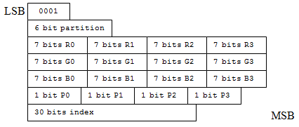
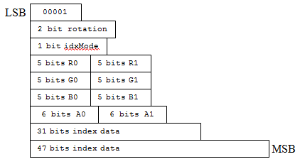
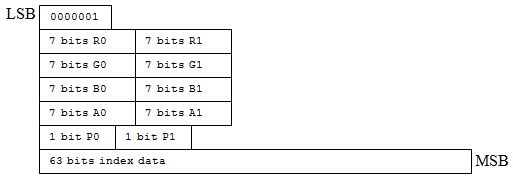

# BC7 format


The BC7 format is a texture compression format used for high-quality compression of RGB and RGBA data.

For info about the block modes of the BC7 format, see [BC7 Format Mode Reference](https://msdn.microsoft.com/library/windows/desktop/hh308954).

## <span id="About-BC7-DXGI-FORMAT-BC7"></span><span id="about-bc7-dxgi-format-bc7"></span><span id="ABOUT-BC7-DXGI-FORMAT-BC7"></span>About BC7/DXGI\_FORMAT\_BC7


BC7 is specified by the following DXGI\_FORMAT enumeration values:

-   **DXGI\_FORMAT\_BC7\_TYPELESS**.
-   **DXGI\_FORMAT\_BC7\_UNORM**.
-   **DXGI\_FORMAT\_BC7\_UNORM\_SRGB**.

The BC7 format can be used for [Texture2D](https://msdn.microsoft.com/library/windows/desktop/bb205277) (including arrays), Texture3D, or TextureCube (including arrays) texture resources. Similarly, this format applies to any MIP-map surfaces associated with these resources.

BC7 uses a fixed block size of 16 bytes (128 bits) and a fixed tile size of 4x4 texels. As with previous BC formats, texture images larger than the supported tile size (4x4) are compressed by using multiple blocks. This addressing identity also applies to three-dimensional images and MIP-maps, cubemaps, and texture arrays. All image tiles must be of the same format.

BC7 compresses both three-channel (RGB) and four-channel (RGBA) fixed-point data images. Typically, source data is 8 bits per color component (channel), although the format is capable of encoding source data with higher bits per color component. All image tiles must be of the same format.

The BC7 decoder performs decompression before texture filtering is applied.

BC7 decompression hardware must be bit accurate; that is, the hardware must return results that are identical to the results returned by the decoder described in this document.

## <span id="BC7-Implementation"></span><span id="bc7-implementation"></span><span id="BC7-IMPLEMENTATION"></span>BC7 Implementation


A BC7 implementation can specify one of 8 modes, with the mode specified in the least significant bit of the 16 byte (128 bit) block. The mode is encoded by zero or more bits with a value of 0 followed by a 1.

A BC7 block can contain multiple endpoint pairs. The set of indices that correspond to an endpoint pair may be referred to as a "subset." Also, in some block modes, the endpoint representation is encoded in a form that can be referred to as "RBGP," where the "P" bit represents a shared least significant bit for the color components of the endpoint. For example, if the endpoint representation for the format is "RGB 5.5.5.1," then the endpoint is interpreted as an RGB 6.6.6 value, where the state of the P-bit defines the least significant bit of each component. Similarly, for source data with an alpha channel, if the representation for the format is "RGBAP 5.5.5.5.1," then the endpoint is interpreted as RGBA 6.6.6.6. Depending on the block mode, you can specify the shared least significant bit for either both endpoints of a subset individually (2 P-bits per subset), or shared between endpoints of a subset (1 P-bit per subset).

For BC7 blocks that don't explicitly encode the alpha component, a BC7 block consists of mode bits, partition bits, compressed endpoints, compressed indices, and an optional P-bit. In these blocks the endpoints have an RGB-only representation and the alpha component is decoded as 1.0 for all texels in the source data.

For BC7 blocks that have combined color and alpha components, a block consists of mode bits, compressed endpoints, compressed indices, and optional partition bits and a P-bit. In these blocks, the endpoint colors are expressed in RGBA format, and alpha component values are interpolated alongside the color component values.

For BC7 blocks that have separate color and alpha components, a block consists of mode bits, rotation bits, compressed endpoints, compressed indices, and an optional index selector bit. These blocks have an effective RGB vector \[R, G, B\] and a scalar alpha channel \[A\] separately encoded.

The following table lists the components of each block type.

| BC7 block contains...     | mode bits | rotation bits | index selector bit | partition bits | compressed endpoints | P-bit    | compressed indices |
|---------------------------|-----------|---------------|--------------------|----------------|----------------------|----------|--------------------|
| color components only     | required  | N/A           | N/A                | required       | required             | optional | required           |
| color + alpha combined    | required  | N/A           | N/A                | optional       | required             | optional | required           |
| color and alpha separated | required  | required      | optional           | N/A            | required             | N/A      | required           |

 

BC7 defines a palette of colors on an approximate line between two endpoints. The mode value determines the number of interpolating endpoint pairs per block. BC7 stores one palette index per texel.

For each subset of indices that corresponds to a pair of endpoints, the encoder fixes the state of one bit of the compressed index data for that subset. It does so by choosing an endpoint order that allows the index for the designated "fix-up" index to set its most significant bit to 0, and which can then be discarded, saving one bit per subset. For block modes with only a single subset, the fix-up index is always index 0.

## <span id="Decoding-the-BC7-Format"></span><span id="decoding-the-bc7-format"></span><span id="DECODING-THE-BC7-FORMAT"></span>Decoding the BC7 Format


The following pseudocode outlines the steps to decompress the pixel at (x,y) given the 16 byte BC7 block.

``` syntax
decompress_bc7(x, y, block)
{
    mode = extract_mode(block);
    
    //decode partition data from explicit partition bits
    subset_index = 0;
    num_subsets = 1;
    
    if (mode.type == 0 OR == 1 OR == 2 OR == 3 OR == 7)
    {
        num_subsets = get_num_subsets(mode.type);
        partition_set_id = extract_partition_set_id(mode, block);
        subset_index = get_partition_index(num_subsets, partition_set_id, x, y);
    }
    
    //extract raw, compressed endpoint bits
    UINT8 endpoint_array[num_subsets][4] = extract_endpoints(mode, block);
    
    //decode endpoint color and alpha for each subset
    fully_decode_endpoints(endpoint_array, mode, block);
    
    //endpoints are now complete.
    UINT8 endpoint_start[4] = endpoint_array[2 * subset_index];
    UINT8 endpoint_end[4]   = endpoint_array[2 * subset_index + 1];
        
    //Determine the palette index for this pixel
    alpha_index     = get_alpha_index(block, mode, x, y);
    alpha_bitcount  = get_alpha_bitcount(block, mode);
    color_index     = get_color_index(block, mode, x, y);
    color_bitcount  = get_color_bitcount(block, mode);

    //determine output
    UINT8 output[4];
    output.rgb = interpolate(endpoint_start.rgb, endpoint_end.rgb, color_index, color_bitcount);
    output.a   = interpolate(endpoint_start.a,   endpoint_end.a,   alpha_index, alpha_bitcount);
    
    if (mode.type == 4 OR == 5)
    {
        //Decode the 2 color rotation bits as follows:
        // 00 – Block format is Scalar(A) Vector(RGB) - no swapping
        // 01 – Block format is Scalar(R) Vector(AGB) - swap A and R
        // 10 – Block format is Scalar(G) Vector(RAB) - swap A and G
        // 11 - Block format is Scalar(B) Vector(RGA) - swap A and B
        rotation = extract_rot_bits(mode, block);
        output = swap_channels(output, rotation);
    }
    
}
```

The followoing pseudocode outlines the steps to fully decode endpoint color and alpha components for each subset given a 16-byte BC7 block.

``` syntax
fully_decode_endpoints(endpoint_array, mode, block)
{
    //first handle modes that have P-bits
    if (mode.type == 0 OR == 1 OR == 3 OR == 6 OR == 7)
    {
        for each endpoint i
        {
            //component-wise left-shift
            endpoint_array[i].rgba = endpoint_array[i].rgba << 1;
        }
        
        //if P-bit is shared
        if (mode.type == 1) 
        {
            pbit_zero = extract_pbit_zero(mode, block);
            pbit_one = extract_pbit_one(mode, block);
            
            //rgb component-wise insert pbits
            endpoint_array[0].rgb |= pbit_zero;
            endpoint_array[1].rgb |= pbit_zero;
            endpoint_array[2].rgb |= pbit_one;
            endpoint_array[3].rgb |= pbit_one;  
        }
        else //unique P-bit per endpoint
        {  
            pbit_array = extract_pbit_array(mode, block);
            for each endpoint i
            {
                endpoint_array[i].rgba |= pbit_array[i];
            }
        }
    }

    for each endpoint i
    {
        // Color_component_precision & alpha_component_precision includes pbit
        // left shift endpoint components so that their MSB lies in bit 7
        endpoint_array[i].rgb = endpoint_array[i].rgb << (8 - color_component_precision(mode));
        endpoint_array[i].a = endpoint_array[i].a << (8 - alpha_component_precision(mode));

        // Replicate each component's MSB into the LSBs revealed by the left-shift operation above
        endpoint_array[i].rgb = endpoint_array[i].rgb | (endpoint_array[i].rgb >> color_component_precision(mode));
        endpoint_array[i].a = endpoint_array[i].a | (endpoint_array[i].a >> alpha_component_precision(mode));
    }
        
    //If this mode does not explicitly define the alpha component
    //set alpha equal to 1.0
    if (mode.type == 0 OR == 1 OR == 2 OR == 3)
    {
        for each endpoint i
        {
            endpoint_array[i].a = 255; //i.e. alpha = 1.0f
        }
    }
}
```

To generate each interpolated component for each subset, use the following algorithm: let "c" be the component to generate; let "e0" be that component of endpoint 0 of the subset; and let "e1" be that component of endpoint 1 of the subset.

``` syntax
UINT16 aWeight2[] = {0, 21, 43, 64};
UINT16 aWeight3[] = {0, 9, 18, 27, 37, 46, 55, 64};
UINT16 aWeight4[] = {0, 4, 9, 13, 17, 21, 26, 30, 34, 38, 43, 47, 51, 55, 60, 64};

UINT8 interpolate(UINT8 e0, UINT8 e1, UINT8 index, UINT8 indexprecision)
{
    if(indexprecision == 2)
        return (UINT8) (((64 - aWeights2[index])*UINT16(e0) + aWeights2[index]*UINT16(e1) + 32) >> 6);
    else if(indexprecision == 3)
        return (UINT8) (((64 - aWeights3[index])*UINT16(e0) + aWeights3[index]*UINT16(e1) + 32) >> 6);
    else // indexprecision == 4
        return (UINT8) (((64 - aWeights4[index])*UINT16(e0) + aWeights4[index]*UINT16(e1) + 32) >> 6);
}
```

The following pseudocode illustrates how to extract indices and bit counts for color and alpha components. Blocks with separate color and alpha also have two sets of index data: one for the vector channel, and one for the scalar channel. For Mode 4, these indices are of differing widths (2 or 3 bits), and there is a one-bit selector which specifies whether the vector or scalar data uses the 3-bit indices. (Extracting the alpha bit count is similar to extracting color bit count but with inverse behavior based on the **idxMode** bit.)

``` syntax
bitcount get_color_bitcount(block, mode)
{
    if (mode.type == 0 OR == 1)
        return 3;
    
    if (mode.type == 2 OR == 3 OR == 5 OR == 7)
        return 2;
    
    if (mode.type == 6)
        return 4;
        
    //The only remaining case is Mode 4 with 1-bit index selector
    idxMode = extract_idxMode(block);
    if (idxMode == 0)
        return 2;
    else
        return 3;
}
```

## <span id="BC7-format-mode-reference"></span><span id="bc7-format-mode-reference"></span><span id="BC7-FORMAT-MODE-REFERENCE"></span>BC7 format mode reference


This section contains a list of the 8 block modes and bit allocations for BC7 texture compression format blocks.

The colors for each subset within a block are represented by two explicit endpoint colors and a set of interpolated colors between them. Depending on the block's index precision, each subset can have 4, 8 or 16 possible colors.

### <span id="Mode-0"></span><span id="mode-0"></span><span id="MODE-0"></span>Mode 0

BC7 Mode 0 has the following characteristics:

-   Color components only (no alpha)
-   3 subsets per block
-   RGBP 4.4.4.1 endpoints with a unique P-bit per endpoint
-   3-bit indices
-   16 partitions


### <span id="Mode-1"></span><span id="mode-1"></span><span id="MODE-1"></span>Mode 1

BC7 Mode 1 has the following characteristics:

-   Color components only (no alpha)
-   2 subsets per block
-   RGBP 6.6.6.1 endpoints with a shared P-bit per subset)
-   3-bit indices
-   64 partitions


### <span id="Mode-2"></span><span id="mode-2"></span><span id="MODE-2"></span>Mode 2

BC7 Mode 2 has the following characteristics:

-   Color components only (no alpha)
-   3 subsets per block
-   RGB 5.5.5 endpoints
-   2-bit indices
-   64 partitions


### <span id="Mode-3"></span><span id="mode-3"></span><span id="MODE-3"></span>Mode 3

BC7 Mode 3 has the following characteristics:

-   Color components only (no alpha)
-   2 subsets per block
-   RGBP 7.7.7.1 endpoints with a unique P-bit per subset)
-   2-bit indices
-   64 partitions



### <span id="Mode-4"></span><span id="mode-4"></span><span id="MODE-4"></span>Mode 4

BC7 Mode 4 has the following characteristics:

-   Color components with separate alpha component
-   1 subset per block
-   RGB 5.5.5 color endpoints
-   6-bit alpha endpoints
-   16 x 2-bit indices
-   16 x 3-bit indices
-   2-bit component rotation
-   1-bit index selector (whether the 2- or 3-bit indices are used)



### <span id="Mode-5"></span><span id="mode-5"></span><span id="MODE-5"></span>Mode 5

BC7 Mode 5 has the following characteristics:

-   Color components with separate alpha component
-   1 subset per block
-   RGB 7.7.7 color endpoints
-   6-bit alpha endpoints
-   16 x 2-bit color indices
-   16 x 2-bit alpha indices
-   2-bit component rotation


### <span id="Mode-6"></span><span id="mode-6"></span><span id="MODE-6"></span>Mode 6

BC7 Mode 6 has the following characteristics:

-   Combined color and alpha components
-   One subset per block
-   RGBAP 7.7.7.7.1 color (and alpha) endpoints (unique P-bit per endpoint)
-   16 x 4-bit indices



### <span id="Mode-7"></span><span id="mode-7"></span><span id="MODE-7"></span>Mode 7

BC7 Mode 7 has the following characteristics:

-   Combined color and alpha components
-   2 subsets per block
-   RGBAP 5.5.5.5.1 color (and alpha) endpoints (unique P-bit per endpoint)
-   2-bit indices
-   64 partitions


### <span id="Remarks"></span><span id="remarks"></span><span id="REMARKS"></span>Remarks

Mode 8 (the least significant byte is set to 0x00) is reserved. Don't use it in your encoder. If you pass this mode to the hardware, a block initialized to all zeroes is returned.

In BC7, you can encode the alpha component in one of the following ways:

-   Block types without explicit alpha component encoding. In these blocks, the color endpoints have an RGB-only encoding, with the alpha component decoded to 1.0 for all texels.
-   Block types with combined color and alpha components. In these blocks, the endpoint color values are specified in the RGBA format, and the alpha component values are interpolated along with the color values.
-   Block types with separated color and alpha components. In these blocks the color and alpha values are specified separately, each with their own set of indices. As a result, they have an effective vector and a scalar channel separately encoded, where the vector commonly specifies the color channels \[R, G, B\] and the scalar specifies the alpha channel \[A\]. To support this approach, a separate 2-bit field is provided in the encoding, which permits the specification of the separate channel encoding as a scalar value. As a result, the block can have one of the following four different representations of this alpha encoding (as indicated by the 2-bit field):
    -   RGB|A: alpha channel separate
    -   AGB|R: "red" color channel separate
    -   RAB|G: "green" color channel separate
    -   RGA|B: "blue" color channel separate

    The decoder reorders the channel order back to RGBA after decoding, so the internal block format is invisible to the developer. Blacks with separate color and alpha components also have two sets of index data: one for the vectored set of channels, and one for the scalar channel. (In the case of Mode 4, these indices are of differing widths \[2 or 3 bits\]. Mode 4 also contains a 1-bit selector that specifies whether the vector or the scalar channel uses the 3-bit indices.)

## <span id="related-topics"></span>Related topics


[Texture block compression](texture-block-compression.md)

 

 


