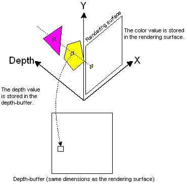

---
title: Depth buffers
description: A depth buffer, or z-buffer, stores depth information to control which areas of polygons are rendered rather than hidden from view.
ms.assetid: BE83A1D7-D43D-4013-8817-EFD2B24DC58E
keywords:
- Depth buffers
author: PeterTurcan
ms.author: pettur
ms.date: 02/08/2017
ms.topic: article
ms.prod: windows
ms.technology: uwp
---

# Depth buffers


A *depth buffer*, or *z-buffer*, stores depth information to control which areas of polygons are rendered rather than hidden from view.

## Overview


A depth buffer, often called a z-buffer or a w-buffer, is a property of the device that stores depth information to be used by Direct3D. When Direct3D renders a scene to a target surface, it can use the memory in an associated depth-buffer surface as a workspace to determine how the pixels of rasterized polygons occlude one another. Direct3D uses an off-screen Direct3D surface as the target to which final color values are written. The depth-buffer surface that is associated with the render-target surface is used to store depth information that tells Direct3D how deep each visible pixel is in the scene.

When a scene is rasterized with depth buffering enabled, each point on the rendering surface is tested. The values in the depth buffer can be a point's z-coordinate or its homogeneous w-coordinate - from the point's (x,y,z,w) location in projection space. A depth buffer that uses z values is often called a z-buffer, and one that uses w values is called a w-buffer. Each type of depth buffer has advantages and disadvantages, which are discussed later.

At the beginning of the test, the depth value in the depth buffer is set to the largest possible value for the scene. The color value on the rendering surface is set to either the background color value or the color value of the background texture at that point. Each polygon in the scene is tested to see if it intersects with the current coordinate (x,y) on the rendering surface.

If it does intersect, the depth value - which will be the z coordinate in a z-buffer, and the w coordinate in a w-buffer - at the current point is tested to see if it is smaller than the depth value stored in the depth buffer. If the depth of the polygon value is smaller, it is stored in the depth buffer and the color value from the polygon is written to the current point on the rendering surface. If the depth value of the polygon at that point is larger, the next polygon in the list is tested. This process is shown in the following diagram.



## Buffering techniques


Although most applications don't use this feature, you can change the comparison that Direct3D uses to determine which values are placed in the depth buffer and subsequently the render-target surface. On some hardware, changing the compare function may disable hierarchical z testing.

Nearly all accelerators on the market support z-buffering, making z-buffers the most common type of depth buffer today. However ubiquitous, z-buffers have their drawbacks. Due to the mathematics involved, the generated z values in a z-buffer tend not to be distributed evenly across the z-buffer range (typically 0.0 to 1.0, inclusive).

Specifically, the ratio between the far and near clipping planes strongly affects how unevenly z values are distributed. Using a far-plane distance to near-plane distance ratio of 100, 90 percent of the depth buffer range is spent on the first 10 percent of the scene depth range. Typical applications for entertainment or visual simulations with exterior scenes often require far-plane/near-plane ratios of anywhere between 1,000 to 10,000. At a ratio of 1,000, 98 percent of the range is spent on the first 2 percent of the depth range, and the distribution becomes worse with higher ratios. This can cause hidden surface artifacts in distant objects, especially when using 16-bit depth buffers, the most commonly supported bit-depth.

A w-based depth buffer, on the other hand, is often more evenly distributed between the near and far clip planes than a z-buffer. The key benefit is that the ratio of distances for the far and near clipping planes is no longer an issue. This allows applications to support large maximum ranges, while still getting relatively accurate depth buffering close to the eye point. A w-based depth buffer isn't perfect, and can sometimes exhibit hidden surface artifacts for near objects. Another drawback to the w-buffered approach is related to hardware support: w-buffering isn't supported as widely in hardware as z-buffering.

Using a z-buffer requires overhead during rendering. Various techniques can be used to optimize rendering when using z-buffers. Applications can increase performance when using z-buffering and texturing by ensuring that scenes are rendered from front to back. Textured z-buffered primitives are pretested against the z-buffer on a scan line basis. If a scan line is hidden by a previously rendered polygon, the system rejects it quickly and efficiently. Z-buffering can improve performance, but the technique is most useful when a scene draws the same pixels more than once. This is difficult to calculate exactly, but you can often make a close approximation. If the same pixels are drawn less than twice, you can achieve the best performance by turning z-buffering off and rendering the scene from back to front.

The actual interpretation of a depth value is specific to the renderer.

## Related topics


[Depth and stencil buffers](depth-and-stencil-buffers.md)

 

 




