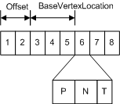

# Introduction to buffers

A buffer resource is a collection of fully typed data, grouped into elements. Buffers store data, such as texture coordinates in a *vertex buffer*, indexes in an *index buffer*, shader constants data in a *constant buffer*, position vectors, normal vectors, or device state.

A buffer element is made up of 1 to 4 components. Buffer elements can include packed data values (like R8G8B8A8 surface values), single 8-bit integers, or four 32-bit floating point values.

A buffer is created as an unstructured resource. Because it is unstructured, a buffer cannot contain any mipmap levels, it cannot get filtered when read, and it cannot be multisampled.

## Buffer Types

The following are the buffer resource types supported by Direct3D 11.

-   [Vertex Buffer](#vertex-buffer)
-   [Index Buffer](#index-buffer)
-   [Constant Buffer](#shader-constant-buffer)

### Vertex Buffer

A vertex buffer contains the vertex data used to define your geometry. Vertex data includes position coordinates, color data, texture coordinate data, normal data, and so on.

The simplest example of a vertex buffer is one that only contains position data. It can be visualized like the following illustration.

More often, a vertex buffer contains all the data needed to fully specify 3D vertices. An example of this could be a vertex buffer that contains per-vertex position, normal and texture coordinates. This data is usually organized as sets of per-vertex elements, as shown in the following illustration.

This vertex buffer contains per-vertex data; each vertex stores three elements (position, normal, and texture coordinates). The position and normal are each typically specified using three 32-bit floats and the texture coordinates using two 32-bit floats.

To access data from a vertex buffer you need to know which vertex to access, plus the following additional buffer parameters:

-   Offset - the number of bytes from the start of the buffer to the data for the first vertex.
-   BaseVertexLocation - the number of bytes from the offset to the first vertex used by the appropriate draw call.

Before you create a vertex buffer, you need to define its layout. After the input-layout object is created, you bind it to the [Input Assembler (IA) stage](input-assembler-stage--ia-.md).

### Index Buffer

Index buffers contain integer offsets into vertex buffers and are used to render primitives more efficiently. An index buffer contains a sequential set of 16-bit or 32-bit indices; each index is used to identify a vertex in a vertex buffer. An index buffer can be visualized like the following illustration.

The sequential indices stored in an index buffer are located with the following parameters:

-   Offset - the number of bytes from the base address of the index buffer.
-   StartIndexLocation - specifies the first index buffer element from the base address and the offset. The start location represents the first index to render.
-   IndexCount - the number of indices to render.

Start of Index Buffer = Index Buffer Base Address + Offset (bytes) + StartIndexLocation \* ElementSize (bytes);

In this calculation, ElementSize is the size of each index buffer element, which is either two or four bytes.

### Constant Buffer

A constant buffer allows you to efficiently supply shader constants data to the pipeline. You can use a constant buffer to store the results of the stream-output stage. Conceptually, a constant buffer looks just like a single-element vertex buffer, as shown in the following illustration.

Each element stores a 1-to-4 component constant, determined by the format of the data stored.

A constant buffer can only use a single bind flag , which cannot be combined with any other bind flag.

To read a shader-constant buffer from a shader, use an HLSL load function. Each shader stage allows up to 15 shader-constant buffers; each buffer can hold up to 4096 constants.

## Related topics

[Vertex and index buffers](vertex-and-index-buffers.md)

 

 

