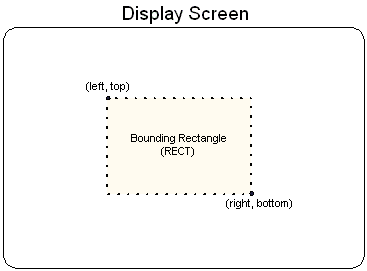

# Rectangles


Throughout Direct3D and Windows programming, objects on the screen are referred to in terms of bounding rectangles. The sides of a bounding rectangle are always parallel to the sides of the screen, so the rectangle can be described by two points, the upper-left corner and lower-right corner.

## <span id="Bounding_rectangles"></span><span id="bounding_rectangles"></span><span id="BOUNDING_RECTANGLES"></span>Bounding rectangles


Most applications use the [**RECT**](https://msdn.microsoft.com/library/windows/desktop/dd162897) structure (or a typedef'd alias for it) to carry information about a bounding rectangle to use when blitting to the screen or when performing hit detection. In C++, the **RECT** structure has the following definition.

```
typedef struct tagRECT { 
    LONG    left;    // This is the upper-left corner x-coordinate.
    LONG    top;     // The upper-left corner y-coordinate.
    LONG    right;   // The lower-right corner x-coordinate.
    LONG    bottom;  // The lower-right corner y-coordinate.
} RECT, *PRECT, NEAR *NPRECT, FAR *LPRECT; 
```

In the preceding example, the left and top members are the x- and y-coordinates of a bounding rectangle's upper-left corner. Similarly, the right and bottom members make up the coordinates of the lower-right corner. The following illustration shows how you can visualize these values.



The column of pixels at the right edge and the row of pixels at the bottom edge are not included in the RECT. For example, locking a RECT with members {10, 10, 138, 138} results in an object 128 pixels in width and height.

For efficiency, consistency, and ease of use, all Direct3D presentation functions work with rectangles.

## <span id="related-topics"></span>Related topics


[Coordinate systems and geometry](coordinate-systems-and-geometry.md)

 

 


