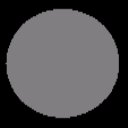
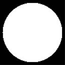
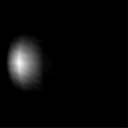

# Specular lighting

*Specular lighting* identifies the bright specular highlights that occur when light hits an object surface and reflects back toward the camera. Specular lighting is more intense than diffuse light and falls off more rapidly across the object surface. It takes longer to calculate specular lighting than diffuse lighting, however the benefit of using it is that it adds significant detail to a surface.

Modeling specular reflection requires that the system know in what direction light is traveling and the direction to the viewer's eye. The system uses a simplified version of the Phong specular-reflection model, which employs a halfway vector to approximate the intensity of specular reflection.

The default lighting state does not calculate specular highlights.

## Specular Lighting Equation

Specular Lighting is described by the following equation.

|                                                                             |
|-----------------------------------------------------------------------------|
| Specular Lighting = Cₛ \* sum\[Lₛ \* (N · H)P \* Atten \* Spot\] |

 

The variables, their types, and their ranges are as follows:

| Parameter    | Default value | Type                                                             | Description                                                                                            |
|--------------|---------------|------------------------------------------------------------------|--------------------------------------------------------------------------------------------------------|
| Cₛ           | (0,0,0,0)     | Red, green, blue, and alpha transparency (floating-point values) | Specular color.                                                                                        |
| sum          | N/A           | N/A                                                              | Summation of each light's specular component.                                                          |
| N            | N/A           | 3D vector (x, y, and z floating-point values)                    | Vertex normal.                                                                                         |
| H            | N/A           | 3D vector (x, y, and z floating-point values)                    | Half way vector. See the section on the halfway vector.                                                |
| P | 0.0           | Floating point                                                   | Specular reflection power. Range is 0 to +infinity                                                     |
| Lₛ           | (0,0,0,0)     | Red, green, blue, and alpha transparency (floating-point values) | Light specular color.                                                                                  |
| Atten        | N/A           | Floating point                                                   | Light attenuation value. See [Attenuation and spotlight factor](attenuation-and-spotlight-factor.md). |
| Spot         | N/A           | Floating point                                                   | Spotlight factor. See [Attenuation and spotlight factor](attenuation-and-spotlight-factor.md).        |

 

The value for Cₛ is either:

-   vertex color 1, if the specular material source is the diffuse vertex color, and the first vertex color is supplied in the vertex declaration.
-   vertex color 2, if specular material source is the specular vertex color, and the second vertex color is supplied in the vertex declaration.
-   material specular color

**Note**   If either specular material source option is used and the vertex color is not provided, then the material specular color is used.

 

Specular components are clamped to be from 0 to 255, after all lights are processed and interpolated separately.

## The Halfway Vector

The halfway vector (H) exists midway between two vectors: the vector from an object vertex to the light source, and the vector from an object vertex to the camera position. Direct3D provides two ways to compute the halfway vector. When camera-relative specular highlights is enabled (instead of orthogonal specular highlights), the system calculates the halfway vector using the position of the camera and the position of the vertex, along with the light's direction vector. The following formula illustrates this.

|                                           |
|-------------------------------------------|
| H = norm(norm(Cₚ - Vₚ) + Ldir) |

 

| Parameter       | Default value | Type                                          | Description                                                  |
|-----------------|---------------|-----------------------------------------------|--------------------------------------------------------------|
| Cₚ              | N/A           | 3D vector (x, y, and z floating-point values) | Camera position.                                             |
| Vₚ              | N/A           | 3D vector (x, y, and z floating-point values) | Vertex position.                                             |
| Ldir | N/A           | 3D vector (x, y, and z floating-point values) | Direction vector from vertex position to the light position. |

 

Determining the halfway vector in this manner can be computationally intensive. As an alternative, using orthogonal specular highlights (instead of camera-relative specular highlights) instructs the system to act as though the viewpoint is infinitely distant on the z-axis. This is reflected in the following formula.

|                                     |
|-------------------------------------|
| H = norm((0,0,1) + Ldir) |

 

This setting is less computationally intensive, but much less accurate, so it is best used by applications that use orthogonal projection.

## Example

In this example, the object is colored using the scene specular light color and a material specular color.

According to the equation, the resulting color for the object vertices is a combination of the material color and the light color.

The following two illustration show the specular material color, which is gray, and the specular light color, which is white.

The resulting specular highlight is shown in the following illustration.

Combining the specular highlight with the ambient and diffuse lighting produces the following illustration. With all three types of lighting applied, this more clearly resembles a realistic object.

Specular lighting is more intensive to calculate than diffuse lighting. It is typically used to provide visual clues about the surface material. The specular highlight varies in size and color with the material of the surface.

## Related topics

[Mathematics of lighting](mathematics-of-lighting.md)

 

 

