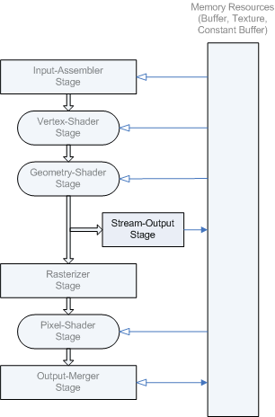

# Stream Output (SO) stage

The Stream Output (SO) stage continuously outputs (or streams) vertex data from the previous active stage to one or more buffers in memory. Data streamed out to memory can be re-circulated back into the pipeline as input data, or read-back from the CPU.

## Purpose and uses

The stream-output stage streams primitive data from the pipeline to memory on its way to the rasterizer. Data from the previous stage can be streamed out to memory, and/or passed into the rasterizer. Data streamed out to memory can be re-circulated back into the pipeline as input data, or read-back from the CPU.

Data streamed out to memory can be read back into the pipeline in a subsequent rendering pass, or can be copied to a staging resource (so it can be read by the CPU). The amount of data streamed out can vary; Direct3D is designed to handle the data without the need to query (the GPU) about the amount of data written.--&gt;

There are two ways to feed stream-output data into the pipeline:

-   Stream-output data can be fed back into the Input Assembler (IA) stage.
-   Stream-output data can be read by programmable shaders using [Load](https://msdn.microsoft.com/library/windows/desktop/bb509694) functions.

## Input

Vertex data from a previous shader stage.

## Output

The Stream Ouput (SO) stage continuously outputs (or streams) vertex data from the previous active stage, such as the Geometry Shader (GS) stage, to one or more buffers in memory. If the Geometry Shader (GS) stage is inactive, the Stream Ouput (SO) stage continuously outputs vertex data from the Domain Shader (DS) stage to buffers in memory (or if DS is also inactive, from the Vertex Shader (VS) stage).

When a triangle or line strip is bound to the Input Assembler (IA) stage, each strip is converted into a list before they are streamed out. Vertices are always written out as complete primitives (for example, 3 vertices at a time for triangles); incomplete primitives are never streamed out. Primitive types with adjacency discard the adjacency data before streaming data out.

The stream-output stage supports up to 4 buffers simultaneously.

-   If you are streaming data into multiple buffers, each buffer can only capture a single element (up to 4 components) of per-vertex data, with an implied data stride equal to the element width in each buffer (compatible with the way single element buffers can be bound for input into shader stages). Furthermore, if the buffers have different sizes, writing stops as soon as any one of the buffers is full.
-   If you are streaming data into a single buffer, the buffer can capture up to 64 scalar components of per-vertex data (256 bytes or less) or the vertex stride can be up to 2048 bytes.

## Related topics

[Graphics pipeline](graphics-pipeline.md)

 

 

