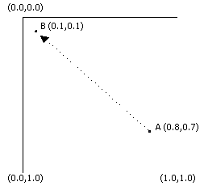
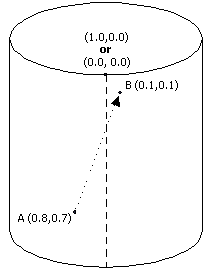
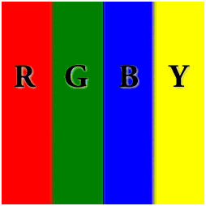
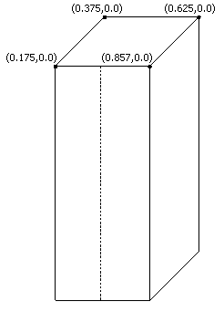
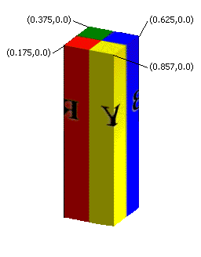

# Texture wrapping

Texture wrapping changes the basic way that Direct3D rasterizes textured polygons using the texture coordinates specified for each vertex. While rasterizing a polygon, the system interpolates between the texture coordinates at each of the polygon's vertices to determine the texels that should be used for every pixel of the polygon. Normally, the system treats the texture as a 2D plane, interpolating new texels by taking the shortest route from point A within a texture to point B. If point A represents the u, v position (0.8, 0.1), and point B is at (0.1,0.1), the line of interpolation looks like the following diagram.

Note that the shortest distance between A and B in this illustration runs roughly through the middle of the texture. Enabling u-texture or v-texture coordinate wrapping changes how Direct3D perceives the shortest route between texture coordinates in the u-direction and v-direction. By definition, texture wrapping causes the rasterizer to take the shortest route between texture coordinate sets, assuming that 0.0 and 1.0 are coincident. The last bit is the tricky part: You can imagine that enabling texture wrapping in one direction causes the system to treat a texture as though it were wrapped around a cylinder. For example, consider the following diagram.

The preceding illustration shows how wrapping in the u - direction affects how the system interpolates texture coordinates. Using the same points as in the example for normal, or nonwrapped, textures, you can see that the shortest route between points A and B is no longer across the middle of the texture; it's now across the border where 0.0 and 1.0 exist together. Wrapping in the v-direction is similar, except that it wraps the texture around a cylinder that is lying on its side. Wrapping in both the u-direction and v-direction is more complex. In this situation, you can envision the texture as a torus, or doughnut.

The most common practical application for texture wrapping is to perform environment mapping. Usually, an object textured with an environment map appears very reflective, showing a mirrored image of the object's surroundings in the scene. For the sake of this discussion, picture a room with four walls, each one painted with a letter R, G, B, Y and the corresponding colors: red, green, blue, and yellow. The environment map for such a simple room might look like the following illustration.

Imagine that the room's ceiling is held up by a perfectly reflective, four-sided, pillar. Mapping the environment map texture to the pillar is simple; making the pillar look as though it is reflecting the letters and colors is not as easy. The following diagram shows a wire frame of the pillar with the applicable texture coordinates listed near the top vertices. The seam where wrapping will cross the edges of the texture is shown with a dotted line.

With wrapping enabled in the u-direction, the textured pillar shows the colors and symbols from the environment map appropriately and, at the seam in the front of the texture, the rasterizer properly chooses the shortest route between the texture coordinates, assuming that u-coordinates 0.0 and 1.0 share the same location. The textured pillar looks like the following illustration.

If texture wrapping isn't enabled, the rasterizer does not interpolate in the direction needed to generate a believable, reflected image. Rather, the area at the front of the pillar contains a horizontally compressed version of the texels between u-coordinates 0.175 and 0.875, as they pass through the center of the texture. The wrap effect is ruined.

Do not confuse texture wrapping with the similarly named texture addressing modes. Texture wrapping is performed before texture addressing. Be sure the texture wrapping data does not contain any texture coordinates outside of the range of \[0.0, 1.0\] because this will produce undefined results. For more information about texture addressing, see [Texture addressing modes](texture-addressing-modes.md).

## Displacement map wrapping

Displacement maps are interpolated by the tesselation engine. Because the wrap mode cannot be specified for the tessellation engine, texture wrapping cannot be performed with displacement maps. An application is able to use a set of vertices that forces the interpolation to wrap in any direction. The application can also specify the interpolation to be done as a simple linear interpolation.

## Related topics

[Textures](textures.md)

 

 

