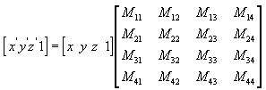
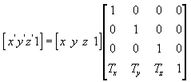
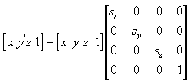
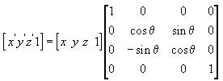
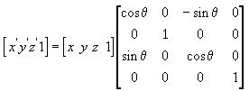
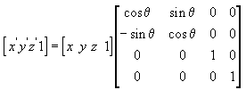

# Transform overview


\[Some information relates to pre-released product which may be substantially modified before it's commercially released. Microsoft makes no warranties, express or implied, with respect to the information provided here.\]

Matrix transformations handle a lot of the low level math of 3D graphics.

The geometry pipeline takes vertices as input. The transform engine applies the world, view, and projection transforms to the vertices, clips the result, and passes everything to the rasterizer.

| Transform and space                           | Description                                                                                                                                                                                                                                                                                                                                                                                                                                                                                                                                                                                                                                                                                                                                       |
|-----------------------------------------------|---------------------------------------------------------------------------------------------------------------------------------------------------------------------------------------------------------------------------------------------------------------------------------------------------------------------------------------------------------------------------------------------------------------------------------------------------------------------------------------------------------------------------------------------------------------------------------------------------------------------------------------------------------------------------------------------------------------------------------------------------|
| Model coordinates in model space              | At the head of the pipeline, a model's vertices are declared relative to a local coordinate system. This is a local origin and an orientation. This orientation of coordinates is often referred to as *model space*. Individual coordinates are called *model coordinates*.                                                                                                                                                                                                                                                                                                                                                                                                                                                                      |
| World transform into world space              | The first stage of the geometry pipeline transforms a model's vertices from their local coordinate system to a coordinate system that is used by all the objects in a scene. The process of reorienting the vertices is called the [World transform](world-transform.md), which converts from model space to a new orientation called *world space*. Each vertex in world space is declared using *world coordinates*.                                                                                                                                                                                                                                                                                                                           |
| View transform into view space (camera space) | In the next stage, the vertices that describe your 3D world are oriented with respect to a camera. That is, your application chooses a point-of-view for the scene, and world space coordinates are relocated and rotated around the camera's view, turning world space into *view space* (also known as *camera space*). This is the [View transform](view-transform.md), which converts from world space to view space.                                                                                                                                                                                                                                                                                                                        |
| Projection transform into projection space    | The next stage is the [Projection transform](projection-transform.md), which converts from view space to projection space. In this part of the pipeline, objects are usually scaled with relation to their distance from the viewer in order to give the illusion of depth to a scene; close objects are made to appear larger than distant objects. For simplicity, this documentation refers to the space in which vertices exist after the projection transform as *projection space*. Some graphics books might refer to projection space as *post-perspective homogeneous space*. Not all projection transforms scale the size of objects in a scene. A projection such as this is sometimes called an *affine* or *orthogonal projection*. |
| Clipping in screen space                      | In the final part of the pipeline, any vertices that will not be visible on the screen are removed, so that the rasterizer doesn't take the time to calculate the colors and shading for something that will never be seen. This process is called *clipping*. After clipping, the remaining vertices are scaled according to the viewport parameters and converted into screen coordinates. The resulting vertices, seen on the screen when the scene is rasterized, exist in *screen space*.                                                                                                                                                                                                                                                    |

 

Transforms are used to convert object geometry from one coordinate space to another. Direct3D uses matrices to perform 3D transforms. Matrices create 3D transforms. You can combine matrices to produce a single matrix that encompasses multiple transforms.

You can transform coordinates between model space, world space, and view space.

-   [World transform](world-transform.md) - Converts from model space to world space.
-   [View transform](view-transform.md) - Converts from world space to view space.
-   [Projection transform](projection-transform.md) - Converts from view space to projection space.

## <span id="Matrix_Transforms"></span><span id="matrix_transforms"></span><span id="MATRIX_TRANSFORMS"></span>Matrix Transforms


In applications that work with 3D graphics, you can use geometrical transforms to do the following:

-   Express the location of an object relative to another object.
-   Rotate and size objects.
-   Change viewing positions, directions, and perspectives.

You can transform any point (x,y,z) into another point (x', y', z') by using a 4x4 matrix, as shown in the following equation.



Perform the following equations on (x, y, z) and the matrix to produce the point (x', y', z').


The most common transforms are translation, rotation, and scaling. You can combine the matrices that produce these effects into a single matrix to calculate several transforms at once. For example, you can build a single matrix to translate and rotate a series of points.

Matrices are written in row-column order. A matrix that evenly scales vertices along each axis, known as uniform scaling, is represented by the following matrix using mathematical notation.


In C++, Direct3D declares matrices as a two-dimensional array, using a matrix struct. The following example shows how to initialize a [**D3DMATRIX**](https://msdn.microsoft.com/library/windows/desktop/bb172573) structure to act as a uniform scaling matrix (scale factor "s").

```
D3DMATRIX scale = {
    5.0f,            0.0f,            0.0f,            0.0f,
    0.0f,            5.0f,            0.0f,            0.0f,
    0.0f,            0.0f,            5.0f,            0.0f,
    0.0f,            0.0f,            0.0f,            1.0f
};
```

## <span id="Translate"></span><span id="translate"></span><span id="TRANSLATE"></span>Translate


The following equation translates the point (x, y, z) to a new point (x', y', z').



You can manually create a translation matrix in C++. The following example shows the source code for a function that creates a matrix to translate vertices.

```
D3DXMATRIX Translate(const float dx, const float dy, const float dz) {
    D3DXMATRIX ret;

    D3DXMatrixIdentity(&ret);
    ret(3, 0) = dx;
    ret(3, 1) = dy;
    ret(3, 2) = dz;
    return ret;
}    // End of Translate
```

## <span id="Scale"></span><span id="scale"></span><span id="SCALE"></span>Scale


The following equation scales the point (x, y, z) by arbitrary values in the x-, y-, and z-directions to a new point (x', y', z').



## <span id="Rotate"></span><span id="rotate"></span><span id="ROTATE"></span>Rotate


The transforms described here are for left-handed coordinate systems, and so may be different from transform matrices that you have seen elsewhere.

The following equation rotates the point (x, y, z) around the x-axis, producing a new point (x', y', z').



The following equation rotates the point around the y-axis.



The following equation rotates the point around the z-axis.



In these example matrices, the Greek letter theta stands for the angle of rotation, in radians. Angles are measured clockwise when looking along the rotation axis toward the origin.

The following code shows a function to handle rotation about the X axis.

```
    // Inputs are a pointer to a matrix (pOut) and an angle in radians.
    float sin, cos;
    sincosf(angle, &sin, &cos);  // Determine sin and cos of angle

    pOut->_11 = 1.0f; pOut->_12 =  0.0f;   pOut->_13 = 0.0f; pOut->_14 = 0.0f;
    pOut->_21 = 0.0f; pOut->_22 =  cos;    pOut->_23 = sin;  pOut->_24 = 0.0f;
    pOut->_31 = 0.0f; pOut->_32 = -sin;    pOut->_33 = cos;  pOut->_34 = 0.0f;
    pOut->_41 = 0.0f; pOut->_42 =  0.0f;   pOut->_43 = 0.0f; pOut->_44 = 1.0f;

    return pOut;
}
```

## <span id="Concatenating_Matrices"></span><span id="concatenating_matrices"></span><span id="CONCATENATING_MATRICES"></span>Concatenating Matrices


One advantage of using matrices is that you can combine the effects of two or more matrices by multiplying them. This means that, to rotate a model and then translate it to some location, you don't need to apply two matrices. Instead, you multiply the rotation and translation matrices to produce a composite matrix that contains all their effects. This process, called matrix concatenation, can be written with the following equation.


In this equation, C is the composite matrix being created, and M₁ through Mₙ are the individual matrices. In most cases, only two or three matrices are concatenated, but there is no limit.

The order in which the matrix multiplication is performed is crucial. The preceding formula reflects the left-to-right rule of matrix concatenation. That is, the visible effects of the matrices that you use to create a composite matrix occur in left-to-right order. A typical world matrix is shown in the following example. Imagine that you are creating the world matrix for a stereotypical flying saucer. You would probably want to spin the flying saucer around its center - the y-axis of model space - and translate it to some other location in your scene. To accomplish this effect, you first create a rotation matrix, and then multiply it by a translation matrix, as shown in the following equation.


In this formula, R<sub>y</sub> is a matrix for rotation about the y-axis, and T<sub>w</sub> is a translation to some position in world coordinates.

The order in which you multiply the matrices is important because, unlike multiplying two scalar values, matrix multiplication is not commutative. Multiplying the matrices in the opposite order has the visual effect of translating the flying saucer to its world space position, and then rotating it around the world origin.

No matter what type of matrix you are creating, remember the left-to-right rule to ensure that you achieve the expected effects.

## <span id="related-topics"></span>Related topics


[Transforms](transforms.md)

 

 


