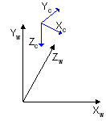

# View transform

A *view transform* locates the viewer in world space, transforming vertices into camera space. In camera space, the camera, or viewer, is at the origin, looking in the positive z-direction. The view matrix relocates the objects in the world around a camera's position - the origin of camera space - and orientation. Direct3D uses a left-handed coordinate system, so z is positive into a scene.

There are many ways to create a view matrix. In all cases, the camera has some logical position and orientation in world space that is used as a starting point to create a view matrix that will be applied to the models in a scene. The view matrix translates and rotates objects to place them in camera space, where the camera is at the origin. One way to create a view matrix is to combine a translation matrix with rotation matrices for each axis. In this approach, the following general matrix equation applies.

In this formula, V is the view matrix being created, T is a translation matrix that repositions objects in the world, and Rₓ through Rz are rotation matrices that rotate objects along the x-, y-, and z-axis. The translation and rotation matrices are based on the camera's logical position and orientation in world space. So, if the camera's logical position in the world is &lt;10,20,100&gt;, the aim of the translation matrix is to move objects -10 units along the x-axis, -20 units along the y-axis, and -100 units along the z-axis. The rotation matrices in the formula are based on the camera's orientation, in terms of how much the axes of camera space are rotated out of alignment with world space. For example, if the camera mentioned earlier is pointing straight down, its z-axis is 90 degrees (pi/2 radians) out of alignment with the z-axis of world space, as shown in the following illustration.

The rotation matrices apply rotations of equal, but opposite, magnitude to the models in the scene. The view matrix for this camera includes a rotation of -90 degrees around the x-axis. The rotation matrix is combined with the translation matrix to create a view matrix that adjusts the position and orientation of the objects in the scene so that their top is facing the camera, giving the appearance that the camera is above the model.

## Setting Up a View Matrix

Direct3D uses the world and view matrices to configure several internal data structures. Each time you set a new world or view matrix, the system recalculates the associated internal structures. Setting these matrices frequently is computationally time-consuming. You can minimize the number of required calculations by concatenating your world and view matrices into a world-view matrix that you set as the world matrix, and then setting the view matrix to the identity. Keep cached copies of individual world and view matrices that you can modify, concatenate, and reset the world matrix as needed.

## Related topics

[Transforms](transforms.md)

 

 

