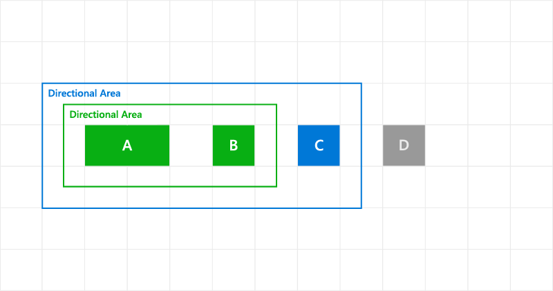
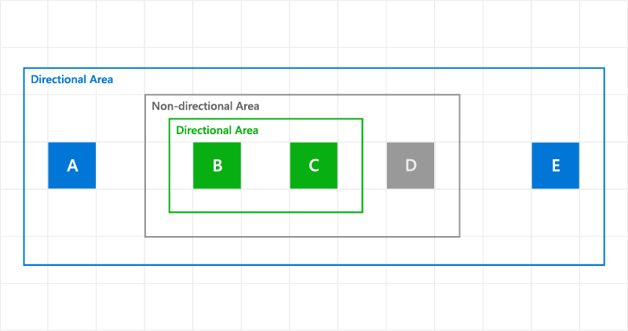
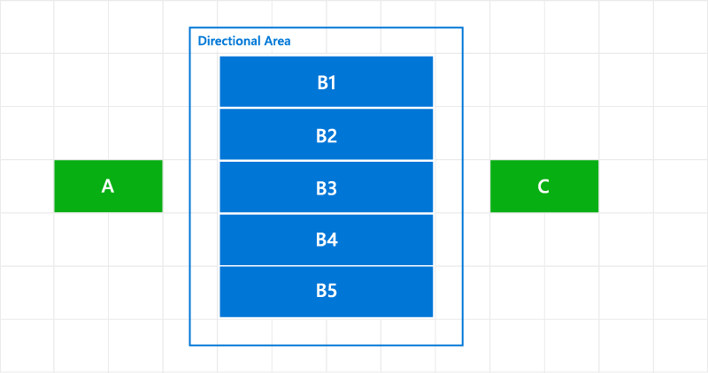
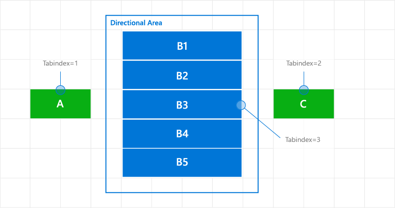

#Custom keyboard interactions

Provide comprehensive and consistent keyboard interaction experiences in
your UWP apps and custom controls for both keyboard power users and
those with disabilities and other accessibility requirements.

In this topic, our primary focus is on supporting keyboard input with
custom controls for UWP apps on PCs. However, a well-designed keyboard
experience is important for supporting accessibility tools such as
Windows Narrator, using software keyboards such as the touch keyboard
and the On-Screen Keyboard (OSK).

##Providing 2D directional inner navigation <a name="xyfocuskeyboardnavigation">

Use the
**XYFocusKeyboardNavigation** property to support 2D directional inner
navigation of custom controls and control groups with keyboard (arrow
keys), Xbox gamepad (D-pad and left stick buttons), and Xbox remote
control (D-pad).

**NOTE** We refer to the inner navigation region of a control or control
group as the *directional area*.

**XYFocusKeyboardNavigation** has a value of type
**XYFocusKeyboardNavigationMode** with possible values of **Auto**
(default), **Enabled** or **Disabled**.

This property does not affect tab navigation, it only affects the inner
navigation of child elements within your control or control group. Child
elements of a directional area should not be included in tab navigation.

### Default behavior

Directional navigation behavior is based on the element’s ancestry, or
inheritance hierarchy. If all ancestors are in default mode, or set to
**Auto**, directional navigation behavior is not supported for keyboard
(gamepad and remote control always support directional navigation unless
explicitly set to **Disabled**).

### Custom behavior

Setting this property to **Enabled** lets your control support 2D inner
navigation (using the keyboard arrow keys) over every UIElement within
your control.

When using the keyboard arrow keys, navigation is constrained within the
directional area (pressing the tab key sets focus to the next focusable
element outside the directional area).

**NOTE** This is not the case when using a gamepad or remote, where
navigation continues outside the directional area to the next focusable
control.

This property affects only inner navigation with arrow keys, it does not
affect tab key navigation. All controls maintain their expected tab
order hierarchy.

The following image shows three buttons (A, B, and C) contained within a
directional area and a fourth button (D) outside the directional area.


*Keyboard arrow keys can move focus between the buttons A-B-C, but not
D*

The following code example shows how navigation is affected when
**XYFocusKeyboardNavigation** is enabled. Using the previous image, A
has initial focus and the tab key cycles through all controls (A -&gt; B
-&gt; C -&gt; D and back to A) while the arrow keys are constrained to
the directional area.

```XAML
<StackPanel Orientation="Horizontal">
      <StackPanel Orientation="Horizontal" XYFocusKeyboardNavigation="Enabled">
            <Button Content="A" />
            <Button Content="B" />
            <Button Content="C" />
      </StackPanel>
      <Button Content="D" />
</StackPanel>
```

#### Override directional navigation

Use the XYFocusRight/XYFocusLeft/XYFocusTop/XYFocusDown properties to
override the default navigation behaviors.

Here’s the same image as the previous example showing three buttons (A,
B, and C) contained within a directional area and a fourth button (D)
outside the directional area.


*Keyboard arrow keys can move focus between the buttons A-B-C, and out
to D*

This code example demonstrates how to override the default navigation
behavior for the Right arrow key by allowing it to navigate to a control
outside the directional area. Note that the directional area cannot be
re-entered using the left arrow key.

```XAML
<StackPanel Orientation="Horizontal">
      <StackPanel Orientation="Horizontal" XYFocusKeyboardNavigation="Enabled">
            <Button Content="A" />
            <Button Content="B" />
            <Button Content="C" XYFocusRight="{x:Bind ButtonD}" />
      </StackPanel>
      <Button Content="D" x:Name="ButtonD"/>
</StackPanel>
```

For more detail, see [XYFocus Navigation
Strategies](#set-the-tab-navigation-behavior) later in this topic.

#### Restrict navigation with Disabled

Set **XYFocusKeyboardNavigation** to **Disabled** to restrict arrow key
navigation within a directional area.

**NOTE** Setting this property to does affect keyboard navigation to the
control itself, just the control’s child elements.

In the following code example, the parent StackPanel has
**XYFocusKeyboardNavigation** set to **Enabled** and the child element,
C, has **XYFocusKeyboardNavigation** set to **Disabled**. Only the child
elements of C have arrow key navigation disabled.

```XAML
<StackPanel Orientation="Horizontal" XYFocusKeyboardNavigation="Enabled">
        <Button Content="A" />
        <Button Content="B" />
        <Button Content="C" XYFocusKeyboardNavigation="Disabled" >
            ...
        </Button>
</StackPanel>
```

#### Use nested directional areas

You can have multiple levels of nested directional areas. If all parent
elements have **XYFocusKeyboardNavigation** set to **Enabled**, region
boundaries are ignored by arrow key navigation.

Here’s an image showing three buttons (A, B, and C) contained within a
nested directional area and a fourth button (D) outside the directional
area.



*Keyboard arrow keys can move focus between the buttons A-B-C, but not
D*

This code example demonstrates how to specify that nested directional
areas support arrow key navigation across region boundaries.

```XAML
<StackPanel Orientation="Horizontal">
        <StackPanel Orientation="Horizontal" XYFocusKeyboardNavigation ="Enabled">
            <StackPanel Orientation="Horizontal" XYFocusKeyboardNavigation ="Enabled">
                <Button Content="A" />
                <Button Content="B" />
            </StackPanel>
            <Button Content="C" />
        </StackPanel>
        <Button Content="D" />
 </StackPanel>
```

Here’s an image showing four buttons (A, B, C, and D) where A and B are
contained within a nested directional area, and C and D are contained
within a different area. As the parent element has
**XYFocusKeyboardNavigation** set to **Disabled**, the boundary of each
nested area cannot be crossed using the arrow keys.


*Keyboard arrow keys can move focus between buttons A-B and between
buttons C-D, but not between regions*

This code example demonstrates how to specify nested directional areas
that do not support arrow key navigation across region boundaries.

```XAML
<StackPanel Orientation="Horizontal">
  <StackPanel Orientation="Horizontal" XYFocusKeyboardNavigation="Enabled">
    <Button Content="A" />
    <Button Content="B" />
  </StackPanel>
  <StackPanel Orientation="Horizontal" XYFocusKeyboardNavigation="Enabled">
    <Button Content="C" />
    <Button Content="D" />
  </StackPanel>
</StackPanel>
```

Here’s a more complex example of nested directional areas where:

-   if A has focus, only E can be navigated to (and vice versa) because
    there is a non-directional area boundary that makes B, C, and D
    unreachable with the arrow keys
-   If B has focus, only C can be navigated to (and vice versa) because
    D is outside the directional area and the non-directional area
    boundary blocks access to A and E
-   If D has focus, the Tab key must be used to navigate between
    controls as arrow key navigation is not possible



*Keyboard arrow keys can move focus between buttons A-E and between
buttons B-C, but not between other regions*

This code example demonstrates how to specify nested directional areas
that support complex arrow key navigation across region boundaries.

```XAML
<StackPanel  Orientation="Horizontal" XYFocusKeyboardNavigation ="Enabled">
  <Button Content="A" />
    <StackPanel Orientation="Horizontal" XYFocusKeyboardNavigation ="Disabled">
      <StackPanel Orientation="Horizontal" XYFocusKeyboardNavigation ="Enabled">
        <Button Content="B" />
        <Button Content="C" />
      </StackPanel>
        <Button Content="D" />
    </StackPanel>
  <Button Content="E" />
</StackPanel>
```

##Set the tab navigation behavior <a name="tab-navigation">

The
UIElement.[TabFocusNavigation](http://msdn.microsoft.com/en-us/library/windows/apps/xaml/Windows.UI.Xaml.Controls.Control.TabNavigation)
property specifies the tab navigation behavior for its entire object
tree (or directional area).

[TabFocusNavigation](http://msdn.microsoft.com/en-us/library/windows/apps/xaml/Windows.UI.Xaml.Controls.Control.TabNavigation)
has a value of type **TabFocusNavigationMode** with possible values of
**Once**, **Cycle,** **or Local** (default).

In the following image, depending on the tab navigation of the
directional area, focus is moved in the following ways:

-   Once: A, B1, C, A
-   Local: A, B1, B2, B3, B4, B5, C, A
-   Cycle: A, B1, B2, B3, B4, B5, B1, B2, B3, B4, B5, (cycling on B’s)



*Focus behavior based on tab navigation mode*

The following code example demonstrates using TabFocusNavigation with a
mode of Once.

```XAML
<Button Content="X" Click="OnAClick"/>
<StackPanel Orientation="Horizontal" XYFocusNavigation ="Local"
   TabFocusNavigation ="Local">
   <Button Content="A" Click="OnAClick"/>
   <StackPanel Orientation="Horizontal" TabFocusNavigation ="Once">
        <Button Content="B" Click="OnBClick"/>
        <Button Content="C" Click="OnCClick"/>
        <Button Content="D" Click="OnDClick"/>
   </StackPanel>
   <Button Content="E" Click="OnBClick"/>
</StackPanel>
```

*The Tab Navigation when focus is on X is: A,B,E,X*

#### About TabFocusNavigation and TabIndex

The UIElement.TabFocusNavigation property has the same behavior as the
Control.TabNavigation property, including how it works with TabIndex.

When a control has no TabIndex specified, the framework assigns it a
higher index value than the current highest index value (and the lowest
priority). It resolves the ambiguate by choosing the first element on
the visual tree. The framework resolves Tab indexes per scope. The
children of a control are considered a scope, and if one of this child
has children, those are part of another scope.

In the following image, depending on the tab navigation of the
directional area and the tab index of the elements, focus is moved in
the following ways:

-   Once: A, B3, C, A.
-   Local: A, B3, B4, B5, B1, B2, C, A.
-   Cycle: A, B3, B4, B5, B1, B2, B3, B4, B5, B1, B2, (cycling on B’s)



*Focus behavior based on tab navigation mode and tab indexes*

Notice how the directional area is considered a scope and how focus
navigation moves to the control with the highest priority first: B3. In
fact, there are two scopes: One for A, Directional Area, and C. And
another for the Directional area. Because the directional area is not a
TabStop, the framework switches the scope to look for the best
candidate, and then recursively through any child elements.
