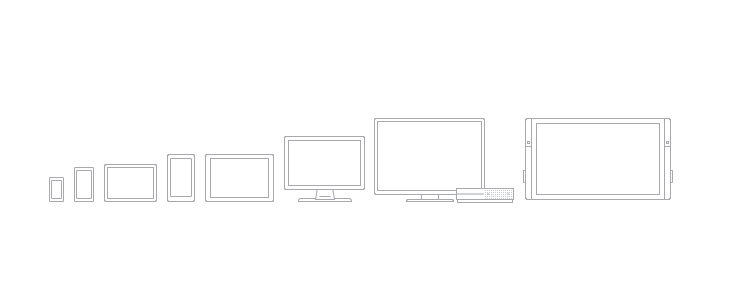
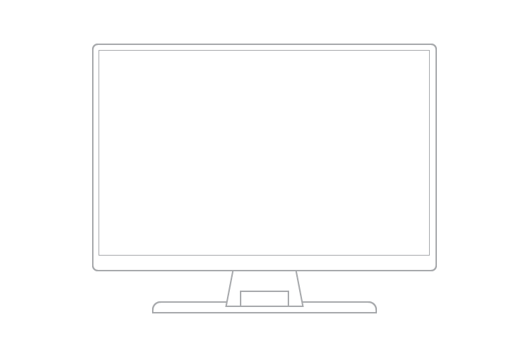
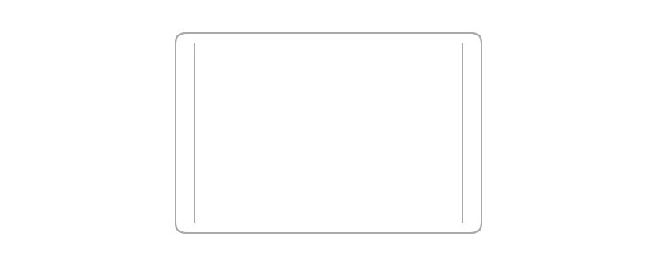
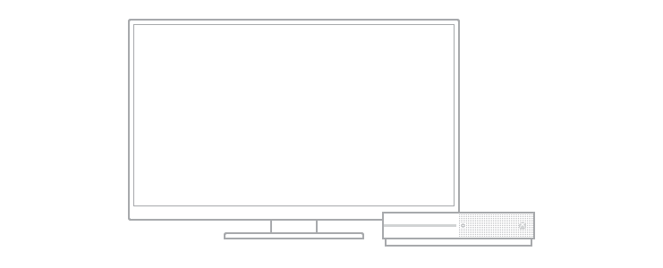
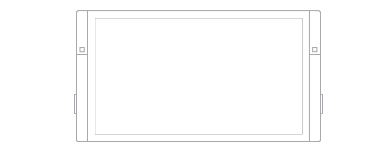

#  Device primer for Universal Windows Platform (UWP) apps

<link rel="stylesheet" href="https://az835927.vo.msecnd.net/sites/uwp/Resources/css/custom.css">

Getting to know the devices that support Universal Windows Platform (UWP) apps will help you offer the best user experience for each form factor. When designing for a particular device, the main considerations include how the app will appear on that device, where, when, and how the app will be used on that device, and how the user will interact with that device.

## PCs and laptops

Windows PCs and laptops include a wide array of devices and screen sizes. In general, PCs and laptops can display more info than phone or tablets.

Screen sizes
-   13” and greater

Typical usage
-   Apps on desktops and laptops see shared use, but by one user at a time, and usually for longer periods.

UI considerations
-   Apps can have a windowed view, the size of which is determined by the user. Depending on window size, there can be between one and three frames. On larger monitors, the app can have more than three frames.

-   When using an app on a desktop or laptop, the user has control over app files. As an app designer, be sure to provide the mechanisms to manage your app’s content. Consider including commands and features such as "Save As", "Recent files", and so on.

-   System back is optional. When an app developer chooses to show it, it appears in the app title bar.

Inputs
-   Mouse
-   Keyboard
-   Touch on laptops and all-in-one desktops.
-   Gamepads, such as the Xbox controller, are sometimes used.

Typical device capabilities
-   Camera
-   Microphone

## Tablets and 2-in-1s

Ultra-portable tablet computers are equipped with touchscreens, cameras, microphones, and accelerometers. Tablet screen sizes usually range from 7” to 13.3”. 2-in-1 devices can act like either a tablet or a laptop with a keyboard and mouse, depending on the configuration (usually involving folding the screen back or tilting it upright).

Screen sizes
- 7” to 13.3” for tablet
- 13.3" and greater for 2-in-1

Typical usage
-   About 80% of tablet use is by the owner, with the other 20% being shared use.
-   It’s most commonly used at home as a companion device while watching TV.
-   It’s used for longer periods than phones and phablets.
-   Text is entered in short bursts.

UI considerations
-   In both landscape and portrait orientations, tablets allow two frames at a time.
-   System back is located on the navigation bar.

Inputs
-   Touch
-   Stylus
-   External keyboard (occasionally)
-   Mouse (occasionally)
-   Voice (occasionally)

Typical device capabilities
-   Camera
-   Microphone
-   Movement sensors
-   Location sensors

> [!NOTE]
> Most of the considerations for PCs and laptops apply to 2-in-1s as well.

## Xbox and TV

The experience of sitting on your couch across the room, using a gamepad or remote to interact with your TV, is called the **10-foot experience**. It is so named because the user is generally sitting approximately 10 feet away from the screen. This provides unique challenges that aren't present in, say, the *2-foot* experience, or interacting with a PC. If you are developing an app for Xbox One or any other device that's connected to a TV screen and might use a gamepad or remote for input, you should always keep this in mind.

Designing your UWP app for the 10-foot experience is very different from designing for any of the other device categories listed here. For more information, see [Designing for Xbox and TV](designing-for-tv.md).

Screen sizes
- 24" and up

Typical usage
- Often shared among several people, though is also often used by just one person.
- Usually used for longer periods.
- Most commonly used at home, staying in one place.
- Rarely asks for text input because it takes longer with a gamepad or remote.
- Orientation of the screen is fixed.
- Usually only runs one app at a time, but it may be possible to snap apps to the side (such as on Xbox).

UI considerations
- Apps usually stay the same size, unless another app is snapped to the side.
- System back is useful functionality that is offered in most Xbox apps, accessed using the B button on the gamepad.
- Since the customer is sitting approximately 10 feet away from the screen, make sure that UI is large and clear enough to be visible.

Inputs
- Gamepad (such as an Xbox controller)
- Remote
- Voice (occasionally, if the customer has a Kinect or headset)

Typical device capabilities
- Camera (occasionally, if the customer has a Kinect)
- Microphone (occasionally, if the customer has a Kinect or headset)
- Movement sensors (occasionally, if the customer has a Kinect)

## Phones and phablets

The most widely-used of all computing devices, phones can do a lot with limited screen real estate and basic inputs. Phones are available in a variety of sizes; larger phones are called phablets. App experiences on phablets are similar to those on phones, but the increased screen real estate of phablets enable some key changes in content consumption.

With Continuum for Phones, a new experience for compatible Windows 10 mobile devices, users can connect their phones to a monitor and even use a mouse and keyboard to make their phones work like a laptop. (For more info, see the [Continuum for Phone article](http://go.microsoft.com/fwlink/p/?LinkID=699431).)

Screen sizes
-   4'' to 5'' for phone
-   5.5'' to 7'' for phablet

Typical usage
-   Primarily used in portrait orientation, mostly due to the ease of holding the phone with one hand and being able to fully interact with it that way, but there are some experiences that work well in landscape, such as viewing photos and video, reading a book, and composing text.
-   Mostly used by just one person, the owner of the device.
-   Always within reach, usually stashed in a pocket or a bag.
-   Used for brief periods of time.
-   Users are often multitasking when using the phone.
-   Text is entered in short bursts.

UI considerations
-   The small size of a phone's screen allows only one frame at a time to be viewed in both portrait and landscape orientations. All hierarchical navigation patterns on a phone use the "drill" model, with the user navigating through single-frame UI layers.

-   Similar to phones, phablets in portrait mode can view only one frame at a time. But with the greater screen real estate available on a phablet, users have the ability to rotate to landscape orientation and stay there, so two app frames can be visible at a time.

-   In both landscape and portrait orientations, be sure that there's enough screen real estate for the app bar when the on-screen keyboard is up.

Inputs
-   Touch
-   Voice

Typical device capabilities
-   Microphone
-   Camera
-   Movement sensors
-   Location sensors

 

## Surface Hub devices

Microsoft Surface Hub is a large-screen team collaboration device designed for simultaneous use by multiple users.

Screen sizes
-   55” and 84''

Typical usage
-   Apps on Surface Hub see shared use for short periods of time, such as in meetings.

-   Surface Hub devices are mostly stationary and rarely moved.

UI considerations
-   Apps on Surface Hub can appear in one of four states - full (standard full-screen view), background (hidden from view while the app is still running, available in task switcher), fill (a fixed view that occupies the available stage area), and snapped (variable view that occupies the right or left sides of the stage).
-   In snapped mode or fill modes, the system displays the Skype sidebar and shrinks the app horizontally.
-   System back is optional. When an app developer chooses to show it, it appears in the app title bar.

Inputs
-   Touch
-   Pen
-   Voice
-   Keyboard (on-screen/remote)
-   Touchpad (remote)

Typical device capabilities
-   Camera
-   Microphone

 

## Windows IoT devices

Windows IoT devices are an emerging class of devices centered around embedding small electronics, sensors, and connectivity within physical objects. These devices are usually connected through a network or the Internet to report on the real-world data they sense, and in some cases act on it. Devices can either have no screen (also known as “headless” devices) or are connected to a small screen (known as “headed” devices) with a screen size usually 3.5” or smaller.

Screen sizes
-   3.5'' or smaller
-   Some devices have no screen

Typical usage
-   Usually connected through a network or the Internet to report on the real-world data they sense, and in some cases act on it.
-   These devices can only run one application at a time unlike phones or other larger devices.
-   It isn’t something that is interacted with all the time, but instead is available when you need it, out of the way when you don’t.
-   App doesn’t have a dedicated back affordance, that is the developers responsibility.

UI considerations
-   "headless" devices have no screen.
-   Display for “headed” devices is minimal, only showing what is necessary due to limited screen real estate and functionality.
-   Orientation is most times locked, so your app only needs to consider one display direction.

Inputs
-   Variable, depending on the device

Typical device capabilities
-   Variable, depending on the device