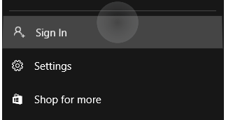
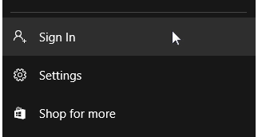
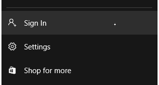
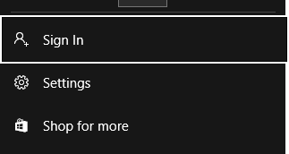
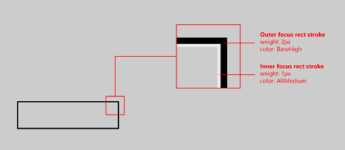
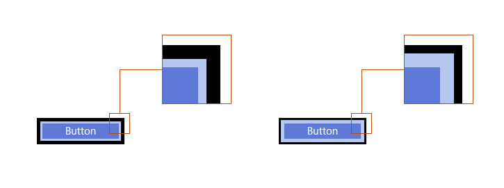
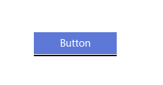
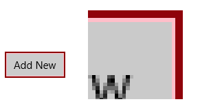

---
author: Karl-Bridge-Microsoft
Description: Use visual feedback to show users when their interactions with a Windows Store app are detected, interpreted, and handled.
title: Visual feedback
ms.assetid: bf2f3672-95f0-4c8c-9a72-0934f2d3b767
label: Visual feedback
template: detail.hbs
keywords: visual feedback, focus feedback, touch feedback, contact visualization, input, interaction
ms.author: kbridge
ms.date: 02/08/2017
ms.topic: article
ms.prod: windows
ms.technology: uwp
---

# Guidelines for visual feedback
<link rel="stylesheet" href="https://az835927.vo.msecnd.net/sites/uwp/Resources/css/custom.css">

Use visual feedback to show users when their interactions are detected, interpreted, and handled. Visual feedback can help users by encouraging interaction. It indicates the success of an interaction, which improves the user's sense of control. It also relays system status and reduces errors.

<div class="important-apis" >
<b>Important APIs</b><br/>
<ul>
<li>[**Windows.Devices.Input**](https://msdn.microsoft.com/library/windows/apps/br225648)</li>
<li>[**Windows.UI.Input**](https://msdn.microsoft.com/library/windows/apps/br242084)</li>
<li>[**Windows.UI.Core**](https://msdn.microsoft.com/library/windows/apps/br208383)</li>
</ul>
</div>

## Recommendations

-   Try to remain as close to the original control template as possible, for optimal control and application performance.
-   Don't use touch visualizations in situations where they might interfere with the use of the app. For more info, see [**ShowGestureFeedback**](https://msdn.microsoft.com/library/windows/apps/br241969).
-   Don't display feedback unless it is absolutely necessary. Keep the UI clean and uncluttered by not showing visual feedback unless you are adding value that is not available elsewhere.
-   Try not to dramatically customize the visual feedback behaviors of the built-in Windows gestures, as this can create an inconsistent and confusing user experience.

## Additional usage guidance

Contact visualizations are especially critical for touch interactions that require accuracy and precision. For example, your app should clearly indicate the location of a tap to let a user know if they missed their target, how much they missed it by, and what adjustments they must make.

Using the default XAML platform controls available ensures that your app works correctly on all devices and in all input situations. If your app features custom interactions that require customized feedback, you should ensure the feedback is appropriate, spans input devices, and doesn't distract a user from their task. This can be a particular issue in game or drawing apps, where the visual feedback might conflict with or obscure critical UI.

[!IMPORTANT] We don't recommend changing the interaction behavior of the built-in gestures. 

**Feedback Across Devices**

Visual feedback is generally dependent on the input device (touch, touchpad, mouse, pen/stylus, keyboard, and so on). For example, the built-in feedback for a mouse usually involves moving and changing the cursor, while touch and pen require contact visualizations, and keyboard input and navigation uses focus rectangles and highlighting.

Use [**ShowGestureFeedback**](https://msdn.microsoft.com/library/windows/apps/br241969) to set feedback behavior for the platform gestures.

If customizing feedback UI, ensure you provide feedback that supports, and is suitable for, all input modes.

Here are some examples of built-in contact visualizations in Windows.

|  |  |  |  |
| --- | --- | --- | --- |
| Touch visualization | Mouse/touchpad visualization | Pen visualization | Keyboard visualization |

## High Visibility Focus Visuals

All Windows apps sport a more defined focus visual around interactable controls within the application. These new focus visuals are fully customizable as well as disableable when needed.

## Color Branding & Customizing

**Border Properties**

There are two parts to the high visibility focus visuals: the primary border and the secondary border. The primary border is **2px** thick, and runs around the *outside* of the secondary border. The secondary border is **1px** thick and runs around the *inside* of the primary border.


To change the thickness of either border type (primary or secondary) use the **FocusVisualPrimaryThickness** or **FocusVisualSecondaryThickness**, respectively:
```XAML
<Slider Width="200" FocusVisualPrimaryThickness="5" FocusVisualSecondaryThickness="2"/>
```


The margin is a property of type [**Thickness**](https://msdn.microsoft.com/library/system.windows.thickness), and therefore the margin can be customized to appear only on certain sides of the control. See below:


The margin is the space between the control's visual bounds and the start of the focus visuals *secondary border*. The default margin is **1px** away from the control bounds. You can edit this margin on a per-control basis, by changing the **FocusVisualMargin** property:
```XAML
<Slider Width="200" FocusVisualMargin="-5"/>
```


*A negative margin will push the border away from the center of the control, and a positive margin will move the border closer to the center of the control.*

To turn off focus visuals on the control entirely, simply disabled **UseSystemFocusVisuals**:
```XAML
<Slider Width="200" UseSystemFocusVisuals="False"/>
```

The thickness, margin, or whether or not the app-developer wishes to have the focus visuals at all, is determined on a per-control basis.

**Color Properties**

There are only two color properties for the focus visuals: the primary border color, and the secondary border color. These focus visual border colors can be changed per-control on an page level, and globally on an app-wide level:

To brand focus visuals app-wide, override the system brushes:
```XAML
<SolidColorBrush x:Key="SystemControlFocusVisualPrimaryBrush" Color="DarkRed"/>
<SolidColorBrush x:Key="SystemControlFocusVisualSecondaryBrush" Color="Pink"/>
```


To change the colors on a per-control basis, just edit the focus visual properties on the desired control:
```XAML
<Slider Width="200" FocusVisualPrimaryBrush="DarkRed" FocusVisualSecondaryBrush="Pink"/>
```

## Related articles

**For designers**
* [Guidelines for panning](guidelines-for-panning.md)

**For developers**
* [Custom user interactions](https://msdn.microsoft.com/library/windows/apps/mt185599)

**Samples**
* [Basic input sample](http://go.microsoft.com/fwlink/p/?LinkID=620302)
* [Low latency input sample](http://go.microsoft.com/fwlink/p/?LinkID=620304)
* [User interaction mode sample](http://go.microsoft.com/fwlink/p/?LinkID=619894)
* [Focus visuals sample](http://go.microsoft.com/fwlink/p/?LinkID=619895)

**Archive samples**
* [Input: XAML user input events sample](http://go.microsoft.com/fwlink/p/?linkid=226855)
* [Input: Device capabilities sample](http://go.microsoft.com/fwlink/p/?linkid=231530)
* [Input: Touch hit testing sample](http://go.microsoft.com/fwlink/p/?linkid=231590)
* [XAML scrolling, panning, and zooming sample](http://go.microsoft.com/fwlink/p/?linkid=251717)
* [Input: Simplified ink sample](http://go.microsoft.com/fwlink/p/?linkid=246570)
* [Input: Windows 8 gestures sample](http://go.microsoft.com/fwlink/p/?LinkId=264995)
* [Input: Manipulations and gestures (C++) sample](http://go.microsoft.com/fwlink/p/?linkid=231605)
* [DirectX touch input sample](http://go.microsoft.com/fwlink/p/?LinkID=231627)
 

 
