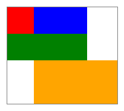

# Layout panels

<link rel="stylesheet" href="https://az835927.vo.msecnd.net/sites/uwp/Resources/css/custom.css">

You use layout panels to arrange and group UI elements in your app. The built-in XAML layout panels include [**RelativePanel**](https://msdn.microsoft.com/library/windows/apps/xaml/windows.ui.xaml.controls.relativepanel.aspx), [**StackPanel**](https://msdn.microsoft.com/library/windows/apps/xaml/windows.ui.xaml.controls.stackpanel.aspx), [**Grid**](https://msdn.microsoft.com/library/windows/apps/xaml/windows.ui.xaml.controls.grid.aspx), [**VariableSizedWrapGrid**](https://msdn.microsoft.com/library/windows/apps/xaml/windows.ui.xaml.controls.variablesizedwrapgrid.aspx), and [**Canvas**](https://msdn.microsoft.com/library/windows/apps/xaml/windows.ui.xaml.controls.canvas.aspx). Here, we describe each panel and show how to use it to layout XAML UI elements.

There are several things to consider when choosing a layout panel:
- How the panel positions its child elements.
- How the panel sizes its child elements.
- How overlapping child elements are layered on top of each other (z-order).
- The number and complexity of nested panel elements needed to create your desired layout.


**Panel attached properties**

Most XAML layout panels use attached properties to let their child elements inform the parent panel about how they should be positioned in the UI. Attached properties use the syntax *AttachedPropertyProvider.PropertyName*. If you have panels that are nested inside other panels, attached properties on UI elements that specify layout characteristics to a parent are interpreted by the most immediate parent panel only.

Here is an example of how you can set the [**Canvas.Left**](https://msdn.microsoft.com/library/windows/apps/xaml/windows.ui.xaml.controls.canvas.left.aspx) attached property on a Button control in XAML. This informs the parent Canvas that the Button should be positioned 50 effective pixels from the left edge of the Canvas.

```xaml
<Canvas>
  <Button Canvas.Left="50">Hello</Button>
</Canvas>
```

For more info about attached properties, see [Attached properties overview](../xaml-platform/attached-properties-overview.md).

> **Note**&nbsp;&nbsp;An attached property is a XAML concept that requires special syntax to get or set from code. To use attached properties in code, see the *Attached properties in code* section of the *Attached properties overview* article.

**Panel borders**

The RelativePanel, StackPanel, and Grid panels define border properties that let you draw a border around the panel without wrapping them in an additional Border element. The border properties are **BorderBrush**, **BorderThickness**, **CornerRadius**, and **Padding**.

Here’s an example of how to set border properties on a Grid.

```xaml
<Grid BorderBrush="Blue" BorderThickness="12" CornerRadius="12" Padding="12">
    <TextBlock Text="Hello World!"/>
</Grid>
```


Using the built-in border properties reduces the XAML element count, which can improve the UI performance of your app. For more info about layout panels and UI performance, see [Optimize your XAML layout](https://msdn.microsoft.com/en-us/library/windows/apps/mt404609.aspx).

## RelativePanel

[**RelativePanel**](https://msdn.microsoft.com/library/windows/apps/xaml/windows.ui.xaml.controls.relativepanel.aspx) lets you layout UI elements by specifying where they go in relation to other elements and in relation to the panel. By default, an element is positioned in the upper left corner of the panel. You can use RelativePanel with a [**VisualStateManager**](https://msdn.microsoft.com/library/windows/apps/xaml/windows.ui.xaml.visualstatemanager.aspx) and [**AdaptiveTrigger**](https://msdn.microsoft.com/library/windows/apps/xaml/windows.ui.xaml.adaptivetrigger.aspx)s to rearrange your UI for different window sizes.

This table shows the attached properties you can use to align an element with the edge or center of the panel, and align and position it in relation to other elements.

Panel alignment | Sibling alignment | Sibling position
----------------|-------------------|-----------------
[**AlignTopWithPanel**](https://msdn.microsoft.com/library/windows/apps/xaml/windows.ui.xaml.controls.relativepanel.aligntopwithpanel.aspx) | [**AlignTopWith**](https://msdn.microsoft.com/library/windows/apps/xaml/windows.ui.xaml.controls.relativepanel.aligntopwith.aspx) | [**Above**](https://msdn.microsoft.com/library/windows/apps/xaml/windows.ui.xaml.controls.relativepanel.above.aspx)  
[**AlignBottomWithPanel**](https://msdn.microsoft.com/library/windows/apps/xaml/windows.ui.xaml.controls.relativepanel.alignbottomwithpanel.aspx) | [**AlignBottomWith**](https://msdn.microsoft.com/library/windows/apps/xaml/windows.ui.xaml.controls.relativepanel.alignbottomwith.aspx) | [**Below**](https://msdn.microsoft.com/library/windows/apps/xaml/windows.ui.xaml.controls.relativepanel.below.aspx)  
[**AlignLeftWithPanel**](https://msdn.microsoft.com/library/windows/apps/xaml/windows.ui.xaml.controls.relativepanel.alignleftwithpanel.aspx) | [**AlignLeftWith**](https://msdn.microsoft.com/library/windows/apps/xaml/windows.ui.xaml.controls.relativepanel.alignleftwith.aspx) | [**LeftOf**](https://msdn.microsoft.com/library/windows/apps/xaml/windows.ui.xaml.controls.relativepanel.leftof.aspx)  
[**AlignRightWithPanel**](https://msdn.microsoft.com/library/windows/apps/xaml/windows.ui.xaml.controls.relativepanel.alignrightwithpanel.aspx) | [**AlignRightWith**](https://msdn.microsoft.com/library/windows/apps/xaml/windows.ui.xaml.controls.relativepanel.alignrightwith.aspx) | [**RightOf**](https://msdn.microsoft.com/library/windows/apps/xaml/windows.ui.xaml.controls.relativepanel.rightof.aspx)  
[**AlignHorizontalCenterWithPanel**](https://msdn.microsoft.com/library/windows/apps/xaml/windows.ui.xaml.controls.relativepanel.alignhorizontalcenterwithpanel.aspx) | [**AlignHorizontalCenterWith**](https://msdn.microsoft.com/library/windows/apps/xaml/windows.ui.xaml.controls.relativepanel.alignhorizontalcenterwith.aspx) | &nbsp;   
[**AlignVerticalCenterWithPanel**](https://msdn.microsoft.com/library/windows/apps/xaml/windows.ui.xaml.controls.relativepanel.alignverticalcenterwithpanel.aspx) | [**AlignVerticalCenterWith**](https://msdn.microsoft.com/library/windows/apps/xaml/windows.ui.xaml.controls.relativepanel.alignverticalcenterwith.aspx) | &nbsp;   

 
This XAML shows how to arrange elements in a RelativePanel.

```xaml
<RelativePanel BorderBrush="Gray" BorderThickness="1">
    <Rectangle x:Name="RedRect" Fill="Red" Height="44" Width="44"/>
    <Rectangle x:Name="BlueRect" Fill="Blue"
               Height="44" Width="88"
               RelativePanel.RightOf="RedRect" />

    <Rectangle x:Name="GreenRect" Fill="Green" 
               Height="44"
               RelativePanel.Below="RedRect" 
               RelativePanel.AlignLeftWith="RedRect" 
               RelativePanel.AlignRightWith="BlueRect"/>
    <Rectangle Fill="Yellow"
               RelativePanel.Below="GreenRect" 
               RelativePanel.AlignLeftWith="BlueRect" 
               RelativePanel.AlignRightWithPanel="True"
               RelativePanel.AlignBottomWithPanel="True"/>
</RelativePanel>
```

The result looks like this. 



Here are a few thing to note about the sizing of the rectangles.
- The red rectangle is given an explicit size of 44x44. It's placed in the upper left corner of the panel, which is the default position.
- The green rectangle is given an explicit height of 44. Its left side is aligned with the red rectangle, and its right side is aligned with the blue rectangle, which determines its width.
- The yellow rectangle isn't given an explicit size. Its left side is aligned with the blue rectangle. Its right and bottom edges are aligned with the edge of the panel. Its size is determined by these alignments and it will resize as the panel resizes.

## StackPanel

[**StackPanel**](https://msdn.microsoft.com/library/windows/apps/xaml/windows.ui.xaml.controls.stackpanel.aspx) is a simple layout panel that arranges its child elements into a single line that can be oriented horizontally or vertically. StackPanel controls are typically used in scenarios where you want to arrange a small subsection of the UI on your page.

You can use the [**Orientation**](https://msdn.microsoft.com/library/windows/apps/xaml/windows.ui.xaml.controls.stackpanel.orientation.aspx) property to specify the direction of the child elements. The default orientation is [**Vertical**](https://msdn.microsoft.com/library/windows/apps/xaml/windows.ui.xaml.controls.orientation.aspx).

The following XAML shows how to create a vertical StackPanel of items.

```xaml
<StackPanel>
    <Rectangle Fill="Red" Height="44"/>
    <Rectangle Fill="Blue" Height="44"/>
    <Rectangle Fill="Green" Height="44"/>
    <Rectangle Fill="Yellow" Height="44"/>
</StackPanel>
```


The result looks like this.


In a StackPanel, if a child element's size is not set explicitly, it stretches to fill the available width (or height if the Orientation is **Horizontal**). In this example, the width of the rectangles is not set. The rectangles expand to fill the entire width of the StackPanel.

## Grid

The [**Grid**](https://msdn.microsoft.com/library/windows/apps/xaml/windows.ui.xaml.controls.grid.aspx) panel supports arranging controls in multi-row and multi-column layouts. You can specify a Grid panel's rows and columns by using the [**RowDefinitions**](https://msdn.microsoft.com/library/windows/apps/xaml/windows.ui.xaml.controls.grid.rowdefinitions.aspx) and [**ColumnDefinitions**](https://msdn.microsoft.com/library/windows/apps/xaml/windows.ui.xaml.controls.grid.columndefinitions.aspx) properties. In XAML, use property element syntax to declare the rows and columns within the Grid element. You can distribute space within a column or a row by using **Auto** or star sizing.

You position objects in specific cells of the Grid by using the [**Grid.Column**](https://msdn.microsoft.com/library/windows/apps/xaml/windows.ui.xaml.controls.grid.column.aspx) and [**Grid.Row**](https://msdn.microsoft.com/library/windows/apps/xaml/windows.ui.xaml.controls.grid.row.aspx) attached properties.

You can make content span across multiple rows and columns by using the [**Grid.RowSpan**](https://msdn.microsoft.com/library/windows/apps/xaml/windows.ui.xaml.controls.grid.rowspan.aspx) and [**Grid.ColumnSpan**](https://msdn.microsoft.com/library/windows/apps/xaml/windows.ui.xaml.controls.grid.columnspan.aspx) attached properties.

This XAML example shows how to create a Grid with two rows and two columns.

```xaml
<Grid>
    <Grid.RowDefinitions>
        <RowDefinition/>
        <RowDefinition Height="44"/>
    </Grid.RowDefinitions>
    <Grid.ColumnDefinitions>
        <ColumnDefinition Width="Auto"/>
        <ColumnDefinition/>
    </Grid.ColumnDefinitions>
    <Rectangle Fill="Red" Width="44"/>
    <Rectangle Fill="Blue" Grid.Row="1"/>
    <Rectangle Fill="Green" Grid.Column="1"/>
    <Rectangle Fill="Yellow" Grid.Row="1" Grid.Column="1"/>
</Grid>
```


The result looks like this.


In this example, the sizing works like this: 
- The second row has an explicit height of 44 effective pixels. By default, the height of the first row fills whatever space is left over.
- The width of the first column is set to **Auto**, so it's as wide as needed for its children. In this case, it's 44 effective pixels wide to accommodate the width of the red rectangle.
- There are no other size constraints on the rectangles, so each one stretches to fill the grid cell it's in.

## VariableSizedWrapGrid

[**VariableSizedWrapGrid**](https://msdn.microsoft.com/library/windows/apps/xaml/windows.ui.xaml.controls.variablesizedwrapgrid.aspx) provides a grid-style layout panel where elements are arranged in rows or columns that automatically wrap to a new row or column when the [**MaximumRowsOrColumns**](https://msdn.microsoft.com/library/windows/apps/xaml/windows.ui.xaml.controls.variablesizedwrapgrid.maximumrowsorcolumns.aspx) value is reached. 

The [**Orientation**](https://msdn.microsoft.com/library/windows/apps/xaml/windows.ui.xaml.controls.variablesizedwrapgrid.orientation.aspx) property specifies whether the grid adds its items in rows or columns before wrapping. The default orientation is **Vertical**, which means the grid adds items from top to bottom until a column is full, then wraps to a new column. When the value is **Horizontal**, the grid adds items from left to right, then wraps to a new row.

Cell dimensions are specified by the [**ItemHeight**](https://msdn.microsoft.com/library/windows/apps/xaml/windows.ui.xaml.controls.variablesizedwrapgrid.itemheight.aspx) and [**ItemWidth**](https://msdn.microsoft.com/library/windows/apps/xaml/windows.ui.xaml.controls.variablesizedwrapgrid.itemwidth.aspx). Each cell is the same size. If ItemHeight or ItemWidth is not specified, then the first cell sizes to fit its content, and every other cell is the size of the first cell.

You can use the [**VariableSizedWrapGrid.ColumnSpan**](https://msdn.microsoft.com/library/windows/apps/xaml/windows.ui.xaml.controls.variablesizedwrapgrid.columnspan.aspx) and [**VariableSizedWrapGrid.RowSpan**](https://msdn.microsoft.com/library/windows/apps/xaml/windows.ui.xaml.controls.variablesizedwrapgrid.rowspan.aspx) attached properties to specify how many adjacent cells a child element should fill.

Here's how to use a VariableSizedWrapGrid in XAML.

```xaml
<VariableSizedWrapGrid MaximumRowsOrColumns="3" ItemHeight="44" ItemWidth="44">
    <Rectangle Fill="Red"/>
    <Rectangle Fill="Blue" 
               VariableSizedWrapGrid.RowSpan="2"/>
    <Rectangle Fill="Green" 
               VariableSizedWrapGrid.ColumnSpan="2"/>
    <Rectangle Fill="Yellow" 
               VariableSizedWrapGrid.RowSpan="2" 
               VariableSizedWrapGrid.ColumnSpan="2"/>
</VariableSizedWrapGrid>
```


The result looks like this.


In this example, the maximum number of rows in each column is 3. The first column contains only 2 items (the red and blue rectangles) because the blue rectangle spans 2 rows. The green rectangle then wraps to the top of the next column.

## Canvas

The [**Canvas**](https://msdn.microsoft.com/library/windows/apps/xaml/windows.ui.xaml.controls.canvas.aspx) panel positions its child elements using fixed coordinate points. You specify the points on individual child elements by setting the [**Canvas.Left**](https://msdn.microsoft.com/library/windows/apps/xaml/windows.ui.xaml.controls.canvas.left.aspx) and [**Canvas.Top**](https://msdn.microsoft.com/library/windows/apps/xaml/windows.ui.xaml.controls.canvas.top.aspx) attached properties on each element. During layout, the parent Canvas reads these attached property values from its children and uses these values during the [Arrange](https://msdn.microsoft.com/library/windows/apps/xaml/windows.ui.xaml.uielement.arrange.aspx) pass of layout.

Objects in a Canvas can overlap, where one object is drawn on top of another object. By default, the Canvas renders child objects in the order in which they’re declared, so the last child is rendered on top (each element has a default z-index of 0). This is the same as other built-in panels. However, Canvas also supports the [**Canvas.ZIndex**](https://msdn.microsoft.com/library/windows/apps/xaml/windows.ui.xaml.controls.canvas.zindex.aspx) attached property that you can set on each of the child elements. You can set this property in code to change the draw order of elements during run time. The element with the highest Canvas.ZIndex value draws last and therefore draws over any other elements that share the same space or overlap in any way. Note that alpha value (transparency) is respected, so even if elements overlap, the contents shown in overlap areas might be blended if the top one has a non-maximum alpha value.

The Canvas does not do any sizing of its children. Each element must specify its size.

Here's an example of a Canvas in XAML.

```xaml
<Canvas Width="120" Height="120">
    <Rectangle Fill="Red" Height="44" Width="44"/>
    <Rectangle Fill="Blue" Height="44" Width="44" Canvas.Left="20" Canvas.Top="20"/>
    <Rectangle Fill="Green" Height="44" Width="44" Canvas.Left="40" Canvas.Top="40"/>
    <Rectangle Fill="Yellow" Height="44" Width="44" Canvas.Left="60" Canvas.Top="60"/>
</Canvas>
```


The result looks like this.


Use the Canvas panel with discretion. While it's convenient to be able to precisely control positions of elements in UI for some scenarios, a fixed positioned layout panel causes that area of your UI to be less adaptive to overall app window size changes. App window resize might come from device orientation changes, split app windows, changing monitors, and a number of other user scenarios.

## Panels for ItemsControl

There are several special-purpose panels that can be used only as an [**ItemsPanel**](https://msdn.microsoft.com/library/windows/apps/xaml/windows.ui.xaml.controls.itemscontrol.itemspanel.aspx) to display items in an [**ItemsControl**](https://msdn.microsoft.com/library/windows/apps/xaml/windows.ui.xaml.controls.itemscontrol.aspx). These are [**ItemsStackPanel**](https://msdn.microsoft.com/library/windows/apps/xaml/windows.ui.xaml.controls.itemsstackpanel.aspx), [**ItemsWrapGrid**](https://msdn.microsoft.com/library/windows/apps/xaml/windows.ui.xaml.controls.itemswrapgrid.aspx), [**VirtualizingStackPanel**](https://msdn.microsoft.com/library/windows/apps/xaml/windows.ui.xaml.controls.virtualizingstackpanel.aspx), and [**WrapGrid**](https://msdn.microsoft.com/library/windows/apps/xaml/windows.ui.xaml.controls.wrapgrid.aspx). You can't use these panels for general UI layout.
