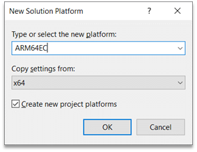

# Using Arm64EC to build apps for Windows 11 on Arm devices

Arm64EC (“Emulation Compatible”) is a new application binary interface (ABI) for building apps for Windows 11 on Arm. With Arm64EC, you can build new native apps or incrementally transition existing apps to native performance on Arm. You can read more about Arm64EC on the [Windows Developer blog](https://aka.ms/arm64ecannounceblog). 

## Get started building Win32 apps as Arm64EC

To start building Win32 apps as Arm64EC, you'll need to install these prerequisites:

- The latest [Windows Insider SDK build](https://aka.ms/windowsinsidersdk) available through the Windows Insider program.
- [Visual Studio Preview (version 16.11 preview 2 or later)](https://visualstudio.microsoft.com/vs/preview/).

Once the Windows Insider SDK and Visual Studio Preview have been installed, follow these steps to add the Arm64EC platform.

1. In the Visual Studio Installer, add the Arm64EC tools by searching under **Individual components** and selecting the **MSVC v142 - VS 2019 C++ Arm64EC build tools** checkbox, currently marked as experimental.

    

2. With the tools and SDK installed, create a new C++ project or open an existing one.

    > [!NOTE]
    > If your project is using an older SDK or older version of MSVC, you'll need to retarget the solution to use the latest version of each.

3. To add the Arm64EC platform:
    - In the **Build** menu, select **Configuration Manager**.
    - In the **Active solution platform** box, select **`<New…>`** to create a new platform.
    - Select **Arm64EC**, Copy settings from **x64**, and check the **Create new project platforms** checkbox.

    

    You can choose to leave parts of the solution as x64 as needed. However, the more code built as Arm64EC, the more code that will run with native performance on Windows 11 on Arm. For any external dependencies, ensure that your project links against the x64 or Arm64EC versions of those projects.

4. With the new solution platform in place, select **Build** in Visual Studio to start building Arm64EC binaries.  
