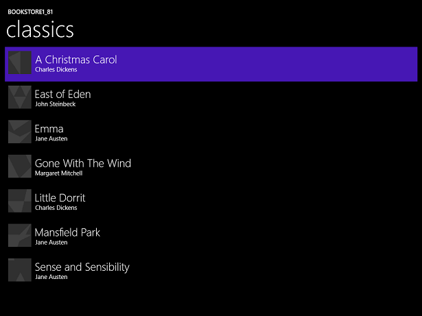
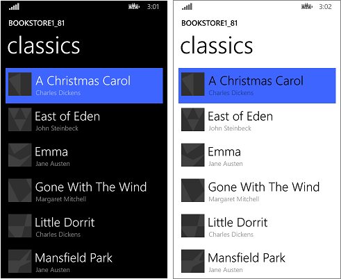
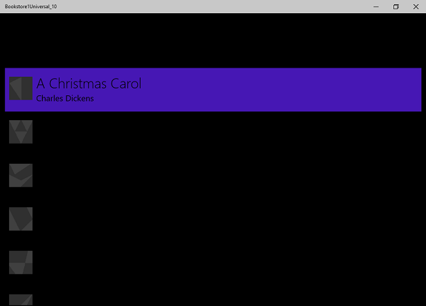
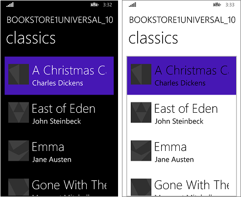
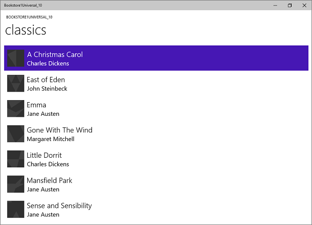
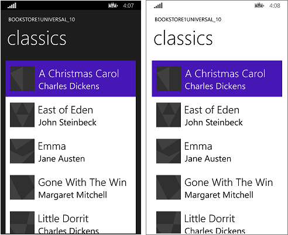
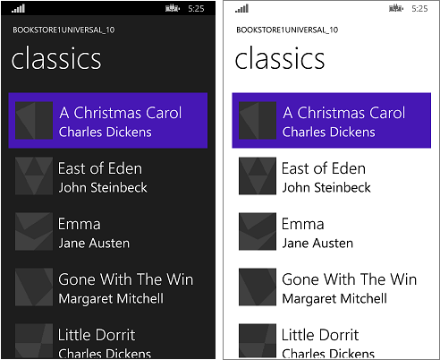

# Windows Runtime 8.x to UWP case study: Bookstore1

This topic presents a case study of porting a very simple Universal 8.1 app to a Windows 10 Universal Windows Platform (UWP) app. A Universal 8.1 app is one that builds one app package for Windows 8.1, and a different app package for Windows Phone 8.1. With Windows 10, you can create a single app package that your customers can install onto a wide range of devices, and that's what we'll do in this case study. See [Guide to UWP apps](https://msdn.microsoft.com/library/windows/apps/dn894631).

The app we'll port consists of a **ListBox** bound to a view model. The view model has a list of books that shows title, author, and book cover. The book cover images have **Build Action** set to **Content** and **Copy to Output Directory** set to **Do not copy**.

The previous topics in this section describe the differences between the platforms, and they give details and guidance on the porting process for various aspects of an app from XAML markup, through binding to a view model, down to accessing data. A case study aims to complement that guidance by showing it in action in a real example. The case studies assume you've read the guidance, which they do not repeat.

**Note**   When opening Bookstore1Universal\_10 in Visual Studio, if you see the message "Visual Studio update required", then follow the steps in [TargetPlatformVersion](w8x-to-uwp-troubleshooting.md).

## Downloads

[Download the Bookstore1\_81 Universal 8.1 app](https://go.microsoft.com/fwlink/?linkid=532946).

[Download the Bookstore1Universal\_10 Windows 10 app](https://go.microsoft.com/fwlink/?linkid=532950).

## The Universal 8.1 app

Here’s what Bookstore1\_81—the app that we're going to port—looks like. It's just a vertically-scrolling list box of books beneath the heading of the app's name and page title.

Bookstore1\_81 on Windows

Bookstore1\_81 on Windows Phone

##  Porting to a Windows 10 project

The Bookstore1\_81 solution is an 8.1 Universal App project, and it contains these projects.

-   Bookstore1\_81.Windows. This is the project that builds the app package for Windows 8.1.
-   Bookstore1\_81.WindowsPhone. This is the project that builds the app package for Windows Phone 8.1.
-   Bookstore1\_81.Shared. This is the project that contains source code, markup files, and other assets and resources, that are used by both of the other two projects.

For this case study, we have the usual options described in [If you have a Universal 8.1 app](w8x-to-uwp-root.md) with respect to what devices to support. The decision here is a simple one: this app has the same features, and does so mostly with the same code, in both its Windows 8.1 and Windows Phone 8.1 forms. So, we'll port the contents of the Shared project (and anything else we need from the other projects) to a Windows 10 that targets the Universal device family (one that you can install onto the widest range of devices).

It's a very quick task to create a new project in Visual Studio, copy files over to it from Bookstore1\_81, and include the copied files in the new project. Start by creating a new Blank Application (Windows Universal) project. Name it Bookstore1Universal\_10. These are the files to copy over from Bookstore1\_81 to Bookstore1Universal\_10.

**From the Shared project**

-   Copy the folder containing the book cover image PNG files (the folder is \\Assets\\CoverImages). After copying the folder, in **Solution Explorer**, make sure **Show All Files** is toggled on. Right-click the folder that you copied and click **Include In Project**. That command is what we mean by "including" files or folders in a project. Each time you copy a file or folder, each copy, click **Refresh** in **Solution Explorer** and then include the file or folder in the project. There's no need to do this for files that you're replacing in the destination.
-   Copy the folder containing the view model source file (the folder is \\ViewModel).
-   Copy MainPage.xaml and replace the file in the destination.

**From the Windows project**

-   Copy BookstoreStyles.xaml. We'll use this one as a good starting-point because all the resource keys in this file will resolve in a Windows 10 app; some of those in the equivalent WindowsPhone file will not.

Edit the source code and markup files that you just copied and change any references to the Bookstore1\_81 namespace to Bookstore1Universal\_10. A quick way to do that is to use the **Replace In Files** feature. No code changes are needed in the view model, nor in any other imperative code. But, just to make it easier to see which version of the app is running, change the value returned by the **Bookstore1Universal\_10.BookstoreViewModel.AppName** property from "BOOKSTORE1\_81" to "BOOKSTORE1UNIVERSAL\_10".

Right now, you can build and run. Here's how our new UWP app looks after having done no explicit work yet to port it to Windows 10.

The Windows 10 app with initial source code changes running on a Desktop device

The Windows 10 app with initial source code changes running on a Mobile device

The view and the view model are working together correctly, and the **ListBox** is functioning. We just need to fix the styling. On a Mobile device, in light theme, we can see the border of the list box, but that will be easy to hide. And, the typography is too big, so we'll change the styles we're using. Also, the app should be light in color when running on a Desktop device if we want it to look like the default. So, we'll change that.

## Universal styling

The Bookstore1\_81 app used two different resource dictionaries (BookstoreStyles.xaml) to tailor its styles to the Windows 8.1 and Windows Phone 8.1 operating systems. Neither of those two BookstoreStyles.xaml files contains exactly the styles we need for our Windows 10 app. But, the good news is that what we want is actually much simpler than either of them. So, the next steps will mostly involve removing and simplifying our project files and markup. The steps are below. And you can use the links at the top of this topic to download the projects and see the results of all the changes between here and the end of the case study.

-   To tighten up the spacing between items, find the `BookTemplate` data template in MainPage.xaml and delete the `Margin="0,0,0,8"` from the root **Grid**.
-   Also, in `BookTemplate`, there are references to `BookTemplateTitleTextBlockStyle` and `BookTemplateAuthorTextBlockStyle`. Bookstore1\_81 used those keys as an indirection so that a single key had different implementations in the two apps. We don't need that indirection any more; we can just reference system styles directly. So, replace those references with `TitleTextBlockStyle` and `SubtitleTextBlockStyle`, respectively.
-   Now, we need to set `LayoutRoot`'s Background to the correct default value so that the app looks appropriate when running on all devices no matter what the theme is. Change it from `"Transparent"` to `"{ThemeResource ApplicationPageBackgroundThemeBrush}"`.
-   In `TitlePanel`, change the reference to `TitleTextBlockStyle` (which is now a little too big) to a reference to `CaptionTextBlockStyle`. `PageTitleTextBlockStyle` is another Bookstore1\_81 indirection that we don't need any longer. Change that to reference `HeaderTextBlockStyle` instead.
-   We no longer need to set any special Background, Style, nor ItemContainerStyle on the **ListBox**, so just delete those three attributes and their values from the markup. We do want to hide the border of the **ListBox**, though, so add `BorderBrush="{x:Null}"` to it.
-   We're not referencing any of the resources in the BookstoreStyles.xaml **ResourceDictionary** file any longer. You can delete all of those resources. But, don't delete the BookstoreStyles.xaml file itself: we still have one last use for it, as you'll see in the next section.

That last sequence of styling operations leaves the app looking like this.

The almost-ported Windows 10 app running on a Desktop device

The almost-ported Windows 10 app running on a Mobile device

## An optional adjustment to the list box for Mobile devices

When the app is running on a Mobile device, the background of a list box is light by default in both themes. That may be the style that you prefer and, if so, then there's nothing more to do except to tidy up: delete the BookstoreStyles.xaml resource dictionary file from your project, and remove the markup that merges it into MainPage.xaml.

But, controls are designed so that you can customize their look while leaving their behavior unaffected. So, if you want the list box to be dark in the dark theme—the way the original app looked—then this section describes a way to do that.

The change we make only needs to affect the app when it's running on Mobile devices. So, we'll use a very slightly customized list box style when we're running on the Mobile device family, and we'll continue to use the default style when we're running everywhere else. To do that, we'll make a copy of BookstoreStyles.xaml and we'll give it a special MRT-qualified name, which will cause it to be loaded only on Mobile devices.

Add a new **ResourceDictionary** project item and name it BookstoreStyles.DeviceFamily-Mobile.xaml. You now have two files both of whose logical name is BookstoreStyles.xaml (and that's the name you use in your markup and code). The files have different physical names, though, so they can contain different markup. You can use this MRT-qualified naming scheme with any xaml file, but be aware that all xaml files with the same logical name share a single xaml.cs code-behind file (where one is applicable).

Edit a copy of the control template for the list box and store that with the key of `BookstoreListBoxStyle` in the new resource dictionary, BookstoreStyles.DeviceFamily-Mobile.xaml. Now, we'll make simple changes to three of the setters.

-   In the Foreground setter, change the value to `"{x:Null}"`. Note that setting a property to `"{x:Null}"` directly on an element is the same as setting it to `null` in code. But, using a value of `"{x:Null}"` in a setter has a unique effect: it overrides the setter in the default style (for the same property) and restores the default value of the property on the target element.
-   In the Background setter, change the value to `"Transparent"` to remove that light background.
-   In the Template setter, find the visual state named `Focused` and delete its Storyboard, making it into an empty tag.
-   Delete all the other setters from the markup.

Finally, copy `BookstoreListBoxStyle` into BookstoreStyles.xaml and delete its three setters, making it into an empty tag. We do this so that on devices other than Mobile ones, our reference to BookstoreStyles.xaml and to `BookstoreListBoxStyle` will resolve, but will have no effect.

The ported Windows 10 app running on a Mobile device

## Conclusion

This case study showed the process of porting a very simple app—arguably an unrealistically simple one. For instance, a list box can be used for selection or for establishing a context for navigation; the app navigates to a page with more details about the item that was tapped. This particular app does nothing with the user's selection, and it has no navigation. Even so, the case study served to break the ice, to introduce the porting process, and to demonstrate important techniques that you can use in real UWP apps.

We also saw evidence that porting view models is generally a smooth process. User interface, and form factor support, are aspects that are more likely to require our attention when porting.

The next case study is [Bookstore2](w8x-to-uwp-case-study-bookstore2.md), in which we look at accessing and displaying grouped data.
