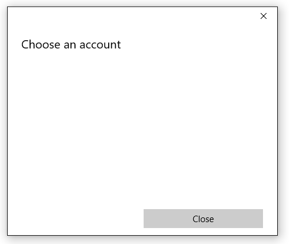
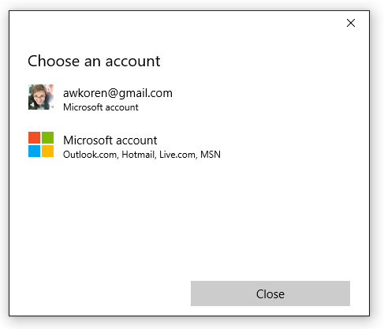
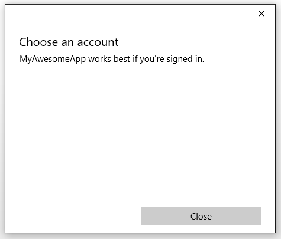
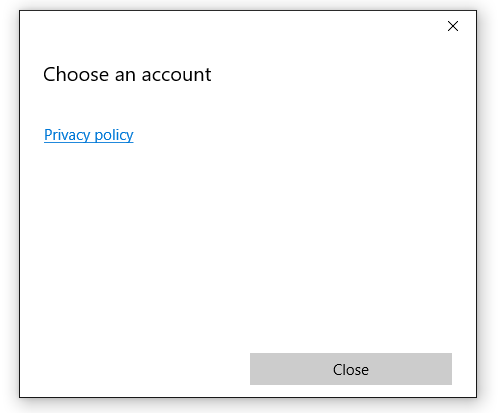

# Web Account Manager

This article describes how to use the **[AccountsSettingsPane](https://docs.microsoft.com/uwp/api/Windows.UI.ApplicationSettings.AccountsSettingsPane)** to connect your Universal Windows Platform (UWP) app to external identity providers, like Microsoft or Facebook, using the Windows 10 Web Account Manager APIs. You'll learn how to request a user's permission to use their Microsoft account, obtain an access token, and use it to perform basic operations (like get profile data or upload files to their OneDrive account). The steps are similar for getting user permission and access with any identity provider that supports the Web Account Manager.

> [!NOTE]
> For a complete code sample, see the [WebAccountManagement sample on GitHub](http://go.microsoft.com/fwlink/p/?LinkId=620621).

## Get set up

First, create a new, blank app in Visual Studio. 

Second, in order to connect to identity providers, you'll need to associate your app with the Store. To do this, right click your project, choose **Store** > **Associate app with the store**, and follow the wizard's instructions. 

Third, create a very basic UI consisting of a simple XAML button and two text boxes.

```XML
<StackPanel HorizontalAlignment="Center" VerticalAlignment="Center">
	<Button x:Name="LoginButton" Content="Log in" Click="LoginButton_Click" />
	<TextBlock x:Name="UserIdTextBlock"/>
	<TextBlock x:Name="UserNameTextBlock"/>
</StackPanel>
```

And an event handler attached to your button in the code-behind:

```csharp
private void LoginButton_Click(object sender, RoutedEventArgs e)
{	
}
```

Lastly, add the following namespaces so you don't have to worry about any reference issues later: 

```csharp
using System;
using Windows.Security.Authentication.Web.Core;
using Windows.System;
using Windows.UI.ApplicationSettings;
using Windows.UI.Xaml;
using Windows.UI.Xaml.Controls;
using Windows.Data.Json;
using Windows.UI.Xaml.Navigation;
using Windows.Web.Http;
```

## Show the accounts settings pane

The system provides a built-in user interface for managing identity providers and web accounts called **AccountsSettingsPane**. You can show it like this:

```csharp
private void LoginButton_Click(object sender, RoutedEventArgs e)
{
	AccountsSettingsPane.Show(); 
}
```

If you run your app and click the "Log in" button, it should display an empty window. 



The pane is empty because the system only provides a UI shell - it's up to the developer to programatically populate the pane with the identity providers. 

## Register for AccountCommandsRequested

To add commands to the pane, we start by registering for the AccountCommandsRequested event handler. This tells the system to run our build logic when the user asks to see the pane (e.g., clicks our XAML button). 

In your code behind, override the OnNavigatedTo and OnNavigatedFrom events and add the following code to them: 

```csharp
protected override void OnNavigatedTo(NavigationEventArgs e)
{
	AccountsSettingsPane.GetForCurrentView().AccountCommandsRequested += BuildPaneAsync; 
}
```

```csharp
protected override void OnNavigatedFrom(NavigationEventArgs e)
{
	AccountsSettingsPane.GetForCurrentView().AccountCommandsRequested -= BuildPaneAsync; 
}
```

Users don't interact with accounts very often, so registering and deregistering your event handler in this fashion helps prevent memory leaks. This way, your customized pane is only in memory when there's a high chance a user is going to ask for it (because they're on a "settings" or "login" page, for example). 

## Build the account settings pane

The BuildPaneAsync method is called whenever the **AccountsSettingsPane** is shown. This is where we'll put the code to customize the commands shown in the pane. 

Start by obtaining a deferral. This tells the system to delay showing the **AccountsSettingsPane** until we're finished building it.

```csharp
private async void BuildPaneAsync(AccountsSettingsPane s,
	AccountsSettingsPaneCommandsRequestedEventArgs e)
{
	var deferral = e.GetDeferral();
		
	deferral.Complete(); 
}
```

Next, get a provider using the WebAuthenticationCoreManager.FindAccountProviderAsync method. The URL for the provider varies based on the provider and can be found in the provider's documentation. For Microsoft Accounts and Azure Active Directory, it's "https://login.microsoft.com". 

```csharp
private async void BuildPaneAsync(AccountsSettingsPane s,
	AccountsSettingsPaneCommandsRequestedEventArgs e)
{
	var deferral = e.GetDeferral();
		
	var msaProvider = await WebAuthenticationCoreManager.FindAccountProviderAsync(
		"https://login.microsoft.com", "consumers"); 
		
	deferral.Complete(); 
}
```

Notice that we also pass the string "consumers" to the optional *authority* parameter. This is because Microsoft provides two different types of authentication - Microsoft Accounts (MSA) for "consumers", and Azure Active Directory (AAD) for "organizations". The "consumers" authority indicates we want the MSA option. If you're developing an enterprise app, use the string "organizations" instead.

Finally, add the provider to the **AccountsSettingsPane** by creating a new **[WebAccountProviderCommand](https://docs.microsoft.com/uwp/api/windows.ui.applicationsettings.webaccountprovidercommand)** like this: 

```csharp
private async void BuildPaneAsync(AccountsSettingsPane s,
	AccountsSettingsPaneCommandsRequestedEventArgs e)
{
	var deferral = e.GetDeferral();

	var msaProvider = await WebAuthenticationCoreManager.FindAccountProviderAsync(
		"https://login.microsoft.com", "consumers");

	var command = new WebAccountProviderCommand(msaProvider, GetMsaTokenAsync);  

	e.WebAccountProviderCommands.Add(command);

	deferral.Complete(); 
}
```

The GetMsaToken method we passed to our new **WebAccountProviderCommand** doesn't exist yet (we'll build that in the next step), so feel free to add it as an empty method for now.

Run the above code and your pane should look something like this: 



### Request a token

Once we have the Microsoft Account option displaying in the **AccountsSettingsPane**, we need to handle what happens when the user selects it. We registered our GetMsaToken method to fire when the user chooses to log in with their Microsoft Account, so we'll obtain the token there. 

To obtain a token, use the RequestTokenAsync method like this: 

```csharp
private async void GetMsaTokenAsync(WebAccountProviderCommand command)
{
	WebTokenRequest request = new WebTokenRequest(command.WebAccountProvider, "wl.basic");
	WebTokenRequestResult result = await WebAuthenticationCoreManager.RequestTokenAsync(request);
}
```

In this example, we pass the string "wl.basic" to the _scope_ parameter. Scope represents the type of information you are requesting from the providing service on a specific user. Certain scopes provide access only to a user's basic information, like name and email address, while other scopes might grant access to sensitive information such as the user's photos or email inbox. Generally, your app should use the least permissive scope necessary to achieve its function. Service providers will provide documentation on which scopes are needed to get tokens for use with their services. 

* For Office 365 and Outlook.com scopes, see [Authenticate Office 365 and Outlook.com APIs using the v2.0 authentication endpoint](https://msdn.microsoft.com/office/office365/howto/authenticate-Office-365-APIs-using-v2). 
* For OneDrive scopes, see [OneDrive authentication and sign-in](https://dev.onedrive.com/auth/msa_oauth.htm#authentication-scopes). 

> [!TIP]
> Optionally, if your app uses a login hint (to populate the user field with a default email address) or other special property related to the sign-in experience, list it in the **[WebTokenRequest.AppProperties](https://docs.microsoft.com/uwp/api/windows.security.authentication.web.core.webtokenrequest.appproperties#Windows_Security_Authentication_Web_Core_WebTokenRequest_AppProperties)** property. This will cause the system to ignore the property when caching the web account, which prevents account mismatches in the cache.

If you're developing an enterprise app, you'll likely want to connect to an Azure Active Directory (AAD) instance and use the Microsoft Graph API instead of regular MSA services. In this scenario, use the following code instead: 

```csharp
private async void GetAadTokenAsync(WebAccountProviderCommand command)
{
	string clientId = "your_guid_here"; // Obtain your clientId from the Azure Portal
	WebTokenRequest request = new WebTokenRequest(provider, "User.Read", clientId);
	request.Properties.Add("resource", "https://graph.microsoft.com");
	WebTokenRequestResult result = await WebAuthenticationCoreManager.RequestTokenAsync(request);
}
```

The rest of this article continues describing the MSA scenario, but the code for AAD is very similar. For more info on AAD/Graph, including a full sample on GitHub, see the [Microsoft Graph documentation](https://graph.microsoft.io/docs/platform/get-started).

## Use the token

The RequestTokenAsync method returns a WebTokenRequestResult object, which contains the results of your request. If your request was successful, it will contain a token.  

```csharp
private async void GetMsaTokenAsync(WebAccountProviderCommand command)
{
	WebTokenRequest request = new WebTokenRequest(command.WebAccountProvider, "wl.basic");
	WebTokenRequestResult result = await WebAuthenticationCoreManager.RequestTokenAsync(request);
	
	if (result.ResponseStatus == WebTokenRequestStatus.Success)
	{
		string token = result.ResponseData[0].Token; 
	}
}
```

> [!NOTE]
> If you receive an error when requesting a token, make sure you've associated your app with the Store as described in step one. Your app won't be able to get a token if you skipped this step. 

Once you have a token, you can use it to call your provider's API. In the code below, we'll call the [user info Microsoft Live API](https://msdn.microsoft.com/library/hh826533.aspx) to obtain basic information about the user and display it in our UI. Note however that in most cases it is recommended that you store the token once obtained and then use it in a separate method.

```csharp
private async void GetMsaTokenAsync(WebAccountProviderCommand command)
{
	WebTokenRequest request = new WebTokenRequest(command.WebAccountProvider, "wl.basic");
	WebTokenRequestResult result = await WebAuthenticationCoreManager.RequestTokenAsync(request);
	
	if (result.ResponseStatus == WebTokenRequestStatus.Success)
	{
		string token = result.ResponseData[0].Token; 
		
		var restApi = new Uri(@"https://apis.live.net/v5.0/me?access_token=" + token);

		using (var client = new HttpClient())
		{
			var infoResult = await client.GetAsync(restApi);
			string content = await infoResult.Content.ReadAsStringAsync();

			var jsonObject = JsonObject.Parse(content);
			string id = jsonObject["id"].GetString();
			string name = jsonObject["name"].GetString();

			UserIdTextBlock.Text = "Id: " + id; 
			UserNameTextBlock.Text = "Name: " + name;
		}
	}
}
```

How you call various REST APIs varies between providers; see the provider's API documentation for information on how to use your token. 

## Store the account for future use

Tokens are useful for immediately obtaining information about a user, but they usually have varying lifespans - MSA tokens, for instance, are only valid for a few hours. Fortunately, you don't need to re-show the **AccountsSettingsPane** each time a token expires. Once a user has authorized your app once, you can store the user's account information for future use. 

To do this, use the **[WebAccount](https://docs.microsoft.com/uwp/api/windows.security.credentials.webaccount)** class. A **WebAccount** is returned by the same method you used to request the token:

```csharp
private async void GetMsaTokenAsync(WebAccountProviderCommand command)
{
	WebTokenRequest request = new WebTokenRequest(command.WebAccountProvider, "wl.basic");
	WebTokenRequestResult result = await WebAuthenticationCoreManager.RequestTokenAsync(request);
	
	if (result.ResponseStatus == WebTokenRequestStatus.Success)
	{
		WebAccount account = result.ResponseData[0].WebAccount; 
	}
}
```

Once you have a **WebAccount** instance, you can easily store it. In the following example, we use LocalSettings. For more information on using LocalSettings and other methods to store user data, see [Store and retrieve app settings and data](https://docs.microsoft.com/windows/uwp/app-settings/store-and-retrieve-app-data).

```csharp
private async void StoreWebAccount(WebAccount account)
{
	ApplicationData.Current.LocalSettings.Values["CurrentUserProviderId"] = account.WebAccountProvider.Id;
	ApplicationData.Current.LocalSettings.Values["CurrentUserId"] = account.Id; 
}
```

Then, we can use an asynchronous method like the following to attempt to obtain a token in the background with the stored **WebAccount**.

```csharp
private async Task<string> GetTokenSilentlyAsync()
{
	string providerId = ApplicationData.Current.LocalSettings.Values["CurrentUserProviderId"]?.ToString();
	string accountId = ApplicationData.Current.LocalSettings.Values["CurrentUserId"]?.ToString();

	if (null == providerId || null == accountId)
	{
		return null; 
	}

	WebAccountProvider provider = await WebAuthenticationCoreManager.FindAccountProviderAsync(providerId);
	WebAccount account = await WebAuthenticationCoreManager.FindAccountAsync(provider, accountId);

	WebTokenRequest request = new WebTokenRequest(provider, "wl.basic");

	WebTokenRequestResult result = await WebAuthenticationCoreManager.GetTokenSilentlyAsync(request, account);
	if (result.ResponseStatus == WebTokenRequestStatus.UserInteractionRequired)
	{
		// Unable to get a token silently - you'll need to show the UI
		return null; 
	}
	else if (result.ResponseStatus == WebTokenRequestStatus.Success)
	{
		// Success
		return result.ResponseData[0].Token;
	}
	else
	{
		// Other error 
		return null; 
	}
}
```

Place the above method just before the code that builds the **AccountsSettingsPane**. If the token is obtained in the background, there is no need to show the pane. 

```csharp
private void LoginButton_Click(object sender, RoutedEventArgs e)
{
	string silentToken = await GetMsaTokenSilentlyAsync();

	if (silentToken != null)
	{
		// the token was obtained. store a reference to it or do something with it here.
	}
	else
	{
		// the token could not be obtained silently. Show the AccountsSettingsPane
		AccountsSettingsPane.Show();
	}
}
```

Because obtaining a token silently is very simple, you should use this process to refresh your token between sessions rather than caching an existing token (since that token might expire at any time).

> [!NOTE]
> The example above only covers basic success and fail cases. Your app should also account for unusual scenarios (like a user revoking your app's permission or removing their account from Windows, for example) and handle them gracefully.  

## Remove a stored account

If you persist a web account, you may want to give your users the ability to disassociate their account with your app. This way, they can effectively "log out" of the app: their account information will no longer be loaded automatically upon launch. To do this, first remove any saved account and provider information from storage. Then call **[SignOutAsync](https://docs.microsoft.com/uwp/api/windows.security.credentials.webaccount.SignOutAsync)** to clear the cache and invalidate any existing tokens your app may have. 

```csharp
private async Task SignOutAccountAsync(WebAccount account)
{
	ApplicationData.Current.LocalSettings.Values.Remove("CurrentUserProviderId");
	ApplicationData.Current.LocalSettings.Values.Remove("CurrentUserId"); 
	account.SignOutAsync(); 
}
```

## Add providers that don't support WebAccountManager

If you want to integrate authentication from a service into your app but that service doesn't support WebAccountManager - Google+ or Twitter, for example - you can still manually add that provider to the **AccountsSettingsPane**. To do so, create a new WebAccountProvider object and provide your own name and .png icon, then and add it to the WebAccountProviderCommands list. Here's some stub code: 

 ```csharp
private async void BuildPaneAsync(AccountsSettingsPane s, AccountsSettingsPaneCommandsRequestedEventArgs e)
{
	// other code here 

	var twitterProvider = new WebAccountProvider("twitter", "Twitter", new Uri(@"ms-appx:///Assets/twitter-auth-icon.png")); 
	var twitterCmd = new WebAccountProviderCommand(twitterProvider, GetTwitterTokenAsync);
	e.WebAccountProviderCommands.Add(twitterCmd);	
	
	// other code here
}

private async void GetTwitterTokenAsync(WebAccountProviderCommand command)
{
	// Manually handle Twitter login here
}

```

> [!NOTE] 
> This only adds an icon to the **AccountsSettingsPane** and runs the method you specify when the icon is clicked (GetTwitterTokenAsync, in this case). You must provide the code that handles the actual authentication. For more information, see (Web authentication broker)[web-authentication-broker], which provides helper methods for authenticating using REST services. 

## Add a custom header

You can customize the account settings pane using the HeaderText property, like this: 

```csharp
private async void BuildPaneAsync(AccountsSettingsPane s, AccountsSettingsPaneCommandsRequestedEventArgs e)
{
	// other code here 
	
	args.HeaderText = "MyAwesomeApp works best if you're signed in."; 	
	
	// other code here
}
```



Don't go overboard with header text; keep it short and sweet. If your login process is complicated and you need to display more information, link the user to a separate page using a custom link. 

## Add custom links

You can add custom commands to the AccountsSettingsPane, which appear as links below your supported WebAccountProviders. Custom commands are great for simple tasks related to user accounts, like displaying a privacy policy or launching a support page for users having trouble. 

Here's an example: 

```csharp
private async void BuildPaneAsync(AccountsSettingsPane s, AccountsSettingsPaneCommandsRequestedEventArgs e)
{
	// other code here 
	
	var settingsCmd = new SettingsCommand(
		"settings_privacy", 
		"Privacy policy", 
		async (x) => await Launcher.LaunchUriAsync(new Uri(@"https://privacy.microsoft.com/en-US/"))); 

	e.Commands.Add(settingsCmd); 
	
	// other code here
}
```



Theoretically, you can use settings commands for anything. However, we suggest limiting their use to intuitive, account-related scenarios like those described above. 

## See also

[Windows.Security.Authentication.Web.Core namespace](https://msdn.microsoft.com/library/windows/apps/windows.security.authentication.web.core.aspx)

[Windows.Security.Credentials namespace](https://msdn.microsoft.com/library/windows/apps/windows.security.credentials.aspx)

[AccountsSettingsPane class](https://msdn.microsoft.com/library/windows/apps/windows.ui.applicationsettings.accountssettingspane)

[Web authentication broker](web-authentication-broker.md)

[Web account management sample](http://go.microsoft.com/fwlink/p/?LinkId=620621)

[Lunch Scheduler app](https://github.com/Microsoft/Windows-appsample-lunch-scheduler)
