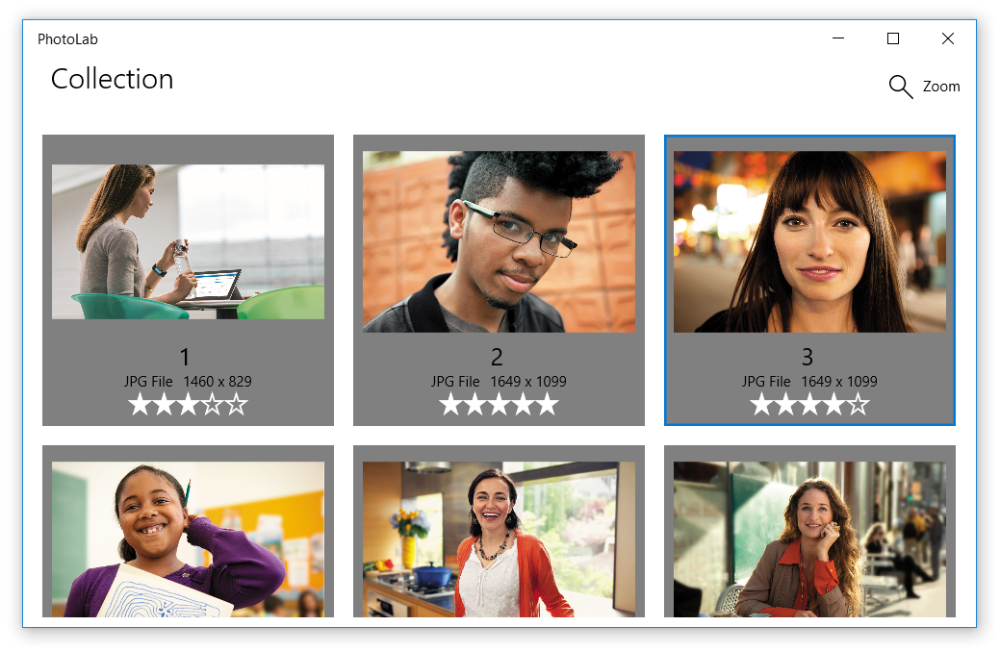

# Contribute What's New items here

As we've done in the past, add your What's New items into the appropriate category below. I'll be pulling from these entries to create our What's New topics.

(Side note - this topic is excluded from the build, and will never show up on staging or be published life. It lives in RS4 so it's never exposed publicly on github.)

## Features

### Sample Feature Entry

Sample feature text. With a sample image below!

### Enter free-form prices in a specific market's local currency

When you override your app's base price for a specific market, you are no longer limited to choosing one of the standard price tiers; you now have the option to enter a free-form price in the market's local currency. For more info, see [Set and schedule app pricing](../publish/set-and-schedule-app-pricing.md)

### Landmarks and Headings supported for accessible technology (AT)

Landmarks and headings define sections of a user interface that aid in efficient navigation for users of assistive technology such as screen readers. For more information see [Landmarks and Headings](../design/accessibility/landmarks-and-headings.md).

### Console UWP apps

You can now write C++ /WinRT or /CX UWP console apps that run in a console window such as a DOS or PowerShell console window. Console apps use the console window for input and output. UWP console apps can be published to the Microsoft Store, have an entry in the app list, and a primary tile that can be pinned to the Start menu. For more info, see [Create a Universal Windows Platform console app](https://docs.microsoft.com/windows/uwp/launch-resume/console-uwp)

### Multi-instance UWP apps

A UWP app can opt-in to support multiple instances. If an instance of an multi-instance UWP app is running, and a subsequent activation request comes through, the platform will not activate the existing instance. Instead, it will create a new instance, running in a separate process. For more info, see [Create a multi-instance Universal Windows App](https://docs.microsoft.com/windows/uwp/launch-resume/multi-instance-uwp).

### Broad file-system access

The **broadFileSystemAccess** capability grants apps the same access to the file system as the user who is currently running the app without file-picker style prompts. For more info, see [File access permissions](https://docs.microsoft.com/windows/uwp/files/file-access-permissions) and the **broadFileSystemAccess** entry in [App capability declarations](https://docs.microsoft.com/windows/uwp/packaging/app-capability-declarations).

### New APIs

The [AppResourceGroupInfo](https://docs.microsoft.com/uwp/api/windows.system.appresourcegroupinfo) class has new methods that you can use to initiate the transition to the app suspended, active (resumed), and terminated states.

The [UserActivitySessionHistoryItem]() class has new methods that retrieve recent user activities. See [GetRecentUserActivitiesAsync](https://docs.microsoft.com/uwp/api/windows.applicationmodel.useractivities.useractivitychannel#Windows_ApplicationModel_UserActivities_UserActivityChannel_GetRecentUserActivitiesAsync_System_Int32_), and its overload, for details. 

The [CustomSystemEventTrigger](https://docs.microsoft.com/uwp/api/windows.applicationmodel.background.customsystemeventtrigger) allows you to define a system trigger when the OS doesn't provide a system trigger that you need. Such as when a hardware driver and the UWP app both belong to 3rd party, and the hardware driver needs to raise a custom event that its app handles. For example, an audio card that needs to notify a user when an audio jack is plugged in.

## Developer Guidance

## Videos

## Samples
