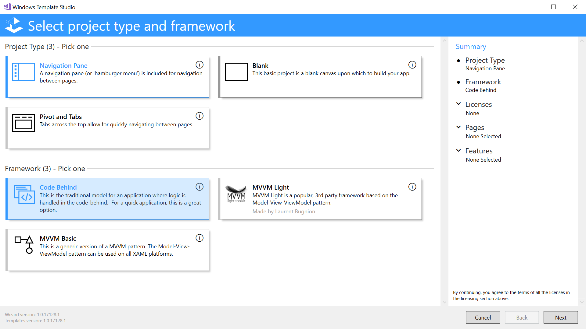
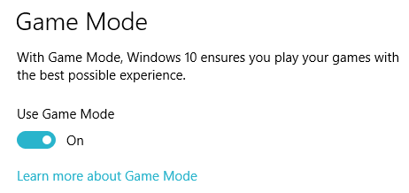

# What's New in the Windows Developer Docs in August 2017

The Windows Developer Documentation is constantly being updated with information on new features available to developers across the Windows platform. The following feature overviews, developer guidance, and videos have recently been made available, containing new and updated information for Windows developers.

[Install the tools and SDK](https://developer.microsoft.com/windows/downloads#_blank) on Windows 10 and you’re ready to either [create a new Universal Windows app](../get-started/your-first-app.md) or explore how you can use your [existing app code on Windows](../porting/index.md).

## Features

### Windows Template Studio

Use the new [Windows Template Studio](https://marketplace.visualstudio.com/items?itemName=WASTeamAccount.WindowsTemplateStudio) extension for Visual Studio 2019 to quickly build a UWP app with the pages, framework, and features that you want. This wizard-based experience implements proven patterns and best practices to save you time and trouble adding features to your app.

### Conditional XAML

You can now preview [conditional XAML](../debug-test-perf/conditional-xaml.md) to create [version adaptive apps](../debug-test-perf/version-adaptive-apps.md). Conditional XAML lets you use the ApiInformation.IsApiContractPresent method in XAML markup, so you can set properties and instantiate objects in markup based on the presence of an API, without needing to use code behind.

### Game Mode

The [Game Mode](/previous-versions/windows/desktop/gamemode/game-mode-portal) APIs for the Universal Windows Platform (UWP) allow you to produce the most optimized gaming experience by taking advantage of Game Mode in Windows 10. These APIs are located in the **&lt;expandedresources.h&gt;** header.

### Submission API supports video trailers and gaming options

The [Microsoft Store submission API](../monetize/create-and-manage-submissions-using-windows-store-services.md) now enables you to include [video trailers](../monetize/manage-app-submissions.md#trailer-object) and [gaming options](../monetize/manage-app-submissions.md#gaming-options-object) with your app submissions.

## Developer Guidance

### Data schemas for Store products

We've added the [Data schemas for Store products](../monetize/data-schemas-for-store-products.md) article. This article provides schemas for the Store-related data available for several objects in the [Windows.Services.Store](/uwp/api/windows.services.store) namespace, including [StoreProduct](/uwp/api/windows.services.store.storeproduct) and [StoreAppLicense](/uwp/api/windows.services.store.storeapplicense).

### Desktop Bridge

We've added two guides that help you to add modern experiences that light up for Windows 10 users.

See [Enhance your desktop application for Windows 10](/windows/apps/desktop/modernize/desktop-to-uwp-enhance) to find and reference the correct files, and then write code to light up UWP experiences for Windows 10 users.  

See [Extend your desktop application with modern UWP components](/windows/apps/desktop/modernize/desktop-to-uwp-extend) to incorporate modern XAML UIs and other UWP experiences that must run in a UWP app container.

### Getting started with point of service

We've added a new guide to help you [get started with point of service devices](../devices-sensors/pos-get-started.md). It covers topics like device enumeration, checking device capabilities, claiming devices, and device sharing. 

### Xbox Live

We've added docs for Xbox Live developers, for both UWP and Xbox Developer Kit (XDK) games.

See the [Xbox Live developer guide](//gaming/xbox-live/index) to learn how to use the Xbox Live APIs to connect your game to the Xbox Live social gaming network.

With the [Xbox Live Creators Program](//gaming/xbox-live/get-started-with-creators/get-started-with-xbox-live-creators), any UWP game developer can develop and publish an Xbox Live-enabled game on both the PC and Xbox One.

See the [Xbox Live developer program overview](//gaming/xbox-live/developer-program-overview) for information about the programs and features available to Xbox Live developers.

## Videos

### Mixed Reality

A series of new tutorial videos have been released for [Microsoft HoloLens Course 250](https://developer.microsoft.com/windows/mixed-reality/mixed_reality_250). If you've already installed the tools and are famiilar with the basics of development for Mixed Reality, check out these video courses for information upon creating shared experiences across Mixed Reality devices.

### Narrator and Dev Mode

You might already know that you can use [Narrator](https://support.microsoft.com/help/22798/windows-10-complete-guide-to-narrator) to test the screen reading experience of your app. But Narrator also features a developer mode, which gives you a good visual representation of the information exposed to it. [Watch the video](https://channel9.msdn.com/Blogs/One-Dev-Minute/Using-Narrator-and-Dev-Mode), then learn more about [Narrator developer mode](https://channel9.msdn.com/Blogs/One-Dev-Minute/Using-Narrator-and-Dev-Mode).

