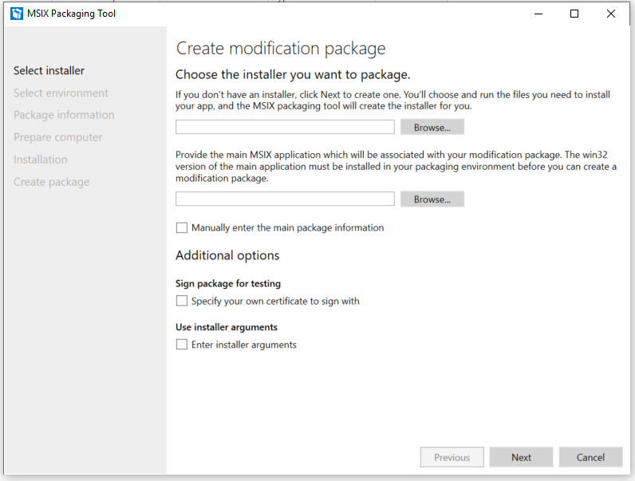

# What's New in the Windows Developer Docs in January 2019

The Windows Developer Documentation is constantly being updated with information on new features available to developers across the Windows platform. The following feature overviews, developer guidance, and videos have been made available in the month of January.

[Install the tools and SDK](https://go.microsoft.com/fwlink/?LinkId=821431) on Windows 10 and you’re ready to either [create a new Universal Windows app](../get-started/create-uwp-apps.md) or explore how you can use your [existing app code on Windows](../porting/index.md).

## Features

### Windows development on Microsoft Learn

Microsoft Learn provides new hands-on learning and training opportunities to Microsoft developers. If you're interested in learning how to develop Windows apps, check out [our new learning path](https://docs.microsoft.com/learn/paths/develop-windows10-apps/) for a thorough introduction to the platform, the tools, and how to write your first few apps.

### Direct 3D 12

[Direct3D 12 render passes](/windows/desktop/direct3d12/direct3d-12-render-passes) can improve the performance of your renderer if it's based on Tile-Based Deferred Rendering (TBDR), among other techniques. The technique helps your renderer to improve GPU efficiency by enabling your application to better identify resource rendering ordering requirements and data dependencies, and thus reducing memory traffic to/from off-chip memory.

### MSIX modification packages

Windows 10 version 1809 improved support for [MSIX modification packages](https://docs.microsoft.com/windows/msix/modification-package-1809-update). Modification packages can include registry-based plugins and associated customization, and will enable an application deployed through MSIX to use a virtual registry and run as expected.

### Open Source of WPF, Windows Forms, and WinUI

The WPF, Windows Forms, and WinUI UX frameworks are now available for open-source contributions on GitHub. For more information and links, see the [building Windows apps blog](https://blogs.windows.com/buildingapps/2018/12/04/announcing-open-source-of-wpf-windows-forms-and-winui-at-microsoft-connect-2018/#OKZjJs1VVTrMMtkL.97).

### Progressive Web Apps for Xbox

With [Progressive Web Apps for Xbox One](https://docs.microsoft.com/microsoft-edge/progressive-web-apps/xbox-considerations), you can extend a web application and make it available as an Xbox One app via Microsoft Store while still continuing to use your existing frameworks, CDN and server backend. For the most part, you can package your PWA for Xbox One in the same way you would for Windows, however, there are several key differences this guide will walk you through.

### Windows Machine learning

We've restructured [the landing page for WinML APIs](https://docs.microsoft.com/windows/ai/api-reference), and added new documentation for WinML custom operator and native APIs.

[Train a model with PyTorch](https://docs.microsoft.com/windows/ai/train-model-pytorch) provides guidance on how to train a model using the PyTorch framework either locally or in the cloud. You can then download this model as an ONNX file and use it in your WinML applications.

## Developer Guidance

### Choose your platform

Interested in creating a new desktop application? Check out our revamped [Choose your platform](https://docs.microsoft.com/windows/desktop/choose-your-technology) page for detailed descriptions and comparisons of the UWP, WPF, and Windows Forms platforms, and further information on the Win32 API.

### FAQs on Win32 WebView

Our [frequently asked questions](https://docs.microsoft.com/windows/communitytoolkit/controls/wpf-winforms/webview#frequently-asked-questions-faqs) provides answers to common questions when using the Microsoft Edge WebView in desktop applications, as well as links to samples and additional resources.

### Japanese era change

[Prepare your application for the Japanese era change](../design/globalizing/japanese-era-change.md) shows you how to ensure your Windows application is ready for the Japanese era change set to take place on May 1, 2019. [This page is also available in Japanese](https://docs.microsoft.com/ja-jp/windows/uwp/design/globalizing/japanese-era-change).

## Videos

### Progressive Web Apps

Progressive Web Apps are web sites that function like native apps across different browsers and a wide variety of Windows 10 devices. [Watch the video](https://youtu.be/ugAewC3308Y) to learn more, and then [check out the docs](https://aka.ms/Windows-PWA) to get started.

### VS Code series

Check out our [new video series on Visual Studio Code](https://www.youtube.com/playlist?list=PLlrxD0HtieHjQX77y-0sWH9IZBTmv1tTx) for information about what VSCode is, how to use it, and how it was created.

### One Dev Question

In the One Dev Question video series, longtime Microsoft developers cover a series of questions about Windows development, team culture, and history. Here's the latest questions that we've answered!

Raymond Chen:

* [Why have Program Files and Program Files (x86)?](https://youtu.be/N7o9eJpFYco)

Larry Osterman:

* [Why is COM so complicated?](https://youtu.be/-gkXAV-StVA )
* [What was your first interview like for Microsoft?](https://youtu.be/qRb6otsHG5c)
