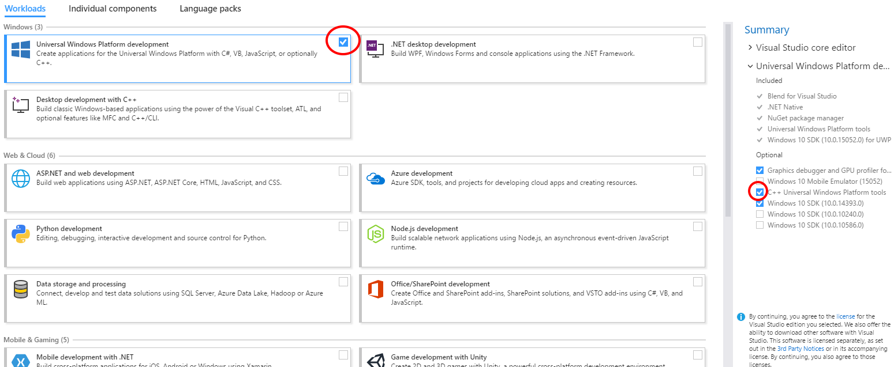
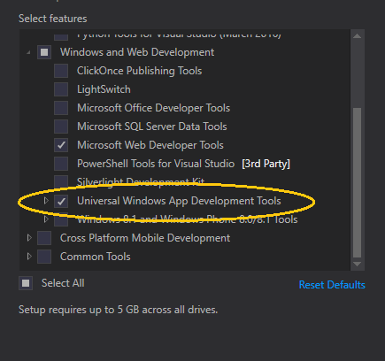
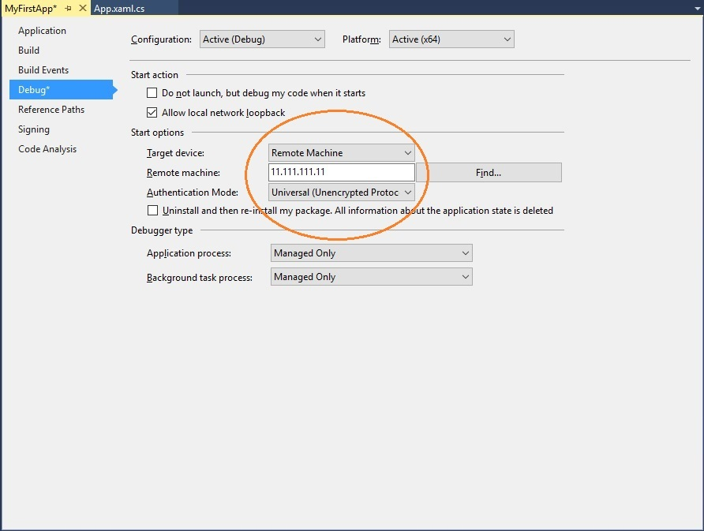
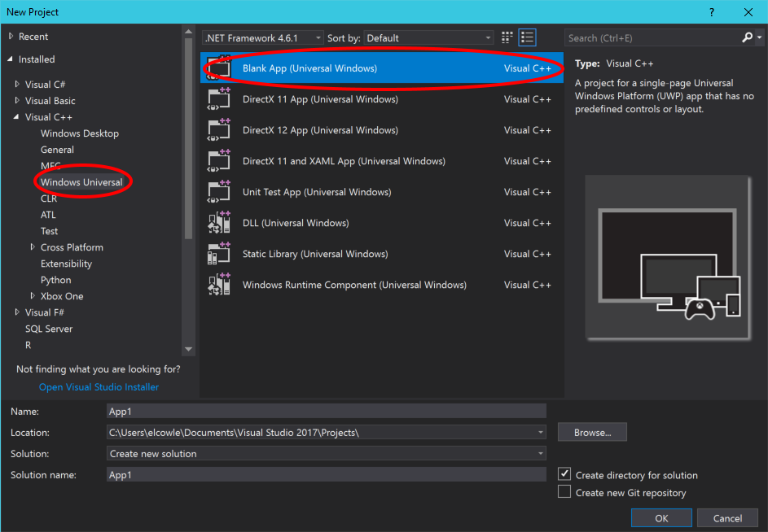
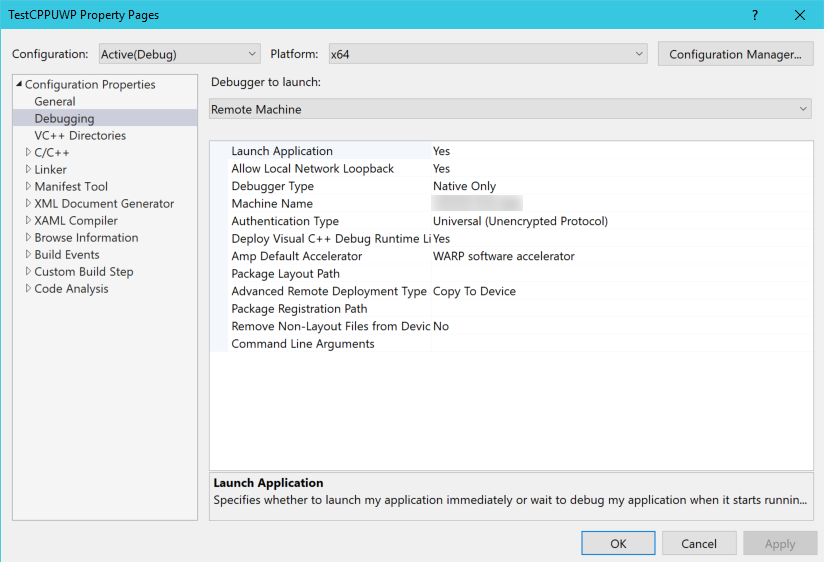
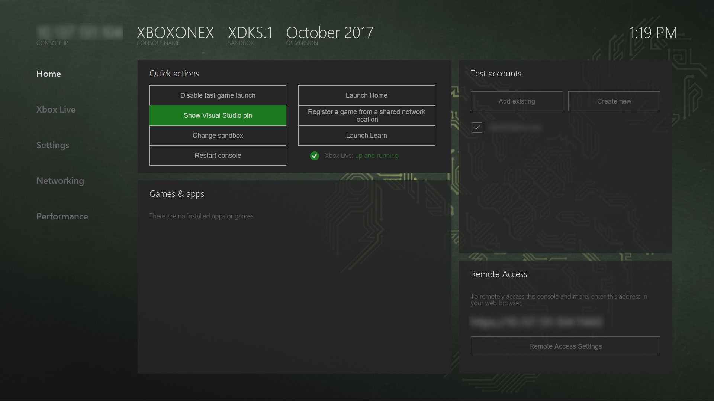
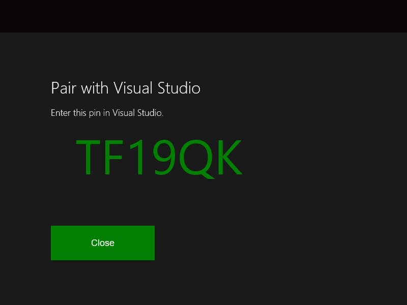

# Set up your UWP on Xbox development environment

The Universal Windows Platform (UWP) on Xbox development environment consists of a development PC connected to an Xbox One console through a local network.
The development PC requires Windows 10, Visual Studio 2017 or Visual Studio 2015 Update 3, the Windows 10 SDK build 14393 or later, and a range of supporting tools.

This article covers the steps to set up and test your development environment.

## Visual Studio setup

1. Install Visual Studio 2017, Visual Studio 2015 Update 3, or the latest release of Visual Studio. For more information and to install, see [Downloads and tools for Windows 10](https://dev.windows.com/downloads). We recommend that you use the latest version of Visual Studio so that you can recieve the latest updates for developers and security.

2. If you're installing Visual Studio 2017, make sure that you choose the **Universal Windows Platform development** workload. If you're a C++ developer, make sure that you also select the **C++ Universal Windows Platform tools** checkbox in the **Summary** pane on the right, under **Universal Windows Platform development**. It's not part of the default installation.

    

    If you're installing Visual Studio 2015 Update 3, ensure that the **Universal Windows App Development Tools** check box is selected.

    

## Windows 10 SDK setup

Install the latest Windows 10 SDK. This comes with your Visual Studio installation, but if you want to download it separately, see [Windows 10 SDK](https://developer.microsoft.com/windows/downloads/windows-10-sdk).

## Enabling Developer Mode

Before you can deploy apps from your development PC, you must enable Developer Mode. In the **Settings** app, navigate to **Update & Security** / **For developers**, and under **Use developer features**, select **Developer mode**.

## Setting up your Xbox One

Before you can deploy an app to your Xbox One, you must have a user signed in on the console. 
You can either use your existing Xbox Live account or create a new account for your console in Developer Mode. 

## Create your first app

1. Make sure your development PC is on the same local network as the target Xbox One console. Typically, this means they should use the same router and be on the same subnet. A wired network connection is recommended.

2. Ensure that your Xbox One console is in Developer Mode.  For more information, see [Xbox One Developer Mode activation](devkit-activation.md).

3. Decide the programming language that you want to use for your UWP app.

4. On your development PC, in Visual Studio, select **New / Project**.

5. In the **New Project** window, select **Windows Universal / Blank App (Universal Windows)**.

### Starting a C# project

  

1. In the **New Universal Windows Project** dialog, select build 14393 or later in the **Minimum Version** dropdown. Select the latest SDK in the **Target Version** dropdown. If the **Developer Mode** dialog appears, click **OK**. A new blank app is created.

2. Configure your development environment for remote debugging:

    a. Right-click the project in the **Solution Explorer**, and then select **Properties**.

    b. On the **Debug** tab, change **Platform** to **x64**. (x86 is no longer a supported platform on Xbox.)

    c. Under **Start options**, change **Target device** to **Remote Machine**.

    d. In **Remote machine**, enter the system IP address or hostname of the Xbox One console. For information about obtaining the IP address or hostname, see [Introduction to Xbox One tools](introduction-to-xbox-tools.md).

    e. In the **Authentication Mode** drop-down list, select **Universal (Unencrypted Protocol)**.

    

### Starting a C++ project

  

1. In the **New Universal Windows Project** dialog, select build 14393 or later in the **Minimum Version** dropdown. Select the latest SDK in the **Target Version** dropdown. If the **Developer Mode** dialog appears, click **OK**. A new blank app is created.

2. Configure your development environment for remote debugging:

   a. Right-click the project in the **Solution Explorer**, and then select **Properties**.

   b. On the **Debugging** tab, change **Debugger to launch** to **Remote Machine**.

   c. In **Machine Name**, enter the system IP address or hostname of the Xbox One console. For information about obtaining the IP address or hostname, see [Introduction to Xbox One tools](introduction-to-xbox-tools.md).

   d. In the **Authentication Type** drop-down list, select **Universal (Unencrypted Protocol)**.

   e. In the **Platform** drop-down, select **x64**.

    

### PIN-pair your device with Visual Studio

1. Save your settings, and make sure your Xbox One console is in Developer Mode.

2. With your project open in Visual Studio, press F5.

3. If this is your first deployment, you will get a dialog from Visual Studio asking to PIN-pair your device.

    a. To obtain a PIN, open **Dev Home** from the Home screen on your Xbox One console.

    b. On the **Home** tab, under **Quick actions**, select **Show Visual Studio pin**.
  
    

    c. Enter your PIN into the **Pair with Visual Studio** dialog. The following PIN is just an example; yours will differ.

    

    d. Deployment errors, if any, will appear in the **Output** window.

Congratulations, you've successfully created and deployed your first UWP app on Xbox!

## See also
- [Xbox One Developer Mode activation](devkit-activation.md)  
- [Downloads and tools for Windows 10](https://dev.windows.com/downloads)  
- [Windows Insider Program](http://go.microsoft.com/fwlink/?LinkId=780552)  
- [Introduction to Xbox One tools](introduction-to-xbox-tools.md) 
- [UWP on Xbox One](index.md)